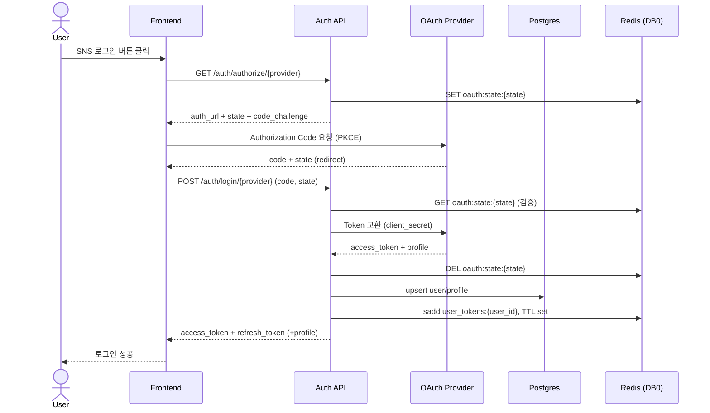
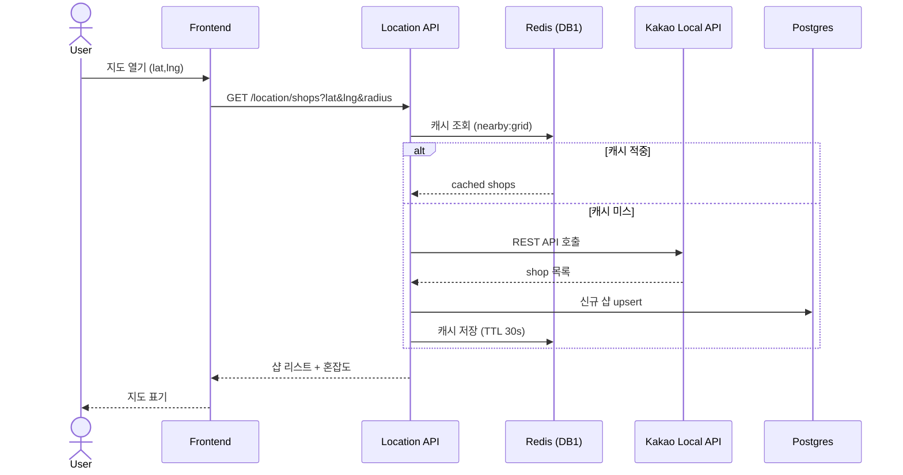
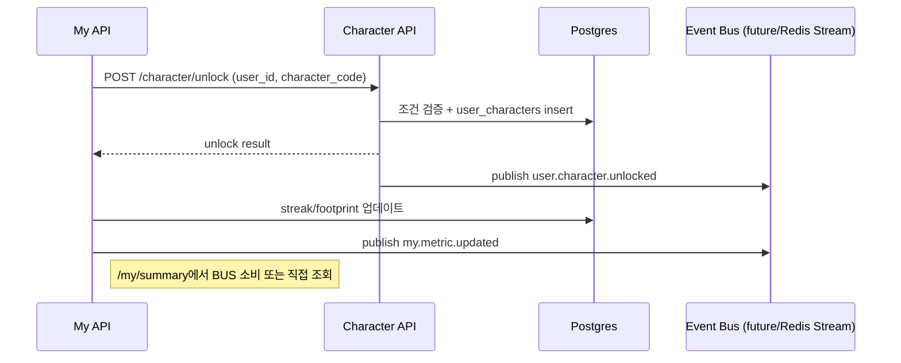
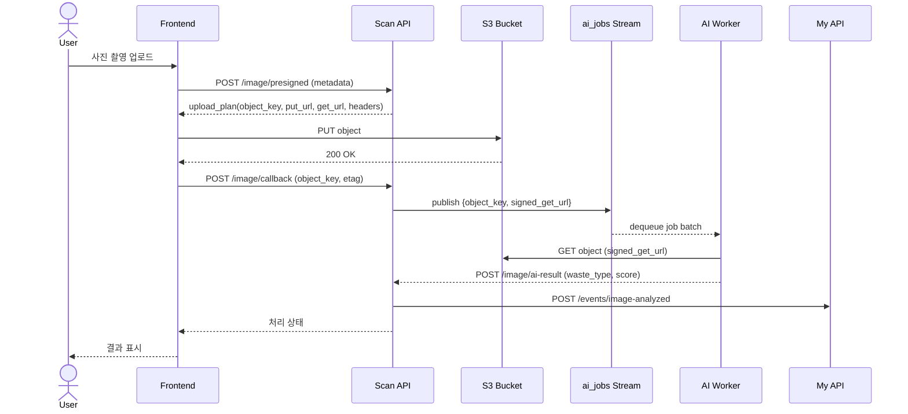

# Zero Waste FastAPI 서비스 사양 (v0.1)

> **목표 시점**: ArgoCD GitOps 안정화 직후 (티켓: `gitops-phase3`)  
> **대상 서비스**: `auth`, `location`, `character`, `my`, `scan`(이미지·AI 연계)  
> **참고 문서**: `docs/data/redis-jwt-blacklist-design.md`, `docs/development/FASTAPI_ENDPOINT_STYLE.md`

## 0. TL;DR
- FastAPI 마이크로서비스 5종을 ArgoCD Sync Wave 30~60 구간에 배치하고, Postgres Operator + Redis Failover + S3/CDN 조합으로 상태를 관리한다.
- SNS 간편 로그인(Naver/Google/Kakao)은 백엔드에서 토큰 교환 후 JWT 발급, `redis` DB0에 저장된 Blacklist로 무효화를 보장한다.
- 위치 정보는 Kakao Map REST API + 서버 측 캐시(`redis` DB1)를 활용해 3초 이내 응답을 목표로 한다.
- 캐릭터·마이 페이지는 Postgres의 정규화 테이블과 S3 이미지 레퍼런스를 공유하며, 활동/환경지표는 단일 어그리게이터(`my` 서비스)가 합성한다.
- 이미지 업로드는 `scan` 서비스가 Pre-signed URL을 발급하고, 업로드 완료 이벤트를 AI 워커(추후 Celery/Queue)로 전달해 실시간 추론을 트리거한다.

---

## 1. 시스템 컨텍스트

### 1.1 서비스 & 인프라 맵

| 계층 | 구성 요소 | 설명 | 비고 |
| --- | --- | --- | --- |
| Client | 웹/모바일 프런트 | OAuth 리다이렉트 처리, KakaoMap JS SDK | Next.js 기준 |
| API | `services/auth` | SNS OAuth, JWT, 토큰 무효화 | Redis DB0 사용 |
| API | `services/location` | 위치 기반 검색, 좌표 변환 | Kakao REST, Redis DB1 캐시 |
| API | `services/character` | 캐릭터 마스터/획득 기록 | S3 이미지 메타 공유 |
| API | `services/my` | 사용자 스냅샷, 통계 어그리게이션 | 다른 도메인 API 호출 |
| API | `services/scan` | 이미지 업로드, AI 전달 | S3 PutObject + 워커 출발 |
| Data | Postgres Operator (`platform/cr/base/postgres-cluster.yaml`) | 영속 데이터 | namespace: `data` |
| Data | Redis Failover (`platform/cr/base/redis-*.yaml`) | 토큰 블랙리스트·캐시 | Sentinel 모드 |
| Object | AWS S3 + CloudFront CDN | 캐릭터/활동 이미지 저장 | 버킷: `sesacthon-ecoeco` (가정) |
| Observability | Prometheus, Loki, Tempo | `/api/v1/metrics` 수집 | 기존 스택 재사용 |

### 1.2 외부 연동
- **SNS OAuth**: Naver(네이버 ID), Google OAuth2, Kakao Login REST. 백엔드가 Authorization Code 교환을 담당하며, Provider 별 Client ID/Secret은 ExternalSecret으로 주입.
- **지도 데이터**: Kakao Local API (`/v2/local/search/keyword.json`, `/v2/local/search/category.json`). 요청 제한(일 100,000건)을 고려해 Redis 캐시 + 오프라인 시드 데이터를 병행.
- **AI 파이프라인**: 현재 `scan` 서비스에서 S3 업로드 이벤트를 통해 Trigger. MVP에서는 `scan`이 곧바로 AI 백엔드(예: SageMaker Endpoint 또는 내부 PyTorch 서버)에 HTTP POST.

---

## 2. 비기능 요구사항 (NFR)

| 항목 | 목표 | 구현 포인트 |
| --- | --- | --- |
| 가용성 | 99.5% (월 다운 3.6h) | 멀티 AZ Postgres, Redis Sentinel, ArgoCD 헬스체크 |
| 응답 시간 | p95 800ms (위치 검색 3s 이내) | Kakao API 병렬 호출 + 캐시 |
| 보안 | OAuth 2.0 PKCE, JWT HS256/RS256, TLS 1.3 | `redis` Blacklist, Refresh Rotation |
| 확장성 | HPA 2~10 replicas, 500 RPS 목표 | `/metrics` 기반 HPA (CPU+RPS) |
| 관측성 | 로그 추적률 95% | OpenTelemetry FastAPI 중간웨어 |
| 배포 | GitOps 자동 승격 | `workloads/domains/<service>` ApplicationSet |

---

## 3. 도메인별 기능 스코프

### 3.1 Auth API
- **책임**: SNS OAuth 토큰 교환, 신규 사용자 가입, Access/Refresh 발급, JWT 블랙리스트/토큰 회수(완전 Stateless), OAuth2.0 콜백 상태 검증.
- **의존성**: Postgres `auth.users`, `auth.login_audits`; Redis DB0 (BlackList + `user_tokens:*`), DB3 (`oauth:state:*`, Rate limiting).
- **데이터 모델**:
  - `users(id, provider, provider_user_id, email, nickname, profile_image_url, created_at, last_login_at)`
  - `login_audits(id, user_id, provider, jti, login_ip, user_agent, issued_at)` : 감사/보안용 Append-only
- **OAuth 콜백 & PKCE 규칙**:
  1. 클라이언트가 `GET /api/v1/auth/authorize/{provider}` 호출 → 서버는 `state`, `code_challenge`, 리다이렉트 URL을 돌려주고, `redis (DB3)`에 `oauth:state:{state}`로 `code_verifier`, redirect_uri, device 메타를 10분 TTL로 저장한다.
  2. Provider 리다이렉트 이후 프런트 혹은 Provider가 직접 `POST /api/v1/auth/login/{provider}`(또는 `/callback/{provider}`) 를 호출할 때 `state`/`code_verifier`를 복구해 PKCE 검증을 완료한다.
  3. 교환이 끝나면 `oauth:state:{state}` 키는 즉시 삭제하며, 만료/재시도는 모니터링 지표(`oauth_state_expired_total`)로 집계한다.
- **토큰 추적/로그아웃 전략**:
  - Refresh 토큰 JTI는 Redis `user_tokens:{user_id}` Set에 저장하고 TTL은 각 Refresh 만료 시점으로 맞춘다.
  - 디바이스 로그아웃은 DB 세션 테이블 없이 `user_tokens` Set에서 해당 JTI를 제거하고, 동시에 `blacklist:{jti}` 키를 생성해 JWT를 폐기한다.
- **핵심 규칙**:
  - Access 15분, Refresh 14일, Refresh Rotation 의무 (`docs/data/redis-jwt-blacklist-design.md` 준수).
  - JTI는 UUIDv7 사용, Redis 키 패턴 `blacklist:{jti}`.
  - OAuth Provider 연결 실패 시 3-way fallback (Provider → Retry → 백엔드 콜백) + state 재발급.
- **엔드포인트**:

| Method | Path | 설명 | 인증 | 비고 |
| --- | --- | --- | --- | --- |
| GET | `/api/v1/auth/authorize/{provider}` | PKCE용 state/code_challenge 생성 및 OAuth URL 반환 | Public | provider ∈ {naver, google, kakao} |
| GET | `/api/v1/auth/callback/{provider}` | Provider가 백엔드로 직접 리다이렉트 시 Authorization Code 수신 | Public | state 검증 후 FE Deep Link 또는 One-time-code 발급 |
| POST | `/api/v1/auth/login/{provider}` | Authorization Code 교환 후 JWT/리프레시 발급 | Public | state·PKCE 검증, Redis `user_tokens` 업데이트 |
| POST | `/api/v1/auth/token/refresh` | Refresh 토큰으로 Access 재발급 & Rotation | Refresh JWT | Blacklist 확인 |
| POST | `/api/v1/auth/logout` | 현재 토큰 무효화 | Access JWT | `blacklist:{jti}` 삽입 |
| GET | `/api/v1/auth/tokens` | 내 활성 Refresh JTI 목록 조회 | Access JWT | Redis `user_tokens` 기반 |
| DELETE | `/api/v1/auth/tokens/{jti}` | 특정 디바이스 Refresh 토큰 폐기 | Access JWT | Blacklist + Set 제거 |
| GET | `/api/v1/auth/me` | 인증된 사용자 프로필 조회 | Access JWT | 캐릭터/마이 링크 제공 |

#### 3.1.1 Stateless JWT 사례 참고
- **Auth0 Access Token Revocation (2023)**: Authorization Server는 세션 테이블 없이 `jti` 기반 블록리스트와 Refresh Rotation을 사용한다. `logout` 시 Access/Refresh 모두 Blocklist에 넣어 리소스 서버가 Redis/DB에서 조회하도록 권장한다. → 본 서비스도 동일하게 Redis DB0에 `blacklist:{jti}` 패턴을 사용.
- **AWS Cognito Global Sign-out (2024)**: Cognito 역시 Refresh 토큰만 추적하며, Global Sign-out 시 활성 Refresh 식별자를 블랙리스트에 추가해 Stateless 특성을 유지한다. → 우리도 DB 세션 대신 Redis Set(`user_tokens:{user_id}`)으로만 디바이스를 추적.
- **Firebase Authentication revokeRefreshTokens (2024)**: Firebase는 서버 상태를 갖지 않고, Refresh 고유 ID와 `validSince` 타임스탬프만 저장한다. 클라이언트는 재로그인 시 토큰을 재발급받으며, 리소스 서버는 JWT 클레임으로만 인증한다. → `login_audits`는 감사용 Append-only 테이블로 한정하고 비즈니스 로직은 전부 Stateless JWT 기반으로 유지한다.

### 3.2 Location API
- **책임**: 사용자 좌표 기반 제로웨이스트 샵 탐색, 즐겨찾기, Kakao Map Proxy, 실시간 거리 계산.
- **의존성**: Postgres `location.shops`, `location.user_favorites`; Redis DB1 캐시 (key: `nearby:{lat}:{lng}:{radius}`).
- **API**:

| Method | Path | 설명 | 인증 | 비고 |
| --- | --- | --- | --- | --- |
| GET | `/api/v1/location/shops` | 좌표+반경 기반 검색 (기본 2km) | Access JWT (선택) | Kakao API 호출 + 캐시 |
| GET | `/api/v1/location/shops/{shop_id}` | 단일 매장 상세 (운영시간, 태그) | Optional | Postgres 조회 |
| GET | `/api/v1/location/search` | 키워드 검색 Proxy | Optional | Kakao Keyword API |
| POST | `/api/v1/location/favorites` | 즐겨찾기 등록 | Access JWT | user_id + shop_id |
| GET | `/api/v1/location/realtime` | (옵션) WebSocket, 거리 업데이트 | Access JWT | GPS 스트림 |

- **캐시 전략**: 좌표를 50m 그리드로 스냅하고 30초 TTL. Kakao 응답 200ms 내 재사용.
- **실패 대비**: Kakao API 429 시 fallback 데이터(사전 수집된 샵 300개)를 Postgres에서 노출.

### 3.3 Character API
- **책임**: 캐릭터 메타데이터 관리(최대 15종), 획득 조건/진행률, 이미지 Asset 경로 관리.
- **의존성**: Postgres `character.catalog`, `character.user_characters`; S3 `characters/{character_code}/sprite.png`.
- **비즈니스 규칙**:
  - 캐릭터 ID는 `CHR001` 형태, 고정 Seed 데이터.
  - 획득 조건은 JSON Schema(`condition_type`, `threshold`, `metadata`)로 저장.
  - 캐릭터 해금 시 `my` 서비스에 이벤트 발행 (`user.character.unlocked`).
- **엔드포인트**:

| Method | Path | 설명 | 인증 | 비고 |
| --- | --- | --- | --- | --- |
| GET | `/api/v1/character/catalog` | 캐릭터 목록/조건 | Optional | CDN 이미지 URL 포함 |
| GET | `/api/v1/character/me` | 내 캐릭터/진행률 | Access JWT | user join |
| POST | `/api/v1/character/unlock` | 조건 충족 시 수동 해금 | Access JWT | idempotent |
| POST | `/api/v1/character/webhook` | 외부 이벤트(예: 캠페인) | Internal token | Argo Workflows 연동 고려 |

### 3.4 My API
- **책임**: 사용자 요약 페이지(캐릭터 수, 분리수거 횟수, 연속 참여일, 환경 영향 지표) 구성.
- **데이터 출처**:
  - `character.user_characters` (보유 수)
  - `scan` 서비스 (분리수거 횟수, 이미지 분석 결과)
  - `location` 서비스 (방문 기록)
  - `my.streaks`, `my.footprints` (환경 영향 계산)
- **연산 방식**:
  - 매 요청 시 직접 합산(초기) → 추후 이벤트 기반 캐싱(`redis` DB2)으로 전환.
  - 환경 영향 수식: 나무 = 분리수거 횟수 × 0.02, 물 = 7L × 횟수, CO2 = 230g × 횟수 (가정치).
- **엔드포인트**:

| Method | Path | 설명 | 인증 | 비고 |
| --- | --- | --- | --- | --- |
| GET | `/api/v1/my/summary` | 대시보드 데이터 일괄 반환 | Access JWT | 캐시 가능 |
| GET | `/api/v1/my/timeline` | 활동 이력(최근 30일) | Access JWT | pagination |
| PATCH | `/api/v1/my/profile` | 닉네임/이미지 수정 | Access JWT | 이미지 경로는 S3 URL |
| GET | `/api/v1/my/badges` | 배지/업적 목록 | Access JWT | 캐릭터/환경 지표 연동 |

### 3.5 Image / Scan API
- **책임**: S3 업로드 Pre-signed URL 발급, 업로드 메타 저장, AI 추론 파이프라인 트리거.
- **의존성**: S3 버킷, Postgres `scan.images`, Queue/Stream(`ai_jobs`), CDN URL.
- **Presigned 발급 정책**:
  - 프런트는 `POST /api/v1/image/presigned` 호출 시 `mime_type`, `content_length`, `device_id`, `gps`, `shooted_at`를 전달한다.
  - 백엔드는 입력을 검증한 뒤 `object_key = uploads/{yyyy}/{mm}/{user_id}/{uuid}.{ext}` 를 조립하고, S3 PutObject용 URL, AI용 GetObject pre-signed URL, CDN 경로, 필수 헤더(`Content-Type`, `x-amz-meta-*`)를 번들링해 반환한다.
  - FE는 서버가 내려준 값만 사용하며 object key를 직접 생성하지 않는다(경로 규약 강제화).
- **AI 부하 최소화 전략**:
  - SCAN API는 바이너리를 직접 전달하지 않고, 업로드가 완료되면 `ai_jobs` Stream/SQS에 **메타데이터( `object_key`, `signed_get_url`, `cdn_url`, `user_id`, `waste_hint` )** 만 push 한다.
  - AI 서버는 Job을 pull한 뒤 S3에서 직접 이미지를 받아 처리(VPC Endpoint/CloudFront Origin access)하며, 처리 결과만 JSON으로 SCAN에 POST하여 API 서버의 대역폭·CPU 사용을 최소화한다.
  - 필요 시 Batch 전송(최대 10건)과 Retry DLQ를 두어 AI 서버에 순간 부하가 몰리지 않도록 한다.
- **흐름**:
  1. 프런트가 `/api/v1/image/presigned` 요청 → 백엔드가 object_key 조립 후 PUT/GET URL + 메타를 응답.
  2. 프런트가 S3에 직접 업로드(사전 정의 헤더 포함).
  3. 업로드 성공 시 프런트가 `/api/v1/image/callback` 호출 → SCAN이 object_key/etag를 검증하고 `scan.images`에 저장.
  4. SCAN이 `ai_jobs` Queue/Stream에 `{object_key, signed_get_url, user_id, metadata}` 이벤트를 push.
  5. AI 워커가 Queue에서 소비 후 S3에서 직접 이미지 다운로드, 추론 결과를 `/api/v1/image/ai-result` 로 전달.
  6. SCAN이 결과를 저장하고 `my` 서비스에 `image.analyzed` 이벤트를 발행.
- **엔드포인트**:

| Method | Path | 설명 | 인증 | 비고 |
| --- | --- | --- | --- | --- |
| POST | `/api/v1/image/presigned` | 업로드용 URL 발급 | Access JWT | mime/type 검증 |
| POST | `/api/v1/image/callback` | 업로드 완료 통보 | Access JWT | AI 워커 호출 |
| GET | `/api/v1/image/{image_id}` | 메타/분석 결과 조회 | Access JWT | `scan.images` 조인 |
| POST | `/api/v1/image/ai-result` | AI → API 결과 Webhook | Internal token | SageMaker 등 |

---

## 4. 시퀀스 다이어그램

### 4.1 SNS 간편 로그인 + JWT 발급

### 4.2 위치 기반 샵 탐색

### 4.3 캐릭터 획득 & 마이페이지 반영

### 4.4 이미지 업로드 & AI 전달

---

## 5. 데이터 모델 & 이벤트

### 5.1 Postgres (Zalando Operator)

| 스키마 | 테이블 | 주요 컬럼 | 비고 |
| --- | --- | --- | --- |
| `auth` | `users` | id (uuid), provider, provider_user_id, email, nickname, created_at | provider_user_id unique |
| `auth` | `login_audits` | id, user_id, provider, jti, login_ip, user_agent, issued_at | Append-only, 컴플라이언스용 |
| `location` | `shops` | id (uuid), external_id, name, lat, lng, tags, hours, source | external_id + provider unique |
| `location` | `user_favorites` | user_id, shop_id, created_at | composite PK |
| `character` | `catalog` | character_code, name, description, unlock_condition_json, asset_url | Seed data |
| `character` | `user_characters` | user_id, character_code, unlocked_at, progress | progress 0~1 |
| `my` | `streaks` | user_id, current_streak, longest_streak, last_activity_date | 업데이트 트랜잭션 |
| `my` | `footprints` | user_id, recycle_count, water_saved_l, co2_saved_g, tree_equivalent | denormalized |
| `scan` | `images` | id, user_id, object_key, waste_type, confidence, analyzed_at | object_key unique |

### 5.2 Redis 키 설계

| DB | 용도 | 키 패턴 | TTL |
| --- | --- | --- | --- |
| 0 | JWT Blacklist | `blacklist:{jti}` | JWT 만료까지 |
| 0 | 토큰 추적(디바이스) | `user_tokens:{user_id}` (Set) | Refresh 만료 |
| 1 | 위치 캐시 | `nearby:{grid_lat}:{grid_lng}:{radius}` | 30s |
| 2 | 마이 요약 캐시 | `my:summary:{user_id}` | 15s (선택) |
| 3 | OAuth state/PKCE | `oauth:state:{state}` / `oauth:code:{state}` | 10분 |
| 3 | Rate Limit | `rl:{endpoint}:{user_id}` | Sliding window |

### 5.3 S3 경로 규약
- `characters/{character_code}/sprite.png` : 캐릭터 아이콘 (빌드 타임 업로드)
- `uploads/{yyyy}/{mm}/{user_id}/{uuid}.jpg` : 사용자 이미지
- 모든 객체는 `Cache-Control: public,max-age=3600` + `x-amz-meta-user-id`.
- AI 워커에는 `cloudfront_url` 전달, 백엔드는 내부 S3 URL → CDN URL 변환.

### 5.4 이벤트 (향후 Kafka/Redis Stream)

| 이벤트 | Producer | Consumer | Payload |
| --- | --- | --- | --- |
| `image.analysis.requested` | scan | AI Worker(`ai_jobs`) | `{object_key, signed_get_url, user_id, metadata}` |
| `user.character.unlocked` | character | my | `{user_id, character_code, unlocked_at}` |
| `my.metric.updated` | my | front cache | `{user_id, recycle_count, streak}` |
| `image.analyzed` | scan | my, character | `{image_id, waste_type, score}` |

---

## 6. 배포 & GitOps 정렬
1. **서비스 코드 레이아웃**: `services/<domain>` 내 공통 FastAPI 스캐폴딩 (`app/main.py`, `app/api/v1/endpoints`, `app/services`, `app/schemas`). 모듈 공통 util은 `services/_shared/` (필요 시) 로 이동.
2. **컨테이너**: `Dockerfile`은 multi-stage(uvicorn) 기반. 이미지 태그: `ghcr.io/sesacthon/<service>-api:{env}-{gitSha}`.
3. **배포 매니페스트**:
   - `workloads/domains/<service>/base/deployment.yaml` : HPA, Service, VirtualService(if Istio) 정의.
   - `clusters/{env}/apps/<sync-wave>-<service>.yaml` 에 Application 리소스 등록.
   - Secrets: ExternalSecret (`workloads/secrets/external-secrets/{env}/service-*.yaml`) 연결, OAuth 키/ Kakao 키 / S3 키 관리.
4. **Sync Wave 제안**:
   - Wave 20: 데이터 계층 (Postgres, Redis 이미 존재)
   - Wave 30: `auth`, `location`
   - Wave 40: `character`, `my`
   - Wave 45: `scan`
   - Wave 60: Frontend/Gateway
5. **CI 파이프라인**: 서비스별 matrix (pytest + ruff + black). 이미지 빌드 후 ArgoCD auto-sync (PR 머지 시).

---

## 7. 관측성 & 테스트 계획
- **건강검사**: `/api/v1/health` (liveness), `/api/v1/metrics` (Prometheus). Kakao API 가용성은 `location` 서비스에서 background check.
- **메트릭**:
  - Auth: 로그인 성공/실패 카운터, Provider별 SLA, JWT 발급/차단 수.
  - Location: Kakao API 응답 시간, 캐시 히트율, 거리 계산 p90.
  - Character/My: Unlock 이벤트 수, streak 업데이트 성공률.
  - Scan: Presigned 발급 수, AI 추론 latency, S3 에러율.
- **로그/트레이스**: OpenTelemetry tracer id → Loki/Tempo. SNS OAuth 실패 시 provider/error_code 필수 로그.
- **테스트**:
  - Contract Test: Pydantic schema + schemathesis로 OpenAPI 검증.
  - E2E: Cypress/Playwright로 SNS 로그인, 위치 검색, 캐릭터 해금, 이미지 업로드 시나리오 자동화.
  - 부하 테스트: k6 script (`scripts/perf/`) 생성, 목표 200 RPS sustained.

---

## 8. 다음 단계 & 오픈 이슈
1. **DB 스키마 마이그레이션**: `platform/cr/base/postgres-cluster.yaml`에 필요한 CRD/DatabaseUser 정의 추가.
2. **OAuth 비밀 관리**: ExternalSecret 값을 AWS Secrets Manager 또는 SSM Parameter Store와 동기화.
3. **AI 연동 구체화**: `scan` → AI 워커 인터페이스 확정 (HTTP vs Queue). 초기에는 HTTP, 추후 SQS/SNS 고려.
4. **실시간 위치 업데이트**: WebSocket 필요 여부와 인프라(예: NATS JetStream) 검토.
5. **마이 통계 계산 최적화**: 이벤트 소싱 기반으로 이동할 때 Redis Stream 또는 Kafka 선택.
6. **보안 감사**: Kakao/Naver/Google Redirect URI, PKCE, Threat modeling 문서화.

---

본 사양서는 개발 착수 전 기능/통합 범위를 확정하기 위한 기준 문서이며, 구현 중 변경 사항은 본 파일과 `docs/development/FASTAPI_ENDPOINT_STYLE.md`를 동시에 업데이트한다.

