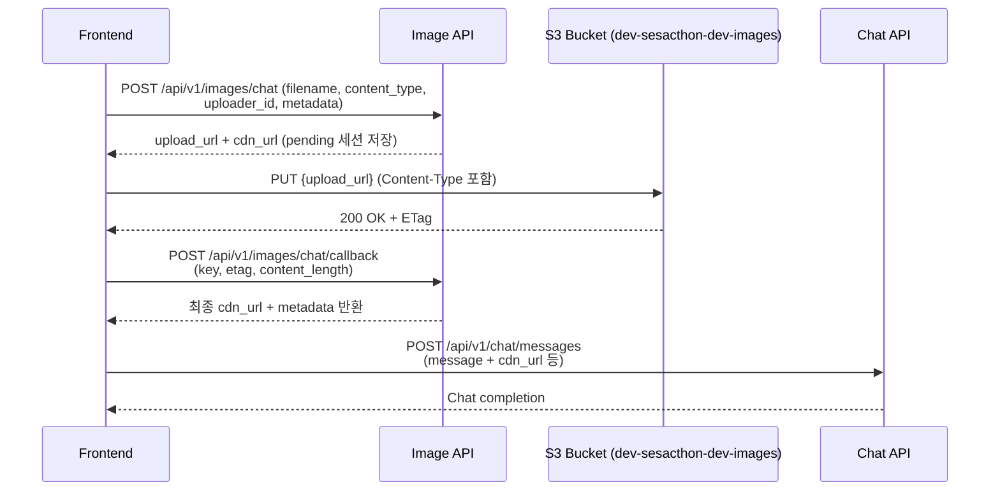

## Image Chat Upload Flow (Frontend Guide)

이 문서는 프론트엔드가 `/api/v1/images/chat` 업로드 파이프라인을 사용하는 방법을 정리합니다. presigned URL 발급 → S3 업로드 → 콜백 확정 → 챗 서버 전달 순서와 예시 코드를 포함합니다.

> **필수 조건**
> - 서비스 로그인 상태(쿠키 `s_access`)가 있어야 presigned 발급/콜백 모두 통과합니다.
> - 요청 본문의 `uploader_id`를 전달하는 경우, 로그인한 사용자 ID와 반드시 일치해야 하며, 미입력 시 서버가 자동으로 쿠키 사용자 ID를 사용합니다.
> - Swagger UI는 `https://api.dev.growbin.app/api/v1/images/docs` 에서 확인할 수 있습니다.

---

### 1. 전체 시퀀스 다이어그램



---

### 2. 엔드포인트 요약

| 단계 | 메서드/URL | 필수 헤더 | 본문/설명 |
| --- | --- | --- | --- |
| 1 | `POST https://api.dev.growbin.app/api/v1/images/{channel}` | `Content-Type: application/json` | `filename`, `content_type`, `uploader_id`(optional), `metadata`(object). |
| 2 | `PUT {upload_url}` | presigned에서 요구한 헤더(`Content-Type` 등) | 원본 이미지 바이너리. |
| 3 | `POST https://api.dev.growbin.app/api/v1/images/{channel}/callback` | `Content-Type: application/json` | `key`, `etag`, `content_length`(선택), `checksum`(선택). |
| 4 | `POST https://api.dev.growbin.app/api/v1/chat/...` | 프로젝트 규격 참고 | callback 응답에서 받은 `cdn_url`과 대화 텍스트를 전달. |

`channel` 값은 `chat`, `scan`, `my` 중 하나이며 이번 플로우는 `chat` 기준입니다.

---

### 3. 예시 코드 (TypeScript/Fetch)

```ts
type UploadInitResponse = {
  key: string;
  upload_url: string;
  cdn_url: string;
  expires_in: number;
  required_headers: Record<string, string>;
};

export async function uploadChatImage(file: File, sessionMeta: {
  chatSessionId: string;
  messageId: string;
  userId: string;
}) {
  const initRes = await fetch("https://api.dev.growbin.app/api/v1/images/chat", {
    method: "POST",
    headers: {"Content-Type": "application/json"},
    body: JSON.stringify({
      filename: file.name,
      content_type: file.type || "application/octet-stream",
      // 로그인 사용자와 동일한 UUID를 넣거나, 생략하면 서버가 쿠키 사용자 ID를 사용합니다.
      uploader_id: sessionMeta.userId,
      metadata: {
        chat_session_id: sessionMeta.chatSessionId,
        message_id: sessionMeta.messageId,
        source: "web",
      },
    }),
  });
  if (!initRes.ok) throw new Error("Failed to request presigned URL");
  const initBody: UploadInitResponse = await initRes.json();

  await fetch(initBody.upload_url, {
    method: "PUT",
    headers: initBody.required_headers,
    body: file,
  });

  const etag = "값은 브라우저 fetch 응답 헤더에서 직접 읽어야 함";
  const finalizeRes = await fetch("https://api.dev.growbin.app/api/v1/images/chat/callback", {
    method: "POST",
    headers: {"Content-Type": "application/json"},
    body: JSON.stringify({
      key: initBody.key,
      etag,
      content_length: file.size,
    }),
  });
  if (!finalizeRes.ok) throw new Error("Failed to finalize upload");
  const finalizeBody = await finalizeRes.json();

  return finalizeBody; // {cdn_url, metadata, uploader_id ...}
}
```

브라우저 Fetch는 기본적으로 ETag를 노출하지 않으므로 콜백 전송 시 빈 값을 보내도 되지만, 가능하면 브라우저 확장(XHR 대신 signed upload SDK)이나 백엔드 프록시를 통해 ETag를 확보하는 것을 권장합니다.

---

### 4. 메타데이터 작성 가이드

- 구조는 자유로운 JSON object. 다만 Key는 snake_case, Value는 문자열/숫자/불리언 같은 단순 타입 사용 권장.
- 권장 필드: `chat_session_id`, `message_id`, `source`, `uploaded_at`, `camera_orientation` 등.
- PII(주민번호, 전화번호 등)나 민감정보는 금지. 필요 시 내부 ID만 넣어두고 실제 개인정보는 BE에서 조회.
- 동일한 `message_id`를 GPT 요청에도 사용하면 이미지-텍스트 매칭이 쉬워집니다.

---

### 5. 오류 대응 체크리스트

| 증상 | 원인/조치 |
| --- | --- |
| presigned 4xx | `filename` 빈 문자열, 허용되지 않은 `channel`, 잘못된 Content-Type 등 입력 검증 실패. |
| S3 PUT 403 | presigned URL 만료(900초) 또는 헤더 누락. 새 presigned 발급 필요. |
| Callback 404 | 업로드 완료 전에 콜백이 호출되었거나 TTL(기본 900초) 경과. presigned → 업로드 → 콜백 순서를 지켜야 함. |
| Callback 400 | 콜백의 `{channel}`와 최초 요청 시 channel이 다르거나 `key` 오타. |

---

### 6. 챗 서버 호출 시 예시 Payload

```json
{
  "message": "이 영수증에서 총 금액 알려줘",
  "attachments": [
    {
      "type": "image",
      "url": "https://images.dev.growbin.app/chat/3d0c0d7a....png",
      "metadata": {
        "chat_session_id": "sess-2025-001",
        "message_id": "msg-7788"
      }
    }
  ]
}
```

챗 API 스펙에 따라 필드명은 조정되지만, `cdn_url`은 콜백 응답 그대로 사용하면 됩니다.

---

추가 질문이나 SDK 포팅이 필요하면 `domains/image` 또는 `domains/chat` 담당자에게 공유해주세요.

