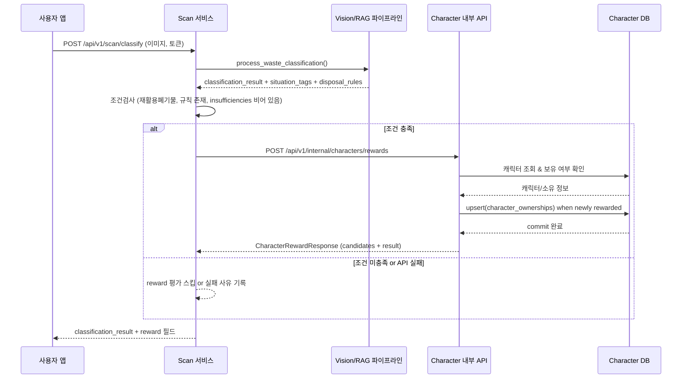

# Scan → Character Reward 연동 설계

## 1. 목표
- `POST /api/v1/scan/classify`가 성공적으로 폐기물을 분류했을 때, **동기적으로 Character 서비스 내부 API**를 호출해 캐릭터 보상 여부를 판단하고, 그 결과를 Scan 응답에 포함한다.
- 프런트는 Scan 응답만으로 분류/보상 상태를 동시에 확인할 수 있으며, Character 서비스는 정책·중복 방지 로직을 서버 사이드에서 통제한다.

## 2. 호출 순서
1. 클라이언트가 `POST /api/v1/scan/classify` 호출 → Vision/RAG/Answer 파이프라인 실행.
2. 파이프라인이 `status=completed`를 반환하고 아래 조건을 모두 충족하면 Character 보상 평가 API를 호출한다.
   - `classification_result.classification.major_category == "재활용폐기물"`
   - `disposal_rules` 존재 (Lite RAG 매칭 성공)
   - `final_answer.insufficiencies`가 **존재**하며, 모든 항목이 비어 있음(실패 사유 없음)
   - Vision middle/minor가 Character DB (`characters.match_label`)의 매칭 기준과 일치
3. Scan 서비스가 Character 내부 API `POST /api/v1/internal/characters/rewards`를 호출하여 user_id, Scan task_id, classification 요약, situation_tags, disposal_rules 존재 여부를 전달.
4. Character 서비스는 매핑/중복 여부를 검증하고, `CharacterRewardResponse` (candidates + result/acquired 여부) 반환.
5. Scan 응답 본문에 `reward` 필드(구현 예정)를 추가하여 Candidate 목록과 Result(획득 성공/이미 소유/조건 불충족 사유)를 포함한다.

## 3. 시퀀스 다이어그램



## 4. Character 내부 API 사양
- Endpoint: `POST /api/v1/internal/characters/rewards`
- Request (`CharacterRewardRequest`):
  ```json
  {
    "source": "scan",
    "user_id": "8e298b12-7898-40f8-8a22-4a410bc861f5",
    "task_id": "24a70b1d-...",
    "classification": {
      "major_category": "재활용폐기물",
      "middle_category": "종이",
      "minor_category": "골판지류"
    },
    "situation_tags": ["깨끗함"],
    "disposal_rules_present": true,
    "insufficiencies_present": false
  }
  ```
- Response (`CharacterRewardResponse`):
  ```json
  {
    "candidates": [
      {
        "name": "페이피",
        "match_reason": "종이>골판지류"
      }
    ],
    "result": {
      "rewarded": true,
      "already_owned": false,
      "character": {
        "name": "페이피",
        "description": "테이프와 스테이플은 떼고 깨끗하게 접어요!"
      },
      "reason": null
    }
  }
  ```

## 5. Reward 매핑 데이터 구조
- 소스: `domains/character/data/character_catalog.csv`
  - `match` 컬럼에 Vision 분류 결과(재활용 2레벨, 기타 1레벨)를 명시한다.
- 로더: `domains/character/jobs/import_character_catalog.py`
  - CSV를 파싱해 Character DB(`characters` 테이블)의 `match_label` 컬럼과 `metadata.match` 필드에 저장한다.
- Character 서비스는 `match_label` 기준으로 직접 DB를 조회해 후보 캐릭터를 결정한다.

## 6. Scan 서비스 구현 포인트
| 단계 | 설명 |
| --- | --- |
| 1 | `ScanService.classify()`에서 `pipeline_result` 산출 후, `_should_evaluate_reward()`로 보상 평가 여부를 결정한다. |
| 2 | 조건을 만족하면 `CharacterRewardRequest` payload를 조립: `user_id`는 Access 토큰 dependency(`TokenPayload.user_id`)에서 추출한다. |
| 3 | `httpx.AsyncClient` 등을 통해 Character API 호출 (내부 네트워크). 타임아웃/재시도 로직 포함. 실패 시 Scan 응답은 성공으로 유지하되, `reward`는 `null`로 둔다. |
| 4 | Character 응답을 Scan 응답의 새 필드 `reward`에 삽입. 기존 `pipeline_result`는 그대로 유지. |

## 7. Character 서비스 구현 포인트
- `CharacterService.evaluate_reward()`는 `CharacterRewardRequest`를 입력받아 다음 순서로 처리한다.
  1. **소스 검증**: 현재는 `scan`만 허용, 다른 값이면 `UNSUPPORTED_SOURCE`.
  2. **분류/규칙 검증**: major가 `재활용폐기물`인지, `disposal_rules_present`가 true인지 검사.
  3. **insufficiencies 확인**: `insufficiencies_present`가 true이면 즉시 실패(사유: `INSUFFICIENT_EVIDENCE`).
  4. **매핑 탐색**: Character DB의 `match_label` 값으로 후보 리스트를 만들고 `CharacterRewardCandidate`에 사유를 기록.
  5. **DB 반영**: 첫 유효 후보부터 캐릭터를 조회하고, `CharacterOwnershipRepository.upsert_owned()`로 저장. 이미 보유한 경우 `already_owned=true`.
  6. **결과 조립**: `CharacterRewardResult`에 지급 여부 또는 실패 사유(`CharacterRewardFailureReason`)를 명시한다.
- 매핑 결과가 없거나 캐릭터 시드가 DB에 없다면 각각 `NO_MATCH`, `CHARACTER_NOT_FOUND`로 표기해 운영 모니터링이 가능하다.

## 8. Scan 응답 확장 예시
```json
{
  "task_id": "...",
  "status": "completed",
  "message": "classification completed",
  "pipeline_result": { ... },
  "reward": {
    "candidates": [...],
    "result": {
      "rewarded": true,
      "already_owned": false,
      "character": {
        "name": "페이피",
        "description": "테이프와 스테이플은 떼고 깨끗하게 접어요!"
      },
      "reason": null
    }
  } // 실패 시 reward 필드는 null
}
```

## 9. 보안/인증
- Character 내부 API는 외부에 노출되지 않으므로, 다음 중 하나 적용:
  - K8s 네트워크 정책으로 Scan Pod만 접근 허용
  - 내부용 헤더/토큰(예: 서비스 간 JWT) 검증 추가
- 요청에는 user_id, task_id 등 최소한의 정보만 포함하고, Vision 결과 전문은 필요한 필드만 전송한다.

## 10. 장애 대응 및 테스트 전략
- **API 호출 실패 처리**: `httpx.HTTPStatusError`/`RequestError`를 각각 로깅하고, reward 필드는 `null` 또는 명시적 실패 reason으로 응답하여 분류 결과 자체는 유지한다.
- **JWT 의존성 명시**:_scan 서비스 requirements에 `python-jose[cryptography]`를 추가해 테스트/배포 환경의 모듈 누락을 방지했다.
- **App 탐색 테스트**: `domains/scan/tests/test_app.py`가 다양한 `sys.path` 후보를 시도해 FastAPI 인스턴스(`app`)를 발견함으로써 CI에서 조기 퇴행을 감지한다.
- **수동 검증 포인트**: `reward_mapping.summarize_mapping()` 출력과 실제 Vision 분류 샘플을 대조해 매핑 누락을 확인한다.

## 11. 향후 확장
- 이벤트 큐 도입 시 Scan이 메시지를 발행하고 Character가 소비하도록 전환할 수 있도록, 현재 HTTP 인터페이스를 그대로 재사용 가능한 구조로 설계한다.
- `source` 필드 확장으로 캠페인/미션 등 다른 보상 소스도 동일 API로 통합 가능.

