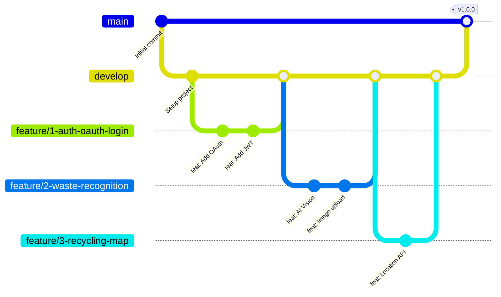

# 🔀 Git 워크플로우

이 문서는 프로젝트의 Git 브랜치 전략과 커밋 규칙을 설명합니다.

## 📋 목차

1. [브랜치 전략](#브랜치-전략)
2. [커밋 컨벤션](#커밋-컨벤션)
3. [작업 프로세스](#작업-프로세스)
4. [PR 가이드라인](#pr-가이드라인)

---

## 🌳 브랜치 전략

### Git Flow 전략 사용



### 메인 브랜치

#### `main`
- **용도**: 프로덕션 배포용
- **보호**: 직접 푸시 금지, PR만 허용
- **배포**: 자동 배포 (GitHub Actions)

#### `develop`
- **용도**: 다음 릴리즈 개발
- **통합**: 모든 feature 브랜치가 여기로 머지
- **테스트**: 개발 서버 자동 배포

### 보조 브랜치

#### `feature/*` - 기능 개발
```bash
# 형식
feature/{이슈번호}-{도메인}-{기능명}

# 예시
feature/1-auth-oauth-login
feature/2-waste-ai-recognition
feature/3-locations-recycling-map
```

#### `hotfix/*` - 긴급 버그 수정
```bash
# 형식
hotfix/{이슈번호}-{설명}

# 예시
hotfix/4-fix-login-token-expiration
hotfix/5-fix-db-connection
```

---

## 💬 커밋 컨벤션

### 커밋 메시지 형식

```
<타입>: <제목>

<본문 (선택)>

<푸터 (선택)>
```

### 타입 종류

| 타입 | 설명 | 예시 |
|------|------|------|
| `feat` | 새로운 기능 추가 | `feat: 카카오 OAuth 로그인 구현` |
| `fix` | 버그 수정 | `fix: JWT 토큰 만료 시간 오류 수정` |
| `docs` | 문서 수정 | `docs: API 문서 업데이트` |
| `style` | 코드 포맷팅 (로직 변경 없음) | `style: Black 포맷팅 적용` |
| `refactor` | 리팩토링 | `refactor: 사용자 서비스 로직 개선` |
| `test` | 테스트 코드 | `test: 사용자 API 단위 테스트 추가` |
| `chore` | 빌드/설정 변경 | `chore: requirements.txt 업데이트` |
| `rename` | 파일/폴더명 수정 | `rename: user_service → users_service` |
| `remove` | 파일 삭제 | `remove: 사용하지 않는 util 함수 제거` |

### 커밋 메시지 예시

#### 좋은 예 ✅

```bash
# 단순한 기능
feat: 사용자 프로필 조회 API 추가

# 상세 설명이 필요한 경우
feat: AI 비전 기반 쓰레기 인식 기능 구현

- YOLOv8 모델 통합
- 이미지 전처리 파이프라인 추가
- 분류 결과 캐싱 로직 구현

Closes #2

# 버그 수정
fix: 로그인 시 토큰 만료 시간 계산 오류 수정

기존에는 UTC 시간을 사용하지 않아 토큰이 즉시 만료되는 문제가 있었음.
datetime.utcnow()를 사용하도록 수정.

Fixes #15
```

#### 나쁜 예 ❌

```bash
# 너무 모호함
update code

# 타입 누락
사용자 API 추가

# 너무 장황함
feat: 사용자 프로필 조회 API를 추가했습니다. 이 API는 사용자 ID를 받아서...
```

### 커밋 크기 가이드

- ✅ **작고 명확한 커밋** - 하나의 기능/수정만 포함
- ✅ **의미 있는 단위** - 독립적으로 실행 가능한 변경
- ❌ **너무 큰 커밋** - 여러 기능을 한 번에 커밋
- ❌ **의미 없는 커밋** - `WIP`, `test`, `fix bug` 등

---

## 🔄 작업 프로세스

### 1. 이슈 생성

```bash
# GitHub에서 Issue 생성
# 템플릿 선택: Feature Request / Bug Report / Refactor
```

### 2. 브랜치 생성

```bash
# develop 브랜치에서 시작
git checkout develop
git pull origin develop

# feature 브랜치 생성
git checkout -b feature/1-auth-oauth-login
```

### 3. 개발 및 커밋

```bash
# 코드 작성 후 스테이징
git add app/domains/auth/

# 커밋 (pre-commit hook 자동 실행)
git commit -m "feat: 카카오 OAuth 로그인 구현"

# 추가 작업
git add app/domains/auth/schemas.py
git commit -m "feat: OAuth 응답 DTO 추가"
```

### 4. 푸시

```bash
# 원격 저장소에 푸시
git push origin feature/1-auth-oauth-login
```

### 5. Pull Request 생성

1. GitHub에서 **New Pull Request** 클릭
2. `feature/1-auth-oauth-login` → `develop`
3. PR 템플릿 작성
4. Reviewers 지정
5. Labels 추가 (`feat`, `backend`)

### 6. 코드 리뷰

- 동료 개발자의 리뷰 대기
- 수정 요청 사항 반영
- 모든 CI 검사 통과 확인

### 7. 머지

```bash
# 리뷰 승인 후 PR 작성자가 머지
# GitHub에서 "Squash and merge" 또는 "Merge" 클릭
```

### 8. 브랜치 정리

```bash
# 로컬 브랜치 삭제
git checkout develop
git pull origin develop
git branch -d feature/1-auth-oauth-login

# 원격 브랜치 삭제 (GitHub에서 자동 삭제 설정 권장)
git push origin --delete feature/1-auth-oauth-login
```

---

## 📝 PR 가이드라인

### PR 제목

```
[타입] 간결한 설명

예시:
[FEAT] 카카오 OAuth 로그인 구현
[FIX] JWT 토큰 만료 시간 오류 수정
[REFACTOR] 사용자 서비스 로직 개선
```

### PR 본문 (템플릿 사용)

``markdown
## 🔗 Issue
- close #1

## 💡 구현 의도
카카오 간편 로그인 기능을 구현했습니다.

## ✅ 구현 사항
- 카카오 OAuth 2.0 인증 플로우 구현
- JWT 토큰 발급 로직 추가
- 사용자 정보 자동 생성 기능

## 🔍 중점적으로 리뷰받고 싶은 부분
- JWT 토큰 만료 시간 설정이 적절한지
- OAuth 에러 처리가 충분한지

## 🫡 참고사항
- [카카오 OAuth 문서](https://developers.kakao.com/docs/latest/ko/kakaologin/rest-api)
```

### PR 체크리스트

머지 전 확인사항:

- [ ] 코드가 [코딩 컨벤션](conventions.md)을 따르는가?
- [ ] 모든 테스트가 통과하는가?
- [ ] 린트 검사를 통과하는가?
- [ ] 문서(docstring, README 등)를 업데이트했는가?
- [ ] Breaking Change가 있다면 명시했는가?
- [ ] 리뷰어를 2명 이상 지정했는가?

---

## 🚨 규칙 및 주의사항

### ✅ 해야 할 것

- ✅ **이슈 먼저 생성** - 코드 작성 전 이슈 생성
- ✅ **작은 PR** - 300줄 이하 권장
- ✅ **테스트 작성** - 새 기능은 테스트 필수
- ✅ **문서 업데이트** - API 변경 시 문서 갱신
- ✅ **CI 통과** - 모든 검사 통과 후 머지

### ❌ 하지 말아야 할 것

- ❌ **main에 직접 푸시** - 반드시 PR 사용
- ❌ **force push** - 공유 브랜치에 절대 금지
- ❌ **리뷰 없이 머지** - 최소 1명 승인 필요
- ❌ **테스트 스킵** - `--no-verify` 사용 금지
- ❌ **대용량 파일** - 이미지, 바이너리 커밋 금지

---

## 🔧 유용한 Git 명령어

### 브랜치 관리

```bash
# 현재 브랜치 확인
git branch

# 원격 브랜치 목록
git branch -r

# 브랜치 삭제
git branch -d feature/old-feature

# 브랜치 이름 변경
git branch -m old-name new-name
```

### 커밋 관리

```bash
# 마지막 커밋 메시지 수정
git commit --amend

# 마지막 커밋에 파일 추가
git add file.py
git commit --amend --no-edit

# 커밋 히스토리 확인
git log --oneline --graph --all
```

### 변경사항 관리

```bash
# 변경사항 임시 저장
git stash

# 임시 저장 내용 복원
git stash pop

# 특정 파일만 체크아웃
git checkout develop -- app/core/config.py
```

### 원격 저장소

```bash
# 원격 브랜치 최신화
git fetch origin

# develop 브랜치 최신화
git pull origin develop

# 원격 브랜치 삭제
git push origin --delete feature/old-feature
```

---

## 📚 관련 문서

- [PR 템플릿 가이드](../contributing/pull-request.md)
- [이슈 작성 가이드](../contributing/issue-guide.md)
- [코드 리뷰 가이드](../contributing/code-review.md)
- [코딩 컨벤션](conventions.md)

---

**문서 버전**: 1.0.0  
**최종 업데이트**: 2025-10-30

