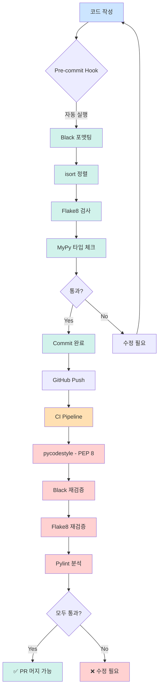
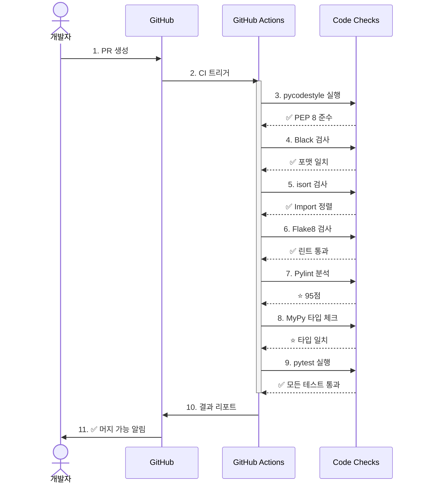

# 📏 PEP 8 완벽 가이드

> **PEP 8** (Python Enhancement Proposal 8)은 Python 코드 스타일 공식 가이드입니다.

## 📋 목차

1. [PEP 8이란?](#pep-8이란)
2. [본 프로젝트의 PEP 8 적용](#본-프로젝트의-pep-8-적용)
3. [핵심 규칙](#핵심-규칙)
4. [검증 방법](#검증-방법)
5. [CI/CD 통합](#cicd-통합)

---

## 🎯 PEP 8이란?

**PEP 8**은 Python 커뮤니티에서 합의한 코드 작성 규칙입니다.

### 목표

- ✅ **가독성 향상** - 일관된 스타일
- ✅ **협업 효율** - 팀원 간 코드 이해 용이
- ✅ **유지보수성** - 장기적인 코드 품질 유지

### 공식 문서

- [PEP 8 – Style Guide for Python Code](https://peps.python.org/pep-0008/)

---

## 🛠️ 본 프로젝트의 PEP 8 적용

### 기본 원칙

```
PEP 8 기본 규칙을 따르되, 현대적인 도구 설정을 적용

1. Black 포맷터 우선 (자동 포맷팅)
2. 줄 길이: 100자 (PEP 8 원칙 79자 → 완화)
3. 타입 힌트 적극 활용 (PEP 484)
```

### 검증 도구 체인



---

## 📖 핵심 규칙

상세한 규칙은 [코딩 컨벤션](conventions.md#pep-8-기본-규칙)을 참고하세요.

### 1. 들여쓰기
- ✅ 4칸 스페이스
- ❌ 탭 금지

### 2. 줄 길이
- ✅ 최대 100자 (본 프로젝트)
- 📝 PEP 8 원칙: 79자 (완화 적용)

### 3. 공백
- ✅ 연산자 양쪽 공백: `x = 1 + 2`
- ✅ 쉼표 뒤 공백: `func(a, b, c)`
- ❌ 괄호 안쪽 공백 금지: `spam = [1, 2, 3]`

### 4. 빈 줄
- ✅ 최상위 함수/클래스 사이: 2줄
- ✅ 클래스 메서드 사이: 1줄

### 5. Import 순서
1. 표준 라이브러리
2. 서드파티 라이브러리
3. 로컬 모듈

### 6. 네이밍
- 함수/변수: `snake_case`
- 클래스: `PascalCase`
- 상수: `UPPER_SNAKE_CASE`

### 7. 비교 연산
- ✅ None: `is None` / `is not None`
- ✅ 불린: `if is_active:` (== True 금지)

### 8. 타입 힌트
- ✅ 함수 시그니처에 타입 명시
- ✅ Optional, List, Dict 활용

---

## ✅ 검증 방법

### 로컬 검사

```bash
# 1단계: PEP 8 검사
pycodestyle app/ --max-line-length=100

# 2단계: 전체 린트 (PEP 8 포함)
make lint

# 3단계: 자동 수정
make lint-fix

# 4단계: 상세 리포트
make lint-report
# → reports/ 폴더에 HTML 리포트 생성
```

### 도구별 역할

| 도구 | 역할 | PEP 8 검사 |
|------|------|-----------|
| **pycodestyle** | 순수 PEP 8 규칙 검사 | ✅ 100% |
| **Black** | 코드 포맷 자동 수정 | ✅ PEP 8 기반 |
| **isort** | Import 정렬 | ✅ PEP 8 준수 |
| **Flake8** | PEP 8 + 추가 린트 | ✅ PEP 8 + α |
| **Pylint** | 정적 분석, 코드 품질 | ⭐ 일부 |
| **MyPy** | 타입 힌트 검증 | ⭐ PEP 484 |

---

## 🔄 CI/CD 통합

### GitHub Actions 파이프라인

```yaml
# .github/workflows/ci.yml
jobs:
  lint-and-test:
    steps:
      # 1. PEP 8 검사 (필수)
      - name: PEP 8 스타일 검사
        run: pycodestyle app/ --max-line-length=100
        continue-on-error: false  # 실패 시 CI 중단
      
      # 2. Black 포맷 검사 (필수)
      - name: Black 포맷 검사
        run: black --check .
        continue-on-error: false
      
      # 3. Flake8 (필수)
      - name: Flake8 린트
        run: flake8 app/
        continue-on-error: false
      
      # 4. Pylint (선택)
      - name: Pylint 분석
        run: pylint app/
        continue-on-error: true  # 경고만 표시
      
      # 5. MyPy (선택)
      - name: MyPy 타입 체크
        run: mypy app/
        continue-on-error: true
```

### PR 체크 과정



---

## 🚨 CI 실패 시 대응

### 시나리오 1: PEP 8 위반

```bash
# CI 에러 메시지
app/domains/users/services.py:45:81: E501 line too long (105 > 100 characters)
app/core/config.py:23:1: E302 expected 2 blank lines, found 1

# 해결 방법
1. 로컬에서 수정
   make lint-fix

2. 재검사
   make lint

3. Commit & Push
   git add .
   git commit -m "style: PEP 8 규칙 준수"
   git push
```

### 시나리오 2: Black 포맷 불일치

```bash
# CI 에러
would reformat app/main.py

# 자동 수정
black .
git add .
git commit -m "style: Black 포맷팅 적용"
```

### 시나리오 3: Import 정렬 오류

```bash
# CI 에러
ERROR: Imports are incorrectly sorted

# 자동 수정
isort .
git add .
git commit -m "style: Import 정렬"
```

---

## 📊 코드 품질 레벨

### Level 1: 최소 요구사항 (필수 ✅)

```bash
✅ pycodestyle 통과 (PEP 8)
✅ black 통과
✅ isort 통과
✅ flake8 통과
✅ pytest 통과
```

**결과:** PR 머지 가능

### Level 2: 권장 사항 (선택 ⭐)

```bash
⭐ Pylint 점수 8.0 이상
⭐ MyPy 타입 검사 통과
⭐ 테스트 커버리지 80% 이상
⭐ 복잡도 10 이하 (Cyclomatic Complexity)
```

**결과:** 코드 품질 우수

---

## 🎓 학습 자료

### PEP 8 학습 순서

1. [PEP 8 공식 문서](https://peps.python.org/pep-0008/) - 원본
2. [Real Python - PEP 8 Guide](https://realpython.com/python-pep8/) - 초보자용
3. [Google Python Style Guide](https://google.github.io/styleguide/pyguide.html) - 실무 응용
4. 본 프로젝트 [코딩 컨벤션](conventions.md) - 팀 규칙

### 실습

```bash
# 1. 의도적으로 PEP 8 위반 코드 작성
# 2. pycodestyle로 검사
pycodestyle your_file.py

# 3. 에러 확인 및 수정
# 4. Black으로 자동 수정
black your_file.py

# 5. 재검사
pycodestyle your_file.py
```

---

## 🔗 관련 문서

- [코딩 컨벤션](conventions.md) - 전체 규칙
- [Git 워크플로우](git-workflow.md) - PR 프로세스
- [배포 가이드](../deployment/full-guide.md) - CI/CD 파이프라인

---

**문서 버전**: 1.0.0  
**최종 업데이트**: 2025-10-30  
**참고**: [PEP 8 공식 문서](https://peps.python.org/pep-0008/)

