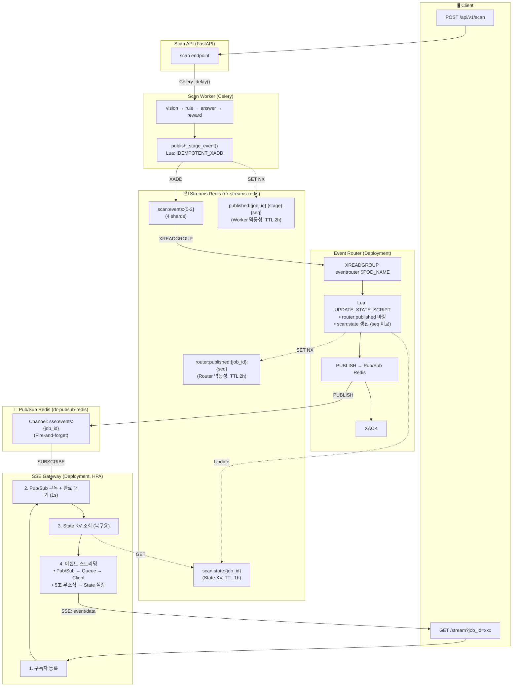
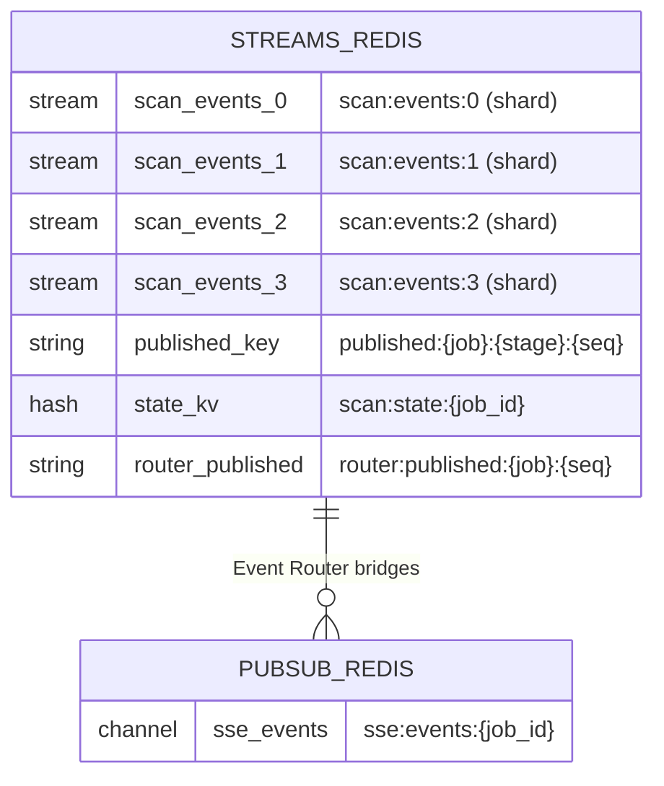
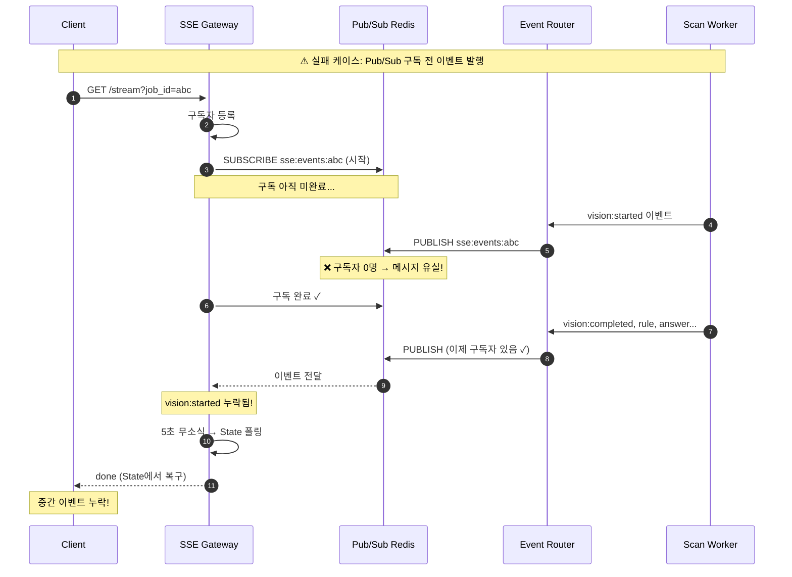
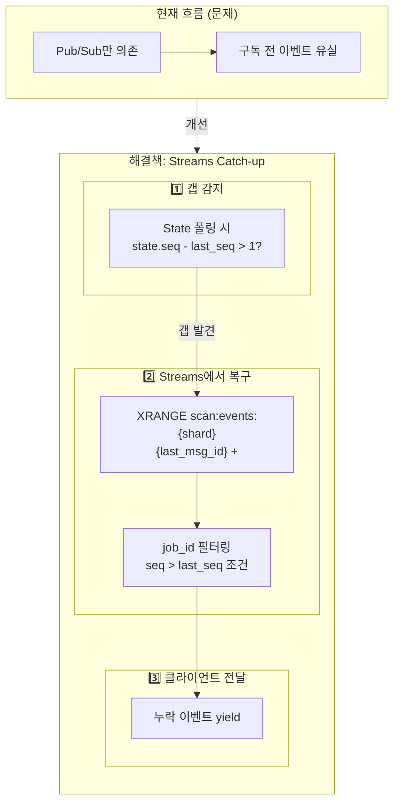
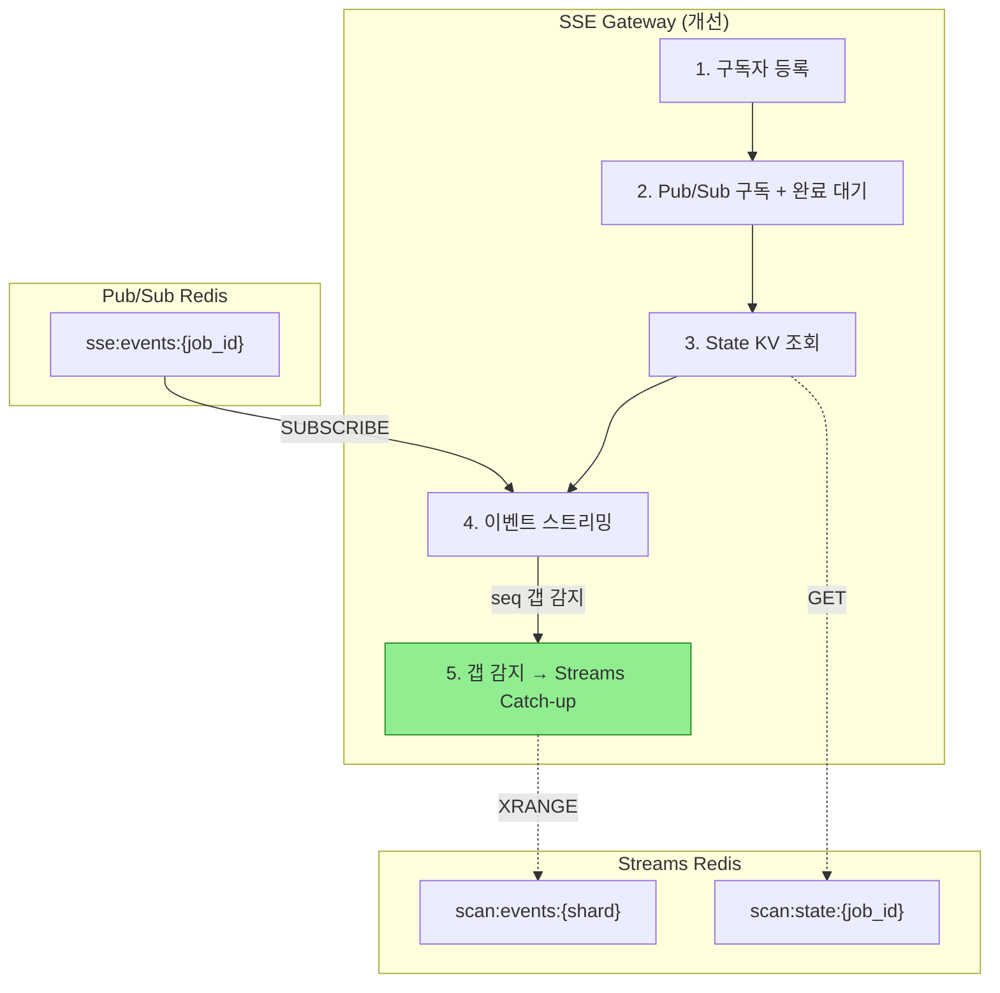

# FLP Impossibility: 분산 합의의 불가능성

> [← 인덱스](./00-index.md) | [← 13. Sharding & Routing](./13-sharding-and-routing.md)

> **"비동기 분산 시스템에서 단 하나의 노드 장애만 허용해도,  
> 합의를 보장하는 결정론적 알고리즘은 존재하지 않는다."**
>
> 분산 시스템 이론의 가장 중요한 불가능성 결과

---

## 공식 자료 (1차 지식생산자)

### 원본 논문

| 논문 | 저자 | 발표 | 핵심 내용 |
|------|------|------|---------|
| **[Impossibility of Distributed Consensus with One Faulty Process](https://groups.csail.mit.edu/tds/papers/Lynch/jacm85.pdf)** | Michael J. Fischer (Yale), Nancy A. Lynch (MIT), Michael S. Paterson (Warwick) | JACM 1985 | FLP Impossibility 원본 논문 |

### 저자 소개

```
┌─────────────────────────────────────────────────────────────────┐
│                    FLP 논문 저자                                  │
├─────────────────────────────────────────────────────────────────┤
│                                                                  │
│  Michael J. Fischer (Yale University)                           │
│  ─────────────────────────────────                              │
│  • 계산 복잡도 이론, 분산 컴퓨팅 전문가                          │
│  • Turing Award 후보                                            │
│                                                                  │
│  Nancy A. Lynch (MIT)                                           │
│  ────────────────────                                           │
│  • 분산 알고리즘 분야의 대모                                     │
│  • "Distributed Algorithms" 교과서 저자                         │
│  • Dijkstra Prize (2007), Knuth Prize (2012)                   │
│                                                                  │
│  Michael S. Paterson (University of Warwick)                    │
│  ────────────────────────────────────────                       │
│  • 알고리즘 이론, 계산 복잡도 전문가                             │
│  • ACM Fellow                                                   │
│                                                                  │
│  논문 별칭: "FLP" (세 저자의 이니셜)                            │
│                                                                  │
└─────────────────────────────────────────────────────────────────┘
```

---

## 1. 배경: 분산 합의 문제 (Consensus Problem)

### 1.1 문제 정의

```
┌─────────────────────────────────────────────────────────────────┐
│                    Consensus Problem                             │
├─────────────────────────────────────────────────────────────────┤
│                                                                  │
│  설정:                                                          │
│  ─────                                                          │
│  • N개의 프로세스                                               │
│  • 각 프로세스는 초기값 ∈ {0, 1}을 가짐                         │
│  • 일부 프로세스는 장애가 발생할 수 있음 (crash)                │
│                                                                  │
│  목표: 모든 정상 프로세스가 하나의 값에 동의                    │
│                                                                  │
│  요구사항:                                                      │
│  ──────────                                                      │
│  1. Agreement (동의):                                           │
│     모든 정상 프로세스는 동일한 값을 결정                       │
│                                                                  │
│  2. Validity (유효성):                                          │
│     결정된 값은 어떤 프로세스가 제안한 초기값                   │
│     (모두 0이면 0, 모두 1이면 1 결정)                          │
│                                                                  │
│  3. Termination (종료):                                         │
│     모든 정상 프로세스는 언젠가 결정에 도달                     │
│                                                                  │
└─────────────────────────────────────────────────────────────────┘
```

### 1.2 실제 응용: Transaction Commit

```
┌─────────────────────────────────────────────────────────────────┐
│                    Distributed Transaction Commit                │
├─────────────────────────────────────────────────────────────────┤
│                                                                  │
│  시나리오: 분산 데이터베이스에서 트랜잭션 커밋                   │
│                                                                  │
│  ┌──────────┐     ┌──────────┐     ┌──────────┐                │
│  │  Node A  │     │  Node B  │     │  Node C  │                │
│  │ (DB 샤드)│     │ (DB 샤드)│     │ (DB 샤드)│                │
│  └────┬─────┘     └────┬─────┘     └────┬─────┘                │
│       │                │                │                       │
│       └────────────────┼────────────────┘                       │
│                        ▼                                         │
│                   ┌─────────┐                                   │
│                   │ Commit? │                                   │
│                   │ Abort?  │                                   │
│                   └─────────┘                                   │
│                                                                  │
│  문제:                                                          │
│  • 모든 노드가 Commit에 동의해야 데이터 일관성 유지             │
│  • 하나라도 Abort하면 전체 Abort                                │
│  • 노드가 장애나면? → 합의 불가능!                              │
│                                                                  │
└─────────────────────────────────────────────────────────────────┘
```

---

## 2. 시스템 모델

### 2.1 비동기 시스템 (Asynchronous System)

```
┌─────────────────────────────────────────────────────────────────┐
│                    비동기 시스템의 특징                          │
├─────────────────────────────────────────────────────────────────┤
│                                                                  │
│  FLP가 가정하는 시스템:                                         │
│  ─────────────────────                                          │
│                                                                  │
│  1. 프로세스 속도에 대한 가정 없음                              │
│     • 상대적 속도 알 수 없음                                    │
│     • 한 프로세스가 다른 것보다 얼마나 빠른지 모름              │
│                                                                  │
│  2. 메시지 지연에 대한 상한 없음                                │
│     • 메시지가 언제 도착할지 알 수 없음                         │
│     • 임의로 오래 지연될 수 있음                                │
│     • 단, 결국에는 도착함 (eventually delivered)                │
│                                                                  │
│  3. 동기화된 시계 없음                                          │
│     • 글로벌 시간 개념 없음                                     │
│     • 타임아웃 기반 알고리즘 불가                               │
│                                                                  │
│  4. 장애 감지 불가능                                            │
│     • 프로세스가 죽었는지, 느린 건지 구분 불가                  │
│     • "Is it dead or just slow?"                                │
│                                                                  │
└─────────────────────────────────────────────────────────────────┘
```

### 2.2 장애 모델 (Failure Model)

```
┌─────────────────────────────────────────────────────────────────┐
│                    장애 모델                                     │
├─────────────────────────────────────────────────────────────────┤
│                                                                  │
│  FLP가 가정하는 장애:                                           │
│  ───────────────────                                            │
│                                                                  │
│  1. Crash Failure (충돌 장애)                                   │
│     • 프로세스가 갑자기 멈춤                                    │
│     • 경고 없이 발생                                            │
│     • 복구 없음 (fail-stop)                                     │
│                                                                  │
│  2. 최대 1개 프로세스 장애                                      │
│     • f = 1 (단 하나의 장애만 가정)                            │
│     • 이것조차도 합의를 불가능하게 함!                          │
│                                                                  │
│  가정하지 않는 것:                                              │
│  ─────────────────                                              │
│  • Byzantine Failure (악의적 행동) - 더 어려운 문제            │
│  • 메시지 손실 - 모든 메시지는 결국 도착                        │
│  • 메시지 변조 - 메시지 내용은 정확                             │
│                                                                  │
│  핵심:                                                          │
│  ─────                                                          │
│  "가장 약한 장애 모델에서도 합의 불가능"                        │
│                                                                  │
└─────────────────────────────────────────────────────────────────┘
```

---

## 3. FLP 정리 (FLP Theorem)

### 3.1 정리 진술

> **Theorem (FLP, 1985):**
>
> 완전히 비동기적인 분산 시스템에서,  
> 단 하나의 프로세스 장애도 허용하면서  
> 합의(Consensus)를 보장하는 결정론적 알고리즘은 존재하지 않는다.

### 3.2 직관적 이해

```
┌─────────────────────────────────────────────────────────────────┐
│                    왜 불가능한가?                                │
├─────────────────────────────────────────────────────────────────┤
│                                                                  │
│  핵심 딜레마: "죽었는가? 느린 것인가?"                          │
│  ───────────────────────────────────                            │
│                                                                  │
│  시나리오: P1, P2가 있고, P2로부터 응답을 기다림                 │
│                                                                  │
│  ┌────────────────────────────────────────────────────────────┐│
│  │                                                             ││
│  │   P1: "P2로부터 응답이 없다..."                             ││
│  │                                                             ││
│  │   선택지 1: P2가 죽었다고 가정하고 혼자 결정                ││
│  │   → P2가 실제로 살아있으면? 다른 값을 결정할 수 있음!       ││
│  │   → Agreement 위반                                          ││
│  │                                                             ││
│  │   선택지 2: P2를 계속 기다림                                ││
│  │   → P2가 실제로 죽었으면? 영원히 기다림                     ││
│  │   → Termination 위반                                        ││
│  │                                                             ││
│  └────────────────────────────────────────────────────────────┘│
│                                                                  │
│  어떤 선택을 해도 합의 요구사항 중 하나를 위반!                 │
│                                                                  │
└─────────────────────────────────────────────────────────────────┘
```

### 3.3 증명 핵심 아이디어

```
┌─────────────────────────────────────────────────────────────────┐
│                    증명 전략 (Bivalence Argument)                │
├─────────────────────────────────────────────────────────────────┤
│                                                                  │
│  정의:                                                          │
│  ─────                                                          │
│  • Univalent Configuration: 결과가 확정된 상태                  │
│    - 0-valent: 0으로 결정될 것이 확정                          │
│    - 1-valent: 1로 결정될 것이 확정                            │
│  • Bivalent Configuration: 아직 0 또는 1 모두 가능             │
│                                                                  │
│  증명 단계:                                                     │
│  ──────────                                                     │
│                                                                  │
│  1단계: Bivalent 초기 설정 존재 증명                           │
│  ──────────────────────────────────                             │
│  • 모든 초기값이 0 → 결과 0 (validity)                         │
│  • 모든 초기값이 1 → 결과 1 (validity)                         │
│  • 사이 어딘가에 bivalent 설정이 있어야 함                     │
│                                                                  │
│  ┌─────────────────────────────────────────────────────────┐   │
│  │  [0,0,0] → 0-valent                                      │   │
│  │  [0,0,1] → ?                                             │   │
│  │  [0,1,1] → bivalent (0 또는 1 가능)                     │   │
│  │  [1,1,1] → 1-valent                                      │   │
│  └─────────────────────────────────────────────────────────┘   │
│                                                                  │
│  2단계: Bivalent에서 탈출 불가능 증명                          │
│  ──────────────────────────────────                             │
│  • 어떤 이벤트를 적용해도 bivalent 상태를 유지할 수 있음       │
│  • 장애 프로세스의 메시지를 무한히 지연시킴                     │
│  • 결정을 영원히 미룰 수 있음 → Termination 위반               │
│                                                                  │
└─────────────────────────────────────────────────────────────────┘
```

### 3.4 핵심 보조정리 (Key Lemma)

```
┌─────────────────────────────────────────────────────────────────┐
│                    Lemma 3 (핵심)                                │
├─────────────────────────────────────────────────────────────────┤
│                                                                  │
│  Lemma:                                                         │
│  어떤 bivalent configuration C에서,                             │
│  어떤 프로세스 p에게 전달 가능한 메시지 m이 있을 때,            │
│  m을 받은 후에도 bivalent한 configuration이 도달 가능하다.      │
│                                                                  │
│  의미:                                                          │
│  ─────                                                          │
│  • 어떤 메시지를 처리해도 "아직 결정 안 됨" 상태 유지 가능     │
│  • 적대자(adversary)가 메시지 순서를 조작하면                   │
│  • 영원히 bivalent 상태를 유지할 수 있음                        │
│                                                                  │
│  증명 아이디어:                                                 │
│  ──────────────                                                 │
│  • 귀류법: m 처리 후 항상 univalent라고 가정                   │
│  • e(C) = 0-valent, e'(C) = 1-valent인 경우 분석               │
│  • 메시지 순서에 따라 모순 도출                                 │
│                                                                  │
└─────────────────────────────────────────────────────────────────┘
```

---

## 4. 함의와 해결책

### 4.1 FLP의 함의

```
┌─────────────────────────────────────────────────────────────────┐
│                    FLP가 의미하는 것                             │
├─────────────────────────────────────────────────────────────────┤
│                                                                  │
│  의미하는 것:                                                   │
│  ─────────────                                                  │
│  • 완벽한 분산 합의는 이론적으로 불가능                         │
│  • 가장 약한 장애 모델에서도 마찬가지                           │
│  • 안전성(Safety)과 종료성(Liveness)을 동시에 보장 불가        │
│                                                                  │
│  의미하지 않는 것:                                              │
│  ─────────────────                                              │
│  • 실용적인 합의 시스템을 만들 수 없다? ✗                      │
│  • 분산 시스템은 무용하다? ✗                                   │
│  • Paxos, Raft가 틀렸다? ✗                                     │
│                                                                  │
│  핵심:                                                          │
│  ─────                                                          │
│  "모든 가능한 실행에서 합의를 보장할 수 없다"                   │
│  "대부분의 실행에서 합의를 달성하는 것은 가능"                  │
│                                                                  │
└─────────────────────────────────────────────────────────────────┘
```

### 4.2 FLP 우회 전략

```
┌─────────────────────────────────────────────────────────────────┐
│                    FLP 우회 전략                                 │
├─────────────────────────────────────────────────────────────────┤
│                                                                  │
│  1. 동기성 가정 추가 (Partial Synchrony)                        │
│  ──────────────────────────────────────                         │
│  • 메시지 지연에 상한이 있다고 가정                             │
│  • 타임아웃 사용 가능                                           │
│  • 예: Paxos, Raft (타임아웃 기반 리더 선출)                   │
│                                                                  │
│  2. 랜덤화 (Randomization)                                      │
│  ────────────────────────                                       │
│  • 확률적 종료 보장 (with probability 1)                       │
│  • 적대자가 예측 불가능한 행동                                  │
│  • 예: Ben-Or's Protocol (1983)                                │
│                                                                  │
│  3. 장애 감지기 (Failure Detectors)                             │
│  ────────────────────────────────                               │
│  • 불완전하지만 유용한 장애 감지                                │
│  • Eventually Perfect Failure Detector (◇P)                    │
│  • 예: Chandra-Toueg (1996)                                    │
│                                                                  │
│  4. 종료 보장 완화                                              │
│  ──────────────────                                             │
│  • "결국 종료" 대신 "높은 확률로 종료"                         │
│  • 실제로는 충분히 실용적                                       │
│                                                                  │
└─────────────────────────────────────────────────────────────────┘
```

### 4.3 실제 시스템에서의 적용

```
┌─────────────────────────────────────────────────────────────────┐
│                    실제 시스템의 FLP 우회                        │
├─────────────────────────────────────────────────────────────────┤
│                                                                  │
│  Paxos / Raft:                                                  │
│  ─────────────                                                  │
│  • 타임아웃 기반 리더 선출                                      │
│  • 동기적 구간에서만 진행 보장                                  │
│  • 비동기 구간: 안전성 유지, 진행 중단                         │
│                                                                  │
│  Redis Sentinel:                                                │
│  ───────────────                                                │
│  • down-after-milliseconds (타임아웃)                          │
│  • 장애 감지 후 Quorum 투표                                    │
│  • 부분 동기 가정                                               │
│                                                                  │
│  Kubernetes (etcd):                                             │
│  ──────────────────                                             │
│  • Raft 기반 etcd                                              │
│  • election-timeout, heartbeat-interval                        │
│  • 네트워크 분할 시 일부 노드 읽기 전용                        │
│                                                                  │
│  공통점: 안전성(Safety)은 항상 보장                             │
│         종료성(Liveness)은 부분적으로만 보장                    │
│                                                                  │
└─────────────────────────────────────────────────────────────────┘
```

---

## 5. 관련 결과

### 5.1 동기 시스템에서의 합의

```
┌─────────────────────────────────────────────────────────────────┐
│                    동기 시스템에서는 가능                        │
├─────────────────────────────────────────────────────────────────┤
│                                                                  │
│  동기 시스템 가정:                                              │
│  ─────────────────                                              │
│  • 메시지 지연에 알려진 상한 Δ 존재                             │
│  • 프로세스 속도에 알려진 상한 존재                             │
│  • 글로벌 시간 개념 존재                                        │
│                                                                  │
│  결과:                                                          │
│  ─────                                                          │
│  • f+1 라운드에서 합의 가능 (f = 장애 수)                      │
│  • 타임아웃으로 장애 감지 가능                                  │
│  • Byzantine Generals도 해결 가능 (n > 3f)                     │
│                                                                  │
│  FLP와의 차이:                                                  │
│  ──────────────                                                 │
│  • 동기: Agreement + Validity + Termination 모두 보장          │
│  • 비동기: Termination 보장 불가                                │
│                                                                  │
└─────────────────────────────────────────────────────────────────┘
```

### 5.2 CAP 정리와의 관계

```
┌─────────────────────────────────────────────────────────────────┐
│                    FLP vs CAP                                    │
├─────────────────────────────────────────────────────────────────┤
│                                                                  │
│  FLP (1985):                                                    │
│  ───────────                                                    │
│  • 비동기 + 1개 장애 → 합의 불가능                             │
│  • Safety vs Liveness 트레이드오프                             │
│                                                                  │
│  CAP (2000, Brewer):                                            │
│  ──────────────────                                             │
│  • 네트워크 분할 시 Consistency vs Availability 선택           │
│  • C + A + P 모두 동시에 불가능                                │
│                                                                  │
│  관계:                                                          │
│  ─────                                                          │
│  • 둘 다 분산 시스템의 근본적 한계를 설명                       │
│  • FLP: 장애 상황에서 합의의 한계                               │
│  • CAP: 네트워크 분할에서 일관성/가용성 트레이드오프           │
│                                                                  │
│  실제 선택:                                                     │
│  ──────────                                                     │
│  • CP 시스템: 일관성 우선 (etcd, ZooKeeper)                    │
│  • AP 시스템: 가용성 우선 (Cassandra, DynamoDB)                │
│                                                                  │
└─────────────────────────────────────────────────────────────────┘
```

---

## 6. Eco² 적용

### 6.1 Redis Sentinel의 FLP 우회

```yaml
# Redis Sentinel 설정
sentinel:
  customConfig:
  - down-after-milliseconds 5000   # 타임아웃 (부분 동기 가정)
  - failover-timeout 10000         # Failover 제한 시간

# FLP 우회 전략:
# 1. 타임아웃으로 장애 감지 (완벽하지 않지만 실용적)
# 2. Quorum 투표로 합의 (과반수 동의)
# 3. 네트워크 분할 시: 소수 파티션 읽기 전용 (Safety 우선)
```

### 6.2 RabbitMQ의 FLP 우회

```yaml
rabbitmq:
  additionalConfig: |
    # 네트워크 분할 처리 전략
    cluster_partition_handling = pause_minority
    
    # FLP 우회:
    # 1. Raft (타임아웃 기반 리더 선출)
    # 2. pause_minority: 소수 파티션 일시정지 (Safety 우선)
    # 3. 동기적 구간에서만 진행 보장
```

---

## 7. "비동기 분산 시스템 = FLP"인가?

> **핵심: "비동기 + 분산"이라고 자동으로 FLP 모델에 해당하지 않는다.**
> FLP는 '합의(consensus)' 문제를 다루는 것이므로, 시스템이 합의를 풀고 있는지가 핵심.

### 7.1 FLP가 직접 겨냥하는 문제

```
┌─────────────────────────────────────────────────────────────────┐
│                    FLP가 다루는 문제                             │
├─────────────────────────────────────────────────────────────────┤
│                                                                  │
│  FLP가 "불가능"이라고 말하는 것:                                │
│  ───────────────────────────────                                │
│  • 여러 노드가                                                  │
│  • 같은 값에 대해 완전히 동일한 결정을                          │
│  • 네트워크 지연이 무한할 수 있는 상황에서                      │
│  • 항상 진행(liveness)까지 보장하면서                           │
│  • 결정론적으로 만들어야 할 때                                  │
│                                                                  │
│  = 분산 합의 / 원자적 브로드캐스트 (Atomic Broadcast)           │
│                                                                  │
│  여기서 "불가능"은:                                             │
│  ─────────────────                                              │
│  • "모든 가능한 실행에서 종료를 보장하는 것"이 불가능           │
│  • "대부분의 실행에서 종료"는 가능 (실제 시스템이 하는 것)      │
│                                                                  │
└─────────────────────────────────────────────────────────────────┘
```

### 7.2 Eco² SSE HA 아키텍처 (현재 구현)

#### 전체 데이터 흐름



#### Redis 데이터 구조



#### 핵심 관찰: FLP 해당 여부

```
┌─────────────────────────────────────────────────────────────────┐
│                    Eco² 이벤트 버스 분석                         │
├─────────────────────────────────────────────────────────────────┤
│                                                                  │
│  핵심 관찰:                                                     │
│  ──────────                                                     │
│  • 합의를 여러 노드가 함께 만드는 구조가 아님                   │
│  • Redis Master가 "단일 시퀀서" 역할                            │
│  • State KV의 "최신 seq만 유지"도 Redis 원자 연산 위에서 성립   │
│  • = 중앙 조정자(Leader)를 둔 모델                              │
│                                                                  │
│  결론: FLP의 전제(완전 분산 합의)와 결이 다름                   │
│                                                                  │
└─────────────────────────────────────────────────────────────────┘
```

### 7.3 Race Condition 문제

Pub/Sub의 Fire-and-forget 특성으로 인한 이벤트 누락 문제:



#### 타임라인 분석

```mermaid
gantt
    title Race Condition 타임라인
    dateFormat X
    axisFormat %s

    section Client
    POST /api/v1/scan           :crit, c1, 0, 1
    SSE 연결 시작               :c2, 1, 2

    section SSE Gateway
    Pub/Sub 구독 시작           :g1, 2, 3
    Pub/Sub 구독 완료           :g2, 4, 5
    State 복구                  :g3, 5, 6

    section Worker
    vision:started 발행         :crit, w1, 3, 4
    vision:completed 발행       :w2, 5, 6
    done 발행                   :w3, 7, 8

    section 문제
    이벤트 유실 구간            :crit, p1, 3, 4
```

### 7.4 해결 방안: Streams Catch-up



#### Catch-up 로직

```python
# SSE Gateway: Streams Catch-up 구현
async def catch_up_from_streams(
    job_id: str, 
    last_seq: int, 
    state_seq: int
):
    """State 폴링에서 seq 갭 발견 시 Streams에서 누락 이벤트 조회"""
    
    if state_seq - last_seq <= 1:
        return  # 갭 없음
    
    # 해당 job의 shard 계산
    shard = hash(job_id) % SHARD_COUNT
    stream_key = f"scan:events:{shard}"
    
    # Streams에서 누락 이벤트 조회
    # last_msg_id 이후의 모든 이벤트
    events = await redis.xrange(
        stream_key, 
        min=last_msg_id,  # 마지막으로 받은 메시지 ID
        max="+"           # 최신까지
    )
    
    for entry_id, data in events:
        if data.get("job_id") == job_id:
            event_seq = int(data.get("seq", 0))
            if event_seq > last_seq:
                yield data  # 누락된 이벤트 전달
                last_seq = event_seq
```

#### 개선된 아키텍처



#### 보장 수준

```
┌─────────────────────────────────────────────────────────────────┐
│                    Eco² SSE 보장 수준                            │
├─────────────────────────────────────────────────────────────────┤
│                                                                  │
│  현재 (Pub/Sub only):                                           │
│  ─────────────────────                                          │
│  • 구독 완료 후 이벤트: ✓ 수신                                  │
│  • 구독 전 이벤트: ✗ 유실 가능                                  │
│  • State 폴링: 최종 상태만 복구                                 │
│                                                                  │
│  개선 후 (Pub/Sub + Streams Catch-up):                          │
│  ──────────────────────────────────────                         │
│  • 구독 완료 후 이벤트: ✓ 수신 (Pub/Sub)                       │
│  • 구독 전 이벤트: ✓ 복구 (Streams)                            │
│  • seq 갭 감지 시: Streams에서 누락 이벤트 조회                 │
│                                                                  │
│  = Per-job Ordering + At-least-once + Catch-up 달성             │
│  = FLP 우회: 중앙 조정자(Redis) + Eventual Consistency          │
│                                                                  │
└─────────────────────────────────────────────────────────────────┘
```

### 7.5 Eco²가 실제로 필요한 보장

```
┌─────────────────────────────────────────────────────────────────┐
│                    Eco² SSE의 실제 요구사항                      │
├─────────────────────────────────────────────────────────────────┤
│                                                                  │
│  필요한 보장 (합의 아님):                                       │
│  ─────────────────────────                                      │
│                                                                  │
│  1. Per-job Ordering                                            │
│     • 같은 job_id 안에서 seq 증가 순서대로 보여주기             │
│     • 전역 순서(Total Order)가 아님                             │
│     • Redis XADD가 자동으로 보장                                │
│                                                                  │
│  2. At-least-once 전달 + Dedup                                  │
│     • 중복 와도 seq로 제거                                      │
│     • 누락되면 Catch-up으로 복구                                │
│                                                                  │
│  3. Catch-up 가능                                               │
│     • Pub/Sub 놓친 구간은 Streams/State로 메우기                │
│     • "항상 진행" 아니라 "언젠가 수렴"이면 OK                   │
│                                                                  │
│  이것은:                                                        │
│  ────────                                                       │
│  • 로그(Streams) + 라이브 푸시(Pub/Sub) + 스냅샷(State) 조합   │
│  • FLP의 "결정론적 합의의 종료 보장"과는 다른 목표              │
│                                                                  │
└─────────────────────────────────────────────────────────────────┘
```

### 7.6 FLP에 가까워지는 조건 체크

```
┌─────────────────────────────────────────────────────────────────┐
│                    FLP 해당 여부 체크리스트                      │
├─────────────────────────────────────────────────────────────────┤
│                                                                  │
│  아래 중 "예"가 많을수록 FLP/합의 문제에 가까워짐:              │
│                                                                  │
│  ┌────────────────────────────────────────────────────────────┐│
│  │                                                             ││
│  │  1. Redis 없이도 Router 여러 개가 서로 통신만으로          ││
│  │     "최신 상태/순서"를 결정해야 한다?                       ││
│  │     → Eco²: 아니오 (Redis가 단일 권위)                     ││
│  │                                                             ││
│  │  2. 네트워크 파티션이 나도 절대 멈추지 않고(liveness)      ││
│  │     계속 진행해야 한다?                                     ││
│  │     → Eco²: 아니오 (잠깐 멈추고 재연결 OK)                 ││
│  │                                                             ││
│  │  3. 동시에, 모든 클라이언트가 같은 전역 순서를             ││
│  │     반드시 봐야 한다?                                       ││
│  │     → Eco²: 아니오 (per-job 순서만 필요)                   ││
│  │                                                             ││
│  │  4. 그걸 결정론적으로 보장해야 한다?                        ││
│  │     → Eco²: 아니오 (최신 상태로 수렴이면 OK)               ││
│  │                                                             ││
│  └────────────────────────────────────────────────────────────┘│
│                                                                  │
│  Eco² 결과: 4개 모두 "아니오" → FLP 직격 대상 아님              │
│                                                                  │
└─────────────────────────────────────────────────────────────────┘
```

### 7.7 언제 FLP가 문제가 되는가?

```
┌─────────────────────────────────────────────────────────────────┐
│                    FLP가 문제가 되는 시나리오                    │
├─────────────────────────────────────────────────────────────────┤
│                                                                  │
│  FLP에 직격으로 걸리는 요구:                                    │
│  ─────────────────────────────                                  │
│                                                                  │
│  "여러 노드(Event Router / SSE Gateway)가                       │
│   같은 job_id에 대해 완전히 동일한 단일 순서(total order)를     │
│   항상(네트워크 지연 무한/파티션 가능) 진행(liveness)까지       │
│   보장하면서 결정론적으로 만들어야 한다"                        │
│                                                                  │
│  = 분산 합의 / 원자적 브로드캐스트에 가까워짐                   │
│  = 완전 비동기에서 liveness 100% 보장 불가능                    │
│                                                                  │
│  예시:                                                          │
│  ─────                                                          │
│  • 분산 DB 트랜잭션 커밋 (2PC/3PC)                              │
│  • 블록체인 합의 (PoW, PoS)                                     │
│  • 분산 락 서비스 (ZooKeeper, etcd)                             │
│  • 리더 선출 (Raft, Paxos)                                      │
│                                                                  │
│  Eco²가 이쪽으로 가는 경우:                                     │
│  ─────────────────────────                                      │
│  • Redis 없이 Event Router끼리 합의해야 할 때                  │
│  • 여러 SSE Gateway가 "같은 전역 순서"를 봐야 할 때            │
│  • 네트워크 분할에서도 "절대 멈추면 안 될 때"                  │
│                                                                  │
└─────────────────────────────────────────────────────────────────┘
```

### 7.8 Eco² 설계 원칙

```
┌─────────────────────────────────────────────────────────────────┐
│                    Eco² SSE 설계 원칙                            │
├─────────────────────────────────────────────────────────────────┤
│                                                                  │
│  FLP를 피하는 설계:                                             │
│  ─────────────────                                              │
│                                                                  │
│  1. 중앙 조정자 사용 (Redis Master)                             │
│     • "분산 합의"를 직접 구현하지 않음                          │
│     • Redis가 순서/스냅샷의 Source of Truth                     │
│     • 나머지는 전달(at-least-once) + 재시도 + 복구              │
│                                                                  │
│  2. Per-job Ordering (전역 순서 아님)                           │
│     • 각 job_id 내에서만 순서 보장                              │
│     • 전역 Total Order 요구 안 함                               │
│     • 훨씬 쉬운 문제                                            │
│                                                                  │
│  3. Eventual Consistency                                        │
│     • "항상 즉시 일관성" 대신 "언젠가 수렴"                    │
│     • Catch-up으로 누락 복구                                    │
│     • 네트워크 분할 시 잠깐 멈춰도 OK                          │
│                                                                  │
│  4. 복구 가능성 (Liveness보다 Safety)                           │
│     • 의심스러우면 멈추고 재연결                                │
│     • 데이터 손실/불일치보다 지연이 낫다                        │
│                                                                  │
└─────────────────────────────────────────────────────────────────┘
```

---

## 8. 핵심 정리

```
┌─────────────────────────────────────────────────────────────────┐
│                    FLP Impossibility 핵심                        │
├─────────────────────────────────────────────────────────────────┤
│                                                                  │
│  1. 정리:                                                       │
│     비동기 + 1개 장애 → 결정론적 합의 불가능                   │
│                                                                  │
│  2. 핵심 원인:                                                  │
│     "죽었는가? 느린가?" 구분 불가능                             │
│                                                                  │
│  3. 우회 전략:                                                  │
│     • 부분 동기 (타임아웃)                                      │
│     • 랜덤화 (확률적 보장)                                      │
│     • 장애 감지기                                               │
│                                                                  │
│  4. 실제 시스템:                                                │
│     • Safety는 항상 보장                                        │
│     • Liveness는 "좋은 상황"에서만 보장                        │
│     • 대부분의 경우 잘 동작                                     │
│                                                                  │
│  5. "비동기 분산 ≠ FLP":                                       │
│     • FLP는 "합의" 문제에 대한 것                               │
│     • 중앙 조정자(Redis) 사용 → 분산 합의 아님                 │
│     • Per-job ordering + eventual consistency면 충분           │
│                                                                  │
│  6. Eco² SSE 이벤트 버스:                                       │
│     • FLP 직격 대상 아님 (합의 문제 안 풀음)                    │
│     • Redis = 단일 권위 / 순서 부여자                           │
│     • 전달 + 재시도 + catch-up 모델                             │
│                                                                  │
│  7. Eco² 인프라:                                                │
│     • Redis Sentinel: 타임아웃 + Quorum                        │
│     • RabbitMQ: Raft + pause_minority                          │
│                                                                  │
└─────────────────────────────────────────────────────────────────┘
```

---

## 관련 문서

### Foundations

- [12-consensus-algorithms.md](./12-consensus-algorithms.md) - Paxos, Raft, Quorum
- [13-sharding-and-routing.md](./13-sharding-and-routing.md) - Redis Streams, SSE Gateway, Fanout
- [07-redis-streams.md](./07-redis-streams.md) - Redis Streams

### 외부 자료

- [FLP 원본 논문 (PDF)](https://groups.csail.mit.edu/tds/papers/Lynch/jacm85.pdf)
- [Nancy Lynch - Distributed Algorithms](https://www.sciencedirect.com/book/9781558603486/distributed-algorithms)
- [Consensus in the Presence of Partial Synchrony](https://groups.csail.mit.edu/tds/papers/Lynch/jacm88.pdf) - Dwork, Lynch, Stockmeyer (1988)

---

## 버전 정보

- 작성일: 2025-12-28
- 수정일: 2025-12-28 ("비동기 분산 ≠ FLP" 분석 섹션 추가)
- 수정일: 2025-12-28 (Eco² SSE HA 아키텍처 mermaid 시각화 추가)
- 원본 논문: JACM 1985
- 적용 대상: Eco² Backend Infrastructure (Redis Sentinel, RabbitMQ, SSE Event Bus)

