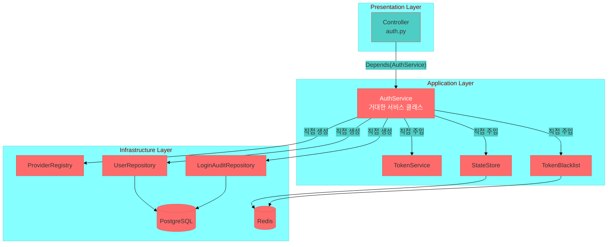
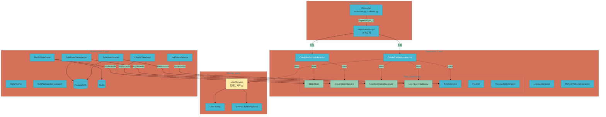
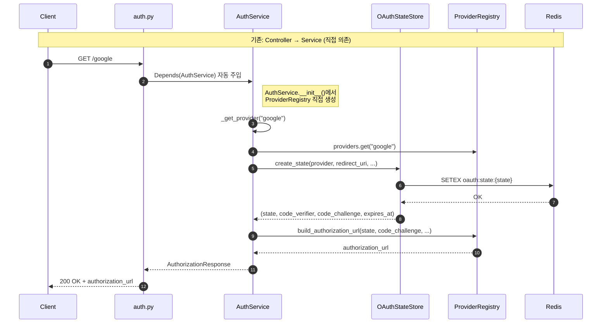
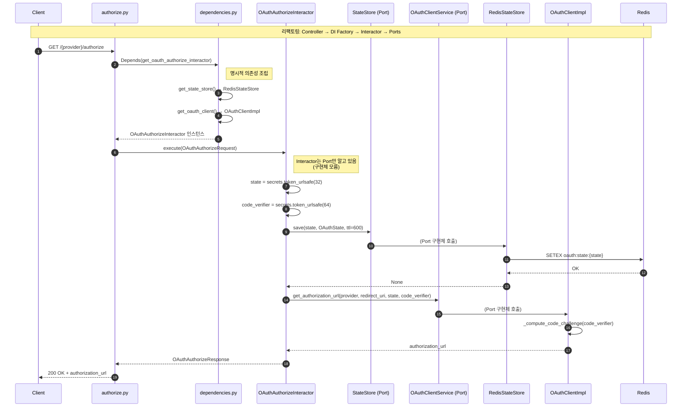
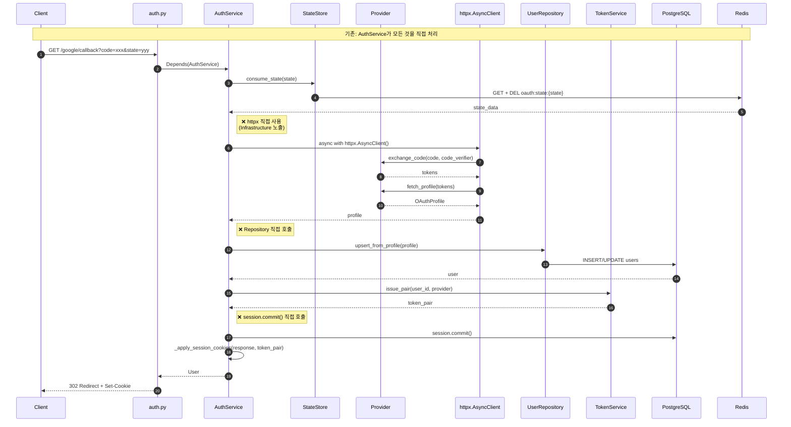
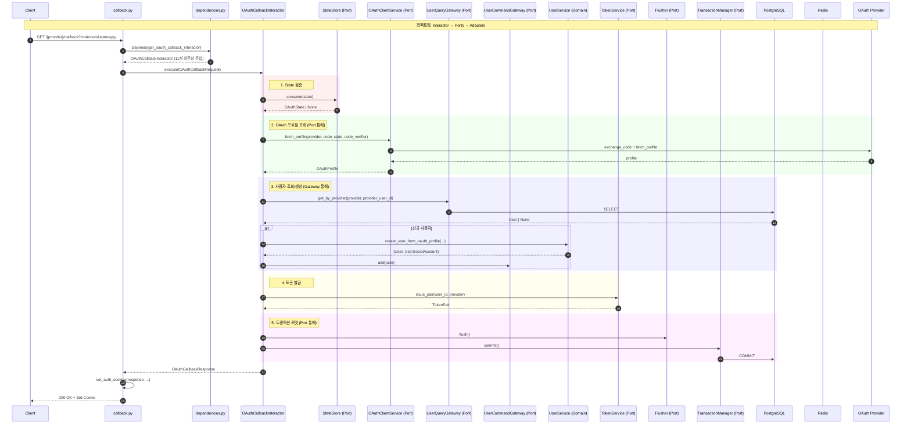

# OAuth2.0 리팩토링 비교 분석

> 기존 구현(`domains/auth/`)과 Clean Architecture 리팩토링(`apps/auth/`) 비교

## 1. 아키텍처 개요

### 1.1 기존 구조 (Layered + Service)



**설명:**
- `AuthService`가 모든 비즈니스 로직을 담당 (God Class)
- Repository를 `__init__`에서 직접 생성
- Infrastructure 의존성이 Application Layer에 직접 노출

---

### 1.2 리팩토링 구조 (Clean Architecture)



**설명:**
- Use Case별 Interactor 클래스 (단일 책임)
- Port(Protocol)를 통한 의존성 역전
- Infrastructure → Application 방향으로만 의존
- `dependencies.py`에서 명시적 DI 조립

---

## 2. OAuth Authorize 플로우 비교

### 2.1 기존 구현



**특징:**
- `AuthService`가 `ProviderRegistry`를 직접 생성 (`self.providers = ProviderRegistry(settings)`)
- `StateStore`가 state 생성 + code_verifier + code_challenge 모두 처리
- Controller에서 `Depends(AuthService)` 자동 주입 (암시적)

---

### 2.2 리팩토링 구현



**특징:**
- `dependencies.py`에서 명시적으로 의존성 조립
- Interactor는 `StateStore`, `OAuthClientService` **Port(Protocol)**만 의존
- state/code_verifier 생성 로직이 Interactor로 이동 (Application Layer 책임)

---

## 3. OAuth Callback 플로우 비교

### 3.1 기존 구현



**문제점:**
- `httpx.AsyncClient`를 Service에서 직접 생성 (Infrastructure 노출)
- `session.commit()` 직접 호출 (트랜잭션 관리 혼재)
- `UserRepository`를 `__init__`에서 직접 생성

---

### 3.2 리팩토링 구현



**개선점:**
- `OAuthClientService` Port가 httpx를 캡슐화
- `UserQueryGateway` / `UserCommandGateway`로 읽기/쓰기 분리 (CQRS)
- `Flusher` + `TransactionManager` Port로 트랜잭션 관리 추상화
- `UserService` (Domain Layer)에서 순수 도메인 로직만 처리

---

## 4. 파일 매핑 테이블

### 4.1 Controller Layer

| 기존 파일 | 리팩토링 파일 | 변경 내용 |
|----------|-------------|----------|
| `presentation/http/controllers/auth.py` (318줄) | `presentation/http/controllers/auth/authorize.py` | Provider별 분리 → 동적 라우팅 |
| ↑ | `presentation/http/controllers/auth/callback.py` | 콜백 로직 분리 |
| ↑ | `presentation/http/controllers/auth/logout.py` | 로그아웃 분리 |
| ↑ | `presentation/http/controllers/auth/refresh.py` | 토큰 갱신 분리 |

### 4.2 Application Layer

| 기존 파일 | 리팩토링 파일 | 변경 내용 |
|----------|-------------|----------|
| `application/services/auth.py` (320줄) | `application/commands/oauth_authorize.py` | authorize() → Interactor |
| ↑ | `application/commands/oauth_callback.py` | login_with_provider() → Interactor |
| ↑ | `application/commands/logout.py` | logout() → Interactor |
| ↑ | `application/commands/refresh_tokens.py` | refresh_session() → Interactor |
| ↑ | `application/queries/validate_token.py` | get_current_user() → QueryService |
| `application/services/state_service.py` | `application/common/ports/state_store.py` | 구현 → Port(인터페이스) |
| `application/services/token_service.py` | `application/common/ports/token_service.py` | 구현 → Port |
| `application/services/token_blacklist.py` | `application/common/ports/token_blacklist.py` | 구현 → Port |
| `application/services/providers/` | `infrastructure/oauth/` | Application → Infrastructure 이동 |

### 4.3 Infrastructure Layer

| 기존 파일 | 리팩토링 파일 | 변경 내용 |
|----------|-------------|----------|
| `infrastructure/repositories/user_repository.py` | `infrastructure/adapters/user_data_mapper_sqla.py` | Repository → Gateway Adapter |
| ↑ | `infrastructure/adapters/user_reader_sqla.py` | 읽기 전용 Adapter 분리 |
| `application/services/state_service.py` | `infrastructure/persistence_redis/state_store_redis.py` | Application → Infrastructure |
| `application/services/token_blacklist.py` | `infrastructure/persistence_redis/token_blacklist_redis.py` | Application → Infrastructure |
| (없음) | `infrastructure/adapters/flusher_sqla.py` | 신규: Flush 추상화 |
| (없음) | `infrastructure/adapters/transaction_manager_sqla.py` | 신규: 트랜잭션 추상화 |

### 4.4 Domain Layer

| 기존 파일 | 리팩토링 파일 | 변경 내용 |
|----------|-------------|----------|
| `domain/models/user.py` (ORM) | `domain/entities/user.py` (순수) | ORM 분리 |
| ↑ | `infrastructure/persistence_postgres/mappings/user.py` | ORM 매핑만 |
| (없음) | `domain/value_objects/user_id.py` | 신규: Value Object |
| (없음) | `domain/value_objects/token_payload.py` | 신규: Value Object |
| (없음) | `domain/services/user_service.py` | 신규: Domain Service |

---

## 5. 의존성 주입 비교

### 5.1 기존: 암시적 DI (FastAPI 자동)

```python
# domains/auth/application/services/auth.py
class AuthService:
    def __init__(
        self,
        session: AsyncSession = Depends(get_db_session),      # ❌ 인프라 직접
        token_service: TokenService = Depends(TokenService),  # ❌ 구현체 직접
        state_store: OAuthStateStore = Depends(OAuthStateStore),
        blacklist: TokenBlacklist = Depends(TokenBlacklist),
        settings: Settings = Depends(get_settings),
    ):
        self.providers = ProviderRegistry(settings)  # ❌ 직접 생성
        self.user_repo = UserRepository(session)     # ❌ 직접 생성
```

**문제:**
- `Depends(ClassName)` → 구현체에 직접 의존
- `ProviderRegistry`, `UserRepository` 직접 생성

---

### 5.2 리팩토링: 명시적 DI (Factory 패턴)

```python
# apps/auth/setup/dependencies.py

# 1. Infrastructure 의존성
async def get_state_store(redis = Depends(get_redis_client)):
    from apps.auth.infrastructure.persistence_redis import RedisStateStore
    return RedisStateStore(redis)  # Port 구현체 반환

def get_oauth_client(registry = Depends(get_oauth_provider_registry)):
    from apps.auth.infrastructure.oauth import OAuthClientImpl
    return OAuthClientImpl(registry)  # Port 구현체 반환

# 2. Use Case 조립
async def get_oauth_authorize_interactor(
    state_store = Depends(get_state_store),      # ✅ Port
    oauth_client = Depends(get_oauth_client),    # ✅ Port
):
    from apps.auth.application.commands import OAuthAuthorizeInteractor
    return OAuthAuthorizeInteractor(
        state_store=state_store,
        oauth_client=oauth_client,
    )

# 3. Controller에서 사용
@router.get("/{provider}/authorize")
async def authorize(
    provider: str,
    interactor: OAuthAuthorizeInteractor = Depends(get_oauth_authorize_interactor),  # ✅ 팩토리 명시
):
    ...
```

**개선:**
- `Depends(get_*_factory)` → 팩토리 함수 명시
- Interactor는 Port(Protocol)만 의존
- 테스트 시 Mock 주입 용이

---

## 6. 체크리스트

### ✅ 완료된 항목

| 기능 | 상태 | 파일 |
|------|------|------|
| OAuth Authorize | ✅ | `commands/oauth_authorize.py` |
| OAuth Callback | ✅ | `commands/oauth_callback.py` |
| Logout | ✅ | `commands/logout.py` |
| Refresh Tokens | ✅ | `commands/refresh_tokens.py` |
| Validate Token | ✅ | `queries/validate_token.py` |
| Google Provider | ✅ | `infrastructure/oauth/google.py` |
| Kakao Provider | ✅ | `infrastructure/oauth/kakao.py` |
| Naver Provider | ✅ | `infrastructure/oauth/naver.py` |
| JWT Token Service | ✅ | `infrastructure/security/jwt_token_service.py` |
| Redis State Store | ✅ | `infrastructure/persistence_redis/state_store_redis.py` |
| Redis Blacklist | ✅ | `infrastructure/persistence_redis/token_blacklist_redis.py` |

### ⚠️ 기존 기능 중 마이그레이션 필요

| 기능 | 기존 위치 | 필요 작업 |
|------|----------|----------|
| `_build_frontend_redirect_url()` | `presentation/http/controllers/auth.py:73-99` | Controller에 추가 |
| `X-Frontend-Origin` 헤더 처리 | `auth.py:65` | Controller에 추가 |
| `oauth_failure_redirect_url` | `auth.py:193-196` | Error Handler에 추가 |
| Provider별 라우터 (`/google`, `/kakao`) | `routers.py` | 동적 라우팅으로 통합됨 ✅ |

---

## 7. 참고

- **기존 코드**: `domains/auth/`
- **리팩토링 코드**: `apps/auth/`
- **관련 문서**: `docs/foundations/16-fastapi-clean-example-analysis.md`

