# Recursive Language Models (RLM)

> 대규모 언어 모델의 무한 컨텍스트 처리를 위한 재귀적 추론 전략

## 1. 논문 기본 정보

| 항목 | 내용 |
|------|------|
| **제목** | Recursive Language Models |
| **저자** | Alex L. Zhang |
| **arxiv** | [2512.24601](https://arxiv.org/abs/2512.24601) (2024년 12월) |
| **공식 블로그** | https://alexzhang13.github.io/blog/2025/rlm/ |
| **GitHub** | alexzhang13/recursive-language-models |

---

## 2. 문제 정의: Context Rot

### 2.1 기존 LLM의 장문 컨텍스트 처리 한계

대규모 언어 모델(LLM)은 고정된 **컨텍스트 윈도우** 크기로 인해 긴 입력을 처리하는 데 본질적인 한계가 있습니다.

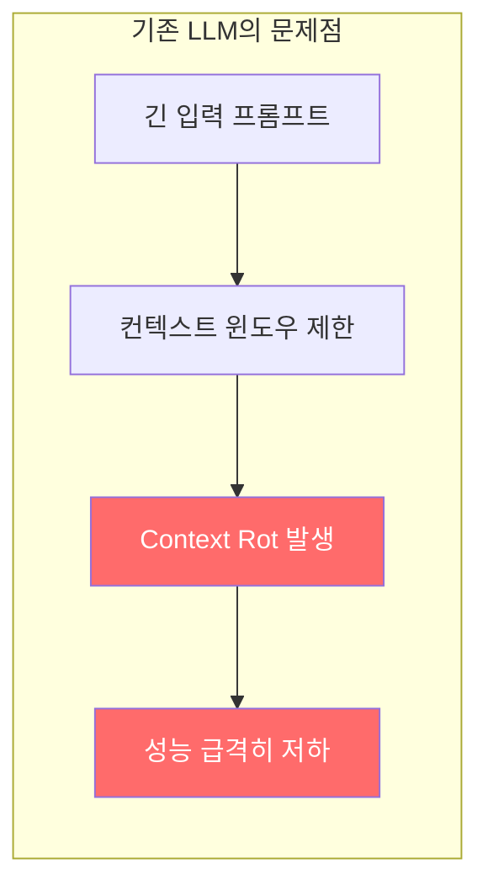

### 2.2 Context Rot 현상의 정의

**Context Rot**(컨텍스트 부패)은 입력 컨텍스트가 길어질수록 모델의 주의력(attention)이 분산되어 정확도가 점진적으로 하락하는 현상입니다.

| 현상 | 설명 |
|------|------|
| **주의력 분산** | 토큰 수 증가에 따라 각 토큰에 대한 attention weight 감소 |
| **정보 손실** | 중요한 정보가 긴 컨텍스트 속에서 "묻혀버림" |
| **위치 편향** | 시작과 끝 부분의 정보에 과도하게 집중 (Lost in the Middle) |
| **성능 저하** | 컨텍스트 길이에 비례하여 정확도 감소 |

### 2.3 기존 해결책의 한계점

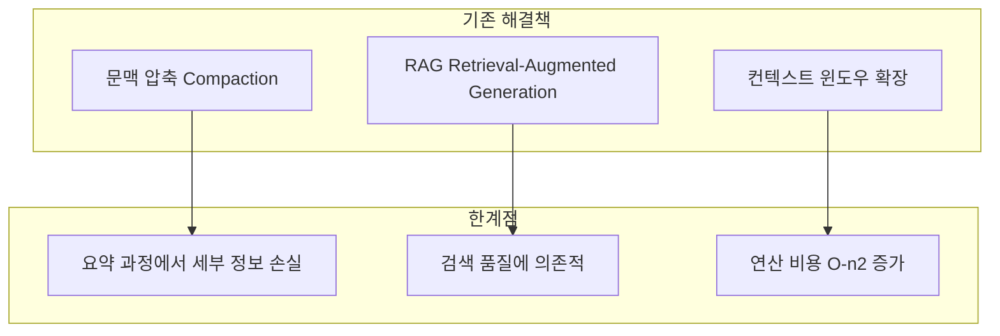

| 방법 | 한계점 |
|------|--------|
| **문맥 압축 (Compaction)** | 요약 과정에서 세부 정보 손실, 반복 요약 시 정보 왜곡 |
| **RAG** | 검색 정확도에 성능 의존, 관련 문서 누락 가능성 |
| **컨텍스트 윈도우 확장** | 연산 비용 기하급수적 증가, Context Rot 근본 해결 안됨 |

---

## 3. RLM 핵심 아이디어

### 3.1 패러다임 전환: 프롬프트를 환경으로

RLM의 핵심 통찰은 **긴 프롬프트를 컨텍스트 윈도우에 직접 넣지 않고, 외부 환경의 일부로 취급**하는 것입니다.

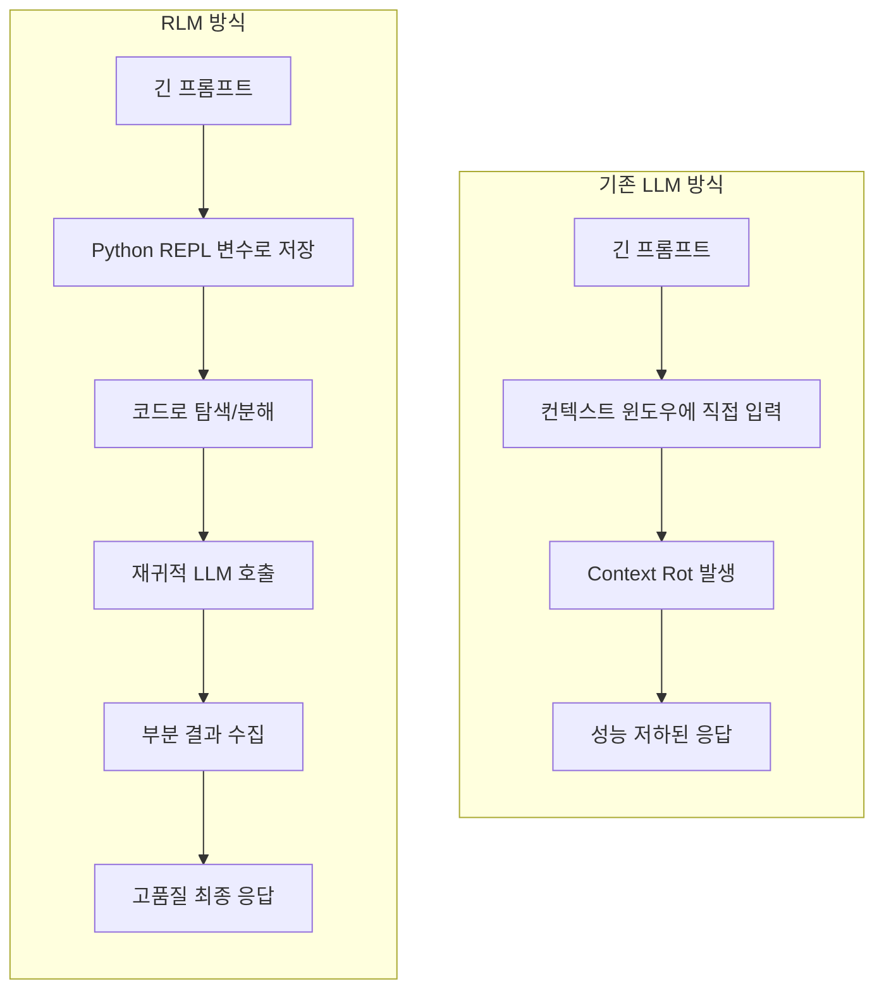

### 3.2 REPL 환경 통합

RLM은 **REPL(Read-Eval-Print Loop)** 환경을 활용하여 LLM이 프롬프트를 프로그래밍적으로 처리할 수 있게 합니다.

```python
# RLM의 REPL 환경 개념 (의사 코드)
class RLMEnvironment:
    def __init__(self, long_prompt: str):
        # 긴 프롬프트를 변수로 저장
        self.context = long_prompt
        self.variables = {}
    
    def store_variable(self, name: str, value: str):
        """프롬프트의 일부를 변수로 저장"""
        self.variables[name] = value
    
    def query_context(self, query: str) -> str:
        """컨텍스트에서 특정 정보 검색"""
        # LLM이 코드를 통해 컨텍스트 탐색
        return self.execute_search(query)
    
    def decompose_prompt(self, prompt: str) -> list[str]:
        """복잡한 프롬프트를 하위 쿼리로 분해"""
        return self.split_into_subqueries(prompt)
```

**REPL 환경의 핵심 기능:**

| 기능 | 설명 |
|------|------|
| **변수 저장** | 긴 프롬프트를 Python 변수로 로드 |
| **프로그래밍적 탐색** | 코드를 통해 컨텍스트 검색/필터링 |
| **동적 분해** | 복잡한 쿼리를 하위 쿼리로 분할 |
| **결과 저장** | 중간 결과를 변수에 누적 |

### 3.3 재귀적 호출 메커니즘

RLM의 가장 독특한 특징은 **LLM이 자기 자신을 재귀적으로 호출**하여 복잡한 작업을 처리한다는 점입니다.

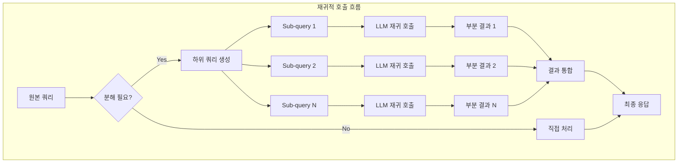

**재귀 호출의 특징:**

1. **Self-Invocation**: 모델이 자기 자신 또는 다른 LLM을 호출
2. **분할 정복**: 복잡한 문제를 작은 하위 문제로 분해
3. **결과 통합**: 각 하위 호출의 결과를 종합하여 최종 답변 생성
4. **깊이 제한 없음**: 이론적으로 무한한 재귀 깊이 가능

### 3.4 전체 아키텍처

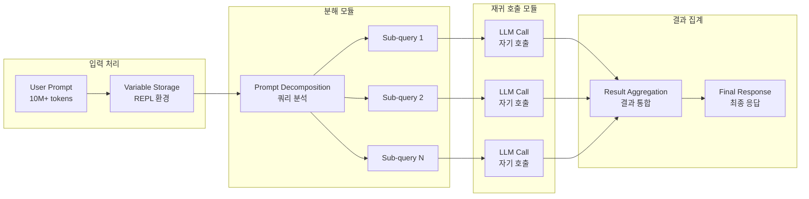

### 3.5 알고리즘 의사 코드

```python
def rlm_process(prompt: str, context: str, llm: LLM) -> str:
    """
    RLM 처리 알고리즘 (의사 코드)
    
    Args:
        prompt: 사용자 쿼리
        context: 긴 컨텍스트 (10M+ 토큰 가능)
        llm: 언어 모델 인스턴스
    
    Returns:
        최종 응답
    """
    # 1. REPL 환경에 컨텍스트 로드
    repl = REPLEnvironment()
    repl.store("context", context)
    
    # 2. 프롬프트 분석 및 분해
    sub_queries = llm.decompose(prompt, context_summary=repl.summarize())
    
    if len(sub_queries) == 1 and is_directly_answerable(sub_queries[0]):
        # 직접 처리 가능한 경우
        return llm.answer(sub_queries[0], repl.get_relevant_context())
    
    # 3. 재귀적 처리
    results = []
    for sub_query in sub_queries:
        # 관련 컨텍스트 추출
        relevant_context = repl.query(sub_query)
        
        # 재귀 호출 (자기 자신 호출)
        sub_result = rlm_process(sub_query, relevant_context, llm)
        results.append(sub_result)
    
    # 4. 결과 통합
    final_response = llm.aggregate(prompt, results)
    
    return final_response
```

---

## 4. Ablation Study 결과

### 4.1 실험 설정

논문에서는 RLM의 두 가지 핵심 구성 요소의 효과를 평가하기 위해 세 가지 실험 조건을 비교했습니다:

| 설정 | REPL 환경 | 재귀적 호출 |
|------|-----------|-------------|
| **Base Model** | X | X |
| **REPL only** | O | X |
| **Full RLM** | O | O |

### 4.2 벤치마크별 성능 결과

#### 정량적 결과 (GPT-5 기반)

| 설정 | OOLONG | OOLONG-Pairs | BrowseComp+ |
|------|--------|--------------|-------------|
| **Base Model (GPT-5)** | 44% | 0.04% | 실패* |
| **REPL only, no sub-calls** | 36% | 43.9% | 88% |
| **Full RLM (REPL + sub-calls)** | 56.5% | 58% | 91.3% |

> *Base Model은 컨텍스트 길이 제한으로 인해 BrowseComp+에서 실패

#### 성능 향상 비율

```mermaid
%%{init: {'theme': 'base', 'themeVariables': { 'primaryColor': '#4ecdc4', 'secondaryColor': '#45b7d1', 'tertiaryColor': '#96ceb4'}}}%%
xychart-beta
    title "벤치마크별 성능 비교 (%)"
    x-axis ["OOLONG", "OOLONG-Pairs", "BrowseComp+"]
    y-axis "정확도 (%)" 0 --> 100
    bar [44, 0.04, 0]
    bar [36, 43.9, 88]
    bar [56.5, 58, 91.3]
```

### 4.3 구성요소별 기여도 분석

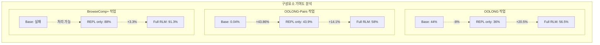

### 4.4 핵심 발견사항

#### REPL 환경의 기여

| 작업 유형 | REPL 환경 기여도 | 분석 |
|-----------|------------------|------|
| **OOLONG** | 낮음 (-8%) | 단순 REPL만으로는 오히려 성능 하락 |
| **OOLONG-Pairs** | 매우 높음 (+43.86%) | 쌍 추출에 프로그래밍적 접근 효과적 |
| **BrowseComp+** | 필수 (0% → 88%) | 긴 컨텍스트 처리 자체가 가능해짐 |

#### 재귀적 호출의 기여

| 작업 유형 | 재귀 호출 기여도 | 분석 |
|-----------|------------------|------|
| **OOLONG** | 매우 높음 (+20.5%) | 복잡한 추론에 필수적 |
| **OOLONG-Pairs** | 중간 (+14.1%) | 추가적인 성능 향상 |
| **BrowseComp+** | 낮음 (+3.3%) | 검색/필터링에는 REPL만으로 충분 |

### 4.5 작업 유형별 최적 구성

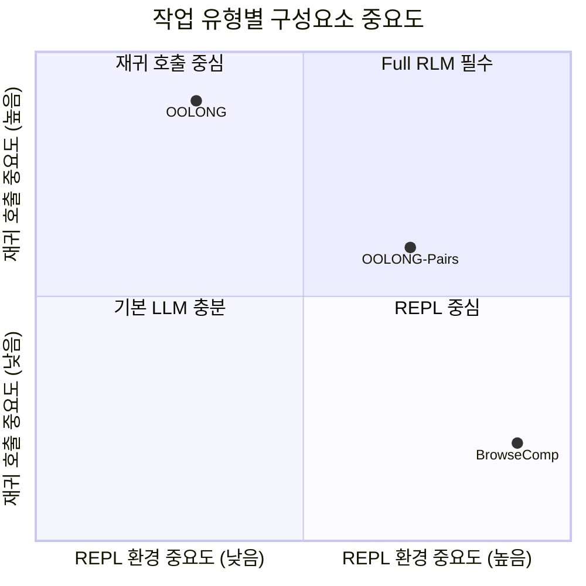

#### 결론 요약

| 작업 특성 | 권장 구성 |
|-----------|-----------|
| **복잡한 다단계 추론** | Full RLM (REPL + 재귀 호출) |
| **구조화된 정보 추출** | REPL + 선택적 재귀 호출 |
| **검색/필터링 중심** | REPL만으로 충분 |

---

## 5. 벤치마크 설명

### 5.1 평가 벤치마크 상세

| 벤치마크 | 전체 이름 | 설명 | 컨텍스트 길이 |
|----------|-----------|------|---------------|
| **S-NIAH** | Single Needle-in-a-Haystack | 긴 텍스트에서 특정 정보 검색 | 수십만 토큰 |
| **OOLONG** | - | 장문에서 복잡한 추론 수행 | 수백만 토큰 |
| **OOLONG-Pairs** | - | 장문에서 특정 쌍(pair) 추출 | 수백만 토큰 |
| **BrowseComp+** | Browse and Compare Plus | 다중 문서 검색 및 비교 | 수천만 토큰 |
| **LongBench-v2 CodeQA** | - | 코드 이해 및 질의응답 | 수십만 토큰 |

### 5.2 벤치마크별 특성

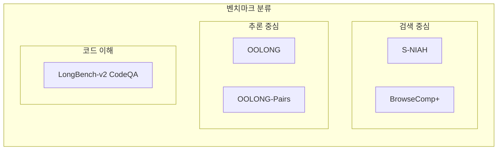

---

## 6. 관련 구현체

### 6.1 공식 구현체

| 구현체 | 설명 | 링크 |
|--------|------|------|
| **RLM Official** | 공식 코드베이스 (전체 기능) | GitHub: alexzhang13 |
| **rlm-minimal** | 최소 구현체 (학습/실험용) | GitHub: alexzhang13 |

### 6.2 기술 스택

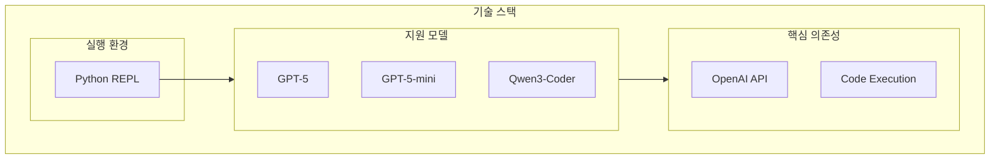

### 6.3 관련 프레임워크

| 프로젝트 | 설명 | 관련성 |
|----------|------|--------|
| **ReCAP** | Recursive Context-Aware Reasoning and Planning | 유사한 재귀적 접근법 |
| **MiroMind-M1** | Qwen-2.5 기반 수학 추론 특화 모델 | RLM 개념 적용 |

---

## 7. 성능 및 비용 분석

### 7.1 성능 향상 요약

| 지표 | 결과 |
|------|------|
| **OOLONG 벤치마크** | GPT-5 대비 **+12.5%p** (44% → 56.5%) |
| **OOLONG-Pairs** | GPT-5 대비 **+57.96%p** (0.04% → 58%) |
| **최대 입력 길이** | **10M+ 토큰** 처리 가능 |
| **성능 저하** | 입력 길이 증가에도 **거의 없음** |

### 7.2 비용 효율성

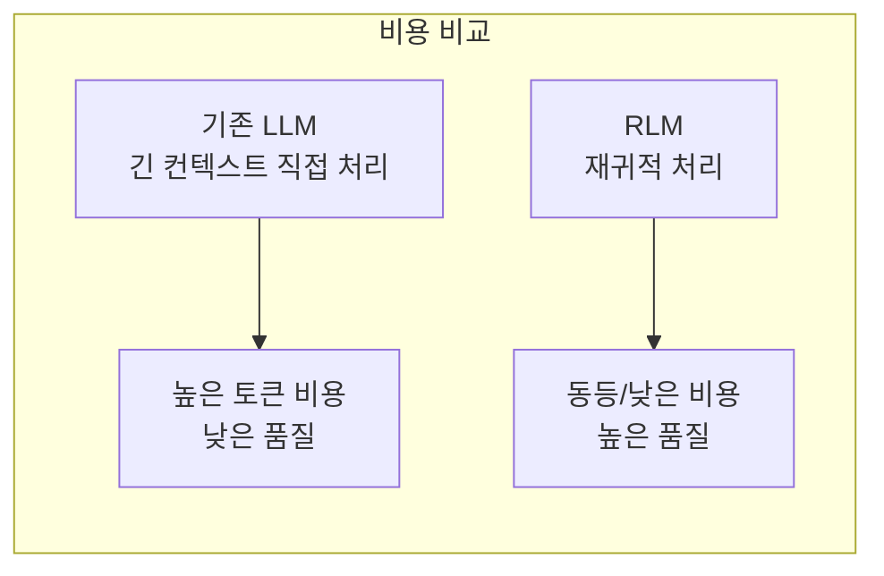

| 측면 | 기존 방식 | RLM |
|------|-----------|-----|
| **쿼리당 비용** | 높음 (전체 컨텍스트) | 동등 또는 낮음 |
| **품질** | Context Rot으로 저하 | 일관된 고품질 |
| **확장성** | 컨텍스트 윈도우 제한 | 무제한 |

---

## 8. 한계점 및 향후 연구 방향

### 8.1 현재 한계점

| 한계점 | 설명 | 영향 |
|--------|------|------|
| **API 호출 비용** | 재귀 호출로 인한 다수의 API 요청 | 비용 증가 가능 |
| **지연 시간** | 재귀 깊이에 따른 응답 시간 증가 | 실시간 응용 제한 |
| **분해 전략 품질** | 프롬프트 분해 품질이 성능에 큰 영향 | 일관성 문제 |
| **모델 의존성** | 코드 생성 능력 필수 | 모델 선택 제한 |

### 8.2 향후 연구 방향

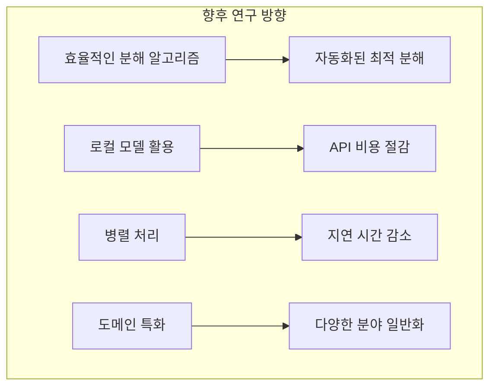

---

## 9. 결론

**Recursive Language Models (RLM)**은 "프롬프트를 외부 환경으로 취급하여 프로그래밍적으로 처리"하는 패러다임 전환을 제시합니다.

### 핵심 기여

1. **무한 컨텍스트 처리**: 10M+ 토큰 입력도 성능 저하 없이 처리
2. **Context Rot 해결**: 재귀적 분해를 통한 주의력 분산 방지
3. **비용 효율성**: 동등하거나 낮은 비용으로 높은 품질 달성
4. **일반성**: 다양한 장문 컨텍스트 작업에 적용 가능

### 실무 적용 고려사항

| 상황 | 권장 사항 |
|------|-----------|
| 긴 문서 분석 | Full RLM 적용 권장 |
| 코드베이스 이해 | REPL 환경 + 선택적 재귀 호출 |
| 실시간 응답 필요 | 재귀 깊이 제한 고려 |
| 비용 민감 환경 | 로컬 모델 조합 검토 |

---

## 참고 자료

- **원본 논문**: [arxiv.org/abs/2512.24601](https://arxiv.org/abs/2512.24601)
- **공식 블로그**: [alexzhang13.github.io/blog/2025/rlm/](https://alexzhang13.github.io/blog/2025/rlm/)
- **관련 리뷰**: [suanlab.com/blog/20260104-paper-2512-24601-recursive-language-models/](https://suanlab.com/blog/20260104-paper-2512-24601-recursive-language-models/)

