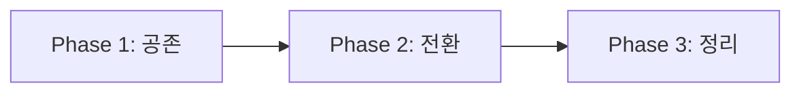

# Clean Architecture 리팩토링 가이드

> Auth/Users 도메인 리팩토링 경험을 바탕으로 작성한 통합 가이드입니다.
> 다른 도메인에도 동일한 절차로 적용할 수 있습니다.

---

## 목차

1. [리팩토링 절차 개요](#1-리팩토링-절차-개요)
2. [Phase 1: 초안 작성](#2-phase-1-초안-작성)
3. [Phase 2: Application Layer](#3-phase-2-application-layer)
4. [Phase 3: Infrastructure Layer](#4-phase-3-infrastructure-layer)
5. [Phase 4: Presentation Layer](#5-phase-4-presentation-layer)
6. [Phase 5: 스키마 정규화](#6-phase-5-스키마-정규화)
7. [체크리스트](#7-체크리스트)

---

## 1. 리팩토링 절차 개요


| Phase | 목표 | 산출물 |
|-------|------|--------|
| 초안 작성 | 현재 구조 분석, 목표 설정 | AS-IS/TO-BE 문서 |
| Application | 기능별 분리, Port/Service 정제 | commands/, queries/, ports/ |
| Infrastructure | 기술별 분리, Adapter 구현 | persistence_*/, grpc/, oauth/ |
| Presentation | 프로토콜별 분리, Interceptor | http/, grpc/ |
| 스키마 | 타입 정규화, 마이그레이션 | DDL, 마이그레이션 스크립트 |

---

## 2. Phase 1: 초안 작성

### 2.1 현재 구조 분석 (AS-IS)

```bash
# 도메인 폴더 구조 확인
tree apps/{domain}/ -L 3

# 의존성 분석
grep -r "from apps" apps/{domain}/ | head -50
```

### 2.2 목표 구조 설계 (TO-BE)

```
apps/{domain}/
├── application/           # 비즈니스 로직
│   ├── {feature1}/       # 기능별 분리
│   │   ├── commands/
│   │   ├── queries/
│   │   ├── dto/
│   │   ├── ports/
│   │   ├── services/
│   │   └── exceptions/
│   ├── {feature2}/
│   └── common/
├── domain/               # 도메인 엔티티
│   ├── entities/
│   ├── value_objects/
│   └── enums/
├── infrastructure/       # 외부 연동
│   ├── persistence_postgres/
│   ├── persistence_redis/
│   ├── grpc/
│   ├── messaging/
│   └── common/
├── presentation/         # 전달 계층
│   ├── http/
│   └── grpc/
└── setup/               # 설정
    ├── config/
    └── dependencies.py
```

### 2.3 기능 도출

| 기능 | 설명 | CRUD |
|------|------|------|
| {feature1} | ... | CRU |
| {feature2} | ... | R |

---

## 3. Phase 2: Application Layer

### 3.1 분류 원칙

```
Application Layer = 기능별 분류
```

| 폴더 | 역할 |
|------|------|
| `commands/` | Write 작업 (Create, Update, Delete) |
| `queries/` | Read 작업 |
| `dto/` | 데이터 전송 객체 |
| `ports/` | 외부 의존성 인터페이스 |
| `services/` | 복잡한 비즈니스 로직 |
| `exceptions/` | 도메인 예외 |

### 3.2 Command/Query 작성 규칙

```python
# commands/{action}.py
class {Action}Command:
    """Command = UseCase (Write)"""
    
    def __init__(
        self,
        gateway: {Feature}CommandGateway,  # Port 주입
        # ... 다른 의존성
    ) -> None:
        self._gateway = gateway
    
    async def execute(self, request: {Action}Request) -> {Action}Response:
        # 1. 유효성 검증
        # 2. 비즈니스 로직
        # 3. Port 호출
        # 4. 결과 반환
        pass
```

```python
# queries/{query}.py
class {Query}Query:
    """Query = UseCase (Read)"""
    
    def __init__(self, gateway: {Feature}QueryGateway) -> None:
        self._gateway = gateway
    
    async def execute(self, request: {Query}Request) -> {Query}Response:
        # Port 호출 → DTO 변환 → 반환
        pass
```

### 3.3 Service 역할 정의

| 유형 | Port 보유 | 용도 |
|------|----------|------|
| **Facade Service** | O | 외부 시스템 캡슐화 (OAuth, gRPC) |
| **Pure Logic Service** | X | 순수 비즈니스 로직 |

```python
# Facade Service (Port 보유 가능)
class OAuthFlowService:
    def __init__(self, provider: OAuthProvider, state_store: OAuthStateStore):
        self._provider = provider
        self._state_store = state_store

# Pure Logic Service (Port 없음)
class ProfileBuilder:
    def build(self, user: User, social: SocialAccount) -> ProfileDTO:
        # 순수 로직만
        pass
```

### 3.4 Port 네이밍 규칙

```
{Feature}{Command|Query}Gateway
```

예시:
- `UsersCommandGateway` - 사용자 쓰기 작업
- `UsersQueryGateway` - 사용자 읽기 작업
- `TokenBlacklistStore` - Redis 저장소
- `OAuthStateStore` - OAuth 상태 저장소

---

## 4. Phase 3: Infrastructure Layer

### 4.1 분류 원칙

```
Infrastructure Layer = 기술별 분류
```

| 폴더 | 역할 |
|------|------|
| `persistence_postgres/` | PostgreSQL 연동 |
| `persistence_redis/` | Redis 연동 |
| `grpc/` | gRPC 클라이언트 |
| `oauth/` | OAuth 프로바이더 |
| `messaging/` | RabbitMQ, Kafka |
| `common/` | 공통 어댑터 (UUID 등) |

### 4.2 폴더 구조

```
infrastructure/
├── persistence_postgres/
│   ├── adapters/           # Port 구현체
│   │   ├── {feature}_gateway_sqla.py
│   │   └── __init__.py
│   ├── mappings/           # ORM 매핑
│   │   ├── {entity}.py
│   │   └── __init__.py
│   ├── session.py          # DB 세션
│   ├── registry.py         # Mapper Registry
│   └── constants.py        # 스키마, 테이블명
├── persistence_redis/
│   ├── adapters/
│   │   └── {feature}_redis.py
│   └── constants.py        # Key prefix
├── grpc/
│   ├── adapters/           # gRPC Gateway 구현
│   ├── client.py           # gRPC 클라이언트
│   └── schemas/            # protobuf
└── common/
    └── adapters/           # 공통 (UUID Generator 등)
```

### 4.3 Adapter 네이밍 규칙

```
{PortName}{Technology}
```

예시:
- `UsersQueryGatewaySqla` - SQLAlchemy 구현
- `TokenBlacklistStoreRedis` - Redis 구현
- `UsersManagementGatewayGrpc` - gRPC 구현

### 4.4 Session 설정

```python
# session.py
engine = create_async_engine(
    settings.database_url,
    pool_pre_ping=True,
    pool_size=5,
    max_overflow=10,
    connect_args={"options": "-c timezone=Asia/Seoul"},  # KST
)
```

---

## 5. Phase 4: Presentation Layer

### 5.1 분류 원칙

```
Presentation Layer = 프로토콜별 분류
```

| 프로토콜 | 위치 | 역할 |
|----------|------|------|
| HTTP | `presentation/http/` | REST API |
| gRPC | `presentation/grpc/` | gRPC 서버 |

### 5.2 gRPC 서버 구조

```
presentation/grpc/
├── protos/               # pb2 파일
│   ├── {service}_pb2.py
│   └── {service}_pb2_grpc.py
├── servicers/            # Thin Adapter
│   └── {service}_servicer.py
├── interceptors/         # 횡단 관심사
│   ├── error_handler.py
│   └── logging.py
├── factory.py            # UseCase Factory
└── server.py             # 서버 부팅
```

### 5.3 Servicer 작성 규칙 (Thin Adapter)

```python
class {Service}Servicer({Service}Servicer):
    """Thin Adapter - UseCase 호출만"""
    
    def __init__(self, factory: GrpcUseCaseFactory):
        self._factory = factory
    
    async def {Method}(self, request, context):
        # 1. Request → DTO 변환
        dto = self._to_dto(request)
        
        # 2. UseCase 호출
        usecase = self._factory.create_{usecase}()
        result = await usecase.execute(dto)
        
        # 3. Result → Response 변환
        return self._to_response(result)
```

### 5.4 Interceptor 분리

```python
# interceptors/error_handler.py
class ErrorHandlerInterceptor(grpc.aio.ServerInterceptor):
    async def intercept_service(self, continuation, handler_call_details):
        try:
            return await continuation(handler_call_details)
        except DomainException as e:
            context.set_code(grpc.StatusCode.INVALID_ARGUMENT)
            context.set_details(str(e))
```

### 5.5 gRPC vs Infrastructure 구분

| 역할 | 위치 |
|------|------|
| gRPC **서버** | `presentation/grpc/` |
| gRPC **클라이언트** | `infrastructure/grpc/` |

---

## 6. Phase 5: 스키마 정규화

### 6.1 타입 규칙

| 타입 | 적용 | 예시 |
|------|------|------|
| **TEXT** | 기본 | nickname, name, description |
| **VARCHAR(n)** | 표준 규격 | email (320), phone (20) |
| **ENUM** | 고정 값 | status, provider |
| **TIMESTAMPTZ** | 시간 | created_at, updated_at |
| **UUID** | 식별자 | id |

### 6.2 타임존 설정 (KST)

```sql
-- DDL
SET timezone = 'Asia/Seoul';
```

```python
# SQLAlchemy
connect_args={"options": "-c timezone=Asia/Seoul"}
```

### 6.3 인덱스 설계

| 기준 | 인덱스 추가 |
|------|------------|
| FK 컬럼 | ✅ (1:N 조회) |
| 자주 검색하는 컬럼 | ✅ |
| NULL 많은 컬럼 | Partial Index |
| 복합 조건 조회 | 복합 인덱스 |

### 6.4 마이그레이션 전략 (Parallel Running)



| Phase | 기존 스키마 | 신규 스키마 |
|-------|------------|------------|
| 1. 공존 | 읽기/쓰기 | 읽기/쓰기 |
| 2. 전환 | 읽기 전용 | 주 스키마 |
| 3. 정리 | DROP | 단일 |

### 6.5 DDL 템플릿

```sql
-- {domain} 스키마 DDL
-- 타입 규칙: TEXT 기본, VARCHAR는 표준 규격만

CREATE SCHEMA IF NOT EXISTS {domain};
SET timezone = 'Asia/Seoul';

-- ENUM 정의
CREATE TYPE {enum_name} AS ENUM ('value1', 'value2');

-- 테이블 정의
CREATE TABLE {domain}.{table} (
    id UUID PRIMARY KEY DEFAULT gen_random_uuid(),
    
    -- TEXT (기본)
    name TEXT NOT NULL,
    description TEXT,
    
    -- VARCHAR (표준 규격)
    email VARCHAR(320),           -- RFC 5321
    phone_number VARCHAR(20),     -- E.164
    
    -- ENUM
    status {enum_name} NOT NULL DEFAULT 'active',
    
    -- TIMESTAMPTZ
    created_at TIMESTAMPTZ NOT NULL DEFAULT NOW(),
    updated_at TIMESTAMPTZ NOT NULL DEFAULT NOW()
);

-- 인덱스 (선택 이유 명시)
CREATE INDEX idx_{table}_{column} ON {domain}.{table}({column});
    -- 이유: {조회 패턴 설명}
```

---

## 7. 체크리스트

### Phase 1: 초안

- [ ] AS-IS 구조 분석
- [ ] TO-BE 구조 설계
- [ ] 기능 목록 도출
- [ ] 의존성 그래프 작성

### Phase 2: Application Layer

- [ ] 기능별 폴더 분리
- [ ] Commands 이동/작성
- [ ] Queries 이동/작성
- [ ] DTOs 기능별 분리
- [ ] Ports 기능별 분리
- [ ] Services 역할 정제 (Facade vs Pure Logic)
- [ ] Exceptions 기능별 분리
- [ ] 기존 import 경로 업데이트
- [ ] deprecated re-export 정리

### Phase 3: Infrastructure Layer

- [ ] 기술별 폴더 분리
- [ ] `persistence_postgres/adapters/` 구성
- [ ] `persistence_postgres/mappings/` 구성
- [ ] `persistence_redis/adapters/` 구성 (해당 시)
- [ ] `grpc/adapters/` 구성 (해당 시)
- [ ] `messaging/adapters/` 구성 (해당 시)
- [ ] session.py KST 타임존 적용
- [ ] constants.py 상수 분리
- [ ] Adapter 네이밍 통일

### Phase 4: Presentation Layer

- [ ] HTTP controllers 정리
- [ ] gRPC server 구성 (해당 시)
- [ ] gRPC servicer → Thin Adapter
- [ ] gRPC interceptors 분리
- [ ] protos 폴더 분리

### Phase 5: 스키마 정규화

- [ ] 타입 규칙 적용 (TEXT 기본)
- [ ] ENUM 타입 도입
- [ ] VARCHAR 표준 규격 적용
- [ ] KST 타임존 설정
- [ ] 인덱스 설계 (선택 이유 명시)
- [ ] DDL 작성
- [ ] 마이그레이션 스크립트 작성

### 배포 및 검증

- [ ] Kubernetes 매니페스트 정합성
- [ ] ConfigMap 환경변수
- [ ] CI 통과
- [ ] Canary 배포 테스트
- [ ] 문서화 (블로그 포스팅)

---

## 관련 문서

- [01-application-layer-refinement.md](../blogs/architecture/01-application-layer-refinement.md)
- [02-infrastructure-layer-refinement.md](../blogs/architecture/02-infrastructure-layer-refinement.md)
- [03-presentation-layer-refinement.md](../blogs/architecture/03-presentation-layer-refinement.md)
- [04-schema-normalization.md](../blogs/architecture/04-schema-normalization.md)


> Auth/Users 도메인 리팩토링 경험을 바탕으로 작성한 통합 가이드입니다.
> 다른 도메인에도 동일한 절차로 적용할 수 있습니다.

---

## 목차

1. [리팩토링 절차 개요](#1-리팩토링-절차-개요)
2. [Phase 1: 초안 작성](#2-phase-1-초안-작성)
3. [Phase 2: Application Layer](#3-phase-2-application-layer)
4. [Phase 3: Infrastructure Layer](#4-phase-3-infrastructure-layer)
5. [Phase 4: Presentation Layer](#5-phase-4-presentation-layer)
6. [Phase 5: 스키마 정규화](#6-phase-5-스키마-정규화)
7. [체크리스트](#7-체크리스트)

---

## 1. 리팩토링 절차 개요


| Phase | 목표 | 산출물 |
|-------|------|--------|
| 초안 작성 | 현재 구조 분석, 목표 설정 | AS-IS/TO-BE 문서 |
| Application | 기능별 분리, Port/Service 정제 | commands/, queries/, ports/ |
| Infrastructure | 기술별 분리, Adapter 구현 | persistence_*/, grpc/, oauth/ |
| Presentation | 프로토콜별 분리, Interceptor | http/, grpc/ |
| 스키마 | 타입 정규화, 마이그레이션 | DDL, 마이그레이션 스크립트 |

---

## 2. Phase 1: 초안 작성

### 2.1 현재 구조 분석 (AS-IS)

```bash
# 도메인 폴더 구조 확인
tree apps/{domain}/ -L 3

# 의존성 분석
grep -r "from apps" apps/{domain}/ | head -50
```

### 2.2 목표 구조 설계 (TO-BE)

```
apps/{domain}/
├── application/           # 비즈니스 로직
│   ├── {feature1}/       # 기능별 분리
│   │   ├── commands/
│   │   ├── queries/
│   │   ├── dto/
│   │   ├── ports/
│   │   ├── services/
│   │   └── exceptions/
│   ├── {feature2}/
│   └── common/
├── domain/               # 도메인 엔티티
│   ├── entities/
│   ├── value_objects/
│   └── enums/
├── infrastructure/       # 외부 연동
│   ├── persistence_postgres/
│   ├── persistence_redis/
│   ├── grpc/
│   ├── messaging/
│   └── common/
├── presentation/         # 전달 계층
│   ├── http/
│   └── grpc/
└── setup/               # 설정
    ├── config/
    └── dependencies.py
```

### 2.3 기능 도출

| 기능 | 설명 | CRUD |
|------|------|------|
| {feature1} | ... | CRU |
| {feature2} | ... | R |

---

## 3. Phase 2: Application Layer

### 3.1 분류 원칙

```
Application Layer = 기능별 분류
```

| 폴더 | 역할 |
|------|------|
| `commands/` | Write 작업 (Create, Update, Delete) |
| `queries/` | Read 작업 |
| `dto/` | 데이터 전송 객체 |
| `ports/` | 외부 의존성 인터페이스 |
| `services/` | 복잡한 비즈니스 로직 |
| `exceptions/` | 도메인 예외 |

### 3.2 Command/Query 작성 규칙

```python
# commands/{action}.py
class {Action}Command:
    """Command = UseCase (Write)"""
    
    def __init__(
        self,
        gateway: {Feature}CommandGateway,  # Port 주입
        # ... 다른 의존성
    ) -> None:
        self._gateway = gateway
    
    async def execute(self, request: {Action}Request) -> {Action}Response:
        # 1. 유효성 검증
        # 2. 비즈니스 로직
        # 3. Port 호출
        # 4. 결과 반환
        pass
```

```python
# queries/{query}.py
class {Query}Query:
    """Query = UseCase (Read)"""
    
    def __init__(self, gateway: {Feature}QueryGateway) -> None:
        self._gateway = gateway
    
    async def execute(self, request: {Query}Request) -> {Query}Response:
        # Port 호출 → DTO 변환 → 반환
        pass
```

### 3.3 Service 역할 정의

| 유형 | Port 보유 | 용도 |
|------|----------|------|
| **Facade Service** | O | 외부 시스템 캡슐화 (OAuth, gRPC) |
| **Pure Logic Service** | X | 순수 비즈니스 로직 |

```python
# Facade Service (Port 보유 가능)
class OAuthFlowService:
    def __init__(self, provider: OAuthProvider, state_store: OAuthStateStore):
        self._provider = provider
        self._state_store = state_store

# Pure Logic Service (Port 없음)
class ProfileBuilder:
    def build(self, user: User, social: SocialAccount) -> ProfileDTO:
        # 순수 로직만
        pass
```

### 3.4 Port 네이밍 규칙

```
{Feature}{Command|Query}Gateway
```

예시:
- `UsersCommandGateway` - 사용자 쓰기 작업
- `UsersQueryGateway` - 사용자 읽기 작업
- `TokenBlacklistStore` - Redis 저장소
- `OAuthStateStore` - OAuth 상태 저장소

---

## 4. Phase 3: Infrastructure Layer

### 4.1 분류 원칙

```
Infrastructure Layer = 기술별 분류
```

| 폴더 | 역할 |
|------|------|
| `persistence_postgres/` | PostgreSQL 연동 |
| `persistence_redis/` | Redis 연동 |
| `grpc/` | gRPC 클라이언트 |
| `oauth/` | OAuth 프로바이더 |
| `messaging/` | RabbitMQ, Kafka |
| `common/` | 공통 어댑터 (UUID 등) |

### 4.2 폴더 구조

```
infrastructure/
├── persistence_postgres/
│   ├── adapters/           # Port 구현체
│   │   ├── {feature}_gateway_sqla.py
│   │   └── __init__.py
│   ├── mappings/           # ORM 매핑
│   │   ├── {entity}.py
│   │   └── __init__.py
│   ├── session.py          # DB 세션
│   ├── registry.py         # Mapper Registry
│   └── constants.py        # 스키마, 테이블명
├── persistence_redis/
│   ├── adapters/
│   │   └── {feature}_redis.py
│   └── constants.py        # Key prefix
├── grpc/
│   ├── adapters/           # gRPC Gateway 구현
│   ├── client.py           # gRPC 클라이언트
│   └── schemas/            # protobuf
└── common/
    └── adapters/           # 공통 (UUID Generator 등)
```

### 4.3 Adapter 네이밍 규칙

```
{PortName}{Technology}
```

예시:
- `UsersQueryGatewaySqla` - SQLAlchemy 구현
- `TokenBlacklistStoreRedis` - Redis 구현
- `UsersManagementGatewayGrpc` - gRPC 구현

### 4.4 Session 설정

```python
# session.py
engine = create_async_engine(
    settings.database_url,
    pool_pre_ping=True,
    pool_size=5,
    max_overflow=10,
    connect_args={"options": "-c timezone=Asia/Seoul"},  # KST
)
```

---

## 5. Phase 4: Presentation Layer

### 5.1 분류 원칙

```
Presentation Layer = 프로토콜별 분류
```

| 프로토콜 | 위치 | 역할 |
|----------|------|------|
| HTTP | `presentation/http/` | REST API |
| gRPC | `presentation/grpc/` | gRPC 서버 |

### 5.2 gRPC 서버 구조

```
presentation/grpc/
├── protos/               # pb2 파일
│   ├── {service}_pb2.py
│   └── {service}_pb2_grpc.py
├── servicers/            # Thin Adapter
│   └── {service}_servicer.py
├── interceptors/         # 횡단 관심사
│   ├── error_handler.py
│   └── logging.py
├── factory.py            # UseCase Factory
└── server.py             # 서버 부팅
```

### 5.3 Servicer 작성 규칙 (Thin Adapter)

```python
class {Service}Servicer({Service}Servicer):
    """Thin Adapter - UseCase 호출만"""
    
    def __init__(self, factory: GrpcUseCaseFactory):
        self._factory = factory
    
    async def {Method}(self, request, context):
        # 1. Request → DTO 변환
        dto = self._to_dto(request)
        
        # 2. UseCase 호출
        usecase = self._factory.create_{usecase}()
        result = await usecase.execute(dto)
        
        # 3. Result → Response 변환
        return self._to_response(result)
```

### 5.4 Interceptor 분리

```python
# interceptors/error_handler.py
class ErrorHandlerInterceptor(grpc.aio.ServerInterceptor):
    async def intercept_service(self, continuation, handler_call_details):
        try:
            return await continuation(handler_call_details)
        except DomainException as e:
            context.set_code(grpc.StatusCode.INVALID_ARGUMENT)
            context.set_details(str(e))
```

### 5.5 gRPC vs Infrastructure 구분

| 역할 | 위치 |
|------|------|
| gRPC **서버** | `presentation/grpc/` |
| gRPC **클라이언트** | `infrastructure/grpc/` |

---

## 6. Phase 5: 스키마 정규화

### 6.1 타입 규칙

| 타입 | 적용 | 예시 |
|------|------|------|
| **TEXT** | 기본 | nickname, name, description |
| **VARCHAR(n)** | 표준 규격 | email (320), phone (20) |
| **ENUM** | 고정 값 | status, provider |
| **TIMESTAMPTZ** | 시간 | created_at, updated_at |
| **UUID** | 식별자 | id |

### 6.2 타임존 설정 (KST)

```sql
-- DDL
SET timezone = 'Asia/Seoul';
```

```python
# SQLAlchemy
connect_args={"options": "-c timezone=Asia/Seoul"}
```

### 6.3 인덱스 설계

| 기준 | 인덱스 추가 |
|------|------------|
| FK 컬럼 | ✅ (1:N 조회) |
| 자주 검색하는 컬럼 | ✅ |
| NULL 많은 컬럼 | Partial Index |
| 복합 조건 조회 | 복합 인덱스 |

### 6.4 마이그레이션 전략 (Parallel Running)


| Phase | 기존 스키마 | 신규 스키마 |
|-------|------------|------------|
| 1. 공존 | 읽기/쓰기 | 읽기/쓰기 |
| 2. 전환 | 읽기 전용 | 주 스키마 |
| 3. 정리 | DROP | 단일 |

### 6.5 DDL 템플릿

```sql
-- {domain} 스키마 DDL
-- 타입 규칙: TEXT 기본, VARCHAR는 표준 규격만

CREATE SCHEMA IF NOT EXISTS {domain};
SET timezone = 'Asia/Seoul';

-- ENUM 정의
CREATE TYPE {enum_name} AS ENUM ('value1', 'value2');

-- 테이블 정의
CREATE TABLE {domain}.{table} (
    id UUID PRIMARY KEY DEFAULT gen_random_uuid(),
    
    -- TEXT (기본)
    name TEXT NOT NULL,
    description TEXT,
    
    -- VARCHAR (표준 규격)
    email VARCHAR(320),           -- RFC 5321
    phone_number VARCHAR(20),     -- E.164
    
    -- ENUM
    status {enum_name} NOT NULL DEFAULT 'active',
    
    -- TIMESTAMPTZ
    created_at TIMESTAMPTZ NOT NULL DEFAULT NOW(),
    updated_at TIMESTAMPTZ NOT NULL DEFAULT NOW()
);

-- 인덱스 (선택 이유 명시)
CREATE INDEX idx_{table}_{column} ON {domain}.{table}({column});
    -- 이유: {조회 패턴 설명}
```

---

## 7. 체크리스트

### Phase 1: 초안

- [ ] AS-IS 구조 분석
- [ ] TO-BE 구조 설계
- [ ] 기능 목록 도출
- [ ] 의존성 그래프 작성

### Phase 2: Application Layer

- [ ] 기능별 폴더 분리
- [ ] Commands 이동/작성
- [ ] Queries 이동/작성
- [ ] DTOs 기능별 분리
- [ ] Ports 기능별 분리
- [ ] Services 역할 정제 (Facade vs Pure Logic)
- [ ] Exceptions 기능별 분리
- [ ] 기존 import 경로 업데이트
- [ ] deprecated re-export 정리

### Phase 3: Infrastructure Layer

- [ ] 기술별 폴더 분리
- [ ] `persistence_postgres/adapters/` 구성
- [ ] `persistence_postgres/mappings/` 구성
- [ ] `persistence_redis/adapters/` 구성 (해당 시)
- [ ] `grpc/adapters/` 구성 (해당 시)
- [ ] `messaging/adapters/` 구성 (해당 시)
- [ ] session.py KST 타임존 적용
- [ ] constants.py 상수 분리
- [ ] Adapter 네이밍 통일

### Phase 4: Presentation Layer

- [ ] HTTP controllers 정리
- [ ] gRPC server 구성 (해당 시)
- [ ] gRPC servicer → Thin Adapter
- [ ] gRPC interceptors 분리
- [ ] protos 폴더 분리

### Phase 5: 스키마 정규화

- [ ] 타입 규칙 적용 (TEXT 기본)
- [ ] ENUM 타입 도입
- [ ] VARCHAR 표준 규격 적용
- [ ] KST 타임존 설정
- [ ] 인덱스 설계 (선택 이유 명시)
- [ ] DDL 작성
- [ ] 마이그레이션 스크립트 작성

### 배포 및 검증

- [ ] Kubernetes 매니페스트 정합성
- [ ] ConfigMap 환경변수
- [ ] CI 통과
- [ ] Canary 배포 테스트
- [ ] 문서화 (블로그 포스팅)

---

## 관련 문서

- [01-application-layer-refinement.md](../blogs/architecture/01-application-layer-refinement.md)
- [02-infrastructure-layer-refinement.md](../blogs/architecture/02-infrastructure-layer-refinement.md)
- [03-presentation-layer-refinement.md](../blogs/architecture/03-presentation-layer-refinement.md)
- [04-schema-normalization.md](../blogs/architecture/04-schema-normalization.md)


