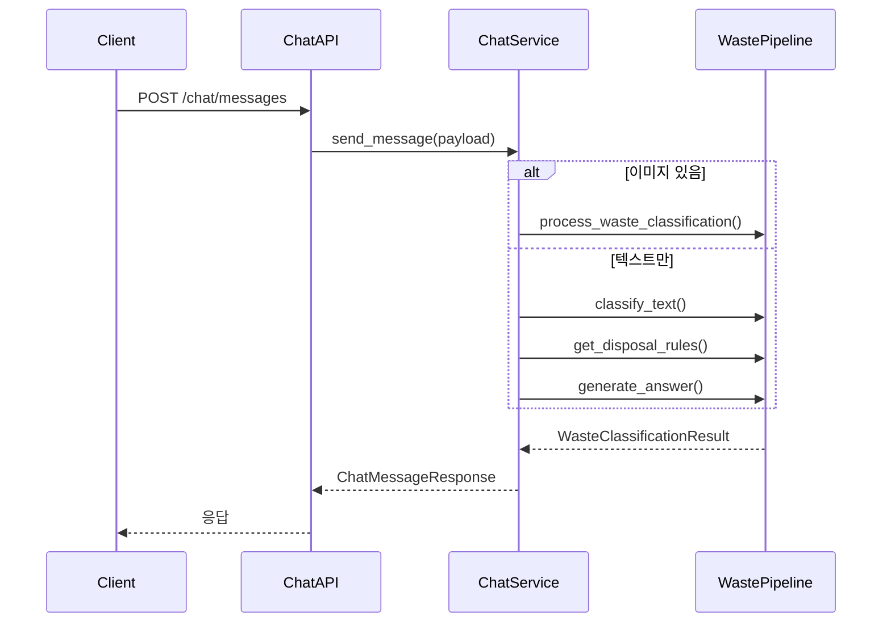

# Chat Clean Architecture 마이그레이션 계획

> `domains/chat` → `apps/chat` 클린 아키텍처 마이그레이션
> gemini, gpt 모델 지원을 위한 추상화 포함

---

## 0. Executive Summary

### 핵심 의사결정

| 항목 | 결정 | 근거 |
|------|------|------|
| **LangGraph 도입** | ✅ 전면 도입 | 이미지/텍스트 파이프라인 모두 LangGraph로 통합 |
| **Celery Chain 대체** | ✅ LangGraph | 진행 상황 UX 노출이 용이, 단일 프로세스 그래프 제어 |
| **SSE 스트리밍** | ✅ 두 가지 모드 | 이미지: Pipeline Stage SSE, 텍스트: LLM Token SSE |
| **기존 인프라 재사용** | ✅ event_router + sse_gateway | Redis Streams → Pub/Sub → SSE 파이프라인 재사용 |
| **Port/Adapter 패턴** | ✅ scan_worker 참고 | `LLMPort`, `VisionModelPort`, `EventPublisherPort` 구조 재사용 |

### 아키텍처 핵심 변경: Celery → LangGraph

**변경 이유:**
1. **UX 진행 상황 노출**: "이미지 분류 중", "규정 찾는 중", "답변 고민 중" 같은 단계별 피드백
2. **조건부 분기**: 텍스트 입력 시 의도 분류 후 다른 노드로 라우팅
3. **단일 프로세스 제어**: 노드 전환이 빠르고 상태 관리 용이
4. **기존 인프라 호환**: `EventPublisherPort`로 Redis Streams에 이벤트 발행 → 기존 `event_router`, `sse_gateway` 재사용

### Chat 통합 파이프라인 (LangGraph 기반)

```
Chat LangGraph Pipeline
=======================

START -> 이미지? --YES-> Image Pipeline
            |
           NO
            v
      Text Pipeline
            |
    +-------+-------+-------+
    |       |       |       |
    v       v       v       v
  waste   eco   character general
 (RAG)   (LLM)   (LLM)    (LLM)


Image Pipeline (순차)
---------------------
vision -> rag -> answer -> user_answer
                          (reward 제외)


SSE 이벤트 흐름
---------------
LangGraph -> Streams -> Router -> SSE -> Client

* 모든 노드: Redis Streams로 이벤트 발행
```

### SSE 스트리밍 모드 & UX 피드백

| 입력 | 스트리밍 모드 | SSE 이벤트 | UX 표시 텍스트 |
|------|-------------|-----------|---------------|
| **이미지** | Pipeline Stage SSE | `vision`, `rag`, `answer`, `done` | "🔍 이미지 분류 중...", "📋 규정 찾는 중...", "💭 답변 고민 중..." |
| **텍스트** | LLM Token SSE | `intent`, `rag`, `delta`, `done` | "🤔 질문 분석 중...", "📋 규정 찾는 중...", (실시간 타이핑) |

### 의도 분류 (Intent Classification)

| 의도 | 설명 | 파이프라인 |
|------|------|-----------|
| `waste_question` | 분리수거/폐기물 질문 | Text → RAG → Answer (Streaming) |
| `eco_tips` | 환경 팁 요청 | LLM 답변 생성 (Streaming) |
| `character_chat` | 캐릭터와 대화 | 캐릭터 페르소나 + LLM (Streaming) |
| `general` | 기타 일반 대화 | LLM 답변 생성 (Streaming) |

### LangGraph 노드별 이벤트 발행

| 노드 | 발행 이벤트 | stage 값 | UX 피드백 |
|------|-----------|----------|----------|
| `start_node` | 작업 시작 | `queued` | 작업 대기열 등록 |
| `vision_node` | 이미지 분류 | `vision` | "🔍 이미지 분류 중..." |
| `intent_node` | 의도 분류 | `intent` | "🤔 질문 분석 중..." |
| `rag_node` | 규정 검색 | `rag` | "📋 규정 찾는 중..." |
| `answer_node` | 답변 생성 (Streaming) | `answer` | "💭 답변 고민 중..." + 실시간 타이핑 |
| `end_node` | 완료 | `done` | 결과 전송 |

---

## 1. 현재 구조 분석 (AS-IS)

### 1.1 디렉토리 구조

```
domains/chat/
├── api/v1/
│   ├── endpoints/
│   │   ├── chat.py        # POST /chat/messages
│   │   ├── health.py
│   │   └── metrics.py
│   ├── dependencies.py
│   └── routers.py
├── core/
│   ├── config.py          # Settings (pydantic-settings)
│   ├── constants.py       # 상수 정의
│   ├── logging.py         # ECS JSON 로깅
│   └── tracing.py         # OpenTelemetry
├── schemas/
│   └── chat.py            # ChatMessageRequest/Response
├── services/
│   └── chat.py            # ChatService (비즈니스 로직)
├── security.py            # 인증 (Ext-Authz)
├── metrics.py             # Prometheus 메트릭
├── main.py
├── Dockerfile
└── requirements.txt
```

### 1.2 주요 의존성

| 모듈 | 의존성 | 용도 |
|------|--------|------|
| `services/chat.py` | `domains._shared.waste_pipeline` | 이미지/텍스트 분류 파이프라인 |
| | `domains._shared.waste_pipeline.rag` | 배출 규정 검색 |
| | `domains._shared.waste_pipeline.answer` | 답변 생성 |
| | `domains._shared.waste_pipeline.text` | 텍스트 분류 |
| `schemas/chat.py` | `domains._shared.schemas.waste` | WasteClassificationResult |

### 1.3 현재 파이프라인 흐름



---

## 2. 목표 구조 (TO-BE)

### 2.1 클린 아키텍처 구조

```
apps/chat/
├── __init__.py
├── domain/                                # 도메인 계층
│   ├── __init__.py
│   ├── entities/
│   │   ├── __init__.py
│   │   └── chat_message.py               # ChatMessage 엔티티
│   ├── enums/
│   │   ├── __init__.py
│   │   ├── intent.py                     # Intent (WASTE_QA, ECO_TIPS, CHARACTER_CHAT, GENERAL)
│   │   ├── llm_provider.py               # LLMProvider (OPENAI, GEMINI)
│   │   └── pipeline_type.py              # PipelineType (IMAGE, TEXT)
│   └── value_objects/
│       ├── __init__.py
│       ├── classification_result.py      # ClassificationResult VO
│       └── disposal_rule.py              # DisposalRule VO
│
├── application/                          # 애플리케이션 계층
│   ├── __init__.py
│   ├── chat/
│   │   ├── __init__.py
│   │   ├── commands/
│   │   │   ├── __init__.py
│   │   │   └── send_message.py           # SendMessageCommand
│   │   ├── dto/
│   │   │   ├── __init__.py
│   │   │   └── chat_dto.py               # Request/Response DTO
│   │   └── ports/
│   │       ├── __init__.py
│   │       ├── llm_client.py             # LLMClient Port (추상화)
│   │       ├── vision_model.py           # VisionModel Port (이미지 분류)
│   │       └── retriever.py              # Retriever Port (RAG)
│   └── pipeline/                         # LangGraph 파이프라인
│       ├── __init__.py
│       ├── graph.py                      # StateGraph 정의
│       ├── state.py                      # ChatState TypedDict
│       └── nodes/
│           ├── __init__.py
│           ├── intent_classifier.py      # 의도 분류 노드
│           ├── waste_qa_node.py          # 분리수거 Q&A 노드
│           ├── eco_tips_node.py          # 환경 팁 노드
│           ├── character_chat_node.py    # 캐릭터 대화 노드
│           └── response_node.py          # 응답 포맷팅 노드
│
├── infrastructure/                       # 인프라 계층
│   ├── __init__.py
│   ├── llm/
│   │   ├── __init__.py
│   │   ├── gpt/
│   │   │   ├── __init__.py
│   │   │   ├── config.py                 # OpenAI 설정
│   │   │   ├── llm.py                    # GPTLLMAdapter
│   │   │   └── vision.py                 # GPTVisionAdapter
│   │   └── gemini/
│   │       ├── __init__.py
│   │       ├── config.py                 # Gemini 설정
│   │       ├── llm.py                    # GeminiLLMAdapter
│   │       └── vision.py                 # GeminiVisionAdapter
│   ├── retrievers/
│   │   ├── __init__.py
│   │   └── json_regulation.py            # JsonRegulationRetriever (RAG)
│   ├── assets/
│   │   ├── data/
│   │   │   └── source/                   # 배출 규정 JSON 복사
│   │   └── prompts/
│   │       ├── intent_classification_prompt.txt
│   │       ├── waste_qa_prompt.txt
│   │       ├── eco_tips_prompt.txt
│   │       └── character_chat_prompt.txt
│   └── observability/
│       ├── __init__.py
│       ├── logging.py                    # ECS JSON 로깅
│       └── tracing.py                    # OpenTelemetry
│
├── presentation/                         # 프레젠테이션 계층
│   ├── __init__.py
│   └── http/
│       ├── __init__.py
│       └── controllers/
│           ├── __init__.py
│           ├── chat.py                   # POST /chat/messages
│           └── health.py                 # Health/Readiness
│
├── setup/                                # 설정 계층
│   ├── __init__.py
│   ├── config.py                         # Settings
│   └── dependencies.py                   # DI 설정
│
├── main.py                               # FastAPI app
├── Dockerfile
├── requirements.txt
└── tests/
    └── ...
```

### 2.2 계층별 책임

| 계층 | 책임 | 의존성 |
|------|------|--------|
| **Domain** | 비즈니스 규칙, 엔티티, VO | 없음 (순수 Python) |
| **Application** | 유스케이스, Port 정의 | Domain |
| **Infrastructure** | Port 구현, 외부 시스템 연동 | Application |
| **Presentation** | HTTP 컨트롤러 | Application |
| **Setup** | 설정, DI | 전체 |

---

## 3. LangGraph 파이프라인 설계

### 3.1 StateGraph 아키텍처

```
Chat LangGraph StateGraph
=========================

         START
           |
           v
    intent_classify
     (빠른 모델)
           |
     +-----+-----+
     |     |     |
     v     v     v
  waste  eco  character
   (RAG) (Tips) (페르소나)
     |     |     |
     +-----+-----+
           |
           v
    response_node
     (포맷팅)
           |
           v
          END
```

### 3.2 ChatState 정의

```python
# application/pipeline/state.py
from typing import TypedDict, Literal

class ChatState(TypedDict):
    """Chat 파이프라인 상태."""
    
    # 입력
    user_id: str
    message: str
    image_url: str | None
    model: str
    
    # 의도 분류
    intent: Literal["waste_question", "eco_tips", "character_chat", "general"] | None
    
    # 분류 결과 (waste_question용)
    classification: dict | None
    disposal_rules: dict | None
    
    # 캐릭터 정보 (character_chat용)
    character_id: str | None
    character_persona: str | None
    
    # 출력
    response: str | None
    metadata: dict | None
```

### 3.3 노드별 책임

| 노드 | 입력 | 출력 | 사용 모델 |
|------|------|------|----------|
| `intent_classifier` | message | intent | gpt-5-mini / gemini-3-flash-preview (빠름) |
| `waste_qa_node` | message, image_url | classification, disposal_rules, response | gpt-5.2 / gemini-3-pro-preview (품질) |
| `eco_tips_node` | message | response | 선택 모델 |
| `character_chat_node` | message, character_id | response | 선택 모델 |
| `response_node` | response, metadata | 최종 응답 | - |

### 3.4 LangGraph 구현 예시

```python
# application/pipeline/graph.py
from langgraph.graph import StateGraph, START, END
from chat.application.pipeline.state import ChatState
from chat.application.pipeline.nodes import (
    intent_classifier,
    waste_qa_node,
    eco_tips_node,
    character_chat_node,
    response_node,
)


def route_by_intent(state: ChatState) -> str:
    """의도에 따른 라우팅."""
    intent = state.get("intent", "general")
    
    if intent == "waste_question":
        return "waste_qa"
    elif intent == "eco_tips":
        return "eco_tips"
    elif intent == "character_chat":
        return "character_chat"
    else:
        return "general"


def build_chat_graph() -> StateGraph:
    """Chat StateGraph 빌드."""
    builder = StateGraph(ChatState)
    
    # 노드 등록
    builder.add_node("intent_classify", intent_classifier)
    builder.add_node("waste_qa", waste_qa_node)
    builder.add_node("eco_tips", eco_tips_node)
    builder.add_node("character_chat", character_chat_node)
    builder.add_node("general", general_node)
    builder.add_node("response", response_node)
    
    # 엣지 연결
    builder.add_edge(START, "intent_classify")
    builder.add_conditional_edges(
        "intent_classify",
        route_by_intent,
        {
            "waste_qa": "waste_qa",
            "eco_tips": "eco_tips",
            "character_chat": "character_chat",
            "general": "general",
        }
    )
    
    # 모든 분기가 response로 합류
    for node in ["waste_qa", "eco_tips", "character_chat", "general"]:
        builder.add_edge(node, "response")
    
    builder.add_edge("response", END)
    
    return builder.compile()


# 싱글톤 그래프
chat_graph = build_chat_graph()
```

### 3.5 waste_qa_node 상세 (RAG 파이프라인)

```python
# application/pipeline/nodes/waste_qa_node.py
from chat.application.chat.ports import LLMPort, VisionModelPort, RetrieverPort
from chat.application.pipeline.state import ChatState


def create_waste_qa_node(
    vision_model: VisionModelPort,
    llm: LLMPort,
    retriever: RetrieverPort,
):
    """waste_qa 노드 팩토리 (DI)."""
    
    def waste_qa_node(state: ChatState) -> dict:
        image_url = state.get("image_url")
        message = state["message"]
        
        # 1. 분류 (Vision 또는 Text)
        if image_url:
            classification = vision_model.classify(image_url, message)
        else:
            classification = llm.classify_text(message)
        
        # 2. RAG - 배출 규정 검색
        disposal_rules = retriever.get_disposal_rules(classification)
        
        # 3. 답변 생성
        response = llm.generate_answer(
            classification=classification,
            disposal_rules=disposal_rules,
            user_input=message,
        )
        
        return {
            "classification": classification,
            "disposal_rules": disposal_rules,
            "response": response,
        }
    
    return waste_qa_node
```

---

## 4. 핵심 설계: LLM 추상화 (scan_worker 참고)

> **참고**: `apps/scan_worker`의 Port/Adapter 패턴을 그대로 적용합니다.
> 코드 중복은 허용하되, Clean Architecture 경계를 유지합니다.

### 4.1 Port 정의 (scan_worker 참고)

```python
# application/chat/ports/llm_client.py
from abc import ABC, abstractmethod
from typing import Any, AsyncGenerator


class LLMPort(ABC):
    """LLM 모델 포트 - 자연어 답변 생성.
    
    OpenAI GPT, Gemini 등 다양한 구현체를 DI로 주입.
    scan_worker.application.classify.ports.llm_model 참고.
    
    스트리밍 메서드 추가 (OpenAI stream=True 지원).
    """

    # ─────────────────────────────────────────────────────────────────
    # 동기 메서드 (scan_worker 호환)
    # ─────────────────────────────────────────────────────────────────

    @abstractmethod
    def generate_answer(
        self,
        classification: dict[str, Any],
        disposal_rules: dict[str, Any],
        user_input: str,
    ) -> dict[str, Any]:
        """분류 결과와 배출 규정을 기반으로 자연어 답변 생성."""
        pass
    
    @abstractmethod
    def classify_text(self, user_input: str) -> dict[str, Any]:
        """텍스트 기반 폐기물 분류."""
        pass
    
    @abstractmethod
    def classify_intent(self, message: str) -> str:
        """사용자 메시지 의도 분류."""
        pass

    # ─────────────────────────────────────────────────────────────────
    # 스트리밍 메서드 (SSE용) ← NEW
    # ─────────────────────────────────────────────────────────────────

    @abstractmethod
    async def generate_answer_stream(
        self,
        classification: dict[str, Any],
        disposal_rules: dict[str, Any],
        user_input: str,
    ) -> AsyncGenerator[str, None]:
        """스트리밍 답변 생성 (토큰 단위).
        
        OpenAI stream=True 옵션 사용.
        https://platform.openai.com/docs/guides/streaming-responses
        """
        pass
    
    @abstractmethod
    async def generate_eco_tips_stream(self, message: str) -> AsyncGenerator[str, None]:
        """환경 팁 스트리밍 생성."""
        pass
    
    @abstractmethod
    async def generate_character_response_stream(
        self,
        message: str,
        character_persona: str,
    ) -> AsyncGenerator[str, None]:
        """캐릭터 페르소나 기반 스트리밍 응답 생성."""
        pass
```

```python
# application/chat/ports/vision_model.py
from abc import ABC, abstractmethod
from typing import Any


class VisionModelPort(ABC):
    """Vision 모델 포트 - 이미지 분류.
    
    scan_worker.application.classify.ports.vision_model 참고.
    """

    @abstractmethod
    def classify(
        self,
        image_url: str,
        user_input: str | None = None,
    ) -> dict[str, Any]:
        """이미지 기반 폐기물 분류."""
        pass
```

```python
# application/chat/ports/retriever.py
from abc import ABC, abstractmethod
from typing import Any


class RetrieverPort(ABC):
    """RAG Retriever 포트 - 배출 규정 검색.
    
    scan_worker.application.classify.ports.retriever 참고.
    """

    @abstractmethod
    def get_disposal_rules(
        self,
        classification: dict[str, Any],
    ) -> dict[str, Any]:
        """분류 결과를 기반으로 배출 규정 검색."""
        pass
```

### 4.2 LLMProvider Enum

```python
# domain/enums/llm_provider.py
from enum import Enum


class LLMProvider(str, Enum):
    """지원하는 LLM Provider.
    
    scan 서비스와 동일한 명명 규칙 사용.
    """
    GPT = "gpt"        # OpenAI GPT 계열
    GEMINI = "gemini"  # Google Gemini 계열
```

```python
# domain/enums/intent.py
from enum import Enum


class Intent(str, Enum):
    """사용자 메시지 의도."""
    WASTE_QUESTION = "waste_question"
    ECO_TIPS = "eco_tips"
    CHARACTER_CHAT = "character_chat"
    GENERAL = "general"
```

### 4.3 지원 모델 목록 (scan 서비스와 동일)

> **참고**: 
> - OpenAI: https://platform.openai.com/docs/models
> - Google Gemini 3: https://ai.google.dev/gemini-api/docs/gemini-3

| Provider | 모델 ID | 특징 | 권장 용도 |
|----------|---------|------|----------|
| **GPT** | `gpt-5.2` | 최신 플래그십, 추론 강화 | Vision, Answer 생성 |
| | `gpt-5.2-pro` | 심층 추론, 복잡한 문제 | 복잡한 분석 |
| | `gpt-5.1` | 이전 버전 호환 | - |
| | `gpt-5` | 이전 버전 호환 | - |
| | `gpt-5-pro` | 이전 버전 호환 | - |
| | `gpt-5-mini` | 빠름, 저비용 | Intent 분류 |
| **Gemini** | `gemini-3-pro-preview` | 최신 추론 모델, 100만 토큰 | Vision, Answer 생성 |
| | `gemini-3-flash-preview` | Pro 수준 지능 + 속도 | Intent 분류 |
| | `gemini-2.5-pro` | 이전 버전 안정화 | - |
| | `gemini-2.5-flash` | 빠른 추론 | - |
| | `gemini-2.5-flash-lite` | 경량, 저비용 | - |
| | `gemini-2.0-flash` | 레거시 호환 | - |
| | `gemini-2.0-flash-lite` | 레거시 호환 | - |

### 4.4 Model → Provider 매핑 (config.py)

```python
# setup/config.py
# scan 서비스와 동일한 모델 목록 (apps/scan/setup/config.py 참고)
MODEL_PROVIDER_MAP: dict[str, str] = {
    # === GPT 계열 (OpenAI) ===
    # https://platform.openai.com/docs/models
    "gpt-5.2": "gpt",
    "gpt-5.2-pro": "gpt",
    "gpt-5.1": "gpt",
    "gpt-5": "gpt",
    "gpt-5-pro": "gpt",
    "gpt-5-mini": "gpt",
    # === Gemini 계열 (Google) ===
    # https://ai.google.dev/gemini-api/docs/gemini-3
    "gemini-3-pro-preview": "gemini",
    "gemini-3-flash-preview": "gemini",
    "gemini-2.5-pro": "gemini",
    "gemini-2.5-flash": "gemini",
    "gemini-2.5-flash-lite": "gemini",
    "gemini-2.0-flash": "gemini",
    "gemini-2.0-flash-lite": "gemini",
}
```

### 4.5 DI Factory (scan_worker.setup.dependencies 참고)

```python
# setup/dependencies.py
from functools import lru_cache
from typing import TYPE_CHECKING

from chat.application.chat.ports import LLMPort, VisionModelPort, RetrieverPort
from chat.infrastructure.llm.gpt import GPTLLMAdapter, GPTVisionAdapter
from chat.infrastructure.llm.gemini import GeminiLLMAdapter, GeminiVisionAdapter
from chat.infrastructure.retrievers import JsonRegulationRetriever
from chat.setup.config import get_settings

if TYPE_CHECKING:
    pass


class UnsupportedModelError(ValueError):
    """지원하지 않는 모델 에러."""
    pass


def get_vision_model(model: str | None = None) -> VisionModelPort:
    """VisionModel 생성 (per-request).
    
    scan_worker.setup.dependencies.get_vision_model 참고.
    """
    settings = get_settings()
    if model is None:
        model = settings.llm_default_model
    
    if not settings.validate_model(model):
        raise UnsupportedModelError(f"Unsupported model: {model}")
    
    provider = settings.resolve_provider(model)
    api_key = settings.get_api_key(provider)
    
    if provider == "gemini":
        return GeminiVisionAdapter(model=model, api_key=api_key)
    return GPTVisionAdapter(model=model, api_key=api_key)


def get_llm(model: str | None = None) -> LLMPort:
    """LLM 생성 (per-request).
    
    scan_worker.setup.dependencies.get_llm 참고.
    """
    settings = get_settings()
    if model is None:
        model = settings.llm_default_model
    
    if not settings.validate_model(model):
        raise UnsupportedModelError(f"Unsupported model: {model}")
    
    provider = settings.resolve_provider(model)
    api_key = settings.get_api_key(provider)
    
    if provider == "gemini":
        return GeminiLLMAdapter(model=model, api_key=api_key)
    return GPTLLMAdapter(model=model, api_key=api_key)


@lru_cache
def get_retriever() -> RetrieverPort:
    """Retriever 싱글톤."""
    settings = get_settings()
    return JsonRegulationRetriever(data_path=settings.assets_path + "/data")
```

---

## 5. 마이그레이션 단계

### Phase 1: 디렉토리 구조 생성

```bash
mkdir -p apps/chat/{domain/{entities,enums,value_objects},application/{chat/{commands,dto,ports},pipeline/nodes},infrastructure/{llm/{gpt,gemini},retrievers,assets/{data/source,prompts},observability},presentation/http/controllers,setup,tests}
touch apps/chat/__init__.py
```

### Phase 2: Domain Layer

1. `domain/enums/llm_provider.py` - LLMProvider enum
2. `domain/enums/intent.py` - Intent enum (NEW)
3. `domain/enums/pipeline_type.py` - PipelineType enum  
4. `domain/value_objects/classification_result.py` - 분류 결과 VO
5. `domain/value_objects/disposal_rule.py` - 배출 규정 VO

### Phase 3: Application Layer - Ports

1. `application/chat/ports/llm_client.py` - LLMPort (scan_worker 참고)
2. `application/chat/ports/vision_model.py` - VisionModelPort (scan_worker 참고)
3. `application/chat/ports/retriever.py` - RetrieverPort (scan_worker 참고)
4. `application/chat/commands/send_message.py` - SendMessageCommand
5. `application/chat/dto/chat_dto.py` - Request/Response DTO

### Phase 4: Application Layer - LangGraph Pipeline (NEW)

1. `application/pipeline/state.py` - ChatState TypedDict
2. `application/pipeline/graph.py` - StateGraph 정의
3. `application/pipeline/nodes/intent_classifier.py` - 의도 분류 노드
4. `application/pipeline/nodes/waste_qa_node.py` - 분리수거 Q&A 노드
5. `application/pipeline/nodes/eco_tips_node.py` - 환경 팁 노드
6. `application/pipeline/nodes/character_chat_node.py` - 캐릭터 대화 노드
7. `application/pipeline/nodes/response_node.py` - 응답 포맷팅 노드

### Phase 5: Infrastructure Layer

1. `infrastructure/llm/gpt/llm.py` - GPTLLMAdapter (scan_worker 복사)
2. `infrastructure/llm/gpt/vision.py` - GPTVisionAdapter (scan_worker 복사)
3. `infrastructure/llm/gemini/llm.py` - GeminiLLMAdapter (scan_worker 복사)
4. `infrastructure/llm/gemini/vision.py` - GeminiVisionAdapter (scan_worker 복사)
5. `infrastructure/retrievers/json_regulation.py` - JsonRegulationRetriever (scan_worker 복사)
6. `infrastructure/assets/data/source/` - 배출 규정 JSON 복사
7. `infrastructure/assets/prompts/` - 프롬프트 파일 (NEW)
8. `infrastructure/observability/` - 로깅/트레이싱

### Phase 6: Presentation Layer

1. `presentation/http/controllers/chat.py` - 채팅 엔드포인트
2. `presentation/http/controllers/health.py` - 헬스체크

### Phase 7: Setup & Main

1. `setup/config.py` - Settings (scan_worker 참고)
2. `setup/dependencies.py` - DI 설정 (scan_worker 참고)
3. `main.py` - FastAPI app
4. `Dockerfile` - 컨테이너 빌드
5. `requirements.txt` - 의존성 (langgraph 추가)

---

## 5. domains/_shared 의존성 제거

### 5.1 복사할 파일

| 원본 | 대상 | 설명 |
|------|------|------|
| `domains/_shared/waste_pipeline/data/source/*.json` | `apps/chat/infrastructure/rag/data/source/` | 배출 규정 데이터 |
| `domains/_shared/waste_pipeline/data/prompts/*.txt` | `apps/chat/infrastructure/llm/prompts/` | LLM 프롬프트 |

### 5.2 재구현 모듈

| 원본 모듈 | 새 위치 | 변경 사항 |
|-----------|---------|-----------|
| `waste_pipeline.vision` | `infrastructure/llm/openai_client.py` | 비동기 + 멀티 Provider |
| `waste_pipeline.text` | `infrastructure/llm/openai_client.py` | 비동기 + 멀티 Provider |
| `waste_pipeline.rag` | `infrastructure/rag/yaml_rule_repository.py` | Port 패턴 적용 |
| `waste_pipeline.answer` | `infrastructure/llm/openai_client.py` | 비동기 + 멀티 Provider |

---

## 6. 주요 개선사항

### 6.1 LangGraph 조건부 분기 (가장 중요한 변경)

```python
# AS-IS (단일 파이프라인)
async def send_message(self, payload):
    if payload.image_url:
        result = await self._run_image_pipeline(...)
    else:
        result = await self._run_text_pipeline(...)
    return ChatMessageResponse(user_answer=result)

# TO-BE (LangGraph 조건부 분기)
def route_by_intent(state: ChatState) -> str:
    intent = state.get("intent")
    return {
        "waste_question": "waste_qa",
        "eco_tips": "eco_tips",
        "character_chat": "character_chat",
    }.get(intent, "general")

# StateGraph로 선언적 분기
builder.add_conditional_edges("intent_classify", route_by_intent, {...})
```

### 6.2 의도 분류 추가 (NEW)

```python
# AS-IS - 의도 분류 없음 (모든 요청을 폐기물 질문으로 처리)

# TO-BE - 4가지 의도 분류
class Intent(str, Enum):
    WASTE_QUESTION = "waste_question"    # "페트병 어떻게 버려요?"
    ECO_TIPS = "eco_tips"                # "환경 보호 팁 알려줘"
    CHARACTER_CHAT = "character_chat"    # "이코야 안녕!"
    GENERAL = "general"                  # "오늘 날씨 어때?"
```

### 6.3 멀티 모델 지원 (scan_worker 패턴)

```python
# AS-IS (단일 모델, OpenAI 하드코딩)
from domains._shared.waste_pipeline import process_waste_classification

# TO-BE (Port/Adapter + DI 팩토리)
# scan_worker.setup.dependencies 패턴 적용
def get_llm(model: str | None = None) -> LLMPort:
    provider = settings.resolve_provider(model)
    if provider == "gemini":
        return GeminiLLMAdapter(model=model, api_key=api_key)
    return GPTLLMAdapter(model=model, api_key=api_key)
```

### 6.4 클린 아키텍처 적용

```python
# AS-IS (서비스에 직접 의존)
from domains._shared.waste_pipeline import process_waste_classification

# TO-BE (Port/Adapter 패턴)
class SendMessageCommand:
    def __init__(
        self,
        llm: LLMPort,
        vision_model: VisionModelPort,
        retriever: RetrieverPort,
    ):
        self._llm = llm
        self._vision_model = vision_model
        self._retriever = retriever
```

---

## 7. 테스트 전략

### 7.1 단위 테스트

```python
# Mock을 활용한 Command 테스트
class TestSendMessageCommand:
    async def test_image_pipeline(self, mock_llm_client, mock_rag_service):
        command = SendMessageCommand(mock_llm_client, mock_rag_service)
        result = await command.execute(request)
        assert result.user_answer is not None
```

### 7.2 통합 테스트

```python
# 실제 API 테스트 (TestClient)
def test_send_message_endpoint(client: TestClient):
    response = client.post(
        "/api/v1/chat/messages",
        json={"message": "페트병 어떻게 버려요?"},
    )
    assert response.status_code == 201
```

---

## 8. 배포 계획

### 8.1 단계별 배포

| 단계 | 작업 | 검증 |
|------|------|------|
| 1 | apps/chat 구현 완료 | 로컬 테스트 |
| 2 | CI 파이프라인 추가 | PR 빌드 성공 |
| 3 | K8s 매니페스트 작성 | ArgoCD Sync |
| 4 | Canary 배포 | 10% 트래픽 |
| 5 | 점진적 롤아웃 | 100% 트래픽 |
| 6 | domains/chat deprecate | 제거 예정 태그 |

### 8.2 롤백 전략

- ArgoCD revision 기반 롤백
- 이전 이미지 태그로 즉시 복구

---

## 9. 체크리스트

### Domain Layer
- [ ] `domain/enums/llm_provider.py`
- [ ] `domain/enums/intent.py` ← **NEW**
- [ ] `domain/enums/pipeline_type.py`
- [ ] `domain/value_objects/classification_result.py`
- [ ] `domain/value_objects/disposal_rule.py`

### Application Layer - Ports
- [ ] `application/chat/ports/llm_client.py` (LLMPort)
- [ ] `application/chat/ports/vision_model.py` (VisionModelPort)
- [ ] `application/chat/ports/retriever.py` (RetrieverPort)
- [ ] `application/chat/commands/send_message.py`
- [ ] `application/chat/dto/chat_dto.py`

### Application Layer - LangGraph Pipeline ← **NEW (Celery 대체)**
- [ ] `application/pipeline/state.py` (ChatState TypedDict)
- [ ] `application/pipeline/graph.py` (create_chat_graph - StateGraph)
- [ ] `application/pipeline/nodes/start_node.py` (queued 이벤트)
- [ ] `application/pipeline/nodes/vision_node.py` (이미지 분류)
- [ ] `application/pipeline/nodes/intent_node.py` (의도 분류)
- [ ] `application/pipeline/nodes/rag_node.py` (규정 검색)
- [ ] `application/pipeline/nodes/answer_node.py` (답변 생성 + Token Streaming)
- [ ] `application/pipeline/nodes/end_node.py` (done 이벤트)

### Application Layer - Ports (이벤트 발행)
- [ ] `application/chat/ports/event_publisher.py` (EventPublisherPort - scan_worker 참고)

### Infrastructure Layer - LLM (scan_worker 복사 + 스트리밍 추가)
- [ ] `infrastructure/llm/gpt/config.py`
- [ ] `infrastructure/llm/gpt/llm.py` (GPTLLMAdapter + **generate_answer_stream**)
- [ ] `infrastructure/llm/gpt/vision.py` (GPTVisionAdapter)
- [ ] `infrastructure/llm/gemini/config.py`
- [ ] `infrastructure/llm/gemini/llm.py` (GeminiLLMAdapter + **generate_answer_stream**)
- [ ] `infrastructure/llm/gemini/vision.py` (GeminiVisionAdapter)

### Infrastructure Layer - Retrievers & Assets
- [ ] `infrastructure/retrievers/json_regulation.py` (scan_worker 복사)
- [ ] `infrastructure/assets/data/source/*.json` (배출 규정 복사)
- [ ] `infrastructure/assets/prompts/intent_classification_prompt.txt` ← **NEW**
- [ ] `infrastructure/assets/prompts/waste_qa_prompt.txt`
- [ ] `infrastructure/assets/prompts/eco_tips_prompt.txt` ← **NEW**
- [ ] `infrastructure/assets/prompts/character_chat_prompt.txt` ← **NEW**

### Infrastructure Layer - Messaging (SSE 이벤트)
- [ ] `infrastructure/messaging/redis_event_publisher.py` (RedisEventPublisher - scan_worker 복사)

### Infrastructure Layer - Observability
- [ ] `infrastructure/observability/logging.py`
- [ ] `infrastructure/observability/tracing.py`

### Application Layer - SSE DTO ← **NEW**
- [ ] `application/chat/dto/sse_events.py` (SSEEvent, TokenDeltaEvent, PipelineProgressEvent)

### Presentation Layer
- [ ] `presentation/http/controllers/chat.py` (**SSE StreamingResponse**)
- [ ] `presentation/http/controllers/health.py`

### Setup
- [ ] `setup/config.py` (scan_worker 참고)
- [ ] `setup/dependencies.py` (scan_worker 참고)

### Root
- [ ] `main.py`
- [ ] `Dockerfile`
- [ ] `requirements.txt` (langgraph, redis, sse-starlette 추가)

### 배포
- [ ] K8s 매니페스트 업데이트
- [ ] CI 파이프라인 추가
- [ ] ArgoCD Application 추가
- [ ] 문서화

---

## 10. SSE 스트리밍 전략 (LangGraph 기반)

### 10.1 LangGraph + 기존 인프라 재사용

Chat API는 **LangGraph로 파이프라인을 제어**하고, 기존 `event_router` + `sse_gateway` 인프라를 재사용합니다.

**핵심 설계:**
- **LangGraph 노드**에서 `EventPublisherPort`를 통해 Redis Streams에 이벤트 발행
- **event_router**가 Redis Streams → Pub/Sub로 중계 (기존 그대로)
- **sse_gateway**가 Pub/Sub → 클라이언트 SSE로 전달 (기존 그대로)

| 컴포넌트 | 역할 | 변경 여부 |
|---------|------|----------|
| **chat-api** | LangGraph 실행, 이벤트 발행 | ✅ 신규 |
| **event_router** | Redis Streams → Pub/Sub | ❌ 기존 재사용 |
| **sse_gateway** | Pub/Sub → SSE | ❌ 기존 재사용 |
| **Redis Streams** | 이벤트 버퍼 + 내구성 | ❌ 기존 재사용 |
| **Redis Pub/Sub** | 실시간 브로드캐스트 | ❌ 기존 재사용 |

### 10.2 전체 아키텍처: LangGraph + SSE

```
Chat SSE 아키텍처 (LangGraph + 기존 인프라)
============================================

[Client]
    |
    | (1) POST /chat/messages
    v
[Chat API]
    |
    | (2) job_id 발급
    | (3) Background: LangGraph 시작
    v
[LangGraph] ---> [Redis Streams]
    |                   |
    |                   v
    |            [Event Router]
    |                   |
    |                   v
    |            [Redis Pub/Sub]
    |                   |
    v                   v
[완료]           [SSE Gateway]
                       |
                       v
                 [Client SSE]

SSE 이벤트 예시:
  queued  -> { status: "started" }
  vision  -> { status: "started" }
  rag     -> { status: "started" }
  answer  -> { status: "started" }
  delta   -> { content: "페" }
  done    -> { user_answer: "..." }
```

### 10.3 이미지 파이프라인: LangGraph 노드 흐름

```
Image Pipeline (LangGraph)
==========================

start -> vision -> rag -> answer
  |         |        |       |
  v         v        v       v
queued    vision    rag   answer
started   started  started started
          done     done   +streaming
                          done

* 각 노드에서 EventPublisher 호출
* Reward 없음 -> user_answer만 추출
```

### 10.4 이미지 파이프라인 결과 추출

Scan과 달리 `user_answer`만 추출하고 reward는 제외:

```python
# LangGraph 최종 State (answer_node 완료 후)
{
  "job_id": "3adbf737-...",
  "pipeline_type": "image",
  "classification_result": {
    "major_category": "재활용폐기물",
    "middle_category": "전기전자제품",
    "item_name": "무선이어폰 충전 케이스"
  },
  "disposal_rules": {...},
  "final_answer": {
    "disposal_steps": {...},
    "insufficiencies": [],
    "user_answer": "무선이어폰 충전 케이스는..."  # ← 이것만 클라이언트에 전달
  }
  # ❌ reward 없음 (Scan과 다름)
}

# done 이벤트 payload (user_answer만)
{
  "stage": "done",
  "status": "completed",
  "result": {
    "user_answer": "무선이어폰 충전 케이스는...",
    "metadata": {
      "pipeline_type": "image",
      "classification": {
        "major_category": "전기전자제품",
        "middle_category": "소형가전"
      }
    }
  }
}
```

### 10.5 텍스트 파이프라인: LangGraph 노드 흐름

```
Text Pipeline (Intent 분기)
===========================

start -> intent
           |
     +-----+-----+
     |     |     |
     v     v     v
   waste  eco  character
     |     |     |
     v     v     v
   rag   llm   llm
     |     |     |
     v     v     v
  answer  |     |
     |     |     |
     v     v     v
  (streaming tokens)
     |     |     |
     v     v     v
   done  done  done

* 모든 LLM: stream=True
* delta -> Redis Streams -> SSE
```

### 10.6 LLM Token Streaming + Redis Streams

**토큰 스트리밍 최적화:**
- LLM 토큰(delta)도 Redis Streams로 발행
- 빠른 응답을 위해 **batch 없이 즉시 발행**
- Event Router가 실시간으로 Pub/Sub로 중계

```python
# application/pipeline/nodes/answer_node.py
async def execute(self, state: ChatState) -> ChatState:
    """답변 생성 노드 - LLM Token Streaming."""
    
    # 단계 시작 이벤트
    self._event_publisher.publish_stage_event(
        task_id=state.job_id,
        stage="answer",
        status="started",
    )
    
    # LLM 스트리밍 실행
    full_response = ""
    async for token in self._llm.generate_stream(state.prompt):
        full_response += token
        
        # 각 토큰을 즉시 Redis Streams로 발행
        self._event_publisher.publish_stage_event(
            task_id=state.job_id,
            stage="delta",  # 토큰 스트리밍 전용 stage
            status="streaming",
            result={"content": token},
        )
    
    # 완료 이벤트
    self._event_publisher.publish_stage_event(
        task_id=state.job_id,
        stage="answer",
        status="completed",
        result={"user_answer": full_response},
    )
    
    return state.with_answer(full_response)
```

### 10.7 OpenAI Streaming 구현 (참고: platform.openai.com/docs/guides/streaming-responses)

```python
# infrastructure/llm/gpt/llm.py
from openai import OpenAI
from typing import AsyncGenerator


class GPTLLMAdapter(LLMPort):
    """GPT LLM API 구현체 - 스트리밍 지원."""

    def __init__(self, model: str = "gpt-5.2", api_key: str | None = None):
        self._client = OpenAI(api_key=api_key)
        self._model = model

    async def generate_answer_stream(
        self,
        classification: dict,
        disposal_rules: dict,
        user_input: str,
        system_prompt: str | None = None,
    ) -> AsyncGenerator[str, None]:
        """스트리밍 답변 생성.
        
        OpenAI stream=True 옵션 사용.
        https://platform.openai.com/docs/guides/streaming-responses
        """
        if system_prompt is None:
            system_prompt = "당신은 폐기물 분리배출 전문가입니다."

        user_message = self._build_user_message(
            classification, disposal_rules, user_input
        )

        # stream=True로 스트리밍 활성화
        stream = self._client.responses.create(
            model=self._model,
            input=[
                {"role": "system", "content": system_prompt},
                {"role": "user", "content": user_message},
            ],
            stream=True,
        )

        # 이벤트 타입별 처리
        for event in stream:
            if event.type == "response.output_text.delta":
                yield event.delta  # 토큰 단위 전송
            elif event.type == "response.completed":
                break
            elif event.type == "error":
                raise Exception(f"OpenAI streaming error: {event}")
```

### 10.8 FastAPI SSE 엔드포인트

```python
# presentation/http/controllers/chat.py
from fastapi import APIRouter, BackgroundTasks
from fastapi.responses import JSONResponse
import uuid


router = APIRouter(prefix="/chat", tags=["chat"])


@router.post("/messages")
async def send_message(
    payload: ChatMessageRequest,
    user: CurrentUser,
    background_tasks: BackgroundTasks,
    pipeline: ChatPipelineDep,
) -> JSONResponse:
    """채팅 메시지 전송 - job_id 발급 후 비동기 처리.
    
    클라이언트는 반환된 job_id로 SSE Gateway에 연결하여 
    실시간 진행 상황을 구독합니다.
    
    Returns:
        { "job_id": "abc-123-..." }
    
    SSE 구독:
        EventSource('/api/v1/chat/abc-123/events')
    """
    job_id = str(uuid.uuid4())
    
    # Background에서 LangGraph 파이프라인 실행
    background_tasks.add_task(
        pipeline.execute,
        job_id=job_id,
        payload=payload,
        user_id=user.user_id,
    )
    
    return JSONResponse(
        content={"job_id": job_id},
        status_code=202,  # Accepted
    )
```

### 10.9 SSE 이벤트 타입 정의

```python
# application/chat/dto/sse_events.py
from dataclasses import dataclass
from typing import Literal


@dataclass
class SSEEvent:
    """SSE 이벤트 기본 클래스."""
    type: str
    data: str


# Pipeline SSE (이미지 입력 시)
class PipelineProgressEvent(SSEEvent):
    """파이프라인 진행 상황 이벤트."""
    type: Literal["vision", "rule", "answer", "done"]
    progress: int
    status: str


# LLM Token SSE (텍스트 입력 시)
class TokenDeltaEvent(SSEEvent):
    """토큰 델타 이벤트."""
    type: Literal["delta"] = "delta"
    content: str


class StreamDoneEvent(SSEEvent):
    """스트리밍 완료 이벤트."""
    type: Literal["done"] = "done"
    content: str
    metadata: dict | None = None
```

### 10.10 클라이언트 사용 예시

```javascript
// 프론트엔드: POST 후 job_id로 SSE 연결
async function sendChatMessage(message, imageUrl = null) {
  // 1. 메시지 전송 (job_id 획득)
  const response = await fetch('/api/v1/chat/messages', {
    method: 'POST',
    headers: { 'Content-Type': 'application/json' },
    body: JSON.stringify({ message, image_url: imageUrl }),
  });
  
  const { job_id } = await response.json();
  
  // 2. SSE Gateway에 연결 (기존 인프라 재사용)
  const eventSource = new EventSource(`/api/v1/chat/${job_id}/events`);
  
  // 진행 상황 이벤트 (UX 피드백)
  eventSource.addEventListener('queued', (e) => {
    showProgress('⏳ 요청 접수 중...');
  });
  
  eventSource.addEventListener('vision', (e) => {
    const { status } = JSON.parse(e.data);
    if (status === 'started') showProgress('🔍 이미지 분류 중...');
    else if (status === 'completed') showProgress('✓ 이미지 분류 완료');
  });
  
  eventSource.addEventListener('intent', (e) => {
    showProgress('🤔 질문 분석 중...');
  });
  
  eventSource.addEventListener('rag', (e) => {
    const { status } = JSON.parse(e.data);
    if (status === 'started') showProgress('📋 규정 찾는 중...');
    else if (status === 'completed') showProgress('✓ 규정 검색 완료');
  });
  
  eventSource.addEventListener('answer', (e) => {
    showProgress('💭 답변 고민 중...');
  });
  
  // LLM 토큰 스트리밍 (실시간 타이핑 효과)
  eventSource.addEventListener('delta', (e) => {
    const { content } = JSON.parse(e.data);
    appendToChat(content);
  });
  
  // 완료 이벤트
  eventSource.addEventListener('done', (e) => {
    const result = JSON.parse(e.data);
    hideProgress();
    finalizeChat(result.user_answer);
    eventSource.close();
  });
  
  eventSource.onerror = (error) => {
    console.error('SSE 에러:', error);
    showError('연결 오류가 발생했습니다');
    eventSource.close();
  };
}
```

### 10.11 LangGraph 파이프라인 구현

```python
# application/pipeline/graph.py
from langgraph.graph import StateGraph, END
from typing import TypedDict, Literal


class ChatState(TypedDict):
    """LangGraph 상태."""
    job_id: str
    user_id: str
    message: str
    image_url: str | None
    intent: str | None
    classification_result: dict | None
    disposal_rules: dict | None
    answer: str | None
    error: str | None


def create_chat_graph(
    event_publisher: EventPublisherPort,
    llm: LLMPort,
    vision_model: VisionModelPort,
    retriever: RetrieverPort,
) -> StateGraph:
    """Chat LangGraph 그래프 생성.
    
    Celery Chain 대체 - 모든 노드에서 이벤트 발행.
    """
    
    # 노드 정의
    async def start_node(state: ChatState) -> ChatState:
        """시작 노드 - queued 이벤트 발행."""
        event_publisher.publish_stage_event(
            task_id=state["job_id"],
            stage="queued",
            status="started",
        )
        return state
    
    async def vision_node(state: ChatState) -> ChatState:
        """이미지 분류 노드."""
        event_publisher.publish_stage_event(
            task_id=state["job_id"],
            stage="vision",
            status="started",
        )
        
        result = await vision_model.classify(state["image_url"])
        
        event_publisher.publish_stage_event(
            task_id=state["job_id"],
            stage="vision",
            status="completed",
            result={"classification": result.model_dump()},
        )
        
        return {**state, "classification_result": result.model_dump()}
    
    async def intent_node(state: ChatState) -> ChatState:
        """의도 분류 노드 (텍스트 전용)."""
        event_publisher.publish_stage_event(
            task_id=state["job_id"],
            stage="intent",
            status="started",
        )
        
        intent = await llm.classify_intent(state["message"])
        
        event_publisher.publish_stage_event(
            task_id=state["job_id"],
            stage="intent",
            status="completed",
            result={"intent": intent},
        )
        
        return {**state, "intent": intent}
    
    async def rag_node(state: ChatState) -> ChatState:
        """규정 검색 노드."""
        event_publisher.publish_stage_event(
            task_id=state["job_id"],
            stage="rag",
            status="started",
        )
        
        # 텍스트만인 경우 먼저 분류
        if state["classification_result"] is None:
            classification = await llm.classify_text(state["message"])
            state = {**state, "classification_result": classification}
        
        rules = retriever.get_disposal_rules(state["classification_result"])
        
        event_publisher.publish_stage_event(
            task_id=state["job_id"],
            stage="rag",
            status="completed",
        )
        
        return {**state, "disposal_rules": rules}
    
    async def answer_node(state: ChatState) -> ChatState:
        """답변 생성 노드 - LLM Token Streaming."""
        event_publisher.publish_stage_event(
            task_id=state["job_id"],
            stage="answer",
            status="started",
        )
        
        full_answer = ""
        async for token in llm.generate_stream(
            classification=state["classification_result"],
            disposal_rules=state["disposal_rules"],
            user_input=state["message"],
        ):
            full_answer += token
            # 토큰 단위 이벤트 발행
            event_publisher.publish_stage_event(
                task_id=state["job_id"],
                stage="delta",
                status="streaming",
                result={"content": token},
            )
        
        event_publisher.publish_stage_event(
            task_id=state["job_id"],
            stage="answer",
            status="completed",
        )
        
        return {**state, "answer": full_answer}
    
    async def end_node(state: ChatState) -> ChatState:
        """종료 노드 - done 이벤트 발행."""
        event_publisher.publish_stage_event(
            task_id=state["job_id"],
            stage="done",
            status="completed",
            result={"user_answer": state["answer"]},
        )
        return state
    
    # 라우팅 함수
    def route_by_input(state: ChatState) -> Literal["vision_node", "intent_node"]:
        """이미지 유무에 따라 분기."""
        if state["image_url"]:
            return "vision_node"
        return "intent_node"
    
    def route_by_intent(state: ChatState) -> Literal["rag_node", "answer_node"]:
        """의도에 따라 분기."""
        if state["intent"] == "waste_question":
            return "rag_node"
        # eco_tips, character_chat, general → 바로 답변
        return "answer_node"
    
    # 그래프 구성
    graph = StateGraph(ChatState)
    
    graph.add_node("start_node", start_node)
    graph.add_node("vision_node", vision_node)
    graph.add_node("intent_node", intent_node)
    graph.add_node("rag_node", rag_node)
    graph.add_node("answer_node", answer_node)
    graph.add_node("end_node", end_node)
    
    graph.set_entry_point("start_node")
    
    graph.add_conditional_edges("start_node", route_by_input)
    graph.add_edge("vision_node", "rag_node")  # 이미지 → RAG
    graph.add_conditional_edges("intent_node", route_by_intent)
    graph.add_edge("rag_node", "answer_node")
    graph.add_edge("answer_node", "end_node")
    graph.add_edge("end_node", END)
    
    return graph.compile()
```

---

## 11. LangGraph 노드 상세 구현

### 11.1 ChatState 정의

```python
# application/pipeline/state.py
from typing import TypedDict, Literal
from dataclasses import dataclass


class ChatState(TypedDict, total=False):
    """LangGraph 상태 정의.
    
    모든 노드가 공유하는 상태 객체.
    TypedDict를 사용하여 타입 안전성 확보.
    """
    # 필수 필드
    job_id: str
    user_id: str
    message: str
    
    # 선택 필드
    image_url: str | None
    
    # 파이프라인 진행 중 채워지는 필드
    intent: Literal["waste_question", "eco_tips", "character_chat", "general"] | None
    classification_result: dict | None
    disposal_rules: dict | None
    answer: str | None
    
    # 메타데이터
    pipeline_type: Literal["image", "text"] | None
    error: str | None
    error_stage: str | None
```

### 11.2 노드 구현 패턴

```python
# application/pipeline/nodes/base.py
from abc import ABC, abstractmethod
from typing import Protocol
from langgraph.types import StreamWriter

from apps.chat.application.chat.ports.event_publisher import EventPublisherPort


class NodeProtocol(Protocol):
    """노드 프로토콜."""
    
    async def __call__(
        self, 
        state: ChatState, 
        writer: StreamWriter,
    ) -> ChatState:
        ...


class BaseNode(ABC):
    """노드 기본 클래스.
    
    모든 노드가 EventPublisher를 통해 이벤트를 발행하도록 강제.
    """
    
    def __init__(self, event_publisher: EventPublisherPort):
        self._events = event_publisher
    
    @property
    @abstractmethod
    def stage_name(self) -> str:
        """노드의 stage 이름."""
        pass
    
    async def __call__(
        self, 
        state: ChatState, 
        writer: StreamWriter,
    ) -> ChatState:
        """노드 실행 - 이벤트 발행 래핑."""
        
        # 시작 이벤트
        self._events.publish_stage_event(
            task_id=state["job_id"],
            stage=self.stage_name,
            status="started",
        )
        
        # 커스텀 스트림에도 emit (로깅용)
        writer({
            "type": "progress",
            "stage": self.stage_name,
            "status": "started",
        })
        
        try:
            result = await self.execute(state, writer)
            
            # 완료 이벤트
            self._events.publish_stage_event(
                task_id=state["job_id"],
                stage=self.stage_name,
                status="completed",
            )
            
            writer({
                "type": "progress",
                "stage": self.stage_name,
                "status": "completed",
            })
            
            return result
            
        except Exception as e:
            # 에러 이벤트
            self._events.publish_stage_event(
                task_id=state["job_id"],
                stage=self.stage_name,
                status="failed",
                result={"error": str(e)},
            )
            
            writer({
                "type": "error",
                "stage": self.stage_name,
                "message": str(e),
            })
            
            return {**state, "error": str(e), "error_stage": self.stage_name}
    
    @abstractmethod
    async def execute(
        self, 
        state: ChatState, 
        writer: StreamWriter,
    ) -> ChatState:
        """실제 노드 로직 구현."""
        pass
```

### 11.3 Vision 노드 구현

```python
# application/pipeline/nodes/vision_node.py
from apps.chat.application.chat.ports.vision_model import VisionModelPort


class VisionNode(BaseNode):
    """이미지 분류 노드."""
    
    stage_name = "vision"
    
    def __init__(
        self, 
        event_publisher: EventPublisherPort,
        vision_model: VisionModelPort,
    ):
        super().__init__(event_publisher)
        self._vision = vision_model
    
    async def execute(
        self, 
        state: ChatState, 
        writer: StreamWriter,
    ) -> ChatState:
        """이미지 분류 실행."""
        
        result = await self._vision.classify(
            image_url=state["image_url"],
            user_message=state.get("message"),
        )
        
        return {
            **state,
            "classification_result": result.model_dump(),
            "pipeline_type": "image",
        }
```

### 11.4 Intent 노드 구현

```python
# application/pipeline/nodes/intent_node.py
class IntentNode(BaseNode):
    """의도 분류 노드."""
    
    stage_name = "intent"
    
    def __init__(
        self, 
        event_publisher: EventPublisherPort,
        llm: LLMPort,
    ):
        super().__init__(event_publisher)
        self._llm = llm
    
    async def execute(
        self, 
        state: ChatState, 
        writer: StreamWriter,
    ) -> ChatState:
        """의도 분류 실행."""
        
        intent = await self._llm.classify_intent(state["message"])
        
        return {
            **state,
            "intent": intent,
            "pipeline_type": "text",
        }
```

### 11.5 RAG 노드 구현

```python
# application/pipeline/nodes/rag_node.py
class RagNode(BaseNode):
    """규정 검색 노드."""
    
    stage_name = "rag"
    
    def __init__(
        self, 
        event_publisher: EventPublisherPort,
        llm: LLMPort,
        retriever: RetrieverPort,
    ):
        super().__init__(event_publisher)
        self._llm = llm
        self._retriever = retriever
    
    async def execute(
        self, 
        state: ChatState, 
        writer: StreamWriter,
    ) -> ChatState:
        """규정 검색 실행."""
        
        # 이미지 파이프라인이 아닌 경우 먼저 텍스트 분류
        if state.get("classification_result") is None:
            classification = await self._llm.classify_text(state["message"])
            state = {**state, "classification_result": classification}
        
        # 규정 검색
        rules = self._retriever.get_disposal_rules(
            state["classification_result"]
        )
        
        return {**state, "disposal_rules": rules}
```

### 11.6 Answer 노드 구현 (토큰 스트리밍)

```python
# application/pipeline/nodes/answer_node.py
class AnswerNode(BaseNode):
    """답변 생성 노드 - 토큰 스트리밍 지원."""
    
    stage_name = "answer"
    
    def __init__(
        self, 
        event_publisher: EventPublisherPort,
        llm: LLMPort,
        batch_size: int = 5,
    ):
        super().__init__(event_publisher)
        self._llm = llm
        self._batch_size = batch_size
    
    async def execute(
        self, 
        state: ChatState, 
        writer: StreamWriter,
    ) -> ChatState:
        """답변 생성 - 토큰 스트리밍."""
        
        prompt = self._build_prompt(state)
        
        full_answer = ""
        token_buffer: list[str] = []
        
        async for token in self._llm.generate_stream(prompt):
            full_answer += token
            token_buffer.append(token)
            
            # 배치 단위로 이벤트 발행
            if len(token_buffer) >= self._batch_size:
                combined = "".join(token_buffer)
                
                # Redis Streams로 배치 발행
                self._events.publish_stage_event(
                    task_id=state["job_id"],
                    stage="delta",
                    status="streaming",
                    result={"content": combined},
                )
                
                # 커스텀 스트림에도 emit
                writer({
                    "type": "delta",
                    "content": combined,
                })
                
                token_buffer.clear()
        
        # 남은 토큰 플러시
        if token_buffer:
            combined = "".join(token_buffer)
            self._events.publish_stage_event(
                task_id=state["job_id"],
                stage="delta",
                status="streaming",
                result={"content": combined},
            )
            writer({"type": "delta", "content": combined})
        
        return {**state, "answer": full_answer}
    
    def _build_prompt(self, state: ChatState) -> str:
        """프롬프트 생성."""
        return f"""
분류 결과: {state.get('classification_result')}
배출 규정: {state.get('disposal_rules')}
사용자 질문: {state['message']}

위 정보를 바탕으로 친절하게 답변해주세요.
"""
```

### 11.7 End 노드 구현

```python
# application/pipeline/nodes/end_node.py
class EndNode(BaseNode):
    """종료 노드 - done 이벤트 발행."""
    
    stage_name = "done"
    
    async def execute(
        self, 
        state: ChatState, 
        writer: StreamWriter,
    ) -> ChatState:
        """파이프라인 완료 처리."""
        
        # done 결과 구성
        result = {
            "user_answer": state.get("answer", ""),
            "metadata": {
                "pipeline_type": state.get("pipeline_type"),
                "intent": state.get("intent"),
                "classification": state.get("classification_result"),
            },
        }
        
        # done 이벤트 (Redis Streams)
        self._events.publish_stage_event(
            task_id=state["job_id"],
            stage="done",
            status="completed",
            result=result,
        )
        
        # 커스텀 스트림에도 emit
        writer({
            "type": "done",
            "result": result,
        })
        
        return state
```

### 11.8 그래프 팩토리

```python
# application/pipeline/graph.py
from langgraph.graph import StateGraph, START, END
from typing import Literal

from .state import ChatState
from .nodes import (
    VisionNode, IntentNode, RagNode, AnswerNode, EndNode
)


def route_by_input(state: ChatState) -> Literal["vision", "intent"]:
    """이미지 유무에 따라 라우팅."""
    if state.get("image_url"):
        return "vision"
    return "intent"


def route_by_intent(state: ChatState) -> Literal["rag", "answer_direct"]:
    """의도에 따라 라우팅."""
    if state.get("intent") == "waste_question":
        return "rag"
    # eco_tips, character_chat, general → 바로 답변
    return "answer_direct"


def route_on_error(state: ChatState) -> Literal["end", "next"]:
    """에러 발생 시 종료."""
    if state.get("error"):
        return "end"
    return "next"


def create_chat_graph(
    event_publisher: EventPublisherPort,
    llm: LLMPort,
    vision_model: VisionModelPort,
    retriever: RetrieverPort,
) -> StateGraph:
    """Chat LangGraph 그래프 생성.
    
    DI로 주입받은 의존성으로 노드 인스턴스 생성.
    """
    
    # 노드 인스턴스 생성
    vision_node = VisionNode(event_publisher, vision_model)
    intent_node = IntentNode(event_publisher, llm)
    rag_node = RagNode(event_publisher, llm, retriever)
    answer_node = AnswerNode(event_publisher, llm)
    end_node = EndNode(event_publisher)
    
    # 그래프 구성
    graph = StateGraph(ChatState)
    
    # 노드 추가
    graph.add_node("vision", vision_node)
    graph.add_node("intent", intent_node)
    graph.add_node("rag", rag_node)
    graph.add_node("answer", answer_node)
    graph.add_node("answer_direct", answer_node)  # 재사용
    graph.add_node("end", end_node)
    
    # 엣지 정의
    graph.set_entry_point(START)
    graph.add_conditional_edges(START, route_by_input)
    
    # 이미지 파이프라인
    graph.add_edge("vision", "rag")
    graph.add_edge("rag", "answer")
    graph.add_edge("answer", "end")
    
    # 텍스트 파이프라인
    graph.add_conditional_edges("intent", route_by_intent)
    graph.add_edge("answer_direct", "end")
    
    # 종료
    graph.add_edge("end", END)
    
    return graph.compile()
```

---

## 12. 의존성 주입 및 팩토리

### 12.1 Dependencies 설정

```python
# setup/dependencies.py
from functools import lru_cache
from typing import Annotated

from fastapi import Depends

from apps.chat.setup.config import get_settings, Settings
from apps.chat.application.pipeline.graph import create_chat_graph
from apps.chat.application.chat.ports.event_publisher import EventPublisherPort
from apps.chat.application.chat.ports.llm_client import LLMPort
from apps.chat.application.chat.ports.vision_model import VisionModelPort
from apps.chat.application.chat.ports.retriever import RetrieverPort
from apps.chat.infrastructure.messaging.redis_event_publisher import RedisEventPublisher
from apps.chat.infrastructure.llm.gpt import GPTLLMAdapter, GPTVisionAdapter
from apps.chat.infrastructure.llm.gemini import GeminiLLMAdapter, GeminiVisionAdapter
from apps.chat.infrastructure.retrievers.json_regulation import JsonRegulationRetriever


@lru_cache
def get_event_publisher() -> EventPublisherPort:
    """이벤트 발행 포트."""
    settings = get_settings()
    return RedisEventPublisher(
        redis_url=settings.redis_streams_url,
        shard_count=settings.sse_shard_count,
    )


def get_llm(settings: Settings = Depends(get_settings)) -> LLMPort:
    """LLM 포트 - 모델 설정에 따라 동적 선택."""
    provider = settings.resolve_provider(settings.default_llm_model)
    
    if provider == "gemini":
        return GeminiLLMAdapter(
            model=settings.default_llm_model,
            api_key=settings.gemini_api_key,
        )
    
    return GPTLLMAdapter(
        model=settings.default_llm_model,
        api_key=settings.openai_api_key,
    )


def get_vision_model(settings: Settings = Depends(get_settings)) -> VisionModelPort:
    """Vision 모델 포트."""
    provider = settings.resolve_provider(settings.default_vision_model)
    
    if provider == "gemini":
        return GeminiVisionAdapter(
            model=settings.default_vision_model,
            api_key=settings.gemini_api_key,
        )
    
    return GPTVisionAdapter(
        model=settings.default_vision_model,
        api_key=settings.openai_api_key,
    )


@lru_cache
def get_retriever() -> RetrieverPort:
    """규정 검색 포트."""
    return JsonRegulationRetriever()


def get_chat_graph(
    event_publisher: Annotated[EventPublisherPort, Depends(get_event_publisher)],
    llm: Annotated[LLMPort, Depends(get_llm)],
    vision_model: Annotated[VisionModelPort, Depends(get_vision_model)],
    retriever: Annotated[RetrieverPort, Depends(get_retriever)],
):
    """Chat LangGraph 그래프."""
    return create_chat_graph(
        event_publisher=event_publisher,
        llm=llm,
        vision_model=vision_model,
        retriever=retriever,
    )


# 타입 별칭
ChatGraphDep = Annotated[StateGraph, Depends(get_chat_graph)]
EventPublisherDep = Annotated[EventPublisherPort, Depends(get_event_publisher)]
```

### 12.2 Config 설정

```python
# setup/config.py
from functools import lru_cache
from pydantic_settings import BaseSettings


class Settings(BaseSettings):
    """Chat 서비스 설정."""
    
    # 서비스 정보
    service_name: str = "chat-api"
    service_version: str = "1.0.0"
    environment: str = "development"
    
    # LLM 설정 (scan 서비스와 동일)
    openai_api_key: str = ""
    gemini_api_key: str = ""
    default_llm_model: str = "gpt-5.2"       # scan: gpt-5.2
    default_vision_model: str = "gpt-5.2"    # scan: gpt-5.2
    
    # 모델 → 프로바이더 매핑 (scan 서비스와 동일)
    # apps/scan/setup/config.py, apps/scan_worker/setup/config.py 참고
    model_to_provider: dict[str, str] = {
        # GPT 계열 (OpenAI)
        "gpt-5.2": "gpt",
        "gpt-5.2-pro": "gpt",
        "gpt-5.1": "gpt",
        "gpt-5": "gpt",
        "gpt-5-pro": "gpt",
        "gpt-5-mini": "gpt",
        # Gemini 계열 (Google)
        "gemini-3-pro-preview": "gemini",
        "gemini-3-flash-preview": "gemini",
        "gemini-2.5-pro": "gemini",
        "gemini-2.5-flash": "gemini",
        "gemini-2.5-flash-lite": "gemini",
        "gemini-2.0-flash": "gemini",
        "gemini-2.0-flash-lite": "gemini",
    }
    
    # Redis 설정
    redis_streams_url: str = "redis://localhost:6379/0"
    sse_shard_count: int = 4
    
    # SSE 설정
    token_batch_size: int = 5
    
    class Config:
        env_prefix = "CHAT_"
        env_file = ".env"
    
    def resolve_provider(self, model: str) -> str:
        """모델명으로 프로바이더 결정."""
        return self.model_to_provider.get(model, "gpt")


@lru_cache
def get_settings() -> Settings:
    return Settings()
```

---

## 13. 향후 고려사항 (Phase 2)

### 11.1 Chat Worker 분리 (필요 시)

현재는 **API 서버의 BackgroundTasks**에서 LangGraph를 실행하지만, 다음 상황에서 Worker 분리를 고려합니다:

- LLM 응답이 30초 이상 소요되어 API 서버 리소스 압박
- 복잡한 멀티턴 대화로 메모리 사용량 증가
- 수평 확장이 필요한 고트래픽 상황

```
Phase 1 (현재): API BackgroundTasks
-----------------------------------
Chat API
  Handler -> BackgroundTasks(LangGraph)
     |              |
     v              v
  {job_id}    Redis Streams


Phase 2 (향후): Worker 분리
---------------------------
Chat API -> RabbitMQ -> Chat Worker
   |                       |
   |                       v
   |                 Redis Streams
   |                       |
   +<-- SSE <-- router <---+
```

### 11.2 토큰 스트리밍 최적화

현재 설계에서 모든 토큰이 Redis Streams → Event Router → Pub/Sub 경로를 타는데, 
고빈도 토큰 스트리밍의 경우 지연이 발생할 수 있습니다.

**최적화 옵션:**
1. **토큰 배치 발행**: 10개 토큰마다 한 번에 발행
2. **직접 Pub/Sub 발행**: 토큰은 Redis Streams 우회, Pub/Sub로 직접 발행
3. **하이브리드**: 진행 상황은 Streams, 토큰은 직접 Pub/Sub

### 11.3 캐릭터 대화 고도화

- 캐릭터별 페르소나 관리
- 대화 히스토리 저장 (Redis/PostgreSQL)
- 멀티턴 대화 지원

### 11.4 RAG 고도화

- Vector DB 도입 (Pinecone, Weaviate)
- 임베딩 기반 검색
- Hybrid Search (BM25 + Vector)

### 11.5 RLM (Recursive Language Models) 적용

복잡한 멀티 카테고리 질문에 대해 RLM 패턴을 적용하여 정확도를 향상시킵니다.

**적용 시나리오:**
| 시나리오 | 문제 | RLM 해결책 |
|---------|------|-----------|
| 멀티 카테고리 질문 | "플라스틱 용기에 음식물이 묻어있고 라벨이 붙어있으면?" | 3개 규정을 분할 분석 후 통합 |
| 전체 규정 탐색 | "집에서 나오는 모든 쓰레기 분류법" | 18개 규정 파일 재귀 탐색 |
| 비교 분석 | "종이팩과 종이류 차이점은?" | 두 규정 병렬 분석 후 비교 |

**LangGraph 통합 구조:**
```
START -> intent (복잡도)
            |
    +-------+-------+
    |       |       |
 simple  complex  multi
    |       |       |
   rag     rag    rlm(재귀)
    |       |       |
    +-------+-------+
            |
         answer (streaming)
```

**구현 우선순위:**
- **Phase 1**: complexity 판단 로직, simple vs complex 분기
- **Phase 2**: RLM 서브그래프 구현, 멀티 카테고리 병렬 분석
- **Phase 3**: 대화 히스토리 RLM, 결과 캐싱

**상세 설계**: `docs/blogs/async/foundations/17-recursive-language-models.md` 참조

---

**작성일**: 2026-01-09
**최종 수정**: 2026-01-09 (LangGraph 기반 아키텍처 확정)
**상태**: 계획 수립 완료

**참고**: 
- `apps/scan` - 클린 아키텍처 구조
- `apps/scan_worker` - Port/Adapter, LLM 구현, EventPublisherPort
- `apps/event_router` - Redis Streams Consumer → Pub/Sub (기존 재사용)
- `apps/sse_gateway` - Redis Pub/Sub → SSE 스트리밍 (기존 재사용)
- `docs/plans/llm-architecture-decision-report.md` - LangGraph 의사결정
- `docs/blogs/applied/01-langgraph-reference.md` - LangGraph 레퍼런스
- `docs/blogs/applied/02-langgraph-streaming-patterns.md` - LangGraph 스트리밍 패턴
- `docs/blogs/async/foundations/17-recursive-language-models.md` - RLM 적용 전략
- https://arxiv.org/abs/2512.24601 - Recursive Language Models 논문
- https://platform.openai.com/docs/models - OpenAI 모델 목록
- https://ai.google.dev/gemini-api/docs/gemini-3 - Gemini 3 가이드
- https://platform.openai.com/docs/guides/streaming-responses - OpenAI 스트리밍

