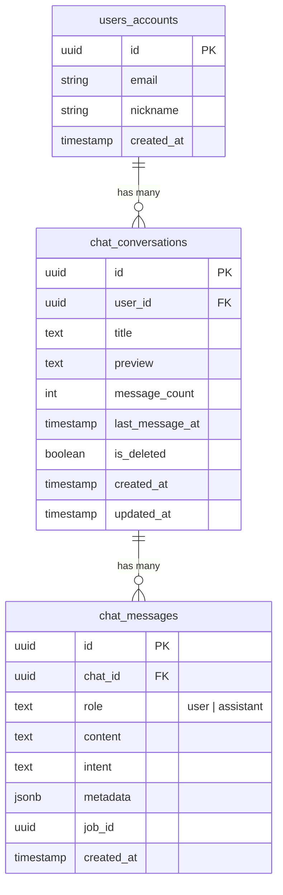
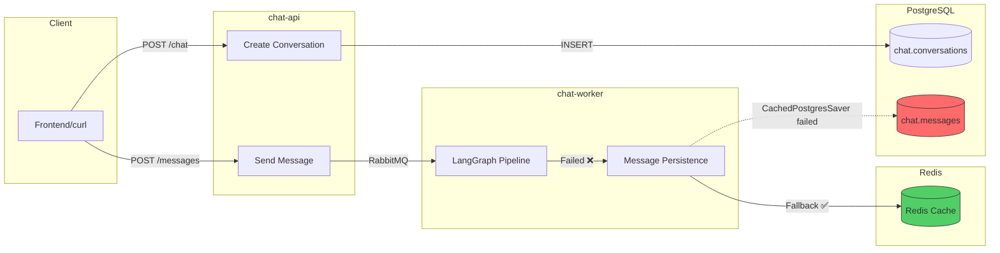
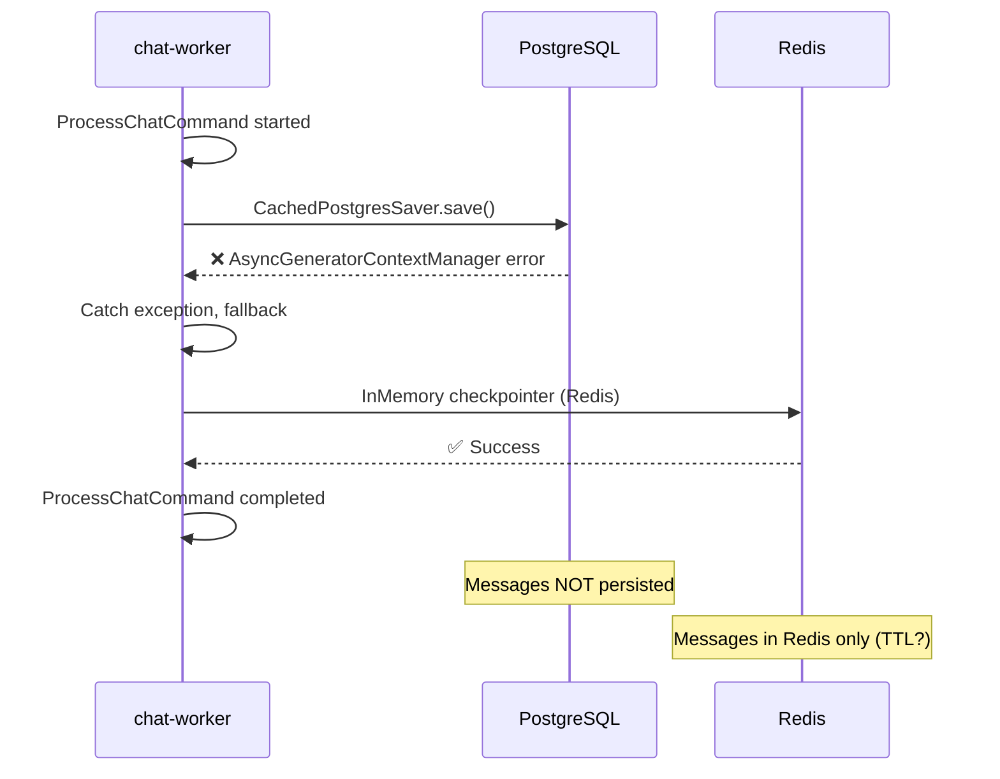

# PostgreSQL Chat Data Analysis

> **Date:** 2026-01-18
> **Database:** ecoeco
> **Status:** Conversations stored, Messages NOT stored

---

## 1. Schema Overview



---

## 2. Data Flow (Current State)



---

## 3. Current Data Statistics

| Table | Records | Status |
|-------|---------|--------|
| `chat.conversations` | **26** | Working |
| `chat.messages` | **0** | NOT Working |

### 3.1 Conversations (Recent 10)

| ID (short) | Title | Message Count | Created At |
|------------|-------|---------------|------------|
| aa312263... | E2E Intent Test | 0 | 2026-01-18 19:35 |
| b8447c1e... | E2E Test - Redis Fix | 0 | 2026-01-18 19:06 |
| eaa11dff... | E2E Test | 0 | 2026-01-18 18:48 |
| cf53e761... | E2E Test | 0 | 2026-01-18 18:27 |
| 426c41f5... | (untitled) | 0 | 2026-01-18 05:48 |
| 9320a74a... | (untitled) | 0 | 2026-01-18 04:30 |
| fc70a0c4... | (untitled) | 0 | 2026-01-18 04:09 |
| d7fc3b9b... | (untitled) | 0 | 2026-01-18 03:20 |
| 4f3377b4... | (untitled) | 0 | 2026-01-18 02:45 |
| 616b4604... | (untitled) | 0 | 2026-01-18 01:29 |

---

## 4. Table Schema Details

### 4.1 chat.conversations

```sql
CREATE TABLE chat.conversations (
    id              UUID PRIMARY KEY DEFAULT gen_random_uuid(),
    user_id         UUID NOT NULL REFERENCES users.accounts(id) ON DELETE CASCADE,
    title           TEXT,
    preview         TEXT,
    message_count   INTEGER NOT NULL DEFAULT 0 CHECK (message_count >= 0),
    last_message_at TIMESTAMPTZ,
    is_deleted      BOOLEAN NOT NULL DEFAULT FALSE,
    created_at      TIMESTAMPTZ NOT NULL DEFAULT NOW(),
    updated_at      TIMESTAMPTZ NOT NULL DEFAULT NOW()
);

-- Indexes
CREATE INDEX idx_conversations_user_recent
    ON chat.conversations(user_id, last_message_at DESC)
    WHERE is_deleted = FALSE;
```

### 4.2 chat.messages

```sql
CREATE TABLE chat.messages (
    id         UUID PRIMARY KEY DEFAULT gen_random_uuid(),
    chat_id    UUID NOT NULL REFERENCES chat.conversations(id) ON DELETE CASCADE,
    role       TEXT NOT NULL CHECK (role IN ('user', 'assistant')),
    content    TEXT NOT NULL,
    intent     TEXT,
    metadata   JSONB,
    job_id     UUID,
    created_at TIMESTAMPTZ NOT NULL DEFAULT NOW()
);

-- Indexes
CREATE INDEX idx_messages_chat_ts ON chat.messages(chat_id, created_at);
CREATE INDEX idx_messages_job ON chat.messages(job_id) WHERE job_id IS NOT NULL;
```

---

## 5. Root Cause Analysis

### 5.1 Worker Log Evidence

```
[WARNING] CachedPostgresSaver failed, falling back to Redis only:
object _AsyncGeneratorContextManager can't be used in 'await' expression
```

### 5.2 Issue Flow



### 5.3 Code Location

- **Error Source:** `apps/chat_worker/infrastructure/orchestration/langgraph/checkpointer.py`
- **Fallback Logic:** `apps/chat_worker/setup/dependencies.py`

---

## 6. Impact Assessment

| Area | Impact | Severity |
|------|--------|----------|
| 대화 기록 조회 | 이전 대화 내용 조회 불가 | High |
| Multi-turn 컨텍스트 | Redis TTL 만료 시 손실 | Medium |
| 분석/통계 | 대화 데이터 수집 불가 | Medium |
| 백업/복구 | 메시지 복구 불가 | High |

---

## 7. Recommendations

### 7.1 Immediate Fix

```python
# checkpointer.py - AsyncGeneratorContextManager 이슈 수정
# Before (오류)
async with get_async_session() as session:
    ...

# After (수정)
session = await anext(get_async_session())
try:
    ...
finally:
    await session.close()
```

### 7.2 Verification Query

```sql
-- 메시지 저장 확인
SELECT
    c.id as conversation_id,
    c.title,
    c.message_count,
    COUNT(m.id) as actual_messages
FROM chat.conversations c
LEFT JOIN chat.messages m ON c.id = m.chat_id
GROUP BY c.id, c.title, c.message_count
ORDER BY c.created_at DESC
LIMIT 10;
```

---

## 8. Related

| Item | Reference |
|------|-----------|
| Worker Logs | `kubectl logs -n chat deploy/chat-worker` |
| Checkpointer | `apps/chat_worker/infrastructure/orchestration/langgraph/checkpointer.py` |
| Dependencies | `apps/chat_worker/setup/dependencies.py` |
