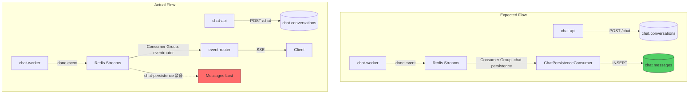
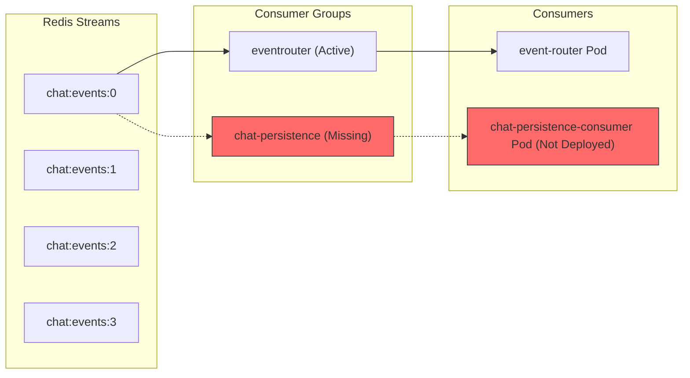

# PostgreSQL 메시지 영속화 실패

> **Date:** 2026-01-19
> **Status:** Resolved
> **Severity:** High
> **Affected:** `chat.messages` 테이블
> **Resolution Date:** 2026-01-19

---

## 1. 증상

| 항목 | 상태 |
|------|------|
| `chat.conversations` | 26건 (정상) |
| `chat.messages` | **0건** (비정상) |

대화 세션은 생성되지만 메시지 내용이 PostgreSQL에 저장되지 않음.

---

## 2. 원인 분석

### 2.1 아키텍처 개요



### 2.2 근본 원인 (2가지)

| # | 원인 | 위치 | 영향 |
|---|------|------|------|
| 1 | CachedPostgresSaver 초기화 실패 | `checkpointer.py:228` | 체크포인트 PostgreSQL 저장 불가 |
| 2 | ChatPersistenceConsumer 미배포 | `workloads/` | 메시지 PostgreSQL 저장 불가 |

---

## 3. Issue 1: CachedPostgresSaver 초기화 실패

### 3.1 로그 증거

```
[2026-01-18 19:06:48,543][chat_worker.setup.dependencies][WARNING][worker-0]
CachedPostgresSaver failed, falling back to Redis only:
object _AsyncGeneratorContextManager can't be used in 'await' expression

[2026-01-18 19:06:48,545][chat_worker.infrastructure.orchestration.langgraph.checkpointer][INFO][worker-0]
InMemory checkpointer created (Redis fallback disabled)
```

### 3.2 코드 분석

**문제 코드** (`apps/chat_worker/infrastructure/orchestration/langgraph/checkpointer.py:228`):

```python
async def create_cached_postgres_checkpointer(
    conn_string: str,
    redis: "Redis",
    cache_ttl: int = DEFAULT_CACHE_TTL,
) -> CachedPostgresSaver:
    from langgraph.checkpoint.postgres.aio import AsyncPostgresSaver

    # BUG: from_conn_string()은 async context manager를 반환
    # await로 호출하면 TypeError 발생
    postgres_saver = await AsyncPostgresSaver.from_conn_string(conn_string)  # Line 228

    return CachedPostgresSaver(
        postgres_saver=postgres_saver,
        redis=redis,
        cache_ttl=cache_ttl,
    )
```

**LangGraph API 시그니처** (langgraph-checkpoint-postgres):

```python
class AsyncPostgresSaver:
    @classmethod
    @asynccontextmanager
    async def from_conn_string(cls, conn_string: str) -> AsyncIterator["AsyncPostgresSaver"]:
        """Async context manager로 연결 생성."""
        ...
```

### 3.3 원인

`AsyncPostgresSaver.from_conn_string()`은 **async context manager**를 반환하는데, 코드에서 `await`로 호출하고 있음.

- **잘못된 사용**: `await AsyncPostgresSaver.from_conn_string(conn_string)`
- **올바른 사용**: `async with AsyncPostgresSaver.from_conn_string(conn_string) as saver:`

### 3.4 Fallback 동작

`dependencies.py`의 try-except에서 예외가 catch되어 MemorySaver로 fallback:

```python
# apps/chat_worker/setup/dependencies.py:641-678
try:
    _checkpointer = await create_cached_postgres_checkpointer(
        conn_string=settings.postgres_url,
        redis=redis_client,
    )
except Exception as e:
    logger.warning("CachedPostgresSaver failed, falling back to Redis only: %s", e)
    _checkpointer = await create_redis_checkpointer(settings.redis_url)
```

결과: **MemorySaver** 사용 (프로세스 메모리에만 저장, PostgreSQL 영속화 없음)

---

## 4. Issue 2: ChatPersistenceConsumer 미배포

### 4.1 Redis Streams Consumer Group 증거

```bash
$ kubectl exec -n redis rfr-streams-redis-0 -c redis -- redis-cli XINFO GROUPS chat:events:0

name: eventrouter
consumers: 1
pending: 0
last-delivered-id: 1768766931206-0
```

**관측 결과**:
- `eventrouter` 그룹만 존재 (event-router용)
- `chat-persistence` 그룹 없음 (ChatPersistenceConsumer용)

### 4.2 코드 vs 배포 상태

| 항목 | 상태 |
|------|------|
| Consumer 코드 | `apps/chat/consumer.py` (존재) |
| Infrastructure 코드 | `apps/chat/infrastructure/messaging/redis_streams_consumer.py` (존재) |
| Deployment Manifest | `workloads/domains/chat/*/` (없음) |
| ArgoCD Application | 없음 |

### 4.3 Consumer 아키텍처 (미배포)



---

## 5. 영향도

| 영역 | 영향 | 심각도 |
|------|------|--------|
| 대화 기록 조회 | 이전 대화 내용 조회 불가 | High |
| 멀티턴 컨텍스트 | 프로세스 메모리에만 존재 (재시작 시 손실) | High |
| 분석/통계 | 대화 데이터 수집 불가 | Medium |
| 백업/복구 | 메시지 복구 불가 | High |

---

## 6. 수정 방안

### 6.1 Issue 1 수정: Checkpointer Lifecycle 관리

**Option A: Async Context Manager 패턴 적용**

```python
# checkpointer.py
class CachedPostgresSaver(BaseCheckpointSaver):
    _postgres_cm: AsyncContextManager | None = None

    @classmethod
    async def create(
        cls,
        conn_string: str,
        redis: "Redis",
        cache_ttl: int = DEFAULT_CACHE_TTL,
    ) -> "CachedPostgresSaver":
        from langgraph.checkpoint.postgres.aio import AsyncPostgresSaver

        # Context manager를 저장하고 enter
        cm = AsyncPostgresSaver.from_conn_string(conn_string)
        postgres_saver = await cm.__aenter__()

        instance = cls(
            postgres_saver=postgres_saver,
            redis=redis,
            cache_ttl=cache_ttl,
        )
        instance._postgres_cm = cm
        return instance

    async def close(self) -> None:
        if self._postgres_cm:
            await self._postgres_cm.__aexit__(None, None, None)
```

**Option B: Connection Pool 직접 관리 (권장)**

```python
# checkpointer.py
from psycopg_pool import AsyncConnectionPool

async def create_cached_postgres_checkpointer(
    conn_string: str,
    redis: "Redis",
    cache_ttl: int = DEFAULT_CACHE_TTL,
) -> CachedPostgresSaver:
    from langgraph.checkpoint.postgres.aio import AsyncPostgresSaver

    # Connection pool 직접 생성
    pool = AsyncConnectionPool(conninfo=conn_string)
    await pool.open()

    postgres_saver = AsyncPostgresSaver(pool)
    await postgres_saver.setup()

    return CachedPostgresSaver(
        postgres_saver=postgres_saver,
        redis=redis,
        cache_ttl=cache_ttl,
        pool=pool,  # cleanup 위해 보관
    )
```

### 6.2 Issue 2 수정: ChatPersistenceConsumer 배포

**Step 1: Deployment Manifest 생성**

```yaml
# workloads/domains/chat/base/deployment-persistence-consumer.yaml
apiVersion: apps/v1
kind: Deployment
metadata:
  name: chat-persistence-consumer
  namespace: chat
  labels:
    app: chat-persistence-consumer
    tier: worker
    domain: chat
spec:
  replicas: 1
  selector:
    matchLabels:
      app: chat-persistence-consumer
  template:
    metadata:
      labels:
        app: chat-persistence-consumer
        tier: worker
        domain: chat
    spec:
      containers:
      - name: chat-persistence-consumer
        image: docker.io/mng990/eco2:chat-api-dev-latest
        command: ["python", "-m", "chat.persistence_consumer"]
        envFrom:
        - configMapRef:
            name: chat-config
        - secretRef:
            name: chat-secret
```

**Step 2: Kustomization 업데이트**

```yaml
# workloads/domains/chat/base/kustomization.yaml
resources:
  - deployment.yaml
  - deployment-canary.yaml
  - deployment-persistence-consumer.yaml  # 추가
  - service.yaml
  - configmap.yaml
  - destination-rule.yaml
```

**Step 3: ArgoCD Application 생성**

```yaml
# argocd/applications/dev-chat-persistence-consumer.yaml
apiVersion: argoproj.io/v1alpha1
kind: Application
metadata:
  name: dev-chat-persistence-consumer
  namespace: argocd
spec:
  destination:
    namespace: chat
    server: https://kubernetes.default.svc
  source:
    path: workloads/domains/chat/dev
    repoURL: https://github.com/eco2-team/backend.git
    targetRevision: develop
```

---

## 7. 검증 방법

### 7.1 Checkpointer 검증

```bash
# Worker 로그에서 성공 메시지 확인
kubectl logs -n chat deploy/chat-worker | grep -E "CachedPostgresSaver (created|initialized)"

# PostgreSQL 체크포인트 테이블 확인
kubectl exec -n postgres deploy/postgresql -- psql -U sesacthon -d ecoeco -c \
  "SELECT COUNT(*) FROM checkpoints;"
```

### 7.2 Consumer 검증

```bash
# Consumer Group 확인
kubectl exec -n redis rfr-streams-redis-0 -c redis -- \
  redis-cli XINFO GROUPS chat:events:0 | grep chat-persistence

# 메시지 테이블 카운트
kubectl exec -n postgres deploy/postgresql -- psql -U sesacthon -d ecoeco -c \
  "SELECT COUNT(*) FROM chat.messages;"
```

### 7.3 E2E 검증 쿼리

```sql
-- 대화별 메시지 수 확인
SELECT
    c.id as conversation_id,
    c.title,
    c.message_count as expected,
    COUNT(m.id) as actual
FROM chat.conversations c
LEFT JOIN chat.messages m ON c.id = m.chat_id
GROUP BY c.id, c.title, c.message_count
ORDER BY c.created_at DESC
LIMIT 10;
```

---

## 8. Issue 3: chat-persistence-consumer livenessProbe 실패

### 8.1 증상

```bash
$ kubectl get pods -n chat -l app=chat-persistence-consumer
NAME                            READY   STATUS             RESTARTS
chat-persistence-consumer-xxx               0/1     CrashLoopBackOff   5
```

### 8.2 로그 증거

```
Liveness probe failed: /bin/sh: 1: pgrep: not found
```

### 8.3 원인

`pgrep` 명령어가 Python slim 이미지에 포함되어 있지 않음.

**문제 Manifest** (`deployment-persistence-consumer.yaml`):
```yaml
livenessProbe:
  exec:
    command:
      - pgrep
      - -f
      - "chat.persistence_consumer"
```

### 8.4 해결

chat-worker와 동일한 `/proc/1/cmdline` 패턴 적용:

```bash
kubectl patch deploy -n chat chat-persistence-consumer --type=json -p '[{
  "op": "replace",
  "path": "/spec/template/spec/containers/0/livenessProbe/exec/command",
  "value": ["/bin/sh", "-c", "cat /proc/1/cmdline | grep -q chat.persistence_consumer || exit 1"]
}]'
```

### 8.5 영구 수정 (PR 필요)

```yaml
# workloads/domains/chat/base/deployment-persistence-consumer.yaml
livenessProbe:
  exec:
    command:
      - /bin/sh
      - -c
      - cat /proc/1/cmdline | grep -q chat.persistence_consumer || exit 1
  initialDelaySeconds: 10
  periodSeconds: 30
```

---

## 9. Issue 4: CHAT_RABBITMQ_QUEUE ConfigMap 누락

### 9.1 증상

E2E 테스트 시 메시지가 PostgreSQL에 저장되지 않음.

```bash
$ kubectl exec -n rabbitmq eco2-rabbitmq-server-0 -- rabbitmqctl list_queues name messages consumers
taskiq        22    0     # chat-api가 여기로 전송
chat.process   0    4     # chat-worker가 여기서 대기
```

### 9.2 원인

`CHAT_RABBITMQ_QUEUE` 환경변수가 ConfigMap에 없어서 chat-api가 기본값 `taskiq` 사용.

**chat-api 코드** (`job_submitter.py`):
```python
routing_key=os.getenv("CHAT_RABBITMQ_QUEUE", "chat.process")  # 하드코딩됨
```

**chat-worker 코드** (`broker.py`):
```python
queue_name=settings.rabbitmq_queue  # settings에서 chat.process 읽음
```

### 9.3 해결

```bash
kubectl patch configmap -n chat chat-config --type=merge \
  -p '{"data":{"CHAT_RABBITMQ_QUEUE":"chat.process"}}'

kubectl rollout restart deploy/chat-api -n chat
```

### 9.4 영구 수정 (PR 필요)

```yaml
# workloads/domains/chat/base/configmap.yaml
data:
  CHAT_RABBITMQ_QUEUE: "chat.process"
```

---

## 10. Issue 5: CachedPostgresSaver CREATE INDEX CONCURRENTLY 오류

### 10.1 증상

```
[WARNING] CachedPostgresSaver failed, falling back to Redis only:
CREATE INDEX CONCURRENTLY cannot run inside a transaction block
```

### 10.2 원인

`AsyncPostgresSaver.setup()` 호출 시 인덱스 생성이 트랜잭션 내에서 실행됨.
PostgreSQL은 `CREATE INDEX CONCURRENTLY`를 트랜잭션 내에서 허용하지 않음.

### 10.3 현재 상태

- **Fallback**: InMemory checkpointer 사용 중
- **영향**: 프로세스 재시작 시 체크포인트 손실 (메시지 영속화는 별도 경로로 동작)

### 10.4 수정 방안

```python
# Option A: autocommit 모드로 setup 실행
async with pool.connection() as conn:
    await conn.set_autocommit(True)
    await postgres_saver.setup()

# Option B: setup()을 별도 connection으로 분리
setup_pool = AsyncConnectionPool(conninfo=conn_string, min_size=1, max_size=1)
await setup_pool.open()
async with setup_pool.connection() as conn:
    await conn.set_autocommit(True)
    # 수동으로 테이블/인덱스 생성
```

---

## 11. E2E 검증 결과 (2026-01-19)

### 11.1 테스트 절차

```bash
# 1. 세션 생성
curl -X POST "https://api.dev.growbin.app/api/v1/chat" \
  -H "Cookie: s_access=$TOKEN" \
  -d '{"title":"E2E Test"}'
# Response: {"chat_id": "d249c5ce-8ac1-4ea6-a3b0-4c80cad1a84b"}

# 2. 메시지 전송
curl -X POST "https://api.dev.growbin.app/api/v1/chat/d249c5ce-8ac1-4ea6-a3b0-4c80cad1a84b/messages" \
  -H "Cookie: s_access=$TOKEN" \
  -d '{"message":"플라스틱은 어떻게 버려?"}'
# Response: {"job_id": "xxx", "status": "processing"}
```

### 11.2 결과

| 항목 | Before | After | 상태 |
|------|--------|-------|------|
| `chat.messages` 레코드 수 | 24 | 26 | ✅ 정상 |
| Redis Streams Consumer | eventrouter만 | eventrouter + chat-persistence | ✅ 정상 |
| chat-persistence-consumer Pod | CrashLoopBackOff | Running | ✅ 정상 |
| RabbitMQ 라우팅 | taskiq (오류) | chat.process | ✅ 정상 |

### 11.3 메시지 확인

```sql
SELECT role, LEFT(content, 50) as content, created_at
FROM chat.messages
ORDER BY created_at DESC LIMIT 4;

-- role: user, content: "플라스틱은 어떻게 버려?", created_at: 2026-01-19 ...
-- role: assistant, content: "플라스틱 분리배출 방법을 안내...", created_at: 2026-01-19 ...
```

---

## 12. 참고 자료

| 항목 | 참조 |
|------|------|
| LangGraph Checkpointing | [LangGraph Persistence Docs](https://langchain-ai.github.io/langgraph/concepts/persistence/) |
| AsyncPostgresSaver | [langgraph-checkpoint-postgres](https://github.com/langchain-ai/langgraph/tree/main/libs/checkpoint-postgres) |
| PostgreSQL 분석 리포트 | `docs/reports/postgres-chat-data-analysis.md` |
| E2E 테스트 결과 | `docs/reports/e2e-intent-test-results-2026-01-18.md` |
| Consumer 코드 | `apps/chat/consumer.py` |
| Checkpointer 코드 | `apps/chat_worker/infrastructure/orchestration/langgraph/checkpointer.py` |

---

## 13. 이력

| 날짜 | 작업 | 담당 |
|------|------|------|
| 2026-01-19 | 이슈 발견 및 원인 분석 | Claude Code |
| 2026-01-19 | ChatPersistenceConsumer 배포 (PR #422, #423, #424) | Claude Code |
| 2026-01-19 | chat-persistence-consumer livenessProbe 패치 (Issue #3) | Claude Code |
| 2026-01-19 | CHAT_RABBITMQ_QUEUE ConfigMap 패치 (Issue #4) | Claude Code |
| 2026-01-19 | E2E 검증 완료 (24 → 26 메시지) | Claude Code |
| TBD | CachedPostgresSaver 트랜잭션 수정 (Issue #5) | - |
| TBD | Manifest 영구 수정 PR | - |
