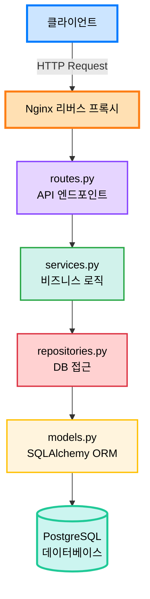

# 🏗️ 프로젝트 구조

이 문서는 AI Waste Coach Backend의 프로젝트 구조와 각 디렉토리의 역할을 설명합니다.

## 📁 전체 구조 개요

```
backend/
├── 📄 설정 파일
│   ├── .env                        # 환경변수 (git 무시)
│   ├── .env.example                # 환경변수 예제
│   ├── .gitignore                  # Git 무시 파일
│   ├── .dockerignore               # Docker 빌드 제외
│   ├── requirements.txt            # Python 의존성
│   ├── pyproject.toml              # Black, isort, pytest 설정
│   ├── .flake8                     # Flake8 린터 설정
│   ├── .pre-commit-config.yaml     # Pre-commit hooks
│   ├── alembic.ini                 # Alembic 설정
│   └── Makefile                    # 자동화 명령어
│
├── 🐳 Docker 관련
│   ├── Dockerfile                  # 프로덕션 이미지
│   ├── Dockerfile.dev              # 개발 이미지
│   ├── docker-compose.yml          # 프로덕션 환경
│   └── docker-compose.dev.yml      # 개발 환경
│
├── 🌐 Nginx 설정
│   └── nginx/
│       ├── nginx.conf              # 메인 설정
│       ├── conf.d/
│       │   └── backend.conf        # 백엔드 프록시
│       └── ssl/                    # SSL 인증서
│
├── 🔄 CI/CD
│   └── .github/
│       ├── workflows/
│       │   ├── ci.yml              # 린트, 테스트
│       │   ├── build-push.yml      # Docker 빌드
│       │   ├── deploy.yml          # EC2 배포
│       │   └── deploy-aws-ecs.yml  # ECS 배포
│       ├── PULL_REQUEST_TEMPLATE.md
│       └── ISSUE_TEMPLATE/
│
├── 📚 문서
│   ├── README.md                   # 프로젝트 소개
│   └── docs/                       # 상세 문서
│       ├── getting-started/        # 시작 가이드
│       ├── development/            # 개발 가이드
│       ├── deployment/             # 배포 가이드
│       ├── api/                    # API 문서
│       └── contributing/           # 기여 가이드
│
├── 🗄️ 데이터베이스
│   └── alembic/                    # DB 마이그레이션
│       ├── env.py                  # Alembic 환경
│       ├── script.py.mako          # 마이그레이션 템플릿
│       └── versions/               # 마이그레이션 파일들
│
└── 📦 애플리케이션 코드
    └── app/
        ├── main.py                 # FastAPI 앱 진입점
        │
        ├── core/                   # 핵심 설정
        │   ├── config.py           # 환경변수 관리
        │   ├── database.py         # DB 연결
        │   └── security.py         # JWT, 인증
        │
        ├── common/                 # 공통 유틸리티
        │   ├── responses.py        # 공통 응답 포맷
        │   ├── exceptions.py       # 커스텀 예외
        │   └── dependencies.py     # 공통 의존성
        │
        ├── domains/                # 도메인별 모듈
        │   ├── auth/               # 인증/OAuth
        │   │   ├── models.py       # SQLAlchemy 모델
        │   │   ├── schemas.py      # Pydantic DTO
        │   │   ├── services.py     # 비즈니스 로직
        │   │   ├── repositories.py # DB 접근 로직
        │   │   └── routes.py       # API 엔드포인트
        │   │
        │   ├── users/              # 사용자 관리
        │   ├── waste/              # 쓰레기 인식
        │   ├── recycling/          # 재활용 정보
        │   └── locations/          # 수거함 위치
        │
        ├── external/               # 외부 API 연동
        │   ├── ai_vision.py        # AI 비전 모델
        │   ├── llm.py              # LLM 연동
        │   └── oauth_clients.py    # 소셜 로그인
        │
        └── tests/                  # 테스트 코드
            ├── unit/               # 단위 테스트
            └── integration/        # 통합 테스트
```

---

## 📂 주요 디렉토리 상세 설명

### 🎯 `app/main.py` - 애플리케이션 진입점

FastAPI 앱 생성 및 설정이 이루어지는 메인 파일입니다.

**주요 기능:**
- FastAPI 인스턴스 생성
- CORS 미들웨어 설정
- 라우터 등록
- 헬스 체크 엔드포인트

### 🔧 `app/core/` - 핵심 설정

애플리케이션의 핵심 설정과 유틸리티를 포함합니다.

| 파일 | 역할 |
|------|------|
| `config.py` | 환경변수 관리 (Pydantic Settings) |
| `database.py` | SQLAlchemy 엔진, 세션 관리 |
| `security.py` | JWT 토큰, 비밀번호 해싱 |

### 🛠️ `app/common/` - 공통 모듈

모든 도메인에서 공통으로 사용하는 유틸리티입니다.

| 파일 | 역할 |
|------|------|
| `responses.py` | 공통 응답 포맷 (성공/에러) |
| `exceptions.py` | 커스텀 HTTP 예외 클래스 |
| `dependencies.py` | FastAPI 의존성 (인증 등) |

### 🏢 `app/domains/` - 도메인 모듈

비즈니스 로직을 도메인별로 분리하여 관리합니다.

**각 도메인은 다음 구조를 따릅니다:**

```
domains/{domain_name}/
├── models.py        # SQLAlchemy ORM 모델 (Entity)
├── schemas.py       # Pydantic 스키마 (DTO)
├── services.py      # 비즈니스 로직
├── repositories.py  # 데이터베이스 접근 계층
└── routes.py        # API 엔드포인트 (Controller)
```

**예시 - `users` 도메인:**

```python
# models.py
class User(Base):
    __tablename__ = "users"
    user_id = Column(Integer, primary_key=True)
    email = Column(String, unique=True)
    # ...

# schemas.py
class UserCreateRequest(BaseModel):
    email: EmailStr
    password: str

class UserResponse(BaseModel):
    user_id: int
    email: str

# repositories.py
def get_user_by_id(db: Session, user_id: int) -> User:
    return db.query(User).filter(User.user_id == user_id).first()

# services.py
def find_user_by_id(db: Session, user_id: int) -> UserResponse:
    user = get_user_by_id(db, user_id)
    if not user:
        raise NotFoundException("사용자를 찾을 수 없습니다")
    return UserResponse.from_orm(user)

# routes.py
@router.get("/{user_id}", response_model=CommonResponse)
def get_user(user_id: int, db: Session = Depends(get_db)):
    user = find_user_by_id(db, user_id)
    return success_response(message="조회 성공", data=user)
```

### 🌐 `app/external/` - 외부 API

외부 서비스와의 연동을 담당합니다.

| 파일 | 역할 |
|------|------|
| `ai_vision.py` | AI 비전 모델 API 호출 |
| `llm.py` | LLM (OpenAI, Claude 등) 연동 |
| `oauth_clients.py` | 카카오, 네이버, 구글 OAuth |

---

## 🔄 데이터 흐름



**요청 흐름 예시 (사용자 조회):**

1. `GET /api/v1/users/1` 요청
2. `routes.py`: `get_user()` 함수 실행
3. `services.py`: `find_user_by_id()` 비즈니스 로직
4. `repositories.py`: `get_user_by_id()` DB 쿼리
5. `models.py`: `User` 모델로 데이터 조회
6. PostgreSQL에서 데이터 반환
7. DTO 변환 후 클라이언트에 응답

---

## 📝 파일 네이밍 규칙

### Python 파일

- **모듈 파일**: `snake_case.py`
  - 예: `user_service.py`, `auth_routes.py`

- **클래스 파일**: 파일명은 소문자, 클래스명은 `PascalCase`
  - 예: `models.py` 내 `class User`, `class WasteItem`

### 폴더

- **도메인 폴더**: `소문자` (복수형 선호)
  - 예: `users/`, `waste/`, `locations/`

- **기능별 폴더**: `소문자`
  - 예: `core/`, `common/`, `external/`

---

## 🎯 계층별 역할

### 1. Routes (Controller)

**역할**: HTTP 요청 처리, 응답 반환

```python
@router.get("/users/{user_id}")
def get_user(user_id: int, db: Session = Depends(get_db)):
    """사용자 조회 API"""
    user = find_user_by_id(db, user_id)
    return success_response(message="조회 성공", data=user)
```

**책임:**
- ✅ HTTP 요청 검증
- ✅ Service 계층 호출
- ✅ 응답 포맷팅
- ❌ 비즈니스 로직 포함 금지

### 2. Services

**역할**: 비즈니스 로직 구현

```python
def find_user_by_id(db: Session, user_id: int) -> UserResponse:
    """사용자 조회 비즈니스 로직"""
    user = UserRepository.get_by_id(db, user_id)
    if not user:
        raise NotFoundException("사용자를 찾을 수 없습니다")
    return UserResponse.from_orm(user)
```

**책임:**
- ✅ 비즈니스 규칙 적용
- ✅ 데이터 검증
- ✅ Repository 호출
- ✅ DTO 변환
- ❌ DB 직접 접근 금지

### 3. Repositories

**역할**: 데이터베이스 접근

```python
def get_by_id(db: Session, user_id: int) -> Optional[User]:
    """ID로 사용자 조회"""
    return db.query(User).filter(User.user_id == user_id).first()
```

**책임:**
- ✅ DB 쿼리 실행
- ✅ ORM 조작
- ❌ 비즈니스 로직 금지

### 4. Models

**역할**: 데이터베이스 테이블 정의

```python
class User(Base):
    __tablename__ = "users"
    user_id = Column(Integer, primary_key=True)
    email = Column(String, unique=True, nullable=False)
```

**책임:**
- ✅ 테이블 구조 정의
- ✅ 관계 설정
- ❌ 비즈니스 로직 금지

### 5. Schemas (DTO)

**역할**: 데이터 전송 객체

```python
class UserCreateRequest(BaseModel):
    email: EmailStr
    password: str = Field(..., min_length=8)
```

**책임:**
- ✅ 데이터 검증
- ✅ 직렬화/역직렬화
- ❌ 비즈니스 로직 금지

---

## 🔍 도메인 추가 가이드

새로운 도메인을 추가할 때는 다음 단계를 따르세요:

### 1. 폴더 구조 생성

```bash
mkdir -p app/domains/new_domain
cd app/domains/new_domain
touch __init__.py models.py schemas.py services.py repositories.py routes.py
```

### 2. 파일 작성 순서

1. `models.py` - 데이터베이스 모델
2. `schemas.py` - Request/Response DTO
3. `repositories.py` - DB 접근 함수
4. `services.py` - 비즈니스 로직
5. `routes.py` - API 엔드포인트

### 3. main.py에 라우터 등록

```python
from app.domains.new_domain.routes import router as new_domain_router

app.include_router(
    new_domain_router,
    prefix="/api/v1/new-domain",
    tags=["NewDomain"]
)
```

---

## 📚 관련 문서

- [코딩 컨벤션](../development/conventions.md) - 코드 작성 규칙
- [데이터베이스 가이드](../development/database.md) - 모델 작성법
- [API 개발 가이드](../development/first-api.md) - 첫 API 만들기

---

**문서 버전**: 1.0.0  
**최종 업데이트**: 2025-10-30

