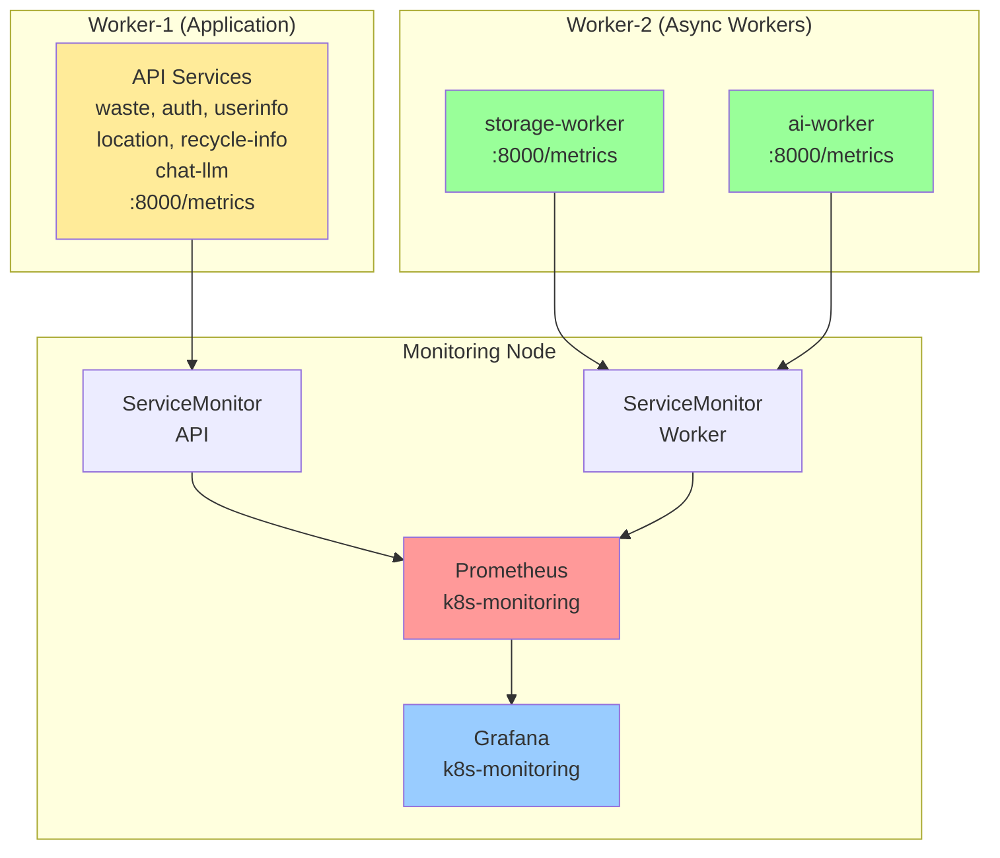
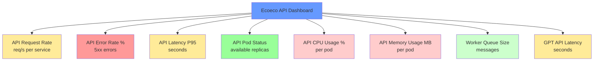

# 📊 Prometheus/Grafana 모니터링 가이드

> **7-Node 아키텍처에서 API 및 Worker 서비스 모니터링**  
> **1 Master + 2 Workers + 4 Infrastructure**

## 📋 목차

1. [아키텍처 개요](#아키텍처-개요)
2. [ServiceMonitor 설정](#servicemonitor-설정)
3. [PrometheusRule 알림](#prometheusrule-알림)
4. [Grafana Dashboard](#grafana-dashboard)
5. [FastAPI 메트릭 구현](#fastapi-메트릭-구현)
6. [배포 및 확인](#배포-및-확인)

---

## 🏗️ 아키텍처 개요

### 모니터링 스택



### 노드 배치

```
7-Node 아키텍처:
├─ k8s-master (t3.large, 8GB)
│  └─ Control Plane
│
├─ k8s-worker-1 (t3.medium, 4GB) - Application
│  └─ API Services (모든 도메인 통합)
│     └─ /metrics 엔드포인트
│
├─ k8s-worker-2 (t3.medium, 4GB) - Async Workers
│  ├─ storage-worker
│  └─ ai-worker
│     └─ /metrics 엔드포인트
│
└─ k8s-monitoring (t3.medium, 4GB)
   ├─ Prometheus
   │  ├─ ServiceMonitor: API (Worker-1)
   │  ├─ ServiceMonitor: Workers (Worker-2)
   │  ├─ PrometheusRule (알림 규칙)
   │  └─ TSDB (7일 retention)
   │
   └─ Grafana
      ├─ API Dashboard
      ├─ Worker Dashboard
      └─ Alerting
```

---

## 🔍 ServiceMonitor 설정

### API ServiceMonitor

**파일**: `k8s/monitoring/servicemonitor-api.yaml`

```yaml
apiVersion: monitoring.coreos.com/v1
kind: ServiceMonitor
metadata:
  name: api-services
  namespace: monitoring
spec:
  selector:
    matchLabels:
      component: api  # API Service에 이 라벨 필수
  
  endpoints:
    - port: metrics
      path: /metrics
      interval: 30s
```

**추적하는 메트릭**:
- `http_requests_total`: 전체 요청 수
- `http_request_duration_seconds`: 응답 시간
- `http_requests_in_progress`: 진행 중인 요청
- `process_*`: 프로세스 메트릭 (CPU, 메모리)
- `python_*`: Python 런타임 메트릭

### Worker ServiceMonitor

**파일**: `k8s/monitoring/servicemonitor-worker.yaml`

```yaml
apiVersion: monitoring.coreos.com/v1
kind: ServiceMonitor
metadata:
  name: worker-services
  namespace: monitoring
spec:
  selector:
    matchLabels:
      component: worker  # Worker Service에 이 라벨 필수
  
  endpoints:
    - port: metrics
      path: /metrics
      interval: 30s
```

**추적하는 메트릭**:
- `celery_task_*`: Celery 태스크 메트릭
- `rabbitmq_queue_*`: RabbitMQ 큐 메트릭
- `gpt_api_*`: GPT API 호출 메트릭
- `s3_upload_*`: S3 업로드 메트릭

---

## 🚨 PrometheusRule 알림

**파일**: `k8s/monitoring/prometheusrule-alerts.yaml`

### API 알림 규칙

| Alert | Condition | Severity | Description |
|-------|-----------|----------|-------------|
| **APIHighErrorRate** | 에러율 > 5% (5분) | critical | 5xx 에러 급증 |
| **APIHighLatency** | P95 > 2s (5분) | warning | 응답 속도 저하 |
| **APIPodDown** | Available < 1 (1분) | critical | Pod 다운 |
| **APIHighCPU** | CPU > 80% (10분) | warning | CPU 과부하 |
| **APIHighMemory** | Memory > 80% (10분) | warning | 메모리 부족 |

### Worker 알림 규칙

| Alert | Condition | Severity | Description |
|-------|-----------|----------|-------------|
| **CeleryQueueHigh** | Queue > 1000 (5분) | warning | 큐 적체 |
| **CeleryDLQNotEmpty** | DLQ > 0 (1분) | critical | 실패 메시지 발생 |
| **WorkerPodDown** | Available < 1 (1분) | critical | Worker Pod 다운 |
| **GPTAPIHighLatency** | P95 > 30s (10분) | warning | GPT API 느림 |
| **GPTAPIErrorRate** | 에러율 > 10% (5분) | critical | GPT API 에러 |
| **S3UploadFailure** | Failures > 0 (1분) | critical | S3 업로드 실패 |

### Infrastructure 알림 규칙

| Alert | Condition | Severity | Description |
|-------|-----------|----------|-------------|
| **RabbitMQDown** | up == 0 (1분) | critical | RabbitMQ 다운 |
| **PostgreSQLDown** | up == 0 (1분) | critical | PostgreSQL 다운 |
| **RedisDown** | up == 0 (1분) | critical | Redis 다운 |
| **PostgreSQLDiskFull** | Disk < 10% (5분) | critical | 디스크 부족 |

---

## 📈 Grafana Dashboard

**파일**: `k8s/monitoring/grafana-dashboard-api.json`

### Dashboard 패널



### 주요 쿼리

**API Request Rate**:
```promql
sum(rate(http_requests_total{component="api"}[5m])) by (service)
```

**API Error Rate**:
```promql
sum(rate(http_requests_total{component="api",status=~"5.."}[5m])) by (service) /
sum(rate(http_requests_total{component="api"}[5m])) by (service) * 100
```

**API Latency P95**:
```promql
histogram_quantile(0.95, 
  sum(rate(http_request_duration_seconds_bucket{component="api"}[5m])) by (service, le)
)
```

---

## 💻 FastAPI 메트릭 구현

### 1. 의존성 설치

```bash
# requirements.txt에 추가
prometheus-client==0.19.0
```

### 2. 모니터링 모듈 사용

**파일**: `app/monitoring.py` (이미 생성됨)

**API 서비스에 적용**:

```python
# app/main.py
from fastapi import FastAPI
from app.monitoring import setup_monitoring

app = FastAPI(title="Waste API")

# Prometheus 모니터링 설정
setup_monitoring(app, service_name="waste-api")

@app.get("/api/v1/waste/classify")
async def classify_waste(image_url: str):
    # 비즈니스 로직
    return {"result": "plastic"}
```

**자동으로 추가되는 엔드포인트**:
- `GET /metrics` - Prometheus 메트릭
- `GET /health` - Liveness probe
- `GET /ready` - Readiness probe

### 3. Celery Task 메트릭

```python
# workers/storage/tasks.py
from app.monitoring import track_celery_task
from celery import shared_task

@shared_task
@track_celery_task("image_upload")
def image_upload_task(image_path: str):
    # S3 업로드 로직
    return {"status": "uploaded"}
```

### 4. GPT API 메트릭

```python
# workers/ai/gpt_client.py
from app.monitoring import track_gpt_api_call
import openai

@track_gpt_api_call("gpt-4o-mini")
async def call_gpt(prompt: str):
    response = await openai.ChatCompletion.create(
        model="gpt-4o-mini",
        messages=[{"role": "user", "content": prompt}]
    )
    return response
```

### 5. S3 업로드 메트릭

```python
# app/storage/s3.py
from app.monitoring import track_s3_upload
import boto3

@track_s3_upload()
async def upload_to_s3(file_path: str, bucket: str, key: str):
    s3 = boto3.client('s3')
    s3.upload_file(file_path, bucket, key)
    return f"s3://{bucket}/{key}"
```

---

## 🚀 배포 및 확인

### 1. ServiceMonitor 배포

```bash
# ServiceMonitor 적용
kubectl apply -f k8s/monitoring/servicemonitor-api.yaml
kubectl apply -f k8s/monitoring/servicemonitor-worker.yaml

# 확인
kubectl get servicemonitor -n monitoring
```

### 2. PrometheusRule 배포

```bash
# PrometheusRule 적용
kubectl apply -f k8s/monitoring/prometheusrule-alerts.yaml

# 확인
kubectl get prometheusrule -n monitoring
```

### 3. Grafana Dashboard 임포트

```bash
# Grafana UI에서 Import
# k8s/monitoring/grafana-dashboard-api.json 업로드
```

또는 ConfigMap으로 자동 배포:

```bash
kubectl create configmap grafana-dashboard-api \
  --from-file=k8s/monitoring/grafana-dashboard-api.json \
  -n monitoring
```

### 4. API Service 라벨 추가

**Kubernetes Service에 `component: api` 라벨 필수**:

```yaml
apiVersion: v1
kind: Service
metadata:
  name: waste-api
  labels:
    component: api  # ⭐ 필수
spec:
  selector:
    app: waste-api
  ports:
    - name: http
      port: 8000
    - name: metrics  # ⭐ 필수
      port: 8000
      targetPort: 8000
```

### 5. Prometheus 확인

```bash
# Prometheus UI 접속
kubectl port-forward svc/prometheus-operated -n monitoring 9090:9090

# 브라우저: http://localhost:9090
# Targets 확인: Status -> Targets
```

**확인 사항**:
- `api-services` ServiceMonitor: 6개 API 타겟 UP
- `worker-services` ServiceMonitor: 2개 Worker 타겟 UP

### 6. Grafana 확인

```bash
# Grafana UI 접속
kubectl port-forward svc/grafana -n monitoring 3000:3000

# 브라우저: http://localhost:3000
# Dashboard -> Import -> grafana-dashboard-api.json
```

**확인 사항**:
- API Request Rate 그래프에 데이터 표시
- API Error Rate < 5%
- API Latency < 2s
- Pod Status = Available

---

## 🔧 트러블슈팅

### ServiceMonitor가 타겟을 찾지 못하는 경우

```bash
# Service 라벨 확인
kubectl get svc -n default -L component

# 라벨이 없다면 추가
kubectl label svc waste-api component=api -n default
```

### 메트릭이 수집되지 않는 경우

```bash
# Pod의 /metrics 엔드포인트 확인
kubectl exec -it <pod-name> -- curl localhost:8000/metrics

# Prometheus가 스크래핑하는지 확인
# Prometheus UI -> Status -> Targets
```

### Grafana Dashboard가 빈 경우

```bash
# Prometheus 데이터 소스 확인
# Grafana -> Configuration -> Data Sources -> Prometheus

# Query 테스트
http_requests_total
```

---

## 📊 기대 결과

### Prometheus Targets

```
api-services (6/6 up)
├─ waste-api (UP)
├─ auth-api (UP)
├─ userinfo-api (UP)
├─ location-api (UP)
├─ recycle-info-api (UP)
└─ chat-llm-api (UP)

worker-services (2/2 up)
├─ storage-worker (UP)
└─ ai-worker (UP)
```

### Grafana Dashboard

- **API Request Rate**: 10-100 req/s
- **API Error Rate**: < 1%
- **API Latency P95**: < 1s
- **Worker Queue Size**: < 100 messages
- **GPT API Latency**: < 20s

---

## 🔗 관련 문서

- [Prometheus Operator](https://github.com/prometheus-operator/prometheus-operator)
- [FastAPI Monitoring](../guides/FASTAPI_MONITORING.md)
- [Grafana Dashboards](../guides/GRAFANA_DASHBOARDS.md)

---

**작성일**: 2025-11-06  
**버전**: 1.0 (7-Node Architecture)  
**상태**: ✅ Production Ready

