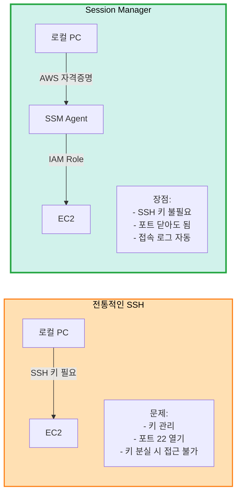

# 🔐 AWS Session Manager 사용 가이드

> **SSH 키 없이 EC2 접속하기**  
> **장점**: 어떤 PC에서든 AWS 자격증명만으로 접속 가능

## 📋 목차

1. [Session Manager란?](#session-manager란)
2. [설정 방법](#설정-방법)
3. [사용 방법](#사용-방법)
4. [장단점](#장단점)

---

## 🤔 Session Manager란?

### SSH vs Session Manager



**Session Manager**:
- AWS Systems Manager의 기능
- 브라우저 또는 AWS CLI로 EC2 접속
- SSH 키 불필요
- 22번 포트 불필요
- IAM으로 권한 관리

---

## ⚙️ 설정 방법

### 1. Terraform 설정 (이미 적용됨)

```hcl
# terraform/iam.tf (신규 파일)
# IAM Role과 Instance Profile 생성

# terraform/main.tf
# iam_instance_profile 추가됨

# ✅ 이미 코드에 포함되어 있습니다!
```

### 2. Terraform Apply

```bash
cd terraform

# IAM Role이 포함된 인프라 생성
terraform init
terraform plan
terraform apply

# Instance Profile이 EC2에 자동 부여됨
```

### 3. SSM Agent 확인

```bash
# Ubuntu 22.04는 기본 설치됨
# 확인만 하면 됨 (Session Manager로 접속 후)

# SSM Agent 상태
sudo systemctl status amazon-ssm-agent

# 자동 시작 설정
sudo systemctl enable amazon-ssm-agent
```

---

## 🚀 사용 방법

### 방법 1: AWS CLI (권장)

```bash
# 1. AWS CLI Session Manager Plugin 설치
# macOS
brew install --cask session-manager-plugin

# Linux
curl "https://s3.amazonaws.com/session-manager-downloads/plugin/latest/ubuntu_64bit/session-manager-plugin.deb" -o "session-manager-plugin.deb"
sudo dpkg -i session-manager-plugin.deb

# 확인
session-manager-plugin

# 2. Instance ID 확인
aws ec2 describe-instances \
  --filters "Name=tag:Name,Values=k8s-master" \
  --query "Reservations[].Instances[].InstanceId" \
  --output text

# 출력: i-0123456789abcdef

# 3. Session Manager로 접속
aws ssm start-session --target i-0123456789abcdef

# ✅ SSH 키 없이 접속 성공!
```

### 방법 2: AWS Console

```
1. AWS Console → EC2
2. 인스턴스 선택 (k8s-master)
3. 연결 버튼 클릭
4. Session Manager 탭
5. 연결 버튼

→ 브라우저에서 바로 접속!
```

### 방법 3: SSH-like 명령어

```bash
# SSH처럼 사용 (간편)
aws ec2-instance-connect ssh \
  --instance-id i-0123456789abcdef

# 또는 이름으로
INSTANCE_ID=$(aws ec2 describe-instances \
  --filters "Name=tag:Name,Values=k8s-master" "Name=instance-state-name,Values=running" \
  --query "Reservations[].Instances[].InstanceId" \
  --output text)

aws ssm start-session --target $INSTANCE_ID
```

### 편의 스크립트

```bash
# scripts/connect-master.sh
#!/bin/bash
INSTANCE_ID=$(aws ec2 describe-instances \
  --filters "Name=tag:Name,Values=k8s-master" "Name=instance-state-name,Values=running" \
  --query "Reservations[].Instances[].InstanceId" \
  --output text \
  --region ap-northeast-2)

if [ -z "$INSTANCE_ID" ]; then
  echo "❌ Master 인스턴스를 찾을 수 없습니다."
  exit 1
fi

echo "🔗 Master 인스턴스에 연결 중... ($INSTANCE_ID)"
aws ssm start-session --target $INSTANCE_ID

# 사용:
# chmod +x scripts/connect-master.sh
# ./scripts/connect-master.sh
```

---

## ✅ 장점

### 1. SSH 키 불필요

```
✅ 키 생성 안 해도 됨
✅ 키 관리 안 해도 됨
✅ 키 분실 걱정 없음
✅ terraform.tfvars 수정 불필요
```

### 2. 어디서든 접속

```
집 PC: AWS CLI 설정 → 접속 가능
회사 PC: AWS CLI 설정 → 접속 가능
노트북: AWS CLI 설정 → 접속 가능

→ AWS 자격증명만 있으면 OK!
```

### 3. 보안 강화

```
✅ 22번 포트 닫아도 됨
✅ 공개 IP 없어도 됨 (Private 서브넷 가능)
✅ IAM으로 권한 관리
✅ 접속 로그 자동 기록 (CloudTrail)
✅ 세션 녹화 가능 (S3)
```

### 4. 팀 협업

```
팀원 추가:
1. AWS IAM 사용자 생성
2. 권한 부여 (AmazonSSMManagedInstanceCore)
3. 완료! (SSH 키 공유 불필요)

→ 키 관리 불필요!
```

---

## 💰 비용

```
Session Manager 사용:
├─ 기본 기능: $0 (무료!)
├─ 세션 로그 (CloudWatch): ~$0.50/월
└─ 세션 녹화 (S3): ~$0.023/GB/월

추가 비용: 거의 $0

vs SSH 키 방식: 동일 ($0)
```

---

## 🔧 Terraform 수정 사항

### 이미 적용된 파일

```
✅ terraform/iam.tf (신규)
   - IAM Role 생성
   - SSM 정책 부여
   - Instance Profile 생성

✅ terraform/main.tf (수정)
   - iam_instance_profile 추가 (3군데)

✅ terraform/modules/ec2/main.tf (수정)
   - iam_instance_profile 파라미터 추가

✅ terraform/modules/ec2/variables.tf (수정)
   - iam_instance_profile 변수 추가
```

---

## 📝 사용 예시

### Master 접속

```bash
# 1. Instance ID 조회
MASTER_ID=$(aws ec2 describe-instances \
  --filters "Name=tag:Name,Values=k8s-master" \
  --query "Reservations[].Instances[].InstanceId" \
  --output text)

# 2. 접속
aws ssm start-session --target $MASTER_ID

# 3. 접속 후
ubuntu@k8s-master:~$ kubectl get nodes
```

### Worker 접속

```bash
# Worker 1
WORKER1_ID=$(aws ec2 describe-instances \
  --filters "Name=tag:Name,Values=k8s-worker-1" \
  --query "Reservations[].Instances[].InstanceId" \
  --output text)

aws ssm start-session --target $WORKER1_ID
```

### kubectl 원격 실행

```bash
# Session Manager로 명령어 전송
aws ssm send-command \
  --instance-ids $MASTER_ID \
  --document-name "AWS-RunShellScript" \
  --parameters 'commands=["kubectl get nodes"]'
```

---

## ⚠️ 주의사항

### 1. IAM 권한 필요

```
로컬 PC의 AWS 자격증명에 필요한 권한:

- AmazonSSMManagedInstanceCore (읽기)
- ec2:DescribeInstances (인스턴스 찾기용)

또는

- AdministratorAccess (개발용)
```

### 2. SSM Agent 상태 확인

```bash
# EC2 생성 후 2-3분 대기 (SSM Agent 등록)
# 너무 빨리 접속하면 실패

# 인스턴스가 SSM에 등록되었는지 확인
aws ssm describe-instance-information \
  --filters "Key=InstanceIds,Values=$MASTER_ID"

# Online 상태 확인
```

### 3. Region 설정

```bash
# AWS CLI에 Region 설정 필수
aws configure set region ap-northeast-2

# 또는 명령어마다 지정
aws ssm start-session --target $MASTER_ID --region ap-northeast-2
```

---

## 🎯 최종 권장사항

### ✅ Session Manager 사용 (권장)

```
이유:
✅ SSH 키 관리 불필요
✅ 어떤 PC에서든 접속 가능
✅ 팀 협업 쉬움 (IAM으로 관리)
✅ 보안 강화 (포트 22 닫기)
✅ 접속 로그 자동 기록
✅ 비용 $0

설정:
→ Terraform 이미 적용됨
→ terraform apply만 하면 자동 설정!
```

### 🔧 SSH 키는 백업용

```
SSH 키는 생성하되:
- 비상시 접근용
- Session Manager 장애 시
- 로컬 개발용 (docker-compose)

주 접속 방법:
→ AWS Session Manager
```

---

## 📚 관련 문서

- [AWS Session Manager 공식 문서](https://docs.aws.amazon.com/systems-manager/latest/userguide/session-manager.html)
- [Setup 체크리스트](setup-checklist.md)
- [IaC 구성](../infrastructure/iac-terraform-ansible.md)

---

**작성일**: 2025-10-30  
**상태**: ✅ Terraform에 적용 완료  
**비용**: $0 (무료)

