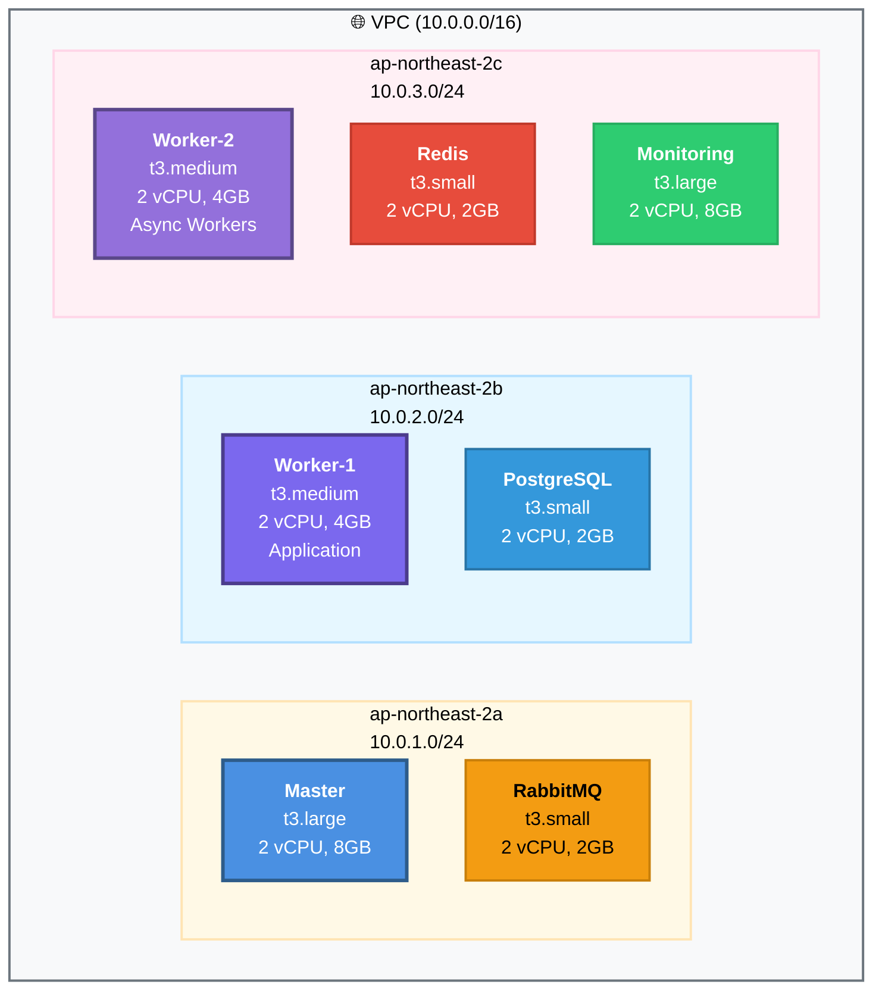
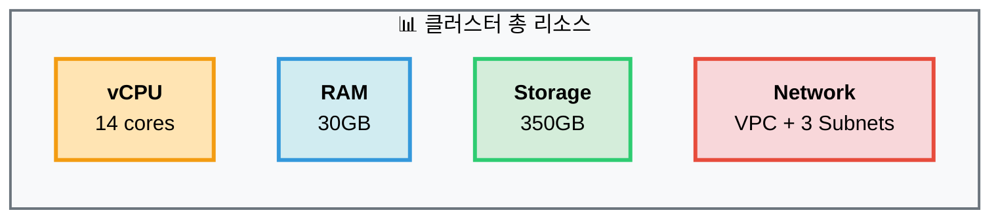
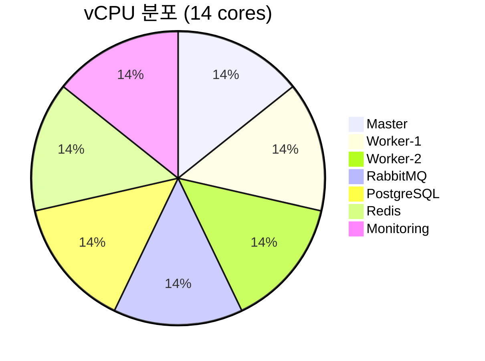
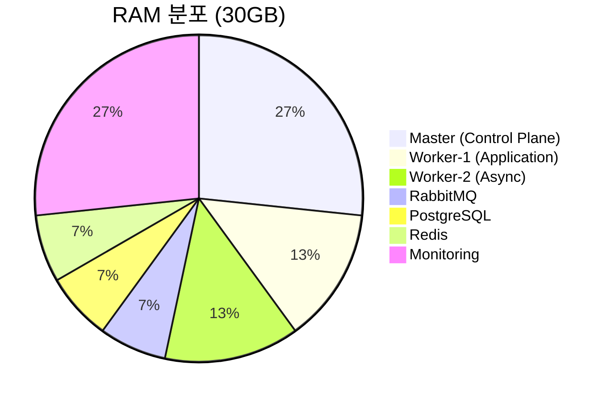
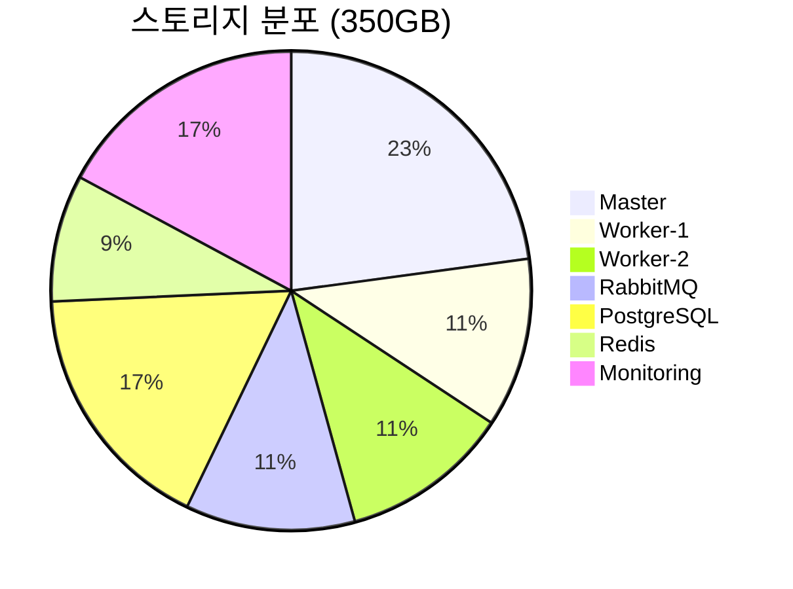
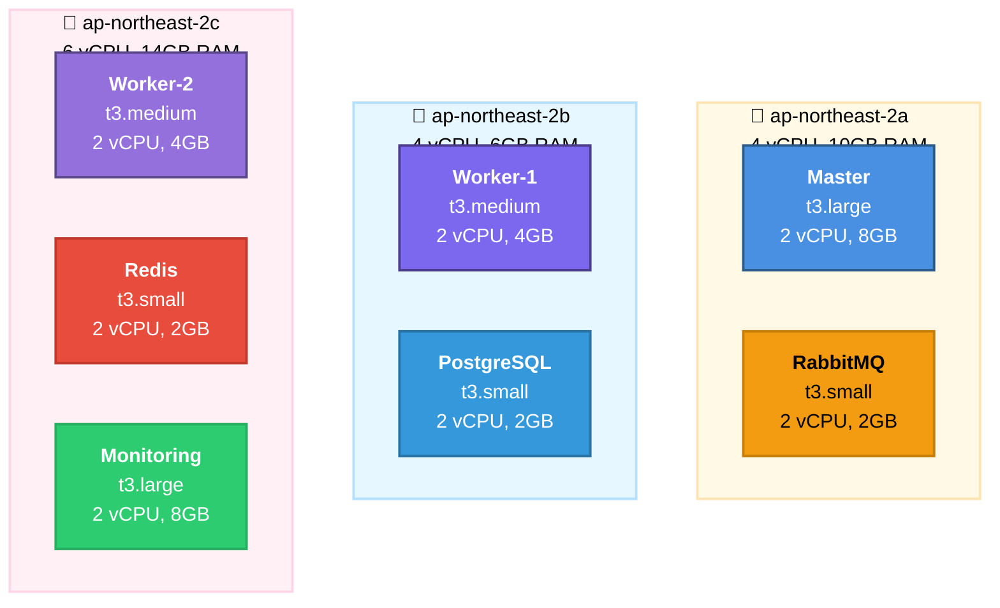

# 🖥️ 클러스터 리소스 현황

> **7-Node Kubernetes 클러스터 상세 명세**  
> **최종 업데이트**: 2025-11-05  
> **소스**: Terraform + Ansible

---

## 📋 목차

1. [클러스터 개요](#클러스터-개요)
2. [노드 상세 명세](#노드-상세-명세)
3. [네트워크 구성](#네트워크-구성)
4. [리소스 분석](#리소스-분석)
5. [배포 고려사항](#배포-고려사항)

---

## 🏗️ 클러스터 개요

### 1. 클러스터 아키텍처



### 2. 기본 정보

```yaml
클러스터 이름: sesacthon
Kubernetes 버전: 1.28.4
노드 수: 7개 (1 Master + 6 Workers)
리전: ap-northeast-2 (Seoul)
AZ: 3개 (a, b, c)
관리 방식: Self-managed (kubeadm)
```

### 3. 총 리소스



| 항목 | 수량 |
|------|------|
| **vCPU** | 14 cores |
| **RAM** | 30GB |
| **스토리지** | 350GB |
| **네트워크** | VPC + 3 Public Subnets |

---

## 🖥️ 노드 상세 명세

### 1. Control Plane 노드

#### k8s-master

```yaml
역할: Control Plane
인스턴스 타입: t3.large
vCPU: 2 cores
RAM: 8GB
스토리지: 80GB (gp3)
AZ: ap-northeast-2a
Subnet: 10.0.1.0/24
Private IP: 10.0.1.138
Public IP: 52.78.61.199 (Elastic IP)

워크로드:
  - kube-apiserver
  - kube-controller-manager
  - kube-scheduler
  - etcd
  - CoreDNS

특징:
  - EIP 할당 (고정 IP)
  - Control Plane 전용
  - Application Pod 배포 불가 (Taint)
```

### 2. Application Worker 노드

#### k8s-worker-1

```yaml
역할: Application Worker
인스턴스 타입: t3.medium
vCPU: 2 cores
RAM: 4GB
스토리지: 40GB (gp3)
AZ: ap-northeast-2b
Subnet: 10.0.2.0/24
Private IP: 10.0.2.145
Public IP: 16.184.21.21

라벨:
  workload: application
  instance_type: t3.medium

워크로드:
  - FastAPI Pods (Sync API)
  - Application Services
  - 블루-그린 배포 대상

특징:
  - NodeSelector: workload=application
  - 블루-그린 배포 가능
  - 4GB RAM (Blue + Green 동시 가능)
```

#### k8s-worker-2

```yaml
역할: Async Worker
인스턴스 타입: t3.medium
vCPU: 2 cores
RAM: 4GB
스토리지: 40GB (gp3)
AZ: ap-northeast-2c
Subnet: 10.0.3.0/24
Private IP: 10.0.3.180
Public IP: 15.164.165.44

라벨:
  workload: async-workers
  instance_type: t3.medium

워크로드:
  - Celery Workers (Async Tasks)
  - Background Jobs
  - 이미지 처리 작업

특징:
  - NodeSelector: workload=async-workers
  - CPU 집약적 작업
  - 독립적 스케일링 가능
```

### 3. Infrastructure Worker 노드

#### k8s-rabbitmq

```yaml
역할: Message Queue (전용)
인스턴스 타입: t3.small
vCPU: 2 cores
RAM: 2GB
스토리지: 40GB (gp3)
AZ: ap-northeast-2a
Subnet: 10.0.1.0/24
Private IP: 10.0.1.x

라벨:
  workload: message-queue

워크로드:
  - RabbitMQ (단일 Pod)
  - Message Queue 전용

특징:
  - 전용 노드 (다른 Pod 배포 불가)
  - Persistent Volume 사용
  - Control Plane과 같은 AZ
```

#### k8s-postgresql

```yaml
역할: Database (전용)
인스턴스 타입: t3.small
vCPU: 2 cores
RAM: 2GB
스토리지: 60GB (gp3)
AZ: ap-northeast-2b
Subnet: 10.0.2.0/24
Private IP: 10.0.2.x

라벨:
  workload: database

워크로드:
  - PostgreSQL 16
  - Database 전용

특징:
  - 전용 노드 (격리)
  - 60GB 스토리지 (데이터 보존)
  - Application Worker와 같은 AZ
```

#### k8s-redis

```yaml
역할: Cache (전용)
인스턴스 타입: t3.small
vCPU: 2 cores
RAM: 2GB
스토리지: 30GB (gp3)
AZ: ap-northeast-2c
Subnet: 10.0.3.0/24
Private IP: 10.0.3.x

라벨:
  workload: cache

워크로드:
  - Redis Cache
  - 인메모리 캐시

특징:
  - 전용 노드
  - 메모리 최적화
  - Async Worker와 같은 AZ
```

#### k8s-monitoring

```yaml
역할: Monitoring Stack (전용)
인스턴스 타입: t3.large
vCPU: 2 cores
RAM: 8GB
스토리지: 60GB (gp3)
AZ: ap-northeast-2c
Subnet: 10.0.3.0/24
Private IP: 10.0.3.x

라벨:
  workload: monitoring

워크로드:
  - Prometheus
  - Grafana
  - Alertmanager
  - Node Exporter

특징:
  - 전용 노드 (모니터링 전용)
  - 8GB RAM (TSDB)
  - 60GB 스토리지 (메트릭 데이터)
  - t3.large (CPU 업그레이드)
```

---

## 🌐 네트워크 구성

### VPC

```yaml
VPC CIDR: 10.0.0.0/16
DNS Hostnames: Enabled
DNS Support: Enabled
Internet Gateway: igw-xxx

Tags:
  kubernetes.io/cluster/prod-sesacthon: shared
```

### Subnets

```yaml
ap-northeast-2a (10.0.1.0/24):
  - k8s-master (10.0.1.138)
  - k8s-rabbitmq (10.0.1.x)
  - 256 IPs available
  - Public Subnet
  - Tag: kubernetes.io/role/elb=1

ap-northeast-2b (10.0.2.0/24):
  - k8s-worker-1 (10.0.2.145)
  - k8s-postgresql (10.0.2.x)
  - 256 IPs available
  - Public Subnet

ap-northeast-2c (10.0.3.0/24):
  - k8s-worker-2 (10.0.3.180)
  - k8s-redis (10.0.3.x)
  - k8s-monitoring (10.0.3.x)
  - 256 IPs available
  - Public Subnet
```

### CNI 구성

```yaml
CNI Plugin: Calico
네트워크 모드: Overlay Network
Pod CIDR: 192.168.0.0/16 (Calico)
Service CIDR: 10.96.0.0/12

특징:
  - VPC와 독립적인 Pod 네트워크
  - Overlay Network (VXLAN)
  - Network Policy 지원
  - ALB는 target-type=instance + NodePort 사용
```

---

## 📊 리소스 분석

### 1. vCPU 분포



### 2. RAM 분포



### 3. 스토리지 분포



### 4. 리소스 요약 테이블

| 노드 | vCPU | RAM | 스토리지 | 비율 (RAM) |
|------|------|-----|----------|-----------|
| **Master** | 2 cores | 8GB | 80GB | 27% |
| **Worker-1** | 2 cores | 4GB | 40GB | 13% |
| **Worker-2** | 2 cores | 4GB | 40GB | 13% |
| **RabbitMQ** | 2 cores | 2GB | 40GB | 7% |
| **PostgreSQL** | 2 cores | 2GB | 60GB | 7% |
| **Redis** | 2 cores | 2GB | 30GB | 7% |
| **Monitoring** | 2 cores | 8GB | 60GB | 27% |
| **Total** | **14 cores** | **30GB** | **350GB** | **100%** |

---

### 5. AZ 분산



---

## 🚀 배포 고려사항

### 블루-그린 배포

**Application Worker 리소스**
```yaml
가용 Worker 노드: 2개 (worker-1, worker-2)
각 Worker RAM: 4GB
각 Worker vCPU: 2 cores

Application Pod 리소스:
  requests:
    memory: 256Mi
    cpu: 100m
  limits:
    memory: 512Mi
    cpu: 500m

배포 시나리오:
  평소: Blue 3 Pods = 1.5GB RAM
  배포 시: Blue 3 + Green 3 = 3GB RAM
  여유: 8GB 중 3GB 사용 = 충분 ✅
```

**NodeSelector 사용**
```yaml
# Application Pod에 NodeSelector 설정 필수
nodeSelector:
  workload: application

# 이유:
# - Infrastructure 노드 (RabbitMQ, PostgreSQL, Redis, Monitoring)는 전용
# - Application Pod은 worker-1, worker-2에만 배포
```

### 카나리 배포

**리소스 효율성**
```yaml
Canary 10%:
  - Stable: 9 Pods
  - Canary: 1 Pod
  - Total: 10 Pods = 5GB RAM
  - 여유: 충분 ✅

Canary 50%:
  - Stable: 5 Pods
  - Canary: 5 Pods
  - Total: 10 Pods = 5GB RAM
  - 여유: 충분 ✅
```

### Auto Scaling

**HPA 설정 권장**
```yaml
minReplicas: 3
maxReplicas: 8
targetCPUUtilizationPercentage: 70

최대 리소스 사용:
  8 Pods x 512MB = 4GB
  가용: 8GB (worker-1: 4GB, worker-2: 4GB)
  여유: 충분 ✅
```

### 리소스 모니터링

**Prometheus 메트릭**
```promql
# 노드 CPU 사용률
100 - (avg by (instance) (rate(node_cpu_seconds_total{mode="idle"}[5m])) * 100)

# 노드 메모리 사용률
(1 - (node_memory_MemAvailable_bytes / node_memory_MemTotal_bytes)) * 100

# Pod 메모리 사용량
sum(container_memory_working_set_bytes{pod=~"backend-.*"}) by (pod) / 1024 / 1024

# Application Worker 가용 메모리
node_memory_MemAvailable_bytes{node=~".*worker-[12]"}
```

---

## 📚 관련 문서

- [VPC 네트워크 설계](vpc-network-design.md)
- [배포 전략 비교](../plans/DEPLOYMENT_STRATEGIES_COMPARISON.md)
- [최종 K8s 아키텍처](../architecture/final-k8s-architecture.md)
- [서비스 아키텍처](../architecture/SERVICE_ARCHITECTURE.md)

---

**문서 버전**: 1.0  
**최종 업데이트**: 2025-11-05  
**소스**: Terraform (main.tf) + Ansible (inventory/hosts)  
**검증**: kubectl get nodes 명령으로 확인 완료

