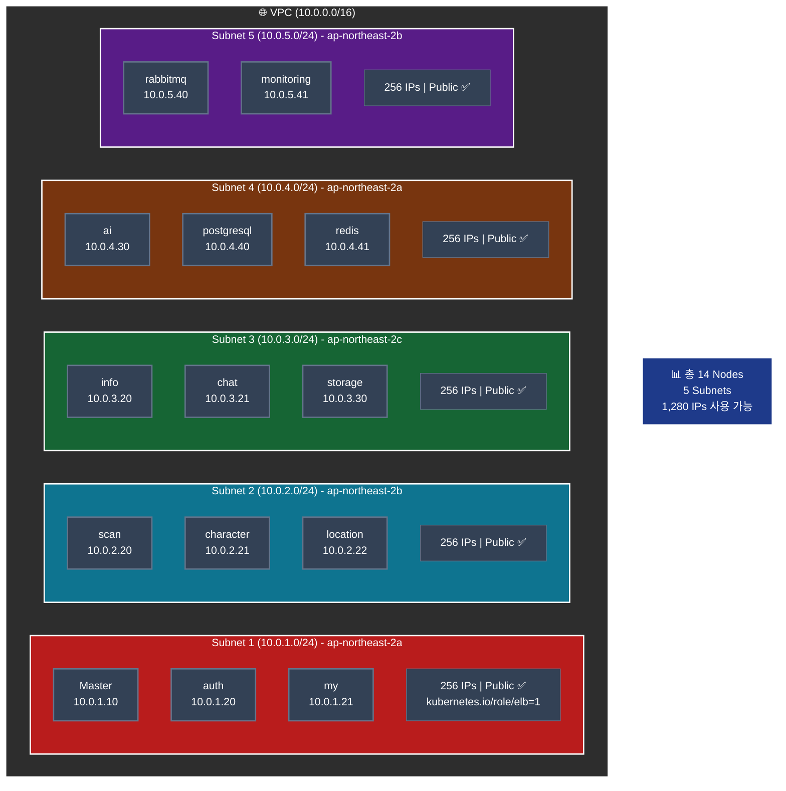
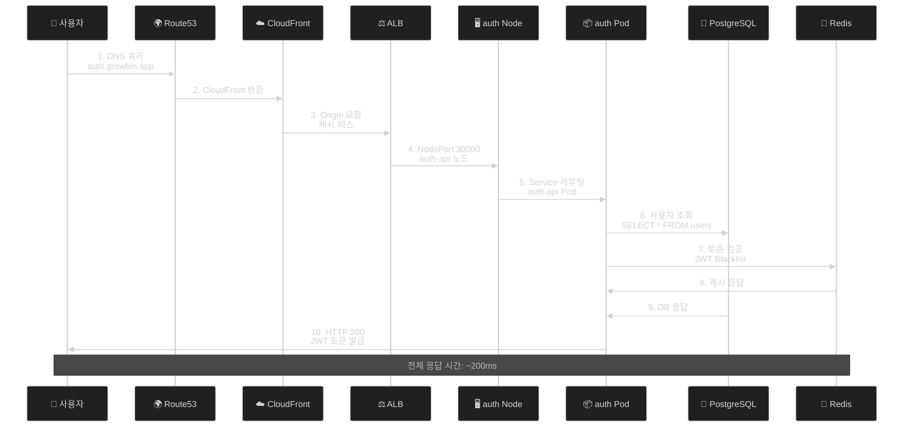
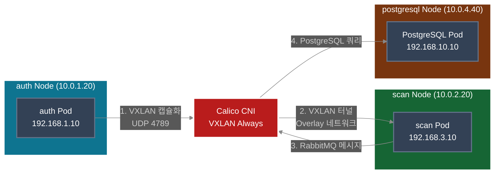
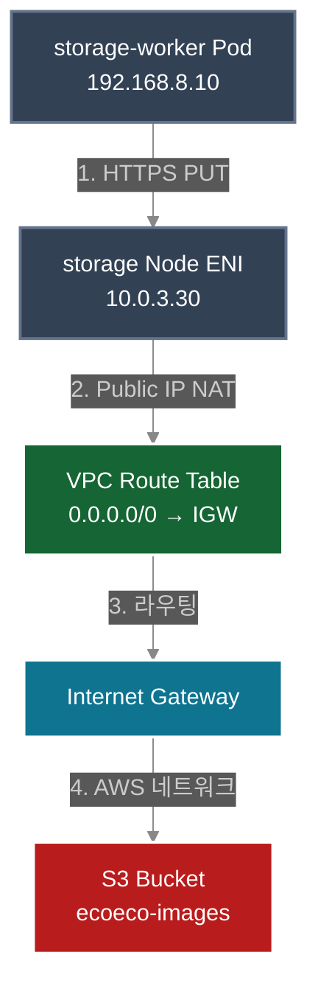

# 🌐 VPC 네트워크 설계 (14-Node Architecture)

> **14-Node Kubernetes 클러스터용 네트워크 구성**  
> **업데이트**: 2025-11-12  
> **상태**: ✅ 프로덕션 완료

---

## 🏗️ VPC 개요

### 기본 정보

```
VPC CIDR: 10.0.0.0/16
Region: ap-northeast-2 (Seoul)
Availability Zones: 3개 (a, b, c)
DNS Hostnames: Enabled
DNS Support: Enabled

사용 가능 IP: 65,536개
실제 사용: ~1,000개 (14 nodes + Pods)
여유: 충분 ✅
```

### VPC Tags

```yaml
Name: ecoeco-k8s-vpc
Project: SeSACTHON-EcoEco
ManagedBy: Terraform
Environment: production
kubernetes.io/cluster/ecoeco: shared  # ALB Controller 자동 인식
```

---

## 🗺️ Subnets 설계 (14-Node)

### Public Subnets (모든 노드가 Public)



### 노드별 IP 할당

| Subnet | AZ | CIDR | 노드 | Private IP | 역할 |
|--------|----|----|------|-----------|------|
| **Subnet 1** | 2a | 10.0.1.0/24 | Master | 10.0.1.10 | Control Plane |
| | | | auth | 10.0.1.20 | API (Phase 1) |
| | | | my | 10.0.1.21 | API (Phase 1) |
| **Subnet 2** | 2b | 10.0.2.0/24 | scan | 10.0.2.20 | API (Phase 1) |
| | | | character | 10.0.2.21 | API (Phase 2) |
| | | | location | 10.0.2.22 | API (Phase 2) |
| **Subnet 3** | 2c | 10.0.3.0/24 | info | 10.0.3.20 | API (Phase 3) |
| | | | chat | 10.0.3.21 | API (Phase 3) |
| | | | storage | 10.0.3.30 | Worker |
| **Subnet 4** | 2a | 10.0.4.0/24 | ai | 10.0.4.30 | Worker |
| | | | postgresql | 10.0.4.40 | Infra |
| | | | redis | 10.0.4.41 | Infra |
| **Subnet 5** | 2b | 10.0.5.0/24 | rabbitmq | 10.0.5.40 | Infra |
| | | | monitoring | 10.0.5.41 | Infra |

### 왜 Public Subnet만?

```
장점:
✅ NAT Gateway 불필요 ($96/월 × 3 AZ = $288/월 절감)
✅ 직접 인터넷 접속 (레이턴시 낮음)
✅ 관리 단순화
✅ ArgoCD, Monitoring 접근 용이

보안:
✅ Security Group으로 엄격히 제어
✅ 필요한 포트만 개방
✅ Pod IP는 Private (192.168.0.0/16)
✅ Network Policy로 Pod 간 통신 제어

적합:
- 중규모 클러스터 (14 nodes)
- 마이크로서비스 아키텍처
- 비용 최적화 중요
- GitOps 환경
```

---

## 🔒 Security Groups (14-Node)

### 1. Master Security Group

```yaml
Name: ecoeco-master-sg
Applies to: k8s-master (10.0.1.10)

Inbound Rules:
━━━━━━━━━━━━━━━━━━━━━━━━━━━━━━━━━━━━━━━━━━━━━━━
# Internet Access
- SSH (22/TCP):           관리자 IP → Master
- K8s API (6443/TCP):     0.0.0.0/0 → Master (kubectl 접근)
- HTTP (80/TCP):          0.0.0.0/0 → Master (리디렉션)
- HTTPS (443/TCP):        0.0.0.0/0 → Master (Ingress)

# Control Plane (Self + Workers)
- etcd (2379-2380/TCP):         Master SG → Master
- Kubelet (10250/TCP):          All SG → Master
- Scheduler (10259/TCP):        Master SG → Master
- Controller-Mgr (10257/TCP):   Master SG → Master

# CNI (Calico VXLAN)
- VXLAN (4789/UDP):       All SG → Master

Outbound:
- All traffic to 0.0.0.0/0
```

### 2. API Nodes Security Group

```yaml
Name: ecoeco-api-sg
Applies to: auth, my, scan, character, location, info, chat (7개)

Inbound Rules:
━━━━━━━━━━━━━━━━━━━━━━━━━━━━━━━━━━━━━━━━━━━━━━━
# Internet Access (ALB 경유)
- SSH (22/TCP):           관리자 IP → API Nodes
- HTTP (80/TCP):          ALB SG → API Nodes
- NodePort (30000-30007): ALB SG → API Nodes

# From Master
- Kubelet (10250/TCP):    Master SG → API Nodes
- All traffic:            Master SG → API Nodes

# API Nodes 간 통신 (Self)
- All traffic:            API SG → API Nodes
- VXLAN (4789/UDP):       API SG → API Nodes

# From Workers & Infra
- All traffic:            Worker SG → API Nodes
- All traffic:            Infra SG → API Nodes

Outbound:
- All traffic to 0.0.0.0/0
```

### 3. Worker Nodes Security Group

```yaml
Name: ecoeco-worker-sg
Applies to: storage, ai (2개)

Inbound Rules:
━━━━━━━━━━━━━━━━━━━━━━━━━━━━━━━━━━━━━━━━━━━━━━━
# Internet Access
- SSH (22/TCP):           관리자 IP → Workers

# From Master
- Kubelet (10250/TCP):    Master SG → Workers
- All traffic:            Master SG → Workers

# From API Nodes
- All traffic:            API SG → Workers

# Worker 간 통신 (Self)
- All traffic:            Worker SG → Workers
- VXLAN (4789/UDP):       Worker SG → Workers

# From Infra
- All traffic:            Infra SG → Workers

Outbound:
- All traffic to 0.0.0.0/0
```

### 4. Infra Nodes Security Group

```yaml
Name: ecoeco-infra-sg
Applies to: postgresql, redis, rabbitmq, monitoring (4개)

Inbound Rules:
━━━━━━━━━━━━━━━━━━━━━━━━━━━━━━━━━━━━━━━━━━━━━━━
# Internet Access
- SSH (22/TCP):           관리자 IP → Infra Nodes
- HTTP (80/TCP):          0.0.0.0/0 → Monitoring (Grafana)
- HTTPS (443/TCP):        0.0.0.0/0 → Monitoring

# Database Ports (From API & Workers)
- PostgreSQL (5432/TCP):  API SG, Worker SG → postgresql
- Redis (6379/TCP):       API SG → redis
- RabbitMQ (5672/TCP):    API SG, Worker SG → rabbitmq
- RabbitMQ Mgmt (15672):  관리자 IP → rabbitmq

# Monitoring Ports
- Prometheus (9090/TCP):  관리자 IP → monitoring
- Grafana (3000/TCP):     0.0.0.0/0 → monitoring
- Node Exporter (9100):   All SG → Infra Nodes

# From Master
- Kubelet (10250/TCP):    Master SG → Infra Nodes
- All traffic:            Master SG → Infra Nodes

# Infra 간 통신 (Self)
- All traffic:            Infra SG → Infra Nodes
- VXLAN (4789/UDP):       Infra SG → Infra Nodes

Outbound:
- All traffic to 0.0.0.0/0
```

### 5. ALB Security Group

```yaml
Name: ecoeco-alb-sg
Applies to: Application Load Balancer

Inbound Rules:
━━━━━━━━━━━━━━━━━━━━━━━━━━━━━━━━━━━━━━━━━━━━━━━
- HTTP (80/TCP):    0.0.0.0/0 → ALB (리디렉션)
- HTTPS (443/TCP):  0.0.0.0/0 → ALB

Outbound:
- HTTP (80/TCP):       ALB → API SG (NodePort)
- NodePort (30000+):   ALB → API SG
- Health Check:        ALB → All SG
```

---

## 🔄 라우팅 테이블

### Public Route Table

```
Name: ecoeco-public-rt
Associated Subnets: Subnet 1, 2, 3, 4, 5 (모두)

Routes:
━━━━━━━━━━━━━━━━━━━━━━━━━━━━━━━━━━━━━━━━━━━━━━━━━━━━
Destination         Target              설명
━━━━━━━━━━━━━━━━━━━━━━━━━━━━━━━━━━━━━━━━━━━━━━━━━━━━
10.0.0.0/16        local               VPC 내부 통신 (14 nodes)
0.0.0.0/0          igw-xxx             인터넷 (양방향)

Pod CIDR (Calico):
192.168.0.0/16     각 노드 ENI         Pod 통신 (Calico 관리)
  ├─ 192.168.0.0/24   → Master
  ├─ 192.168.1.0/24   → auth
  ├─ 192.168.2.0/24   → my
  ├─ 192.168.3.0/24   → scan
  ├─ 192.168.4.0/24   → character
  ├─ 192.168.5.0/24   → location
  ├─ 192.168.6.0/24   → info
  ├─ 192.168.7.0/24   → chat
  ├─ 192.168.8.0/24   → storage
  ├─ 192.168.9.0/24   → ai
  ├─ 192.168.10.0/24  → postgresql
  ├─ 192.168.11.0/24  → redis
  ├─ 192.168.12.0/24  → rabbitmq
  └─ 192.168.13.0/24  → monitoring

Note: Pod CIDR은 Calico VXLAN Overlay가 자동 관리
      VPC Route Table에 추가 불필요
```

---

## 🌐 네트워크 흐름 (14-Node)

### 1. 외부 사용자 → API 서비스



### 2. Pod 간 통신 (Calico CNI)



### 3. Worker → S3 (이미지 처리)



---

## 🔐 보안 계층 (Defense in Depth)

```mermaid
%%{init: {'theme':'dark', 'themeVariables': { 'primaryColor':'#1a1a1a', 'primaryTextColor':'#fff', 'primaryBorderColor':'#444', 'lineColor':'#888', 'secondaryColor':'#2d2d2d', 'tertiaryColor':'#1a1a1a'}}}%%
graph TB
    subgraph Layer1["계층 1: VPC Isolation"]
        L1A["논리적 네트워크 분리<br/>10.0.0.0/16만 사용"]
        L1B["5개 Subnet 분리<br/>14 Nodes 분산"]
    end
    
    subgraph Layer2["계층 2: Security Groups (Stateful)"]
        L2A["Master SG: Control Plane 보호"]
        L2B["API SG: 7개 API 노드 보호"]
        L2C["Worker SG: 작업 노드 보호"]
        L2D["Infra SG: DB/Cache 보호"]
        L2E["ALB SG: 외부 접근 제어"]
    end
    
    subgraph Layer3["계층 3: Network Policies"]
        L3A["Calico NetworkPolicy"]
        L3B["Pod 간 통신 제어"]
        L3C["Namespace 격리"]
    end
    
    subgraph Layer4["계층 4: IAM & RBAC"]
        L4A["EC2 Instance Profile"]
        L4B["ALB Controller IAM Role"]
        L4C["EBS CSI Driver IAM Role"]
        L4D["K8s RBAC (ServiceAccount)"]
    end
    
    subgraph Layer5["계층 5: Application Layer"]
        L5A["JWT 인증 (auth-api)"]
        L5B["Redis Blacklist"]
        L5C["API Rate Limiting"]
    end
    
    Layer1 --> Layer2
    Layer2 --> Layer3
    Layer3 --> Layer4
    Layer4 --> Layer5
    
    style Layer1 fill:#b91c1c,stroke:#fff,stroke-width:2px,color:#fff
    style Layer2 fill:#0e7490,stroke:#fff,stroke-width:2px,color:#fff
    style Layer3 fill:#166534,stroke:#fff,stroke-width:2px,color:#fff
    style Layer4 fill:#78350f,stroke:#fff,stroke-width:2px,color:#fff
    style Layer5 fill:#581c87,stroke:#fff,stroke-width:2px,color:#fff
    
    style L1A fill:#334155,stroke:#64748b,stroke-width:2px,color:#fff
    style L1B fill:#334155,stroke:#64748b,stroke-width:2px,color:#fff
    style L2A fill:#334155,stroke:#64748b,stroke-width:2px,color:#fff
    style L2B fill:#334155,stroke:#64748b,stroke-width:2px,color:#fff
    style L2C fill:#334155,stroke:#64748b,stroke-width:2px,color:#fff
    style L2D fill:#334155,stroke:#64748b,stroke-width:2px,color:#fff
    style L2E fill:#334155,stroke:#64748b,stroke-width:2px,color:#fff
    style L3A fill:#334155,stroke:#64748b,stroke-width:2px,color:#fff
    style L3B fill:#334155,stroke:#64748b,stroke-width:2px,color:#fff
    style L3C fill:#334155,stroke:#64748b,stroke-width:2px,color:#fff
    style L4A fill:#334155,stroke:#64748b,stroke-width:2px,color:#fff
    style L4B fill:#334155,stroke:#64748b,stroke-width:2px,color:#fff
    style L4C fill:#334155,stroke:#64748b,stroke-width:2px,color:#fff
    style L4D fill:#334155,stroke:#64748b,stroke-width:2px,color:#fff
    style L5A fill:#334155,stroke:#64748b,stroke-width:2px,color:#fff
    style L5B fill:#334155,stroke:#64748b,stroke-width:2px,color:#fff
    style L5C fill:#334155,stroke:#64748b,stroke-width:2px,color:#fff
```



---

## 💰 비용 최적화

```
Public Subnet 사용 (NAT Gateway 없음):
- NAT Gateway 비용: $0.045/hour × 3 AZ × 24h × 30d = $97.20/월 절감
- NAT 데이터 전송 비용: $0.045/GB × 예상 100GB = $4.50/월 절감
- 총 절감: ~$102/월

대신:
✅ Security Group 5개로 엄격한 접근 제어
✅ 14개 노드 모두 Public IP (필요시 접근 용이)
✅ Pod IP는 Private (192.168.0.0/16) 유지
✅ Calico Network Policy로 Pod 간 통신 제어

적합:
- 중규모 클러스터 (14 nodes)
- 마이크로서비스 (7 APIs + 2 Workers + 4 Infra)
- GitOps 환경 (ArgoCD, Atlantis 접근 필요)
```

---

## 📊 네트워크 리소스 요약

```
VPC: 10.0.0.0/16 (65,536 IPs)
Subnets: 5개 (각 256 IPs = 1,280 IPs)
Nodes: 14개
Security Groups: 5개 (Master, API, Worker, Infra, ALB)

Pod Network (Calico):
- CIDR: 192.168.0.0/16
- 14개 노드 × 256 IPs = 3,584 Pod IPs
- **VXLAN (UDP 4789)**: Calico Overlay 네트워크

예상 트래픽:
- Ingress: 1-5 Mbps
- Egress: 5-20 Mbps (S3, 외부 API)
- Inter-Pod: 10-50 Mbps
```

---

## 📚 참고 문서

### AWS 공식 문서
- [VPC Best Practices](https://docs.aws.amazon.com/vpc/latest/userguide/vpc-security-best-practices.html)
- [Security Groups](https://docs.aws.amazon.com/vpc/latest/userguide/VPC_SecurityGroups.html)
- [VPC Networking](https://docs.aws.amazon.com/vpc/latest/userguide/what-is-amazon-vpc.html)

### Kubernetes & Calico
- [Kubernetes Networking](https://kubernetes.io/docs/concepts/cluster-administration/networking/)
- [Calico Networking](https://docs.tigera.io/calico/latest/networking/)
- [Calico VXLAN](https://docs.tigera.io/calico/latest/networking/configuring/vxlan-ipip)

### 관련 문서
- [CNI Comparison](./05-cni-comparison.md) - Calico 선택 이유
- [IaC Terraform/Ansible](./03-iac-terraform-ansible.md) - 인프라 자동화
- [Service Architecture](../architecture/03-SERVICE_ARCHITECTURE.md) - 14-Node 아키텍처

---

**작성일**: 2025-10-31  
**최종 업데이트**: 2025-11-12  
**버전**: 3.0 (14-Node Architecture)  
**상태**: ✅ 프로덕션 완료
