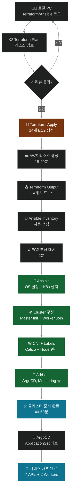

# 🏗️ IaC 구성 (Terraform + Ansible)

> **목적**: 14-Node 클러스터 자동 배포 (Self-Managed Kubernetes)  
> **도구**: Terraform (AWS 인프라) + Ansible (Kubernetes 설정)  
> **업데이트**: 2025-11-12  
> **상태**: ✅ 프로덕션 완료 (14-Node Architecture)

**자동 배포**: `./scripts/cluster/auto-rebuild.sh` (40-60분)

---

## 🎯 IaC 전략

### Terraform vs Ansible 역할 분리 (14-Node Architecture)

```mermaid
%%{init: {'theme':'dark', 'themeVariables': { 'primaryColor':'#1a1a1a', 'primaryTextColor':'#fff', 'primaryBorderColor':'#444', 'lineColor':'#888', 'secondaryColor':'#2d2d2d', 'tertiaryColor':'#1a1a1a'}}}%%
graph TB
    subgraph Terraform["🏗️ Terraform (Layer 0: Infrastructure)"]
        TF1["AWS 리소스 생성<br/>14 EC2 Instances"]
        TF2["VPC + Subnets<br/>Public/Private"]
        TF3["Security Groups<br/>Master/Worker/ALB"]
        TF4["Route53 + ACM<br/>*.growbin.app"]
        TF5["CloudFront + S3<br/>CDN"]
        TF6["IAM Roles<br/>ALB Controller, EBS CSI"]
        TF7["State 관리<br/>S3 Backend"]
    end
    
    subgraph Ansible["⚙️ Ansible (Layer 1: Cluster Configuration)"]
        AN1["OS 설정<br/>containerd, 커널 튜닝"]
        AN2["Kubernetes 설치<br/>kubeadm, kubelet, kubectl"]
        AN3["Master Init<br/>kubeadm init"]
        AN4["Worker Join<br/>13개 노드 Join"]
        AN5["CNI 설치<br/>Calico Network Policy"]
        AN6["Node 관리<br/>Labels + Taints"]
        AN7["Add-ons 배포<br/>ArgoCD, Cert-Manager, ALB Controller"]
        AN8["Monitoring<br/>Prometheus + Grafana"]
    end
    
    TF1 --> TF2
    TF2 --> TF3
    TF3 --> TF4
    TF4 --> TF5
    TF5 --> TF6
    TF6 --> TF7
    
    TF7 -->|Ansible Inventory<br/>14개 노드 IP| AN1
    AN1 --> AN2
    AN2 --> AN3
    AN3 --> AN4
    AN4 --> AN5
    AN5 --> AN6
    AN6 --> AN7
    AN7 --> AN8
    
    style Terraform fill:#78350f,stroke:#fff,stroke-width:3px,color:#fff
    style Ansible fill:#166534,stroke:#fff,stroke-width:3px,color:#fff
    
    style TF1 fill:#334155,stroke:#64748b,stroke-width:2px,color:#fff
    style TF2 fill:#334155,stroke:#64748b,stroke-width:2px,color:#fff
    style TF3 fill:#334155,stroke:#64748b,stroke-width:2px,color:#fff
    style TF4 fill:#334155,stroke:#64748b,stroke-width:2px,color:#fff
    style TF5 fill:#334155,stroke:#64748b,stroke-width:2px,color:#fff
    style TF6 fill:#334155,stroke:#64748b,stroke-width:2px,color:#fff
    style TF7 fill:#334155,stroke:#64748b,stroke-width:2px,color:#fff
    
    style AN1 fill:#334155,stroke:#64748b,stroke-width:2px,color:#fff
    style AN2 fill:#334155,stroke:#64748b,stroke-width:2px,color:#fff
    style AN3 fill:#334155,stroke:#64748b,stroke-width:2px,color:#fff
    style AN4 fill:#334155,stroke:#64748b,stroke-width:2px,color:#fff
    style AN5 fill:#334155,stroke:#64748b,stroke-width:2px,color:#fff
    style AN6 fill:#334155,stroke:#64748b,stroke-width:2px,color:#fff
    style AN7 fill:#334155,stroke:#64748b,stroke-width:2px,color:#fff
    style AN8 fill:#334155,stroke:#64748b,stroke-width:2px,color:#fff
```



### 책임 분리

| 도구 | 역할 | 관리 대상 | 상태 관리 |
|------|------|----------|----------|
| **Terraform** | 인프라 프로비저닝 | EC2 (14개), VPC, SG, EBS, ALB, Route53, CloudFront, S3 | tfstate (S3) |
| **Ansible** | 설정 관리 | OS 설정, K8s 설치 (kubeadm), CNI (Calico), Node Labels, Add-ons | Idempotent Playbook |

### 상세 역할 구분

#### Terraform의 책임 (Layer 0: Infrastructure)

**✅ 관리 대상**:
- VPC, Subnet (Public/Private), Internet Gateway, Route Tables
- Security Groups (Master, Worker, ALB, Database 등)
- EC2 Instances (14개):
  - Master Node: 1개 (t3.large, 2 vCPU, 8GB)
  - API Nodes: 7개 (auth, my, scan, character, location, info, chat)
  - Worker Nodes: 2개 (storage, ai)
  - Infra Nodes: 4개 (postgresql, redis, rabbitmq, monitoring)
- IAM Roles & Policies (ALB Controller, EBS CSI Driver)
- Route53 DNS Records (*.growbin.app)
- ACM Certificate (SSL/TLS)
- CloudFront Distribution (CDN)
- S3 Buckets (이미지 저장소, Terraform State)

**❌ 관리하지 않는 것**:
- Kubernetes 클러스터 초기화 (kubeadm init/join)
- CNI 플러그인 설치 (Calico)
- Node 레이블링 및 Taints
- Kubernetes 애드온 (ArgoCD, Cert-Manager, Monitoring)
- 애플리케이션 배포 (Deployment, Service, ConfigMap)

#### Ansible의 책임 (Layer 1: Cluster Configuration)

**✅ 관리 대상**:
- OS 초기 설정 (패키지, 커널 튜닝, Swap 비활성화, 방화벽)
- Container Runtime 설치 (containerd)
- Kubernetes 설치 (kubeadm, kubelet, kubectl)
- 클러스터 초기화 (kubeadm init/join)
- CNI 설치 (Calico Network Policy)
- Node 관리 (Labels, Taints, Provider ID)
- Kubernetes 인프라 컴포넌트:
  - Cert-Manager, AWS Load Balancer Controller, EBS CSI Driver
  - Metrics Server, Ingress 리소스
  - Prometheus & Grafana, Atlantis, ArgoCD

**❌ 관리하지 않는 것**:
- AWS 인프라 생성/삭제 (EC2, VPC 등)
- 애플리케이션 빌드/테스트 (GitHub Actions)
- Microservices 배포 (ArgoCD + Kustomize)

---

## 🔧 Terraform 구성

### 관리 대상 리소스 (14-Node Architecture)

```
Terraform으로 생성:
├─ VPC & Subnets (Public/Private)
├─ Internet Gateway + NAT Gateway
├─ Route Tables
├─ Security Groups (Master, Worker, ALB, Database)
│
├─ EC2 Instances (14개)
│  ├─ Master Node × 1 (t3.large, 2 vCPU, 8GB)
│  ├─ API Nodes × 7: auth, my, scan, character, location, info, chat
│  ├─ Worker Nodes × 2: storage, ai
│  └─ Infra Nodes × 4: postgresql, redis, rabbitmq, monitoring
│
├─ EBS Volumes (각 30GB GP3, 암호화)
├─ IAM Roles (ALB Controller, EBS CSI Driver)
├─ Route53 Records (*.growbin.app, argocd, atlantis, grafana)
├─ ACM Certificate (*.growbin.app)
├─ CloudFront Distribution (CDN)
├─ S3 Buckets (이미지 저장소, Terraform State)
└─ SSH Key Pair (sesacthon.pem)

총 리소스: 약 60개
실행 시간: 15-20분
총 비용: 시간당 약 $1.20 (월 $864)
```

### 실행 명령어

```bash
# 1. 초기화
cd terraform
terraform init

# 2. 계획 확인 (14-Node 생성 확인)
terraform plan -out=tfplan

# 3. 적용 (약 15-20분 소요)
terraform apply tfplan

# 4. Ansible Inventory 자동 생성
terraform output -raw ansible_inventory > ../ansible/inventory/hosts.ini
```

---

## 🤖 Ansible 구성

### Ansible Inventory (14-Node)

```ini
# ansible/inventory/hosts.ini
[all:vars]
ansible_user=ubuntu
ansible_ssh_private_key_file=~/.ssh/sesacthon.pem

[masters]
k8s-master ansible_host=<IP> private_ip=<PRIVATE_IP>

[api_nodes]
auth-api ansible_host=<IP> domain=auth phase=1 tier=api
my-api ansible_host=<IP> domain=my phase=1 tier=api
scan-api ansible_host=<IP> domain=scan phase=1 tier=api
character-api ansible_host=<IP> domain=character phase=2 tier=api
location-api ansible_host=<IP> domain=location phase=2 tier=api
info-api ansible_host=<IP> domain=info phase=3 tier=api
chat-api ansible_host=<IP> domain=chat phase=3 tier=api

[workers]
storage-worker ansible_host=<IP> domain=storage tier=worker
ai-worker ansible_host=<IP> domain=ai tier=worker

[infra_nodes]
postgres-node ansible_host=<IP> domain=postgresql tier=infra
redis-node ansible_host=<IP> domain=redis tier=infra
rabbitmq-node ansible_host=<IP> domain=rabbitmq tier=infra
monitoring-node ansible_host=<IP> domain=monitoring tier=infra

[k8s_cluster:children]
masters
api_nodes
workers
infra_nodes
```

### Ansible Playbook 단계

```yaml
# ansible/site.yml
1. OS 설정 (00-prerequisites.yml)
2. Kubernetes 설치 (01-k8s-install.yml)
3. Master 초기화 (02-master-init.yml)
4. Worker Join (03-worker-join.yml) - 13개 노드
5. Provider ID 주입 (03-1-set-provider-id.yml)
6. CNI 설치 (04-cni-install.yml) - Calico
7. Add-ons (05-addons.yml)
8. Node 라벨링 (label-nodes.yml) - domain, phase, tier
9. Cert-Manager (06-cert-manager-issuer.yml) - ACM 인증서 사용
10. ALB Controller (07-alb-controller.yml)
11. Monitoring (10-monitoring.yml) - Prometheus + Grafana
12. Atlantis (16-atlantis.yml)
13. ArgoCD (17-argocd.yml)
```

### 실행 명령어

```bash
# 1. EC2 부팅 대기
sleep 120

# 2. Ping 테스트 (14개 노드)
cd ansible
ansible all -i inventory/hosts.ini -m ping

# 3. 전체 플레이북 실행 (약 30-40분)
ansible-playbook -i inventory/hosts.ini site.yml

# 4. 클러스터 상태 확인
ssh ubuntu@$(cd ../terraform && terraform output -raw master_public_ip)
kubectl get nodes
# 14개 노드 모두 Ready 상태 확인
```

---

## 🔄 배포 프로세스

### 전체 흐름 (14-Node)



---

## 🚀 자동 배포 (원 커맨드)

```bash
# 모든 단계를 한 번에 실행 (40-60분)
./scripts/cluster/auto-rebuild.sh

# 이 스크립트는 다음을 자동 수행:
# 1. Terraform destroy (선택)
# 2. Terraform apply (14-Node 생성, 15-20분)
# 3. Ansible site.yml (클러스터 구성, 25-40분)
# 4. ArgoCD ApplicationSet 배포
# 5. 상태 검증 (14개 노드, Applications)
```

---

## 📊 리소스 요약

```
14-Node Kubernetes Cluster
├─ Master Node: 1개 (t3.large, 2 vCPU, 8GB RAM)
├─ API Nodes: 7개 (auth, my, scan, character, location, info, chat)
├─ Worker Nodes: 2개 (storage, ai)
└─ Infra Nodes: 4개 (postgresql, redis, rabbitmq, monitoring)

총 vCPU: 30개
총 Memory: 22GB
월 예상 비용: ~$864 (시간당 $1.20)
배포 소요 시간: 40-60분
```

---

## 💡 IaC의 이점

### 1. 재현 가능성
- ✅ 동일한 환경을 언제든 재생성
- ✅ dev, staging, prod 환경 일관성
- ✅ 재해 복구 시 빠른 복구 (1시간 이내)

### 2. 버전 관리
- ✅ Git으로 인프라 변경 이력 추적
- ✅ 특정 시점으로 롤백 가능
- ✅ PR을 통한 인프라 코드 리뷰

### 3. 협업
- ✅ 코드만 보면 인프라 구조 이해 가능
- ✅ 자동화된 테스트 (terraform plan)
- ✅ 팀원 간 일관된 환경

### 4. 비용 관리
- ✅ terraform destroy로 즉시 삭제
- ✅ 필요할 때만 terraform apply
- ✅ 비용 예측 가능 (terraform plan)

---

## ⚠️ 주의사항

### Terraform State 관리

```bash
# S3 Backend 사용 (필수!)
terraform {
  backend "s3" {
    bucket = "sesacthon-terraform-state"
    key = "k8s-cluster/terraform.tfstate"
    region = "ap-northeast-2"
    dynamodb_table = "terraform-lock"  # State Lock
    encrypt = true
  }
}

# .gitignore에 추가 (State 파일 커밋 금지)
terraform.tfstate
terraform.tfstate.backup
.terraform/
```

### Sensitive 정보 보호

```bash
# 환경 변수 사용
export TF_VAR_db_password="secret"

# Ansible Vault 사용
ansible-vault encrypt group_vars/all.yml
ansible-playbook site.yml --ask-vault-pass
```

---

## 📚 참고 자료

### 관련 문서
- [GitOps Pipeline Diagram](../architecture/GITOPS_PIPELINE_DIAGRAM.md) - Mermaid 다이어그램
- [GitOps Architecture](../deployment/GITOPS_ARCHITECTURE.md) - 도구별 역할 구분
- [Service Architecture](../architecture/03-SERVICE_ARCHITECTURE.md) - 14-Node 상세 아키텍처
- [Auto Rebuild Guide](../deployment/AUTO_REBUILD_GUIDE.md) - 자동 배포 가이드

### 공식 문서
- [Terraform AWS Provider](https://registry.terraform.io/providers/hashicorp/aws/latest/docs)
- [Ansible Best Practices](https://docs.ansible.com/ansible/latest/user_guide/playbooks_best_practices.html)
- [Kubeadm Installation](https://kubernetes.io/docs/setup/production-environment/tools/kubeadm/)
- [Calico CNI Documentation](https://docs.tigera.io/calico/latest/about/)

---

**작성일**: 2025-10-30  
**최종 업데이트**: 2025-11-12  
**상태**: ✅ 프로덕션 완료 (14-Node Architecture)  
**예상 구축 시간**: 40-60분 (Terraform 15-20분 + Ansible 25-40분)

---

## 🔑 핵심 요약

### Terraform과 Ansible의 명확한 역할 분리
- **Terraform (Layer 0)**: AWS 인프라 생성/삭제 (EC2, VPC, IAM 등)
- **Ansible (Layer 1)**: Kubernetes 클러스터 설정 (kubeadm, CNI, Labels 등)

### 14-Node 마이크로서비스 아키텍처
- Master 1개 + API 7개 + Worker 2개 + Infra 4개
- 도메인별 전용 노드 격리 (Taints & Tolerations)
- Phase별 배포 순서 제어 (Wave 1-3)

### GitOps 완전 자동화
```bash
./scripts/cluster/auto-rebuild.sh  # 원 커맨드 배포
```

### 비용 효율성
- 월 예상 비용: ~$864
- terraform destroy로 즉시 삭제 가능
- 개발 완료 후 비용 절감
