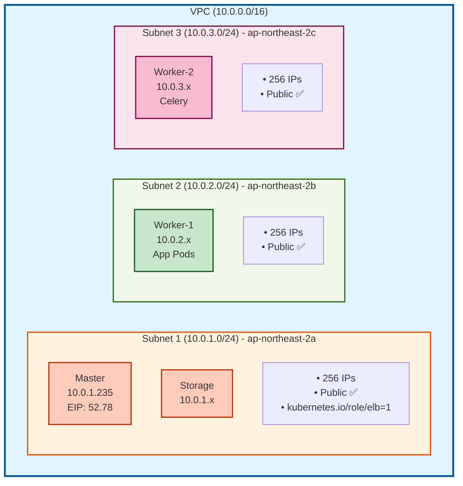
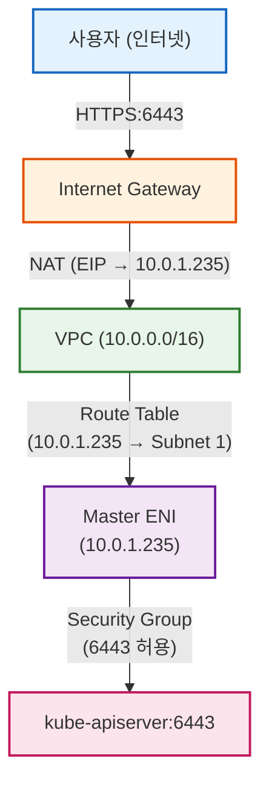
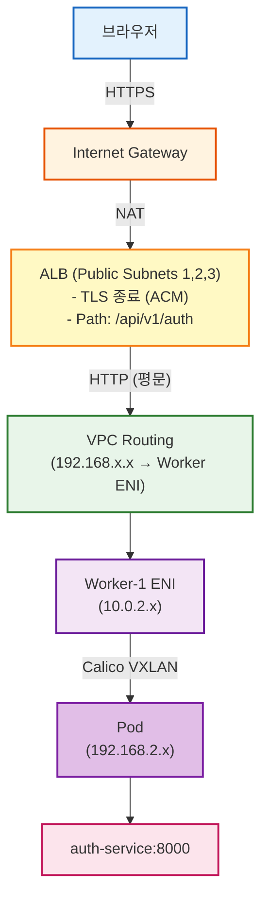
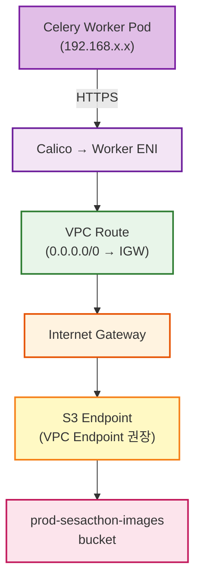
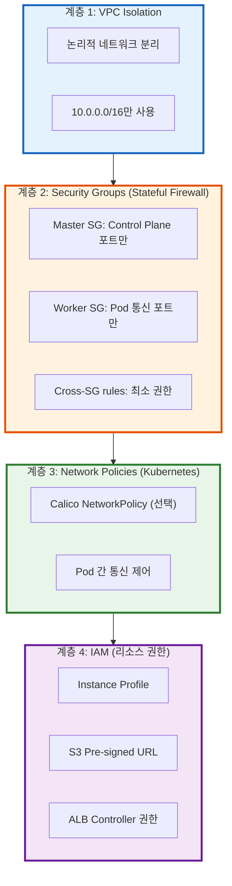

# 🌐 VPC 네트워크 설계

> **4-Tier Kubernetes 클러스터용 네트워크 구성**  
> **날짜**: 2025-10-31

## 📋 목차

1. [VPC 개요](#vpc-개요)
2. [Subnets 설계](#subnets-설계)
3. [Security Groups](#security-groups)
4. [라우팅 테이블](#라우팅-테이블)
5. [네트워크 흐름](#네트워크-흐름)

---

## 🏗️ VPC 개요

### 기본 정보

```
VPC CIDR: 10.0.0.0/16
Region: ap-northeast-2 (Seoul)
Availability Zones: 3개 (a, b, c)
DNS Hostnames: Enabled
DNS Support: Enabled

사용 가능 IP: 65,536개
실제 사용: ~500개
여유: 충분 ✅
```

### VPC Tags

```yaml
Name: prod-k8s-vpc
Project: SeSACTHON
ManagedBy: Terraform
kubernetes.io/cluster/prod-sesacthon: shared
```

**kubernetes.io/cluster 태그**: ALB Controller가 VPC 자동 인식

---

## 🗺️ Subnets 설계

### 3개 Public Subnets (Private 없음)



### 왜 Public Subnet만?

```
장점:
✅ NAT Gateway 불필요 ($96/월 절감)
✅ 직접 인터넷 접속 (빠름)
✅ 관리 단순

보안:
✅ Security Group으로 제어
✅ 필요한 포트만 개방
✅ Pod IP는 Private (192.168.x.x)

적합:
- 소규모 클러스터 (4 nodes)
- MVP, 개발 환경
- 비용 최적화
```

---

## 🔒 Security Groups

### Master Security Group

```yaml
Name: prod-k8s-master-sg
Applies to: Master 노드만

Inbound Rules:
━━━━━━━━━━━━━━━━━━━━━━━━━━━━━━━━━━━━━━━━
# Internet Access
- SSH (22/TCP):           YOUR_IP → Master
- K8s API (6443/TCP):     0.0.0.0/0 → Master
- HTTP (80/TCP):          0.0.0.0/0 → Master (리디렉션)
- HTTPS (443/TCP):        0.0.0.0/0 → Master
- NodePort (30000-32767): 0.0.0.0/0 → Master

# Control Plane (Self)
- etcd (2379-2380/TCP):         Master → Master
- Kubelet (10250/TCP):          Master → Master
- Scheduler (10259/TCP):        Master → Master
- Controller-Mgr (10257/TCP):   Master → Master
- VXLAN (4789/UDP):             Master → Master

# From Workers
- K8s API (6443/TCP):      Worker SG → Master
- Kubelet (10250-10252):   Worker SG → Master
- VXLAN (4789/UDP):        Worker SG → Master

Outbound:
- All traffic to 0.0.0.0/0
```

### Worker Security Group

```yaml
Name: prod-k8s-worker-sg
Applies to: Worker-1, Worker-2, Storage

Inbound Rules:
━━━━━━━━━━━━━━━━━━━━━━━━━━━━━━━━━━━━━━━━
# Internet Access
- SSH (22/TCP):       YOUR_IP → Worker

# Worker 간 통신 (Self)
- All traffic:        Worker → Worker
- VXLAN (4789/UDP):   Worker → Worker
- kube-proxy (10256): Worker → Worker

# From Master
- Kubelet (10250/TCP):      Master SG → Worker
- NodePort (30000-32767):   Master SG → Worker
- All traffic:              Master SG → Worker
- VXLAN (4789/UDP):         Master SG → Worker

Outbound:
- All traffic to 0.0.0.0/0
```

---

## 🔄 라우팅 테이블

### Public Route Table

```
Name: prod-public-rt
Associated Subnets: Subnet 1, 2, 3 (모두)

Routes:
━━━━━━━━━━━━━━━━━━━━━━━━━━━━━━━━━━━━━━━━
Destination         Target              설명
━━━━━━━━━━━━━━━━━━━━━━━━━━━━━━━━━━━━━━━━
10.0.0.0/16        local               VPC 내부 통신
0.0.0.0/0          igw-xxx             인터넷 (양방향)

Pod CIDR (Calico):
192.168.0.0/16     Worker ENIs         Pod 통신
  ├─ 192.168.0.0/24   → Master
  ├─ 192.168.1.0/24   → Storage
  ├─ 192.168.2.0/24   → Worker-1
  └─ 192.168.x.x/24   → Worker-2

Note: Pod CIDR은 Calico가 관리, VPC Route 불필요
      (VXLAN Overlay)
```

---

## 🌐 네트워크 흐름

### 외부 → Master (Kubernetes API)



### ALB → Pod (Application Traffic)



### Pod → S3 (이미지 다운로드)



---

## 🔐 보안 계층



---

## 💰 비용 최적화

```
Public Subnet만 사용:
- NAT Gateway 없음: -$96/월
- 데이터 전송 무료 (IGW)
- 총 절감: $96/월

대신:
✅ Security Group으로 보안
✅ 적은 노드 수 (4개)
✅ Pod IP는 Private 유지
```

---

## 📚 참고 문서

- [AWS VPC Best Practices](https://docs.aws.amazon.com/vpc/latest/userguide/vpc-security-best-practices.html)
- [Kubernetes Networking](https://kubernetes.io/docs/concepts/cluster-administration/networking/)
- [Calico VXLAN](https://docs.tigera.io/calico/latest/networking/configuring/vxlan-ipip)

---

**작성일**: 2025-10-31  
**버전**: 2.0 (4-Tier cluster)

