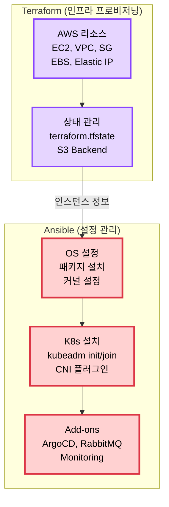
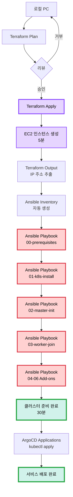

# 🏗️ IaC 구성 (Terraform + Ansible)

> **목적**: 4-Node 클러스터 자동 배포  
> **도구**: Terraform (AWS 인프라) + Ansible (Kubernetes 설정)  
> **날짜**: 2025-10-31  
> **상태**: ✅ 프로덕션 완료 (75개 커밋)

**자동 배포**: `./scripts/auto-rebuild.sh` (40-50분)

## 📋 목차

1. [IaC 전략](#iac-전략)
2. [Terraform 구성](#terraform-구성)
3. [Ansible 구성](#ansible-구성)
4. [배포 프로세스](#배포-프로세스)
5. [구현 계획](#구현-계획)

---

## 🎯 IaC 전략

### Terraform vs Ansible 역할 분리



### 책임 분리

| 도구 | 역할 | 관리 대상 | 상태 관리 |
|------|------|----------|----------|
| **Terraform** | 인프라 프로비저닝 | EC2, VPC, SG, EBS, EIP | tfstate (S3) |
| **Ansible** | 설정 관리 | OS 설정, K8s 설치, Add-ons | Idempotent Playbook |

---

## 🔧 Terraform 구성

### 프로젝트 구조

```
terraform/
├── main.tf                    # 메인 설정
├── variables.tf               # 변수 정의
├── outputs.tf                 # 출력 (IP 주소 등)
├── terraform.tfvars          # 변수 값
├── backend.tf                # State Backend (S3)
│
├── modules/
│   ├── vpc/                  # VPC, 서브넷
│   │   ├── main.tf
│   │   ├── variables.tf
│   │   └── outputs.tf
│   │
│   ├── security-groups/      # 보안 그룹
│   │   ├── main.tf
│   │   └── variables.tf
│   │
│   ├── ec2/                  # EC2 인스턴스
│   │   ├── main.tf
│   │   ├── variables.tf
│   │   └── outputs.tf
│   │
│   └── ebs/                  # EBS 볼륨
│       ├── main.tf
│       └── variables.tf
│
└── environments/
    ├── dev/
    │   └── terraform.tfvars
    └── prod/
        └── terraform.tfvars
```

### main.tf 개요

```hcl
# terraform/main.tf
terraform {
  required_version = ">= 1.0"
  
  required_providers {
    aws = {
      source  = "hashicorp/aws"
      version = "~> 5.0"
    }
  }
  
  backend "s3" {
    bucket = "sesacthon-terraform-state"
    key    = "k8s-cluster/terraform.tfstate"
    region = "ap-northeast-2"
  }
}

provider "aws" {
  region = var.aws_region
  
  default_tags {
    tags = {
      Project     = "SeSACTHON"
      ManagedBy   = "Terraform"
      Environment = var.environment
    }
  }
}

# VPC
module "vpc" {
  source = "./modules/vpc"
  
  vpc_cidr = var.vpc_cidr
  environment = var.environment
}

# Security Groups
module "security_groups" {
  source = "./modules/security-groups"
  
  vpc_id = module.vpc.vpc_id
  allowed_ssh_cidr = var.allowed_ssh_cidr
}

# EC2 Instances
module "master" {
  source = "./modules/ec2"
  
  instance_type = "t3.medium"
  instance_name = "k8s-master"
  subnet_id = module.vpc.public_subnet_ids[0]
  security_group_ids = [
    module.security_groups.master_sg_id
  ]
  
  user_data = templatefile("${path.module}/user-data/master.sh", {
    hostname = "k8s-master"
  })
}

module "worker_1" {
  source = "./modules/ec2"
  
  instance_type = "t3.medium"
  instance_name = "k8s-worker-1"
  subnet_id = module.vpc.public_subnet_ids[1]
  security_group_ids = [
    module.security_groups.worker_sg_id
  ]
  
  tags = {
    Workload = "cpu"
  }
}

module "worker_2" {
  source = "./modules/ec2"
  
  instance_type = "t3.small"
  instance_name = "k8s-worker-2"
  subnet_id = module.vpc.public_subnet_ids[2]
  security_group_ids = [
    module.security_groups.worker_sg_id
  ]
  
  tags = {
    Workload = "network"
  }
}
```

### 관리 대상 리소스

```
Terraform으로 생성:
├─ VPC & Subnets (3개 AZ)
├─ Internet Gateway
├─ Route Tables
├─ Security Groups (Master, Worker)
├─ EC2 Instances (Master ×1, Worker ×2)
├─ EBS Volumes (각 30GB)
├─ Elastic IPs (Master용)
└─ Key Pair (SSH 접근)

총 리소스: 약 20개
실행 시간: 5분
```

---

## 🤖 Ansible 구성

### 프로젝트 구조

```
ansible/
├── ansible.cfg               # Ansible 설정
├── inventory/
│   ├── hosts.ini            # 인벤토리 (Terraform 출력)
│   └── group_vars/
│       ├── all.yml          # 공통 변수
│       ├── masters.yml      # Master 변수
│       └── workers.yml      # Worker 변수
│
├── playbooks/
│   ├── 00-prerequisites.yml # OS 설정, Docker 설치
│   ├── 01-k8s-install.yml   # kubeadm, kubelet, kubectl
│   ├── 02-master-init.yml   # kubeadm init
│   ├── 03-worker-join.yml   # kubeadm join
│   ├── 04-cni-install.yml   # Flannel CNI
│   ├── 05-addons.yml        # Ingress, Cert-manager
│   ├── 06-argocd.yml        # ArgoCD 설치
│   ├── 07-rabbitmq.yml      # RabbitMQ 설치
│   └── 08-monitoring.yml    # Prometheus + Grafana
│
├── roles/
│   ├── common/              # 공통 설정
│   ├── docker/              # Docker 설치
│   ├── kubernetes/          # K8s 설치
│   ├── argocd/              # ArgoCD
│   └── rabbitmq/            # RabbitMQ
│
└── site.yml                 # 마스터 플레이북
```

### inventory/hosts.ini

```ini
# ansible/inventory/hosts.ini
[all:vars]
ansible_user=ubuntu
ansible_ssh_private_key_file=~/.ssh/sesacthon.pem
ansible_python_interpreter=/usr/bin/python3

[masters]
k8s-master ansible_host=<MASTER_PUBLIC_IP> private_ip=<MASTER_PRIVATE_IP>

[workers]
k8s-worker-1 ansible_host=<WORKER1_PUBLIC_IP> private_ip=<WORKER1_PRIVATE_IP> workload=cpu instance_type=t3.medium
k8s-worker-2 ansible_host=<WORKER2_PUBLIC_IP> private_ip=<WORKER2_PRIVATE_IP> workload=network instance_type=t3.small

[k8s_cluster:children]
masters
workers
```

### site.yml (마스터 플레이북)

```yaml
# ansible/site.yml
---
- name: Kubernetes Cluster Setup
  hosts: all
  become: yes
  gather_facts: yes
  
  roles:
    - common
    - docker
    - kubernetes

- name: Initialize Master
  hosts: masters
  become: yes
  
  tasks:
    - name: kubeadm init
      command: >
        kubeadm init
        --pod-network-cidr=10.244.0.0/16
        --apiserver-advertise-address={{ private_ip }}
        --node-name={{ inventory_hostname }}
      register: kubeadm_init
      when: not kubeadm_init_done | default(false)
    
    - name: Save join command
      copy:
        content: "{{ kubeadm_init.stdout_lines | select('search', 'kubeadm join') | list }}"
        dest: /tmp/kubeadm_join_command.sh
    
    - name: Setup kubeconfig
      shell: |
        mkdir -p $HOME/.kube
        cp -i /etc/kubernetes/admin.conf $HOME/.kube/config
        chown $(id -u):$(id -g) $HOME/.kube/config

- name: Install CNI
  hosts: masters
  become: yes
  
  tasks:
    - name: Apply Flannel
      command: kubectl apply -f https://github.com/flannel-io/flannel/releases/latest/download/kube-flannel.yml

- name: Join Workers
  hosts: workers
  become: yes
  
  tasks:
    - name: Copy join command
      copy:
        src: /tmp/kubeadm_join_command.sh
        dest: /tmp/join.sh
        mode: '0755'
    
    - name: Join cluster
      command: /tmp/join.sh

- name: Label Workers
  hosts: masters
  
  tasks:
    - name: Label worker-1
      command: kubectl label nodes k8s-worker-1 workload=cpu instance-type=t3.medium
    
    - name: Label worker-2
      command: kubectl label nodes k8s-worker-2 workload=network instance-type=t3.small

- name: Install ArgoCD
  hosts: masters
  
  tasks:
    - name: Create ArgoCD namespace
      command: kubectl create namespace argocd --dry-run=client -o yaml | kubectl apply -f -
    
    - name: Install ArgoCD
      command: kubectl apply -n argocd -f https://raw.githubusercontent.com/argoproj/argo-cd/stable/manifests/install.yaml

- name: Install RabbitMQ
  hosts: masters
  
  tasks:
    - name: Add Bitnami Helm repo
      command: helm repo add bitnami https://charts.bitnami.com/bitnami
    
    - name: Install RabbitMQ
      command: >
        helm install rabbitmq bitnami/rabbitmq
        --namespace messaging
        --create-namespace
        --set auth.username=admin
        --set auth.password=changeme
        --set persistence.enabled=true
        --set persistence.size=10Gi
```

---

## 🔄 배포 프로세스

### 전체 흐름



---

## 📦 Terraform 상세 설계

### 생성할 리소스

```hcl
# terraform/main.tf

# 1. VPC
resource "aws_vpc" "k8s_vpc" {
  cidr_block = "10.0.0.0/16"
  enable_dns_hostnames = true
  enable_dns_support = true
  
  tags = {
    Name = "k8s-vpc"
    "kubernetes.io/cluster/sesacthon" = "shared"
  }
}

# 2. 서브넷 (3개)
resource "aws_subnet" "public" {
  count = 3
  
  vpc_id = aws_vpc.k8s_vpc.id
  cidr_block = "10.0.${count.index + 1}.0/24"
  availability_zone = data.aws_availability_zones.available.names[count.index]
  map_public_ip_on_launch = true
  
  tags = {
    Name = "k8s-public-subnet-${count.index + 1}"
  }
}

# 3. 보안 그룹 - Master
resource "aws_security_group" "master" {
  name = "k8s-master-sg"
  vpc_id = aws_vpc.k8s_vpc.id
  
  # SSH
  ingress {
    from_port = 22
    to_port = 22
    protocol = "tcp"
    cidr_blocks = [var.allowed_ssh_cidr]
    description = "SSH from admin"
  }
  
  # Kubernetes API
  ingress {
    from_port = 6443
    to_port = 6443
    protocol = "tcp"
    cidr_blocks = ["0.0.0.0/0"]
    description = "Kubernetes API"
  }
  
  # HTTP/HTTPS
  ingress {
    from_port = 80
    to_port = 80
    protocol = "tcp"
    cidr_blocks = ["0.0.0.0/0"]
  }
  
  ingress {
    from_port = 443
    to_port = 443
    protocol = "tcp"
    cidr_blocks = ["0.0.0.0/0"]
  }
  
  # etcd
  ingress {
    from_port = 2379
    to_port = 2380
    protocol = "tcp"
    self = true
    description = "etcd"
  }
  
  # Kubelet
  ingress {
    from_port = 10250
    to_port = 10252
    protocol = "tcp"
    security_groups = [aws_security_group.worker.id]
  }
  
  # Egress all
  egress {
    from_port = 0
    to_port = 0
    protocol = "-1"
    cidr_blocks = ["0.0.0.0/0"]
  }
}

# 4. 보안 그룹 - Worker
resource "aws_security_group" "worker" {
  name = "k8s-worker-sg"
  vpc_id = aws_vpc.k8s_vpc.id
  
  # SSH
  ingress {
    from_port = 22
    to_port = 22
    protocol = "tcp"
    cidr_blocks = [var.allowed_ssh_cidr]
  }
  
  # Kubelet
  ingress {
    from_port = 10250
    to_port = 10250
    protocol = "tcp"
    security_groups = [aws_security_group.master.id]
  }
  
  # NodePort
  ingress {
    from_port = 30000
    to_port = 32767
    protocol = "tcp"
    security_groups = [aws_security_group.master.id]
  }
  
  # Worker 간 통신
  ingress {
    from_port = 0
    to_port = 0
    protocol = "-1"
    self = true
  }
  
  egress {
    from_port = 0
    to_port = 0
    protocol = "-1"
    cidr_blocks = ["0.0.0.0/0"]
  }
}

# 5. EC2 Instances
resource "aws_instance" "master" {
  ami = data.aws_ami.ubuntu.id
  instance_type = "t3.medium"
  subnet_id = aws_subnet.public[0].id
  vpc_security_group_ids = [aws_security_group.master.id]
  key_name = aws_key_pair.k8s.key_name
  
  root_block_device {
    volume_size = 30
    volume_type = "gp3"
    encrypted = true
  }
  
  user_data = templatefile("${path.module}/user-data/common.sh", {
    hostname = "k8s-master"
  })
  
  tags = {
    Name = "k8s-master"
    Role = "master"
  }
}

resource "aws_instance" "worker" {
  count = 2
  
  ami = data.aws_ami.ubuntu.id
  instance_type = count.index == 0 ? "t3.medium" : "t3.small"
  subnet_id = aws_subnet.public[count.index + 1].id
  vpc_security_group_ids = [aws_security_group.worker.id]
  key_name = aws_key_pair.k8s.key_name
  
  root_block_device {
    volume_size = 30
    volume_type = "gp3"
    encrypted = true
  }
  
  user_data = templatefile("${path.module}/user-data/common.sh", {
    hostname = "k8s-worker-${count.index + 1}"
  })
  
  tags = {
    Name = "k8s-worker-${count.index + 1}"
    Role = "worker"
    Workload = count.index == 0 ? "cpu" : "network"
  }
}

# 6. Elastic IP (Master)
resource "aws_eip" "master" {
  instance = aws_instance.master.id
  domain = "vpc"
  
  tags = {
    Name = "k8s-master-eip"
  }
}
```

### variables.tf

```hcl
# terraform/variables.tf
variable "aws_region" {
  description = "AWS 리전"
  type = string
  default = "ap-northeast-2"
}

variable "environment" {
  description = "환경 (dev, prod)"
  type = string
  default = "prod"
}

variable "vpc_cidr" {
  description = "VPC CIDR 블록"
  type = string
  default = "10.0.0.0/16"
}

variable "allowed_ssh_cidr" {
  description = "SSH 접근 허용 CIDR"
  type = string
  default = "0.0.0.0/0"  # 프로덕션에서는 특정 IP로 제한
}

variable "cluster_name" {
  description = "K8s 클러스터 이름"
  type = string
  default = "sesacthon"
}
```

### outputs.tf

```hcl
# terraform/outputs.tf
output "master_public_ip" {
  description = "Master 노드 Public IP"
  value = aws_eip.master.public_ip
}

output "master_private_ip" {
  description = "Master 노드 Private IP"
  value = aws_instance.master.private_ip
}

output "worker_public_ips" {
  description = "Worker 노드 Public IPs"
  value = aws_instance.worker[*].public_ip
}

output "worker_private_ips" {
  description = "Worker 노드 Private IPs"
  value = aws_instance.worker[*].private_ip
}

output "ansible_inventory" {
  description = "Ansible Inventory 자동 생성"
  value = templatefile("${path.module}/templates/hosts.tpl", {
    master_public_ip = aws_eip.master.public_ip
    master_private_ip = aws_instance.master.private_ip
    worker_1_public_ip = aws_instance.worker[0].public_ip
    worker_1_private_ip = aws_instance.worker[0].private_ip
    worker_2_public_ip = aws_instance.worker[1].public_ip
    worker_2_private_ip = aws_instance.worker[1].private_ip
  })
}
```

---

## 🤖 Ansible 상세 설계

### Playbook 예시

```yaml
# ansible/playbooks/02-master-init.yml
---
- name: Initialize Kubernetes Master
  hosts: masters
  become: yes
  
  vars:
    pod_network_cidr: "10.244.0.0/16"
  
  tasks:
    - name: Check if cluster is initialized
      stat:
        path: /etc/kubernetes/admin.conf
      register: kubeadm_init_stat
    
    - name: kubeadm init
      command: >
        kubeadm init
        --pod-network-cidr={{ pod_network_cidr }}
        --apiserver-advertise-address={{ private_ip }}
        --node-name={{ inventory_hostname }}
      register: kubeadm_init_output
      when: not kubeadm_init_stat.stat.exists
    
    - name: Create .kube directory
      file:
        path: /home/ubuntu/.kube
        state: directory
        owner: ubuntu
        group: ubuntu
        mode: '0755'
    
    - name: Copy kubeconfig
      copy:
        src: /etc/kubernetes/admin.conf
        dest: /home/ubuntu/.kube/config
        owner: ubuntu
        group: ubuntu
        mode: '0644'
        remote_src: yes
    
    - name: Extract join command
      shell: |
        kubeadm token create --print-join-command
      register: join_command
      when: not kubeadm_init_stat.stat.exists
    
    - name: Save join command
      local_action:
        module: copy
        content: "{{ join_command.stdout }}"
        dest: "/tmp/kubeadm_join_command.sh"
      when: join_command is defined

# ansible/playbooks/06-argocd.yml
---
- name: Install ArgoCD
  hosts: masters
  become: yes
  become_user: ubuntu
  
  tasks:
    - name: Create ArgoCD namespace
      kubernetes.core.k8s:
        name: argocd
        api_version: v1
        kind: Namespace
        state: present
    
    - name: Install ArgoCD
      kubernetes.core.k8s:
        state: present
        src: https://raw.githubusercontent.com/argoproj/argo-cd/stable/manifests/install.yaml
    
    - name: Wait for ArgoCD pods
      kubernetes.core.k8s_info:
        kind: Pod
        namespace: argocd
        label_selectors:
          - app.kubernetes.io/name=argocd-server
      register: argocd_pods
      until: argocd_pods.resources[0].status.phase == "Running"
      retries: 30
      delay: 10

# ansible/playbooks/07-rabbitmq.yml
---
- name: Install RabbitMQ
  hosts: masters
  become: yes
  become_user: ubuntu
  
  tasks:
    - name: Add Bitnami Helm repo
      kubernetes.core.helm_repository:
        name: bitnami
        repo_url: https://charts.bitnami.com/bitnami
    
    - name: Create messaging namespace
      kubernetes.core.k8s:
        name: messaging
        api_version: v1
        kind: Namespace
        state: present
    
    - name: Install RabbitMQ via Helm
      kubernetes.core.helm:
        name: rabbitmq
        chart_ref: bitnami/rabbitmq
        release_namespace: messaging
        values:
          auth:
            username: admin
            password: "{{ rabbitmq_password }}"
          persistence:
            enabled: true
            size: 10Gi
          resources:
            requests:
              cpu: 200m
              memory: 256Mi
            limits:
              cpu: 500m
              memory: 512Mi
          nodeSelector:
            kubernetes.io/hostname: k8s-master
```

---

## 🚀 실행 명령어

### Terraform

```bash
# 1. 초기화
cd terraform
terraform init

# 2. 계획 확인
terraform plan -out=tfplan

# 3. 적용
terraform apply tfplan

# 4. 출력 확인
terraform output

# 5. Ansible Inventory 자동 생성
terraform output -raw ansible_inventory > ../ansible/inventory/hosts.ini
```

### Ansible

```bash
# 1. Ping 테스트
cd ansible
ansible all -i inventory/hosts.ini -m ping

# 2. 전체 플레이북 실행
ansible-playbook -i inventory/hosts.ini site.yml

# 또는 단계별 실행
ansible-playbook -i inventory/hosts.ini playbooks/00-prerequisites.yml
ansible-playbook -i inventory/hosts.ini playbooks/01-k8s-install.yml
ansible-playbook -i inventory/hosts.ini playbooks/02-master-init.yml
ansible-playbook -i inventory/hosts.ini playbooks/03-worker-join.yml
ansible-playbook -i inventory/hosts.ini playbooks/04-cni-install.yml
ansible-playbook -i inventory/hosts.ini playbooks/05-addons.yml
ansible-playbook -i inventory/hosts.ini playbooks/06-argocd.yml
ansible-playbook -i inventory/hosts.ini playbooks/07-rabbitmq.yml
ansible-playbook -i inventory/hosts.ini playbooks/08-monitoring.yml

# 3. 클러스터 확인
ssh ubuntu@$(terraform output -raw master_public_ip)
kubectl get nodes
```

---

## 💡 IaC의 이점

### 1. 재현 가능성

```
한 번 작성하면:
✅ 동일한 환경을 언제든 재생성
✅ dev, staging, prod 환경 일관성
✅ 재해 복구 시 빠른 복구 (1시간)
```

### 2. 버전 관리

```
terraform/ 폴더 전체를 Git에:
✅ 인프라 변경 이력 추적
✅ 특정 시점으로 롤백
✅ 코드 리뷰 (인프라도!)
```

### 3. 협업

```
팀원들이:
✅ Terraform 코드만 보면 인프라 이해
✅ PR로 인프라 변경 제안
✅ 자동화된 테스트 (terraform plan)
```

### 4. 비용 관리

```
terraform destroy:
✅ 개발 완료 후 인프라 삭제 (비용 절감)
✅ 필요할 때만 terraform apply
✅ 비용 예측 (terraform plan)
```

---

## ⚠️ 주의사항

### Terraform State 관리

```bash
# S3 Backend 사용 (필수!)
# terraform/backend.tf
terraform {
  backend "s3" {
    bucket = "sesacthon-terraform-state"
    key = "k8s-cluster/terraform.tfstate"
    region = "ap-northeast-2"
    
    # State Lock (DynamoDB)
    dynamodb_table = "terraform-lock"
    encrypt = true
  }
}

# State는 절대 Git에 커밋 금지!
# .gitignore에 추가:
terraform.tfstate
terraform.tfstate.backup
.terraform/
```

### Sensitive 정보

```bash
# 민감 정보는 변수로
# terraform.tfvars (Git 무시)
rabbitmq_password = "super-secret-password"
db_password = "another-secret"

# 또는 환경변수
export TF_VAR_rabbitmq_password="secret"

# Ansible Vault 사용
ansible-vault encrypt group_vars/all.yml
ansible-playbook site.yml --ask-vault-pass
```

---

## 📋 구현 체크리스트

### Terraform

- [ ] VPC 모듈 작성
- [ ] 보안 그룹 모듈
- [ ] EC2 모듈
- [ ] S3 Backend 설정
- [ ] variables.tf 정의
- [ ] outputs.tf 정의
- [ ] user-data 스크립트

### Ansible

- [ ] inventory 템플릿
- [ ] common role (OS 설정)
- [ ] docker role (Docker 설치)
- [ ] kubernetes role (kubeadm 설치)
- [ ] master-init playbook
- [ ] worker-join playbook
- [ ] argocd playbook
- [ ] rabbitmq playbook
- [ ] monitoring playbook

---

## 🎯 최종 구조

```
backend/
├── terraform/               # 인프라 코드
│   ├── main.tf
│   ├── variables.tf
│   ├── outputs.tf
│   ├── modules/
│   └── environments/
│
├── ansible/                 # 설정 코드
│   ├── ansible.cfg
│   ├── inventory/
│   ├── playbooks/
│   ├── roles/
│   └── site.yml
│
├── docs/
│   └── architecture/
│       └── iac-terraform-ansible.md  # 이 문서
│
└── scripts/
    ├── provision.sh         # 전체 자동화 스크립트
    └── destroy.sh           # 인프라 삭제
```

---

## 🚀 One-command 배포

```bash
# scripts/provision.sh
#!/bin/bash
set -e

echo "🚀 K8s 클러스터 프로비저닝 시작..."

# 1. Terraform
cd terraform
terraform init
terraform apply -auto-approve
terraform output -raw ansible_inventory > ../ansible/inventory/hosts.ini

# 2. Ansible (2분 대기 후)
sleep 120  # EC2 완전히 부팅 대기
cd ../ansible
ansible-playbook -i inventory/hosts.ini site.yml

# 3. ArgoCD Applications
sleep 60
ssh ubuntu@$(cd ../terraform && terraform output -raw master_public_ip) \
  "kubectl apply -f /tmp/argocd-applications.yaml"

echo "✅ 클러스터 프로비저닝 완료!"
echo "Master IP: $(cd terraform && terraform output -raw master_public_ip)"
echo "ArgoCD: https://argocd.yourdomain.com"
```

---

## 📚 참고 자료

- [Terraform AWS Provider](https://registry.terraform.io/providers/hashicorp/aws/latest/docs)
- [Ansible Kubernetes Module](https://docs.ansible.com/ansible/latest/collections/kubernetes/core/index.html)
- [Terraform Best Practices](https://www.terraform-best-practices.com/)

---

**작성일**: 2025-10-30  
**상태**: 🔄 검토 대기  
**예상 구축 시간**: Terraform (5분) + Ansible (30분) = 35분

