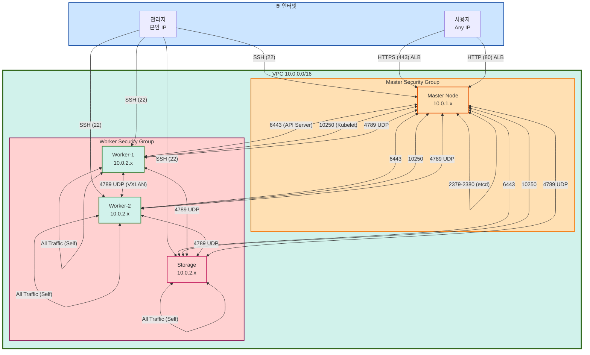

# 🚀 K8s 클러스터 구축 가이드 (4-Node)

> **구성**: 1 Master + 3 Workers (App + Async + Storage)  
> **도구**: Kubernetes (kubeadm) + Calico VXLAN  
> **날짜**: 2025-10-31  
> **상태**: ✅ 프로덕션 준비 완료

⚠️ **이 문서는 수동 설치 가이드입니다.**  
**자동 배포는 [Ansible](iac-terraform-ansible.md)을 사용하세요!**

## 📋 목차

1. [클러스터 사양](#클러스터-사양)
2. [인프라 구성](#인프라-구성)
3. [설치 가이드](#설치-가이드)
4. [서비스 배포](#서비스-배포)
5. [운영 가이드](#운영-가이드)

---

## 🏗️ 클러스터 사양

### 4-Node 구성 (Instagram + Robin 패턴)

```mermaid
graph TB
    subgraph K8s["Kubernetes Cluster (4-Node)"]
        Master[Master<br/>t3.large<br/>2 vCPU, 8GB, 80GB<br/>$60/월<br/><br/>Control Plane:<br/>- kube-apiserver<br/>- etcd<br/>- scheduler<br/>- controller<br/><br/>Monitoring:<br/>- Prometheus<br/>- Grafana]
        
        Worker1[Worker-1<br/>t3.medium<br/>2 vCPU, 4GB, 40GB<br/>$30/월<br/><br/>Application:<br/>- auth-service<br/>- users-service<br/>- locations-service<br/>(FastAPI / Sync)]
        
        Worker2[Worker-2<br/>t3.medium<br/>2 vCPU, 4GB, 40GB<br/>$30/월<br/><br/>Async Workers:<br/>- celery-ai-worker<br/>- celery-batch-worker<br/>(GPT-4o Vision)]
        
        Storage[Storage<br/>t3.large<br/>2 vCPU, 8GB, 100GB<br/>$60/월<br/><br/>Stateful:<br/>- RabbitMQ HA<br/>- PostgreSQL<br/>- Redis]
    end
    
    Master -.->|manage| Worker1
    Master -.->|manage| Worker2
    Master -.->|manage| Storage
    Worker1 -->|publish| Storage
    Worker2 -->|consume| Storage
    
    style Master fill:#cce5ff,stroke:#0d47a1,stroke-width:3px
    style Worker1 fill:#d1f2eb,stroke:#33691e,stroke-width:2px
    style Worker2 fill:#ffe0b3,stroke:#f57f17,stroke-width:2px
    style Storage fill:#ffd1d1,stroke:#880e4f,stroke-width:3px
    
    subgraph Services["서비스 분산"]
        Heavy[Heavy Workload<br/>waste, recycling]
        Light[Light Workload<br/>auth, users, locations]
    end
    
    Users --> Master
    Master -.->|orchestrate| Worker1
    Master -.->|orchestrate| Worker2
    
    Worker1 --> Heavy
    Worker2 --> Light
    
    style Master fill:#ffd1d1,stroke:#dc3545,stroke-width:4px,color:#000
    style Worker1 fill:#ffe0b3,stroke:#fd7e14,stroke-width:3px,color:#000
    style Worker2 fill:#d1f2eb,stroke:#28a745,stroke-width:3px,color:#000
```

### 비용 계산

```
=== 컴퓨팅 ===
Master (t3.medium): $30/월
Worker 1 (t3.medium): $30/월
Worker 2 (t3.small): $15/월
소계: $75/월

=== 스토리지 ===
EBS gp3 (30GB × 3): $2/월 × 3 = $6/월

=== 네트워크 ===
데이터 전송 (100GB): $9/월

=== 레지스트리 ===
ECR (또는 Docker Hub $0): $1/월

─────────────────────────────
총: $91/월
─────────────────────────────

최적화 옵션 (선택):
├─ Worker 2를 Spot으로: $15 → $4.5 (절감 $10.5)
├─ Docker Hub 사용: $1 → $0 (절감 $1)
└─ 최적화 후: $79.5/월

vs Docker Compose: $60/월
차이: $19.5-31/월 (1.3-1.5배)

→ K8s 생태계를 월 $20 추가로!
```

---

## 🖥️ 인프라 구성

### AWS EC2 인스턴스 스펙

```yaml
# terraform 또는 AWS Console 설정

Master Node:
  instance_type: t3.medium
  ami: ubuntu-22.04
  vpc_security_group:
    - SSH (22): 본인 IP만
    - K8s API (6443): Worker IPs
    - HTTP/HTTPS (80, 443): 0.0.0.0/0
    - Kubernetes (10250, 10251, 10252): Worker IPs
  ebs:
    size: 30GB
    type: gp3
  tags:
    Name: sesacthon-k8s-master
    Role: master

Worker Node 1:
  instance_type: t3.medium
  ami: ubuntu-22.04
  vpc_security_group:
    - SSH (22): 본인 IP
    - Kubelet (10250): Master IP
    - NodePort (30000-32767): Master IP
  ebs:
    size: 30GB
    type: gp3
  tags:
    Name: sesacthon-k8s-worker-1
    Role: worker
    Workload: heavy

Worker Node 2:
  instance_type: t3.small
  ami: ubuntu-22.04
  vpc_security_group:
    - SSH (22): 본인 IP
    - Kubelet (10250): Master IP
    - NodePort (30000-32767): Master IP
  ebs:
    size: 20GB
    type: gp3
  tags:
    Name: sesacthon-k8s-worker-2
    Role: worker
    Workload: light
```

### 네트워크 설정

#### VPC 구성

```
VPC: 10.0.0.0/16
├─ Public Subnet A: 10.0.1.0/24 (ap-northeast-2a)
├─ Public Subnet B: 10.0.2.0/24 (ap-northeast-2b)
└─ Public Subnet C: 10.0.3.0/24 (ap-northeast-2c)

Internet Gateway: igw-xxxxx
Route Table: 0.0.0.0/0 → IGW
```

#### 보안 그룹 (Security Groups)



#### Master Security Group 상세

| 방향 | 프로토콜 | 포트 | 소스 | 목적 |
|------|---------|------|------|------|
| Inbound | TCP | 22 | 본인 IP | SSH 접속 |
| Inbound | TCP | 6443 | 0.0.0.0/0 | Kubernetes API Server |
| Inbound | TCP | 2379-2380 | Self | etcd server client API |
| Inbound | TCP | 10250 | Worker SG | Kubelet API |
| Inbound | TCP | 10251 | Self | kube-scheduler |
| Inbound | TCP | 10252 | Self | kube-controller-manager |
| Inbound | TCP | 80 | ALB SG | HTTP (Ingress) |
| Inbound | TCP | 443 | ALB SG | HTTPS (Ingress) |
| Inbound | UDP | 4789 | Master SG, Worker SG | Calico VXLAN |
| Outbound | All | All | 0.0.0.0/0 | 모든 아웃바운드 |

#### Worker Security Group 상세

| 방향 | 프로토콜 | 포트 | 소스 | 목적 |
|------|---------|------|------|------|
| Inbound | TCP | 22 | 본인 IP | SSH 접속 |
| Inbound | TCP | 10250 | Master SG | Kubelet API |
| Inbound | TCP | 30000-32767 | Master SG | NodePort Services |
| Inbound | All | All | Worker SG (Self) | Pod 간 통신 |
| Inbound | UDP | 4789 | Master SG, Worker SG | Calico VXLAN |
| Outbound | All | All | 0.0.0.0/0 | 모든 아웃바운드 |

---

## ⚡ 설치 가이드

### Phase 1: EC2 인스턴스 준비 (30분)

```bash
# ===== 3개 인스턴스 모두 실행 =====

# 1. 시스템 업데이트
sudo apt update && sudo apt upgrade -y

# 2. 필수 패키지 설치
sudo apt install -y curl wget git

# 3. 호스트명 설정
# Master
sudo hostnamectl set-hostname k8s-master

# Worker 1
sudo hostnamectl set-hostname k8s-worker-1

# Worker 2
sudo hostnamectl set-hostname k8s-worker-2

# 4. /etc/hosts 업데이트 (모든 노드)
cat <<EOF | sudo tee -a /etc/hosts
<MASTER_IP>   k8s-master
<WORKER1_IP>  k8s-worker-1
<WORKER2_IP>  k8s-worker-2
EOF

# 5. 방화벽 비활성화 (선택적, 보안그룹 사용 시)
sudo ufw disable
```

### Phase 2: Kubernetes Master 설치 (1시간)

```bash
# ===== Master Node에서 실행 =====

# 1. Docker 설치
sudo apt-get update
sudo apt-get install -y apt-transport-https ca-certificates curl
curl -fsSL https://get.docker.com -o get-docker.sh
sudo sh get-docker.sh
sudo usermod -aG docker $USER

# 2. kubeadm, kubelet, kubectl 설치
sudo mkdir -p /etc/apt/keyrings
curl -fsSL https://pkgs.k8s.io/core:/stable:/v1.28/deb/Release.key | \
  sudo gpg --dearmor -o /etc/apt/keyrings/kubernetes-apt-keyring.gpg

echo 'deb [signed-by=/etc/apt/keyrings/kubernetes-apt-keyring.gpg] https://pkgs.k8s.io/core:/stable:/v1.28/deb/ /' | \
  sudo tee /etc/apt/sources.list.d/kubernetes.list

sudo apt-get update
sudo apt-get install -y kubelet kubeadm kubectl
sudo apt-mark hold kubelet kubeadm kubectl

# 3. 스왑 비활성화 (필수)
sudo swapoff -a
sudo sed -i '/ swap / s/^/#/' /etc/fstab

# 4. 커널 모듈 로드
sudo modprobe overlay
sudo modprobe br_netfilter

cat <<EOF | sudo tee /etc/modules-load.d/k8s.conf
overlay
br_netfilter
EOF

# 5. sysctl 설정
cat <<EOF | sudo tee /etc/sysctl.d/k8s.conf
net.bridge.bridge-nf-call-iptables  = 1
net.bridge.bridge-nf-call-ip6tables = 1
net.ipv4.ip_forward                 = 1
EOF

sudo sysctl --system

# 6. kubeadm init (클러스터 초기화)
sudo kubeadm init \
  --pod-network-cidr=192.168.0.0/16 \
  --apiserver-advertise-address=<MASTER_PRIVATE_IP> \
  --node-name=k8s-master

# pod-network-cidr: Calico 기본값 (192.168.0.0/16)

# 출력된 kubeadm join 명령어 저장!
# kubeadm join <MASTER_IP>:6443 --token <TOKEN> \
#   --discovery-token-ca-cert-hash sha256:<HASH>

# 7. kubeconfig 설정
mkdir -p $HOME/.kube
sudo cp -i /etc/kubernetes/admin.conf $HOME/.kube/config
sudo chown $(id -u):$(id -g) $HOME/.kube/config

# 8. CNI 플러그인 설치 (Calico - 안정적)
kubectl apply -f \
  https://raw.githubusercontent.com/projectcalico/calico/v3.26.4/manifests/calico.yaml

# Calico 선택 이유:
# - Flannel보다 안정적
# - 프로덕션 검증됨
# - 네트워크 정책 지원
# - 대규모 클러스터 최적화

# 9. Master Taint 제거 (Master에도 Pod 배치하려면, 선택)
# kubectl taint nodes k8s-master node-role.kubernetes.io/control-plane:NoSchedule-

# 10. 설치 확인
kubectl get nodes
# NAME         STATUS   ROLES           AGE   VERSION
# k8s-master   Ready    control-plane   2m    v1.28.4

# ✅ Master 설치 완료!
```

### Phase 3: Kubernetes Worker 조인 (10분 × 2)

```bash
# ===== Worker Node 1, 2에서 각각 실행 =====

# 1. Docker 설치 (Master와 동일)
curl -fsSL https://get.docker.com -o get-docker.sh
sudo sh get-docker.sh

# 2. kubeadm, kubelet, kubectl 설치 (Master와 동일)
sudo mkdir -p /etc/apt/keyrings
curl -fsSL https://pkgs.k8s.io/core:/stable:/v1.28/deb/Release.key | \
  sudo gpg --dearmor -o /etc/apt/keyrings/kubernetes-apt-keyring.gpg

echo 'deb [signed-by=/etc/apt/keyrings/kubernetes-apt-keyring.gpg] https://pkgs.k8s.io/core:/stable:/v1.28/deb/ /' | \
  sudo tee /etc/apt/sources.list.d/kubernetes.list

sudo apt-get update
sudo apt-get install -y kubelet kubeadm kubectl
sudo apt-mark hold kubelet kubeadm kubectl

# 3. 스왑 비활성화
sudo swapoff -a
sudo sed -i '/ swap / s/^/#/' /etc/fstab

# 4. 커널 모듈 & sysctl (Master와 동일)
sudo modprobe overlay
sudo modprobe br_netfilter

cat <<EOF | sudo tee /etc/sysctl.d/k8s.conf
net.bridge.bridge-nf-call-iptables  = 1
net.bridge.bridge-nf-call-ip6tables = 1
net.ipv4.ip_forward                 = 1
EOF

sudo sysctl --system

# 5. Master에서 복사한 kubeadm join 명령어 실행
sudo kubeadm join <MASTER_IP>:6443 \
  --token <TOKEN> \
  --discovery-token-ca-cert-hash sha256:<HASH>

# Worker 1 레이블 추가
# (Master에서 실행)
kubectl label nodes k8s-worker-1 workload=cpu
kubectl label nodes k8s-worker-1 instance-type=t3.medium

# Worker 2 레이블 추가
kubectl label nodes k8s-worker-2 workload=network
kubectl label nodes k8s-worker-2 instance-type=t3.small

# ===== Master에서 확인 =====
kubectl get nodes
# NAME           STATUS   ROLES           AGE   VERSION
# k8s-master     Ready    control-plane   10m   v1.28.4
# k8s-worker-1   Ready    <none>          5m    v1.28.4
# k8s-worker-2   Ready    <none>          3m    v1.28.4

# Label 확인
kubectl get nodes --show-labels

# ✅ 클러스터 구축 완료! (총 1.5시간)
```

### Phase 4: 필수 Add-ons 설치 (1시간)

```bash
# ===== 1. AWS Load Balancer Controller (15분) =====

# Helm 설치
curl https://raw.githubusercontent.com/helm/helm/main/scripts/get-helm-3 | bash

# CRDs 설치
kubectl apply -k "github.com/aws/eks-charts/stable/aws-load-balancer-controller/crds?ref=master"

# Helm repo 추가
helm repo add eks https://aws.github.io/eks-charts
helm repo update

# ALB Controller 설치
helm install aws-load-balancer-controller eks/aws-load-balancer-controller \
  -n kube-system \
  --set clusterName=prod-sesacthon \
  --set region=ap-northeast-2 \
  --set vpcId=vpc-xxxxx

# ALB Controller Pod 대기
kubectl wait --for=condition=ready pod \
  -l app.kubernetes.io/name=aws-load-balancer-controller \
  -n kube-system \
  --timeout=300s

# ===== 2. Cert-manager (Certificate 관리, 10분) =====
kubectl apply -f https://github.com/cert-manager/cert-manager/releases/download/v1.13.0/cert-manager.yaml

# ===== 3. ACM Certificate (AWS Console에서 미리 생성) =====
# AWS Console → Certificate Manager
# 1. Request certificate
# 2. Domain: *.growbin.app
# 3. Validation: DNS (Route53)
# 4. ARN 메모: arn:aws:acm:ap-northeast-2:xxxxx:certificate/xxxxx
#
# cert-manager는 Certificate 리소스 관리용으로만 사용

# ===== 3. Metrics Server (HPA용, 5분) =====
kubectl apply -f https://github.com/kubernetes-sigs/metrics-server/releases/latest/download/components.yaml

# ===== 4. ArgoCD (GitOps, 15분) =====
kubectl create namespace argocd
kubectl apply -n argocd -f \
  https://raw.githubusercontent.com/argoproj/argo-cd/stable/manifests/install.yaml

# ArgoCD Ingress 설정
cat <<EOF | kubectl apply -f -
apiVersion: networking.k8s.io/v1
kind: Ingress
metadata:
  name: argocd-server-ingress
  namespace: argocd
  annotations:
    kubernetes.io/ingress.class: alb
    alb.ingress.kubernetes.io/scheme: internet-facing
    alb.ingress.kubernetes.io/target-type: ip
    alb.ingress.kubernetes.io/certificate-arn: arn:aws:acm:ap-northeast-2:xxxxx:certificate/xxxxx
    alb.ingress.kubernetes.io/backend-protocol: HTTPS
spec:
  rules:
  - host: growbin.app
    http:
      paths:
      - path: /argocd
        pathType: Prefix
        backend:
          service:
            name: argocd-server
            port:
              number: 443
EOF

# ArgoCD 초기 비밀번호
kubectl -n argocd get secret argocd-initial-admin-secret \
  -o jsonpath="{.data.password}" | base64 -d && echo

# ===== 5. Prometheus + Grafana (20분, 선택) =====
helm repo add prometheus-community https://prometheus-community.github.io/helm-charts
helm repo update

helm install prometheus prometheus-community/kube-prometheus-stack \
  --namespace monitoring \
  --create-namespace \
  --set prometheus.prometheusSpec.retention=7d \
  --set grafana.adminPassword=admin123

# Grafana Ingress
cat <<EOF | kubectl apply -f -
apiVersion: networking.k8s.io/v1
kind: Ingress
metadata:
  name: grafana-ingress
  namespace: monitoring
  annotations:
    kubernetes.io/ingress.class: alb
    alb.ingress.kubernetes.io/scheme: internet-facing
    alb.ingress.kubernetes.io/target-type: ip
    alb.ingress.kubernetes.io/certificate-arn: arn:aws:acm:ap-northeast-2:xxxxx:certificate/xxxxx
    alb.ingress.kubernetes.io/group.name: growbin-alb
spec:
  rules:
  - host: growbin.app
    http:
      paths:
      - path: /grafana
        pathType: Prefix
        backend:
          service:
            name: prometheus-grafana
            port:
              number: 80
EOF

# ✅ Add-ons 설치 완료!
```

---

## 📦 서비스 배포

### Helm Charts 구조

```
charts/
├── auth/
│   ├── Chart.yaml
│   ├── values.yaml
│   ├── values-dev.yaml
│   ├── values-prod.yaml
│   └── templates/
│       ├── deployment.yaml
│       ├── service.yaml
│       ├── hpa.yaml              # Auto Scaling
│       ├── configmap.yaml
│       └── secret.yaml
│
├── users/
├── waste/
│   ├── Chart.yaml
│   ├── values.yaml
│   └── templates/
│       ├── deployment.yaml       # API Server
│       ├── worker-deployment.yaml  # Celery Worker
│       ├── service.yaml
│       ├── hpa.yaml
│       └── pdb.yaml              # Pod Disruption Budget
│
├── recycling/
└── locations/
```

### 예시: Waste Service Helm Chart

```yaml
# charts/waste/Chart.yaml
apiVersion: v2
name: waste-service
description: AI 기반 쓰레기 분류 서비스
version: 1.0.0
appVersion: 1.0.0

# charts/waste/values.yaml
replicaCount: 2  # Worker 1에 배포

image:
  repository: 123456789.dkr.ecr.ap-northeast-2.amazonaws.com/waste-service
  tag: latest
  pullPolicy: Always

service:
  type: ClusterIP
  port: 80
  targetPort: 8000

ingress:
  enabled: true
  annotations:
    kubernetes.io/ingress.class: alb
    alb.ingress.kubernetes.io/scheme: internet-facing
    alb.ingress.kubernetes.io/target-type: ip
    alb.ingress.kubernetes.io/certificate-arn: arn:aws:acm:ap-northeast-2:xxxxx:certificate/xxxxx
    alb.ingress.kubernetes.io/group.name: growbin-alb
  hosts:
    - host: growbin.app
      paths:
        - path: /api/v1/waste
          pathType: Prefix

# Node Affinity (Worker 1에만 배포)
nodeSelector:
  workload: heavy

resources:
  requests:
    cpu: 200m
    memory: 256Mi
  limits:
    cpu: 1000m
    memory: 1Gi

autoscaling:
  enabled: true
  minReplicas: 2
  maxReplicas: 5
  targetCPUUtilizationPercentage: 70

env:
  - name: DATABASE_URL
    valueFrom:
      secretKeyRef:
        name: waste-secrets
        key: database-url
  - name: REDIS_URL
    value: "redis://redis-service:6379/1"
  - name: AI_VISION_API_URL
    valueFrom:
      configMapKeyRef:
        name: waste-config
        key: ai-vision-url

# Celery Worker
worker:
  enabled: true
  replicaCount: 3
  resources:
    requests:
      cpu: 500m
      memory: 512Mi
    limits:
      cpu: 2000m
      memory: 2Gi
```

### Deployment 템플릿

```yaml
# charts/waste/templates/deployment.yaml
apiVersion: apps/v1
kind: Deployment
metadata:
  name: {{ include "waste-service.fullname" . }}
  labels:
    {{- include "waste-service.labels" . | nindent 4 }}
spec:
  replicas: {{ .Values.replicaCount }}
  selector:
    matchLabels:
      {{- include "waste-service.selectorLabels" . | nindent 6 }}
  strategy:
    type: RollingUpdate
    rollingUpdate:
      maxSurge: 1
      maxUnavailable: 0  # 무중단 배포
  template:
    metadata:
      labels:
        {{- include "waste-service.selectorLabels" . | nindent 8 }}
    spec:
      {{- with .Values.nodeSelector }}
      nodeSelector:
        {{- toYaml . | nindent 8 }}
      {{- end }}
      containers:
      - name: {{ .Chart.Name }}
        image: "{{ .Values.image.repository }}:{{ .Values.image.tag }}"
        imagePullPolicy: {{ .Values.image.pullPolicy }}
        ports:
        - name: http
          containerPort: 8000
          protocol: TCP
        env:
        {{- toYaml .Values.env | nindent 8 }}
        livenessProbe:
          httpGet:
            path: /health
            port: http
          initialDelaySeconds: 30
          periodSeconds: 10
        readinessProbe:
          httpGet:
            path: /health
            port: http
          initialDelaySeconds: 10
          periodSeconds: 5
        resources:
          {{- toYaml .Values.resources | nindent 12 }}
```

### ArgoCD Application

```yaml
# argocd/applications/waste.yaml
apiVersion: argoproj.io/v1alpha1
kind: Application
metadata:
  name: waste-service
  namespace: argocd
spec:
  project: default
  
  source:
    repoURL: https://github.com/your-org/sesacthon-backend
    targetRevision: main
    path: charts/waste
    helm:
      valueFiles:
        - values-prod.yaml
  
  destination:
    server: https://kubernetes.default.svc
    namespace: waste
  
  syncPolicy:
    automated:
      prune: true
      selfHeal: true
      allowEmpty: false
    syncOptions:
      - CreateNamespace=true
    retry:
      limit: 5
      backoff:
        duration: 5s
        factor: 2
        maxDuration: 3m

---
apiVersion: argoproj.io/v1alpha1
kind: Application
metadata:
  name: auth-service
  namespace: argocd
spec:
  project: default
  source:
    repoURL: https://github.com/your-org/sesacthon-backend
    targetRevision: main
    path: charts/auth
  destination:
    server: https://kubernetes.default.svc
    namespace: auth
  syncPolicy:
    automated:
      prune: true
      selfHeal: true

# 다른 서비스들도 동일 패턴
```

---

## 🔧 서비스 배포 예시

### 1. Helm으로 직접 배포

```bash
# Waste Service 배포
helm install waste charts/waste \
  --namespace waste \
  --create-namespace \
  --values charts/waste/values-prod.yaml

# 배포 확인
kubectl get pods -n waste
kubectl get svc -n waste
kubectl get ingress -n waste

# 로그 확인
kubectl logs -n waste -l app=waste-service -f
```

### 2. ArgoCD로 GitOps 배포 (권장)

```bash
# ArgoCD Application 등록
kubectl apply -f argocd/applications/

# ArgoCD UI에서 확인
# https://argocd.yourdomain.com

# CLI로 동기화
argocd app sync waste-service

# 자동 동기화 활성화 (권장)
argocd app set waste-service --sync-policy automated
```

---

## 🎯 Pod 배치 전략

### Node Affinity 설정

```yaml
# Heavy Workload → Worker 1 (t3.medium)
nodeSelector:
  workload: heavy

# Light Workload → Worker 2 (t3.small)
nodeSelector:
  workload: light

# 또는 더 정교한 Affinity
affinity:
  nodeAffinity:
    preferredDuringSchedulingIgnoredDuringExecution:
    - weight: 100
      preference:
        matchExpressions:
        - key: workload
          operator: In
          values:
          - heavy
```

### 예상 Pod 배치

```
Master Node (k8s-master):
├─ Control Plane (k3s 자체)
├─ ArgoCD (3 pods)
├─ Ingress Controller (1 pod)
├─ Cert-manager (1 pod)
└─ Metrics Server (1 pod)

Worker 1 (k8s-worker-1, t3.medium):
├─ waste-service (2 pods)
├─ waste-worker (3 pods)  ← Celery
├─ recycling-service (2 pods)
└─ Prometheus (선택)

Worker 2 (k8s-worker-2, t3.small):
├─ auth-service (2 pods)
├─ users-service (1 pod)
└─ locations-service (1 pod)
```

---

## 🔍 운영 가이드

### 기본 명령어

```bash
# 노드 상태 확인
kubectl get nodes -o wide

# 모든 Pod 확인
kubectl get pods -A

# 서비스별 Pod
kubectl get pods -n waste
kubectl get pods -n auth

# 로그 확인
kubectl logs -n waste -l app=waste-service -f

# Pod 내부 접속
kubectl exec -it -n waste <pod-name> -- bash

# 리소스 사용량
kubectl top nodes
kubectl top pods -A

# Ingress 확인
kubectl get ingress -A
```

### 배포 업데이트

```bash
# 방법 1: Helm Upgrade
helm upgrade waste charts/waste \
  --namespace waste \
  --values charts/waste/values-prod.yaml

# 방법 2: ArgoCD Sync (GitOps)
# Git에 Helm values만 업데이트하면 자동 배포!
git add charts/waste/values-prod.yaml
git commit -m "chore: Update waste image to v1.2.3"
git push

# ArgoCD가 3분 이내 자동 감지 & 배포

# 방법 3: 이미지만 변경
kubectl set image deployment/waste-service \
  waste-service=new-image:v1.2.3 \
  -n waste

# Rolling Update 진행 상황
kubectl rollout status deployment/waste-service -n waste
```

### 롤백

```bash
# Helm 롤백
helm rollback waste 1 -n waste

# Kubectl 롤백
kubectl rollout undo deployment/waste-service -n waste

# 특정 리비전으로
kubectl rollout undo deployment/waste-service \
  --to-revision=2 -n waste

# ArgoCD 롤백
argocd app rollback waste-service
```

### 스케일링

```bash
# 수동 스케일
kubectl scale deployment waste-service \
  --replicas=5 -n waste

# HPA 확인
kubectl get hpa -n waste

# HPA 수정
kubectl edit hpa waste-service -n waste
```

---

## 📊 리소스 할당 계획

### Master Node (t3.medium)

```
총 리소스:
├─ CPU: 2 cores
└─ Memory: 4GB

사용:
├─ k3s Control Plane: 0.5 CPU, 1GB
├─ ArgoCD: 0.2 CPU, 0.5GB
├─ Ingress: 0.1 CPU, 0.3GB
├─ Cert-manager: 0.1 CPU, 0.2GB
├─ Metrics Server: 0.05 CPU, 0.1GB
└─ 여유: 1.05 CPU, 1.9GB

→ 충분함! ✅
```

### Worker 1 (t3.medium, Heavy)

```
총 리소스:
├─ CPU: 2 cores
└─ Memory: 4GB

계획:
├─ waste-service × 2: 0.4 CPU, 0.5GB
├─ waste-worker × 3: 1.5 CPU, 1.5GB
├─ recycling-service × 2: 0.4 CPU, 0.5GB
└─ 여유: -0.3 CPU, 1.5GB

→ CPU 부족 예상!

해결:
1. waste-worker를 2개로 줄임
2. HPA로 Worker 1도 스케일 아웃
3. Spot Instance 추가 (t3.medium, $9/월)
```

### Worker 2 (t3.small, Light)

```
총 리소스:
├─ CPU: 2 cores
└─ Memory: 2GB

계획:
├─ auth-service × 2: 0.4 CPU, 0.5GB
├─ users-service × 1: 0.2 CPU, 0.3GB
├─ locations-service × 1: 0.2 CPU, 0.3GB
└─ 여유: 1.2 CPU, 0.9GB

→ 충분함! ✅
```

---

## ⚠️ non-HA 구성 주의사항

### Single Point of Failure

```
Master Node 장애 시:
❌ 전체 클러스터 다운
❌ 새 Pod 스케줄링 불가
❌ API Server 접근 불가

하지만:
✅ 기존 Pod는 계속 실행됨
✅ 서비스 자체는 작동 (일시적)
✅ Master 재시작하면 복구

대응:
1. Master 정기 스냅샷 (일 1회)
2. 백업 스크립트 준비
3. 빠른 복구 절차 문서화
```

### 백업 전략

```bash
# 1. etcd 백업 (Kubernetes)
# etcd는 /var/lib/etcd에 저장됨

# 백업 스크립트
cat <<'EOF' > /usr/local/bin/etcd-backup.sh
#!/bin/bash
DATE=$(date +%Y%m%d_%H%M%S)
BACKUP_DIR="/backup/etcd"

mkdir -p $BACKUP_DIR

# etcdctl로 스냅샷 생성
ETCDCTL_API=3 etcdctl snapshot save $BACKUP_DIR/snapshot-$DATE.db \
  --endpoints=https://127.0.0.1:2379 \
  --cacert=/etc/kubernetes/pki/etcd/ca.crt \
  --cert=/etc/kubernetes/pki/etcd/server.crt \
  --key=/etc/kubernetes/pki/etcd/server.key

# 7일 이상 된 백업 삭제
find $BACKUP_DIR -name "snapshot-*.db" -mtime +7 -delete

echo "Backup completed: snapshot-$DATE.db"
EOF

chmod +x /usr/local/bin/etcd-backup.sh

# Cron 등록 (매일 02:00)
echo "0 2 * * * /usr/local/bin/etcd-backup.sh" | sudo crontab -

# etcd 복구 방법 (장애 시)
# sudo kubeadm reset
# ETCDCTL_API=3 etcdctl snapshot restore /backup/etcd/snapshot-YYYYMMDD.db
# sudo kubeadm init --ignore-preflight-errors=DirAvailable--var-lib-etcd

# 2. PV 데이터 백업
# PostgreSQL, Redis 볼륨
kubectl exec -n default postgres-0 -- \
  pg_dump -U postgres sesacthon > backup-$(date +%Y%m%d).sql
```

---

## 🚀 CI/CD 파이프라인

### GitHub Actions

```yaml
# .github/workflows/k8s-deploy.yml
name: K8s Deploy

on:
  push:
    branches: [main]
    paths:
      - 'services/**'
      - 'charts/**'

jobs:
  deploy:
    runs-on: ubuntu-latest
    
    steps:
      - uses: actions/checkout@v4
      
      - name: AWS 자격증명 설정
        uses: aws-actions/configure-aws-credentials@v4
        with:
          aws-access-key-id: ${{ secrets.AWS_ACCESS_KEY_ID }}
          aws-secret-access-key: ${{ secrets.AWS_SECRET_ACCESS_KEY }}
          aws-region: ap-northeast-2
      
      - name: ECR 로그인
        run: |
          aws ecr get-login-password | docker login \
            --username AWS \
            --password-stdin $ECR_REGISTRY
      
      - name: Docker 빌드 & 푸시
        run: |
          docker build -t waste-service:${{ github.sha }} ./services/waste
          docker tag waste-service:${{ github.sha }} $ECR_REGISTRY/waste:${{ github.sha }}
          docker push $ECR_REGISTRY/waste:${{ github.sha }}
      
      - name: Helm values 업데이트
        run: |
          yq e ".image.tag = \"${{ github.sha }}\"" \
            -i charts/waste/values-prod.yaml
          
          git config user.name "GitHub Actions"
          git config user.email "actions@github.com"
          git add charts/waste/values-prod.yaml
          git commit -m "chore: Update waste to ${{ github.sha }}"
          git push
      
      # ArgoCD가 자동으로 감지하고 배포!
```

---

## 📈 모니터링

### Prometheus + Grafana 대시보드

```bash
# Grafana 접속
# https://grafana.yourdomain.com
# ID: admin, PW: admin123

주요 메트릭:
├─ CPU/Memory 사용률
├─ Pod 상태
├─ Network I/O
├─ API 요청 수
└─ 에러율
```

### ArgoCD 대시보드

```bash
# ArgoCD 접속
# https://argocd.yourdomain.com

확인 사항:
├─ 서비스별 Sync 상태
├─ Health 상태
├─ 최근 배포 이력
└─ Git Diff
```

---

## 🎯 최종 스펙 요약

### 클러스터 구성

```
Master: t3.medium × 1 = $30/월
Worker 1: t3.medium × 1 = $30/월
Worker 2: t3.small × 1 = $15/월
EBS: $6/월
ECR: $1/월
데이터: $9/월
─────────────────────────────
총: $91/월
─────────────────────────────

추가 최적화 (선택):
+ Spot Instance (Worker 1): -$21/월
→ 최종: $70/월
```

### 서비스 배포 계획

```
Namespace: auth
├─ auth-service: 2 replicas
└─ Node: worker-2

Namespace: users  
├─ users-service: 1 replica
└─ Node: worker-2

Namespace: waste
├─ waste-service: 2 replicas
├─ waste-worker: 3 replicas
└─ Node: worker-1

Namespace: recycling
├─ recycling-service: 2 replicas
└─ Node: worker-1

Namespace: locations
├─ locations-service: 1 replica
└─ Node: worker-2
```

---

## ✅ 체크리스트

### 구축 단계

- [ ] AWS EC2 인스턴스 3대 생성
- [ ] 보안 그룹 설정
- [ ] kubeadm Master 초기화
- [ ] Workers 조인 (3개)
- [ ] AWS Load Balancer Controller 설치
- [ ] Cert-manager 설치
- [ ] ArgoCD 설치
- [ ] Prometheus + Grafana (선택)
- [ ] Helm Charts 작성 (5개 서비스)
- [ ] ArgoCD Applications 등록
- [ ] 도메인 연결 & SSL 설정
- [ ] 백업 스크립트 설정

### 검증 단계

- [ ] 모든 노드 Ready 상태
- [ ] 모든 Pod Running 상태
- [ ] Ingress 정상 동작
- [ ] SSL 인증서 발급
- [ ] ArgoCD Sync 정상
- [ ] HPA 동작 확인
- [ ] 부하 테스트
- [ ] 롤백 테스트

---

## 📚 다음 단계

1. [GitOps 파이프라인 설정](gitops-multi-service.md)
2. [서비스별 Helm Chart 작성](../deployment/helm-charts.md)
3. [모니터링 설정](../deployment/monitoring.md)

---

**작성일**: 2025-10-30  
**구성**: 1 Master + 2 Worker + non-HA  
**비용**: $70-91/월  
**상태**: ✅ 최종 확정

