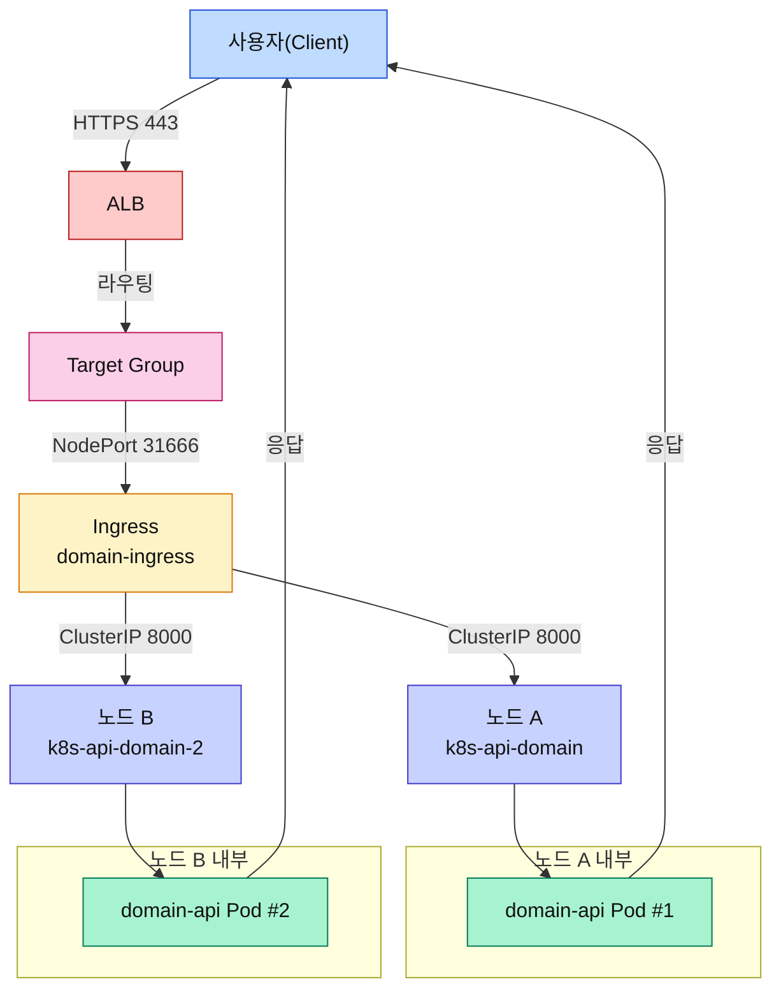

## ALB Controller 구성 흐름

```mermaid
graph TD
    subgraph "Kubernetes Cluster"
        Ingress[["Ingress<br/>domain-ingress"]]:::ing
        Service[["Service & Endpoints<br/>(location-api)"]]:::svc
        subgraph NodesGroup["노드 목록"]
            Node1Box((노드 A<br/>k8s-api-domain)):::node
            Pod1((Pod #1)):::pod
            Pod2((Pod #2)):::pod
            Node2Box((노드 B<br/>k8s-api-domain-2)):::node
            Pod3((Pod #3)):::pod
            Pod4((Pod #4)):::pod
            Node1Box --- Pod1
            Node1Box --- Pod2
            Node2Box --- Pod3
            Node2Box --- Pod4
        end
        ALBCtrl{{"AWS Load Balancer Controller"}}:::ctrl
    end

    subgraph "AWS"
        AWSAPI[(AWS ELB/TargetGroup API)]:::aws
        ALB["ALB (HTTPS Listener)"]:::alb
        TG["Target Group<br/>instance 모드"]:::tg
    end

    Ingress -->|Service 참조| Service
    Service -->|Endpoints 생성| Nodes
    Service -->|Pods 추적| Pods
    Ingress -->|매니페스트 감시| ALBCtrl
    ALBCtrl -->|IAM Role로 API 호출<br/>(Create/Update Listener/Rules/TG)| AWSAPI
    AWSAPI -->|리스너/규칙 생성| ALB
    AWSAPI -->|노드 IP:NodePort 등록| TG
    ALBCtrl -->|상태 확인| AWSAPI

    classDef ing fill:#FEF3C7,stroke:#D97706,color:#111;
    classDef svc fill:#FDE68A,stroke:#B45309,color:#111;
    classDef node fill:#E0E7FF,stroke:#4338CA,color:#111;
    classDef pod fill:#A7F3D0,stroke:#047857,color:#111;
    classDef ctrl fill:#FCD34D,stroke:#B45309,color:#111;
    classDef aws fill:#DBEAFE,stroke:#1D4ED8,color:#111;
    classDef alb fill:#FECACA,stroke:#B91C1C,color:#111;
    classDef tg fill:#FBCFE8,stroke:#BE185D,color:#111;
```

## 실시간 트래픽 경로



