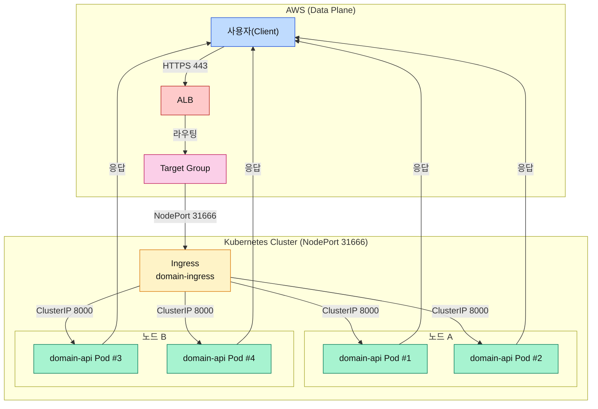

## ALB Controller 구성 흐름

1. **ALB Controller → AWS 연동 설명**  
   Ingress는 `location-api` Service(NodePort 31666)를 통해 파드가 노출되고 있는 노드 IP와 포트 정보를 확인합니다. 이 Endpoints 정보를 AWS Load Balancer Controller가 감지해 Target Group에 노드 IP + NodePort를 등록하고, ALB 리스너/규칙을 생성·업데이트하는 과정을 이 다이어그램 하나로 보여줍니다.

```mermaid
graph TD
    subgraph "Kubernetes Cluster"
        Ingress[["Ingress<br/>domain-ingress"]]:::ing
        Service[["Service & Endpoints<br/>(location-api, NodePort)"]]:::svc
        subgraph NodesGroup["노드 & 파드"]
            Node1Box((노드 A<br/>k8s-api-domain)):::node
            Pod1((domain-api Pod #1)):::pod
            Pod2((domain-api Pod #2)):::pod
            Node2Box((노드 B<br/>k8s-api-domain-2)):::node
            Pod3((domain-api Pod #3)):::pod
            Pod4((domain-api Pod #4)):::pod
            Node1Box --- Pod1
            Node1Box --- Pod2
            Node2Box --- Pod3
            Node2Box --- Pod4
        end
        ALBCtrl{{"AWS Load Balancer Controller"}}:::ctrl
    end

    subgraph "AWS"
        AWSAPI[(AWS ELB/TargetGroup API)]:::aws
        ALB["ALB (HTTPS Listener)"]:::alb
        TG["Target Group<br/>instance 모드"]:::tg
    end

    Ingress -->|Service 참조| Service
    Service -->|Endpoints(NodePort 31666)| NodesGroup
    Ingress -->|매니페스트 감시| ALBCtrl
    ALBCtrl -->|IAM Role로 API 호출<br/>(Create/Update Listener/Rules/TG)| AWSAPI
    AWSAPI -->|리스너/규칙 생성| ALB
    AWSAPI -->|노드 IP:NodePort 등록| TG
    ALBCtrl -->|상태 확인| AWSAPI

    classDef ing fill:#FEF3C7,stroke:#D97706,color:#111;
    classDef svc fill:#FDE68A,stroke:#B45309,color:#111;
    classDef node fill:#E0E7FF,stroke:#4338CA,color:#111;
    classDef pod fill:#A7F3D0,stroke:#047857,color:#111;
    classDef ctrl fill:#FCD34D,stroke:#B45309,color:#111;
    classDef aws fill:#DBEAFE,stroke:#1D4ED8,color:#111;
    classDef alb fill:#FECACA,stroke:#B91C1C,color:#111;
    classDef tg fill:#FBCFE8,stroke:#BE185D,color:#111;
```

## 실시간 트래픽 경로

2. **요청·응답 데이터 경로 설명**  
   실제 데이터 경로는 Client → ALB → Target Group → NodePort 31666 → 각 노드 내부 파드 순서로 흐르며, 파드의 응답이 같은 경로를 거꾸로 타고 돌아오는 모습을 이 그림에서 볼 수 있습니다.



