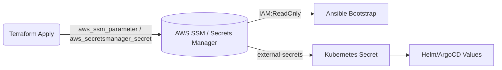

# Terraform Output Secret Injection Strategy

> **목적**: Terraform이 생성하는 인프라 식별자(VPC ID, Subnet ID, Security Group ID 등)를 깃 저장소에 노출하지 않고, Secret Store로 전달하여 Kubernetes/Ansible/Helm 단계에서 안전하게 주입하는 절차를 정의한다.  
> **대상 환경**: AWS (SSM Parameter Store · Secrets Manager), ArgoCD GitOps 파이프라인, Ansible 부트스트랩

---

## 1. 요구사항 & 범위

| 값 유형 | 예시 | 사용처 | 보안 요구 |
|---------|------|--------|-----------|
| 네트워크 ID | `vpc_id`, `private_subnet_ids`, `public_subnet_ids` | AWS Load Balancer Controller, ExternalDNS | 낮은 민감도지만 Git 노출 금지 |
| 보안 그룹/Role | `alb_security_group_id`, `worker_security_group_id`, `iam_role_arn` | Helm values (`aws-load-balancer-controller`, `external-dns`) | 중간 |
| 서비스 엔드포인트 | `rds_endpoint`, `elasticache_primary_endpoint` | 애플리케이션 Secret | 중간~높음 |
| 인증 토큰/키 | `cluster_autoscaler_access_key`, `github_token` | CI/CD | 높음 (별도 Vault 관리) |

본 전략은 **식별자/엔드포인트** 수준 값을 Secret Store로 이동하는 데 집중하며, 자격 증명은 기존 Vault/SSM Secure String 정책을 따른다.

---

## 2. 아키텍처 개요



1. **Terraform Outputs → Secret Store**  
   - `terraform apply` 단계에서 필요한 Output을 JSON으로만 노출하고, 동시에 SSM Parameter Store(또는 Secrets Manager)에 저장한다.
2. **Ansible/Helm 주입**  
   - 부트스트랩 단계는 `aws ssm get-parameter` CLI 또는 `community.aws.ssm_parameter_store` 모듈을 통해 값을 읽는다.  
   - 클러스터 내에서는 `ExternalSecrets` Operator(또는 `kubectl create secret generic` 자동화)에 의해 Secrets를 생성하고 Helm values에서 참조한다.

---

## 3. Terraform 구성

```hcl
variable "env" {}
locals {
  secret_namespace = "/sesacthon/${var.env}/cluster"
}

resource "aws_ssm_parameter" "vpc_id" {
  name        = "${local.secret_namespace}/network/vpc-id"
  type        = "String"
  value       = module.network.vpc_id
  description = "VPC ID used by ALB Controller"
  tags = {
    managed-by = "terraform"
    scope      = "network"
  }
}

resource "aws_ssm_parameter" "private_subnets" {
  name        = "${local.secret_namespace}/network/private-subnets"
  type        = "StringList"
  value       = join(",", module.network.private_subnet_ids)
}
```

### 권장 사항
1. **네이밍 규칙**: `/{project}/{env}/{domain}/{key}` (예: `/sesacthon/prod/network/vpc-id`)  
2. **KMS 암호화**: 민감한 값은 `aws_ssm_parameter` `type = "SecureString"`과 전용 KMS 키 사용.  
3. **출력 제한**: `output` 블록에는 `sensitive = true`를 설정해 CLI 출력에서 숨긴다.

#### 3.1 Application Credential Parameters
- `/sesacthon/{env}/data/postgres-password`
- `/sesacthon/{env}/data/redis-password`
- `/sesacthon/{env}/data/rabbitmq-password`
- `/sesacthon/{env}/platform/grafana-admin-password`
- `/sesacthon/{env}/platform/argocd-admin-password`

위 항목은 `aws_ssm_parameter` SecureString으로 저장되고, Wave 11 `ExternalSecret`이 각각 `postgresql-secret`, `redis-secret`, `rabbitmq-default-user`, `grafana-admin`, `argocd-admin-secret`으로 동기화한다.

---

## 4. 소비(Consumption) 전략

### 4.1 Ansible (부트스트랩)

```yaml
- name: Fetch VPC ID from SSM
  community.aws.aws_ssm_parameter_store:
    name: "/sesacthon/{{ env }}/network/vpc-id"
    decrypt: false
  register: vpc_param

- set_fact:
    alb_vpc_id: "{{ vpc_param.value }}"
```

해당 값을 Helm 설치 역할(`aws-load-balancer-controller`)에서 `--set cluster.vpcId={{ alb_vpc_id }}` 형식으로 전달한다.

### 4.2 Kubernetes / ArgoCD

1. **External Secrets Operator 사용**

```yaml
apiVersion: external-secrets.io/v1beta1
kind: ExternalSecret
metadata:
  name: alb-config
  namespace: kube-system
spec:
  refreshInterval: 1h
  secretStoreRef:
    kind: ClusterSecretStore
    name: ssm-store
  target:
    name: alb-controller-values
  data:
    - secretKey: vpcId
      remoteRef:
        key: "/sesacthon/prod/network/vpc-id"
```

2. **Helm Values 참조**

```yaml
aws-load-balancer-controller:
  extraArgs:
    vpc-id: "{{ .Values.secrets.vpcId }}"
```

ExternalSecrets가 `alb-controller-values` Secret을 생성하면 HelmRelease/Kustomize에서 `valuesFrom.secretKeyRef`로 주입한다.

---

## 5. IAM & 보안 정책

| 주체 | 권한 | 설명 |
|------|------|------|
| Terraform IAM Role | `ssm:PutParameter`, `kms:Encrypt` | Secret 생성 전용 |
| Ansible Runner Role | `ssm:GetParameter`, `kms:Decrypt` (read-only) | 부트스트랩 시 값 조회 |
| ExternalSecrets ServiceAccount | `ssm:GetParametersByPath` | Kubernetes에서 Secret 동기화 |
| 개발자 로컬 계정 | 없음 | 로컬에서 직접 Secret을 읽지 않도록 제한 |

또한 모든 Parameter/Secret에는 `managed-by=terraform` 태그를 달아 드리프트 감사를 용이하게 한다.

---

## 6. 운영 절차

1. **신규 리소스 추가**  
   - Terraform에서 Output → SSM Parameter 작성 → `terraform apply`.  
   - GitOps 리포지토리에는 Secret 이름만 Reference.
2. **값 변경**  
   - Terraform 수정 후 `apply` → Parameter 버전 증가.  
   - ExternalSecrets가 1시간 내 자동 동기화 (필요 시 `kubectl delete externalsecret` 재생성).
3. **회수/삭제**  
   - Terraform에서 `lifecycle { prevent_destroy = true }` 설정으로 실수 방지.  
   - 환경 삭제 시 Parameter도 Terraform이 함께 정리.

---

## 7. 향후 과제

1. ExternalSecrets/ClusterSecretStore 배포 (Wave 20 Platform 계층에 포함).  
2. 기존 Helm values(예: `argocd/apps/25-ingress.yaml`)에서 하드코딩된 `vpcId`/`subnetIds` 제거.  
3. Terraform CI 파이프라인에서 `terraform output -json`을 사용해 검증팀이 값 존재 여부만 확인할 수 있게 보고.

---

> 위 전략을 적용하면 VPC ID 등 인프라 식별자를 Git에 노출하지 않고도, Terraform → Secret Store → K8s/Ansible로 일관되게 공급할 수 있다. 다음 단계로 ExternalSecrets 배포와 Helm values 리팩토링을 계획한다.

