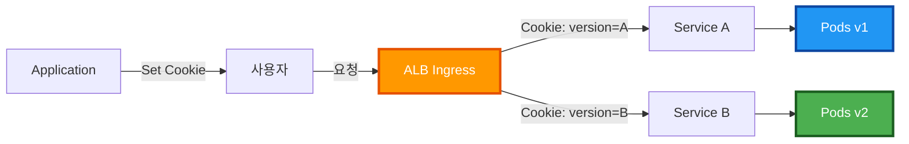
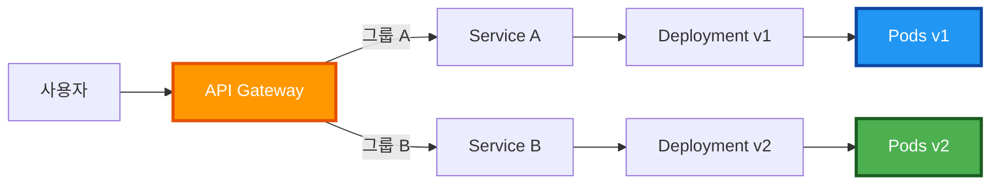
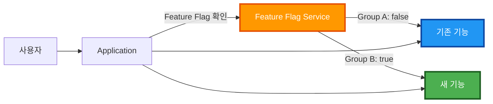

# 🧪 A/B 테스트 전략

**향후 도입 예정 기능**

- **작성일**: 2025-11-05
- **상태**: 📋 계획 단계
- **우선순위**: 중간
- **도입 시기**: Phase 2 이후

---

## 📋 목차

1. [A/B 테스트 개요](#ab-테스트-개요)
2. [현재 아키텍처 구현 방안](#현재-아키텍처-구현-방안)
3. [권장 구현 방법](#권장-구현-방법)
4. [메트릭 수집](#메트릭-수집)
5. [도입 로드맵](#도입-로드맵)

---

## 🎯 A/B 테스트 개요

### A/B 테스트란?

**개념**
- 동일한 시간에 두 개 이상의 버전을 서로 다른 사용자 그룹에게 제공
- 사용자 행동, 전환율, 성과 지표를 비교
- 데이터 기반 의사결정

**비즈니스 가치**
- 기능 효과 정량적 측정
- 사용자 경험 최적화
- 리스크 최소화 (점진적 롤아웃)
- ROI 개선

### Canary 배포와의 차이

| 항목 | Canary 배포 | A/B 테스트 |
|------|-------------|-----------|
| **목적** | 안정적인 배포, 리스크 최소화 | 기능 비교, 성과 측정 |
| **대상** | 랜덤 트래픽 비율 | 특정 사용자 그룹 |
| **기간** | 짧음 (몇 시간) | 길음 (며칠~몇 주) |
| **버전 수** | 2개 (Stable, Canary) | 2개 이상 (A, B, C...) |
| **라우팅** | 트래픽 비율 | 사용자 속성 기반 |
| **종료** | 100% 전환 or 롤백 | 승자 선정 후 적용 |
| **메트릭** | 기술 지표 (에러율, 레이턴시) | 비즈니스 지표 (전환율, 체류시간) |

---

## 🏗️ 현재 아키텍처 구현 방안

**전제 조건**
- Istio Service Mesh 없음
- 기본 Kubernetes + ALB Ingress 구조
- 최소한의 인프라 변경으로 구현

### 방법 1: ALB Ingress + Header/Cookie 기반 라우팅

**개요**
- AWS ALB의 조건부 라우팅 활용
- Header 또는 Cookie 값으로 트래픽 분기
- 애플리케이션에서 사용자 그룹 식별

**아키텍처**



**Ingress 설정**

```yaml
apiVersion: networking.k8s.io/v1
kind: Ingress
metadata:
  name: ab-test-ingress
  annotations:
    kubernetes.io/ingress.class: alb
    alb.ingress.kubernetes.io/scheme: internet-facing
    # Cookie 기반 라우팅
    alb.ingress.kubernetes.io/conditions.version-a: |
      [{"field":"http-header","httpHeaderConfig":{"httpHeaderName":"X-Version","values":["A"]}}]
    alb.ingress.kubernetes.io/conditions.version-b: |
      [{"field":"http-header","httpHeaderConfig":{"httpHeaderName":"X-Version","values":["B"]}}]
spec:
  rules:
    - host: api.example.com
      http:
        paths:
          # Version A
          - path: /*
            pathType: ImplementationSpecific
            backend:
              service:
                name: backend-v1
                port:
                  number: 8000
          # Version B  
          - path: /*
            pathType: ImplementationSpecific
            backend:
              service:
                name: backend-v2
                port:
                  number: 8000
```

**Application 레벨 구현 (FastAPI)**

```python
from fastapi import FastAPI, Request, Response
import hashlib

app = FastAPI()

# A/B 테스트 그룹 할당
def assign_ab_group(user_id: str, split_ratio: int = 50) -> str:
    """사용자 ID 기반으로 A/B 그룹 할당
    
    Args:
        user_id: 사용자 고유 식별자
        split_ratio: A 그룹 비율 (기본 50%)
    
    Returns:
        "A" 또는 "B"
    """
    # 일관성을 위해 해시 사용
    hash_value = int(hashlib.md5(user_id.encode()).hexdigest(), 16) % 100
    return "A" if hash_value < split_ratio else "B"

@app.middleware("http")
async def ab_test_middleware(request: Request, call_next):
    # 사용자 ID 가져오기 (쿠키, JWT 등에서)
    user_id = request.cookies.get("user_id") or request.headers.get("X-User-ID")
    
    if user_id:
        # 기존 그룹 확인 또는 새로 할당
        ab_group = request.cookies.get("ab_group") or assign_ab_group(user_id)
        
        # 응답 생성
        response = await call_next(request)
        
        # 쿠키에 그룹 정보 저장
        response.set_cookie(
            key="ab_group",
            value=ab_group,
            max_age=86400 * 30,  # 30일
            httponly=True,
            secure=True,
            samesite="lax"
        )
        
        # 헤더에도 추가 (디버깅, 라우팅용)
        response.headers["X-AB-Group"] = ab_group
        response.headers["X-Version"] = ab_group
        
        return response
    
    return await call_next(request)

@app.get("/api/feature")
async def get_feature(request: Request):
    ab_group = request.cookies.get("ab_group", "A")
    
    if ab_group == "B":
        # B 그룹용 새 기능
        return {
            "feature": "new_design",
            "group": "B",
            "description": "새로운 UI 디자인"
        }
    else:
        # A 그룹용 기존 기능
        return {
            "feature": "old_design",
            "group": "A",
            "description": "기존 UI 디자인"
        }
```

**장점**
- ✅ Istio 불필요
- ✅ ALB 네이티브 기능 활용
- ✅ 애플리케이션 레벨 제어 가능
- ✅ 사용자별 일관된 경험 제공
- ✅ 즉시 구현 가능
- ✅ 추가 인프라 비용 없음

**단점**
- ❌ 애플리케이션 코드 수정 필요
- ❌ ALB 조건부 라우팅 제약
- ❌ 복잡한 조건 설정 어려움
- ❌ 인프라와 애플리케이션 의존성

**도입 난이도**: ⭐⭐ (중간)

---

### 방법 2: Kubernetes Service + Multiple Deployments

**개요**
- 두 개의 독립적인 Deployment 생성
- Service Label Selector로 트래픽 제어
- Gateway/Proxy에서 라우팅 로직 구현

**아키텍처**



**Kubernetes 리소스**

```yaml
---
# Deployment A (현재 버전)
apiVersion: apps/v1
kind: Deployment
metadata:
  name: backend-v1
  labels:
    app: backend
    version: v1
spec:
  replicas: 3
  selector:
    matchLabels:
      app: backend
      version: v1
  template:
    metadata:
      labels:
        app: backend
        version: v1
    spec:
      containers:
        - name: backend
          image: ghcr.io/org/backend:v1.0.0
          env:
            - name: VERSION
              value: "A"
          resources:
            requests:
              memory: "256Mi"
              cpu: "100m"
            limits:
              memory: "512Mi"
              cpu: "500m"

---
# Deployment B (새 버전)
apiVersion: apps/v1
kind: Deployment
metadata:
  name: backend-v2
  labels:
    app: backend
    version: v2
spec:
  replicas: 3
  selector:
    matchLabels:
      app: backend
      version: v2
  template:
    metadata:
      labels:
        app: backend
        version: v2
    spec:
      containers:
        - name: backend
          image: ghcr.io/org/backend:v2.0.0
          env:
            - name: VERSION
              value: "B"
          resources:
            requests:
              memory: "256Mi"
              cpu: "100m"
            limits:
              memory: "512Mi"
              cpu: "500m"

---
# Service A
apiVersion: v1
kind: Service
metadata:
  name: backend-v1
  labels:
    app: backend
    version: v1
spec:
  selector:
    app: backend
    version: v1
  ports:
    - port: 8000
      targetPort: 8000
      protocol: TCP

---
# Service B
apiVersion: v1
kind: Service
metadata:
  name: backend-v2
  labels:
    app: backend
    version: v2
spec:
  selector:
    app: backend
    version: v2
  ports:
    - port: 8000
      targetPort: 8000
      protocol: TCP
```

**Gateway/Proxy 레벨 라우팅**

```python
from fastapi import FastAPI, Request, Response
import httpx
import hashlib
from typing import Optional

app = FastAPI()

# 백엔드 서비스 URL
BACKEND_V1_URL = "http://backend-v1:8000"
BACKEND_V2_URL = "http://backend-v2:8000"

async def get_backend_url(user_id: str) -> str:
    """A/B 그룹에 따라 백엔드 URL 반환"""
    hash_value = int(hashlib.md5(user_id.encode()).hexdigest(), 16) % 100
    return BACKEND_V1_URL if hash_value < 50 else BACKEND_V2_URL

async def get_ab_group(user_id: str) -> str:
    """사용자 A/B 그룹 반환"""
    hash_value = int(hashlib.md5(user_id.encode()).hexdigest(), 16) % 100
    return "A" if hash_value < 50 else "B"

@app.api_route("/{path:path}", methods=["GET", "POST", "PUT", "DELETE", "PATCH"])
async def proxy(request: Request, path: str):
    user_id = request.cookies.get("user_id") or "anonymous"
    backend_url = await get_backend_url(user_id)
    ab_group = await get_ab_group(user_id)
    
    # 헤더 복사 및 추가
    headers = dict(request.headers)
    headers["X-AB-Group"] = ab_group
    headers["X-Forwarded-For"] = request.client.host
    
    async with httpx.AsyncClient(timeout=30.0) as client:
        try:
            # 요청 프록시
            response = await client.request(
                method=request.method,
                url=f"{backend_url}/{path}",
                headers=headers,
                params=request.query_params,
                content=await request.body()
            )
            
            # 응답 반환
            return Response(
                content=response.content,
                status_code=response.status_code,
                headers=dict(response.headers),
                media_type=response.headers.get("content-type")
            )
            
        except httpx.RequestError as e:
            return {"error": "Backend service unavailable", "detail": str(e)}
```

**장점**
- ✅ Kubernetes 네이티브 기능만 사용
- ✅ 완전한 격리 (독립적인 Pod)
- ✅ 버전별 독립적인 스케일링
- ✅ 롤백 간단 (Service만 변경)
- ✅ 디버깅 용이

**단점**
- ❌ 리소스 2배 소비
- ❌ Gateway/Proxy 레이어 추가 필요
- ❌ 복잡한 라우팅 로직
- ❌ 네트워크 홉 증가 (레이턴시)

**도입 난이도**: ⭐⭐⭐ (높음)

---

### 방법 3: Feature Flag (Unleash)

**개요**
- 외부 Feature Flag 서비스 활용
- 런타임에 기능 on/off 제어
- 배포 없이 A/B 테스트 가능

**아키텍처**



**구현 예시 (Unleash)**

```python
from fastapi import FastAPI, Request
from UnleashClient import UnleashClient
import os
from typing import Dict, Any

app = FastAPI()

# Unleash 클라이언트 초기화
unleash_client = UnleashClient(
    url=os.getenv("UNLEASH_URL", "http://unleash:4242/api"),
    app_name="backend",
    custom_headers={"Authorization": os.getenv("UNLEASH_API_KEY")},
    cache_directory="/tmp/unleash-cache"
)
unleash_client.initialize_client()

def get_unleash_context(request: Request) -> Dict[str, Any]:
    """Unleash Context 생성"""
    return {
        "userId": request.cookies.get("user_id", "anonymous"),
        "sessionId": request.cookies.get("session_id"),
        "remoteAddress": request.client.host,
        "properties": {
            "userAgent": request.headers.get("user-agent"),
            "environment": os.getenv("ENVIRONMENT", "production")
        }
    }

@app.get("/api/feature")
async def get_feature(request: Request):
    context = get_unleash_context(request)
    
    # Feature Flag 확인
    is_new_feature_enabled = unleash_client.is_enabled(
        "new-design-feature",
        context
    )
    
    if is_new_feature_enabled:
        # B 그룹: 새 기능
        return {
            "feature": "new_design",
            "group": "B",
            "enabled": True,
            "variant": unleash_client.get_variant("new-design-feature", context)
        }
    else:
        # A 그룹: 기존 기능
        return {
            "feature": "old_design",
            "group": "A",
            "enabled": False
        }

@app.get("/api/features")
async def get_all_features(request: Request):
    """모든 Feature Flag 상태 반환"""
    context = get_unleash_context(request)
    
    features = {
        "new_dashboard": unleash_client.is_enabled("new-dashboard", context),
        "advanced_analytics": unleash_client.is_enabled("advanced-analytics", context),
        "new_checkout_flow": unleash_client.is_enabled("new-checkout-flow", context)
    }
    
    return {"features": features, "user_id": context["userId"]}
```

**Unleash 배포**

```yaml
apiVersion: apps/v1
kind: Deployment
metadata:
  name: unleash
  namespace: default
spec:
  replicas: 2
  selector:
    matchLabels:
      app: unleash
  template:
    metadata:
      labels:
        app: unleash
    spec:
      containers:
        - name: unleash
          image: unleashorg/unleash-server:5.6
          env:
            - name: DATABASE_URL
              valueFrom:
                secretKeyRef:
                  name: unleash-db-secret
                  key: url
            - name: DATABASE_SSL
              value: "false"
            - name: LOG_LEVEL
              value: "info"
          ports:
            - containerPort: 4242
          resources:
            requests:
              memory: "256Mi"
              cpu: "100m"
            limits:
              memory: "512Mi"
              cpu: "500m"
          livenessProbe:
            httpGet:
              path: /health
              port: 4242
            initialDelaySeconds: 30
            periodSeconds: 10
          readinessProbe:
            httpGet:
              path: /health
              port: 4242
            initialDelaySeconds: 10
            periodSeconds: 5
---
apiVersion: v1
kind: Service
metadata:
  name: unleash
  namespace: default
spec:
  selector:
    app: unleash
  ports:
    - port: 4242
      targetPort: 4242
      protocol: TCP
  type: ClusterIP
```

**장점**
- ✅ 배포 없이 Feature 제어
- ✅ 실시간 on/off 가능
- ✅ 세밀한 타게팅 (%, 사용자 속성, 환경)
- ✅ 대시보드로 관리 편리
- ✅ 점진적 롤아웃 가능
- ✅ 여러 Variant 테스트 가능 (A/B/C/D)
- ✅ 롤백 즉시 가능

**단점**
- ❌ 외부 의존성 추가
- ❌ 애플리케이션 코드 수정 필요
- ❌ Feature Flag 관리 부담
- ❌ 추가 인프라 비용 (Unleash + DB)
- ❌ 코드 복잡도 증가

**도입 난이도**: ⭐⭐ (중간)

---

## 📊 A/B 테스트 비교표

| 방법 | 복잡도 | 비용 | 배포 필요 | 격리 수준 | 즉시 적용 | 추천도 |
|------|--------|------|-----------|-----------|-----------|--------|
| **ALB + Header/Cookie** | ⭐⭐ | 💰 낮음 | ✅ 필요 | 🔒🔒 높음 | ⚡ 즉시 | ⭐⭐⭐ |
| **Multiple Deployments** | ⭐⭐⭐ | 💰💰 높음 | ✅ 필요 | 🔒🔒🔒 매우 높음 | ⚡ 즉시 | ⭐⭐ |
| **Feature Flag (Unleash)** | ⭐⭐ | 💰💰 중간 | ❌ 불필요 | 🔒 낮음 | ⚡⚡ 실시간 | ⭐⭐⭐⭐⭐ |

---

## 🎯 권장 구현 방법

### 🥇 1순위: Feature Flag (Unleash)

**추천 이유**
- A/B 테스트에 최적화된 도구
- 배포 없이 실시간 제어
- 점진적 롤아웃 가능 (10% → 50% → 100%)
- 대시보드로 비개발자도 관리 가능
- 여러 Variant 동시 테스트 가능

**적용 시나리오**
- UI/UX 변경 테스트
- 새 알고리즘 비교 (추천, 검색 등)
- 비즈니스 로직 검증
- 프로모션 효과 측정

**도입 단계**
1. Unleash 서버 배포 (+ PostgreSQL)
2. Python SDK 통합
3. Feature Flag 정의
4. 애플리케이션 코드 수정
5. 대시보드 설정
6. 메트릭 수집 연동

---

### 🥈 2순위: ALB Ingress + Cookie

**추천 이유**
- 인프라 변경 최소
- 즉시 구현 가능
- AWS 네이티브 기능 활용
- 추가 비용 없음

**적용 시나리오**
- 완전히 다른 버전 비교
- 인프라 레벨 분리 필요
- 짧은 기간 테스트 (1~2주)

**도입 단계**
1. Ingress 설정 수정
2. 애플리케이션 미들웨어 추가
3. Cookie 기반 라우팅 구현
4. 테스트 및 검증

---

### 🥉 3순위: Multiple Deployments

**추천 이유**
- 완전한 격리
- 독립적인 리소스 관리
- 디버깅 용이

**적용 시나리오**
- 대규모 리팩토링
- 완전히 다른 아키텍처 비교
- 장기간 병행 운영 (1개월 이상)

**주의사항**
- 리소스 2배 소비 → 비용 고려 필요
- Gateway/Proxy 레이어 추가 → 복잡도 증가

---

## 📈 메트릭 수집

### Prometheus + Grafana 통합

**메트릭 정의**

```python
from prometheus_client import Counter, Histogram, Gauge
import time

# 요청 카운터
ab_test_requests = Counter(
    'ab_test_requests_total',
    'A/B 테스트 요청 수',
    ['version', 'endpoint', 'status']
)

# 응답 시간
ab_test_latency = Histogram(
    'ab_test_latency_seconds',
    'A/B 테스트 응답 시간',
    ['version', 'endpoint'],
    buckets=[0.1, 0.25, 0.5, 1.0, 2.5, 5.0, 10.0]
)

# 전환 이벤트
ab_test_conversions = Counter(
    'ab_test_conversions_total',
    'A/B 테스트 전환 수',
    ['version', 'action', 'success']
)

# 동시 사용자 수
ab_test_active_users = Gauge(
    'ab_test_active_users',
    'A/B 테스트 활성 사용자 수',
    ['version']
)

# 에러 카운터
ab_test_errors = Counter(
    'ab_test_errors_total',
    'A/B 테스트 에러 수',
    ['version', 'error_type']
)

@app.get("/api/feature")
async def get_feature(request: Request):
    start_time = time.time()
    version = request.cookies.get("ab_group", "A")
    
    try:
        # 비즈니스 로직
        result = await process_request()
        
        # 메트릭 기록
        ab_test_requests.labels(
            version=version,
            endpoint="/api/feature",
            status="success"
        ).inc()
        
        latency = time.time() - start_time
        ab_test_latency.labels(
            version=version,
            endpoint="/api/feature"
        ).observe(latency)
        
        return result
        
    except Exception as e:
        # 에러 기록
        ab_test_requests.labels(
            version=version,
            endpoint="/api/feature",
            status="error"
        ).inc()
        
        ab_test_errors.labels(
            version=version,
            error_type=type(e).__name__
        ).inc()
        
        raise

@app.post("/api/conversion")
async def track_conversion(request: Request, action: str):
    version = request.cookies.get("ab_group", "A")
    
    try:
        # 전환 로직
        success = await process_conversion(action)
        
        # 전환 이벤트 기록
        ab_test_conversions.labels(
            version=version,
            action=action,
            success=str(success)
        ).inc()
        
        return {"status": "tracked", "success": success}
        
    except Exception as e:
        ab_test_conversions.labels(
            version=version,
            action=action,
            success="false"
        ).inc()
        raise
```

### Grafana 대시보드 쿼리

**버전별 요청 수**
```promql
sum(rate(ab_test_requests_total[5m])) by (version)
```

**버전별 에러율**
```promql
(
  sum(rate(ab_test_requests_total{status="error"}[5m])) by (version)
  /
  sum(rate(ab_test_requests_total[5m])) by (version)
) * 100
```

**버전별 응답 시간 (p50, p95, p99)**
```promql
# p50
histogram_quantile(0.50, sum(rate(ab_test_latency_seconds_bucket[5m])) by (version, le))

# p95
histogram_quantile(0.95, sum(rate(ab_test_latency_seconds_bucket[5m])) by (version, le))

# p99
histogram_quantile(0.99, sum(rate(ab_test_latency_seconds_bucket[5m])) by (version, le))
```

**버전별 전환율**
```promql
(
  sum(rate(ab_test_conversions_total{success="true"}[5m])) by (version)
  /
  sum(rate(ab_test_requests_total[5m])) by (version)
) * 100
```

**버전별 상대 성능 (A 대비 B의 비율)**
```promql
(
  sum(rate(ab_test_conversions_total{version="B",success="true"}[5m]))
  /
  sum(rate(ab_test_conversions_total{version="A",success="true"}[5m]))
) * 100
```

---

## 🗺️ 도입 로드맵

### Phase 1: 준비 단계 (2주)

**목표**: 기술 검증 및 아키텍처 설계

- [ ] A/B 테스트 요구사항 정의
- [ ] 측정 지표 선정 (KPI)
- [ ] Feature Flag 서비스 선정 (Unleash vs LaunchDarkly)
- [ ] 아키텍처 설계 및 검토
- [ ] PoC 개발 (간단한 Feature Flag 테스트)

### Phase 2: 인프라 구축 (2주)

**목표**: Feature Flag 서비스 배포

- [ ] Unleash 서버 배포 (Kubernetes)
- [ ] PostgreSQL 연동
- [ ] Ingress 설정 (ALB)
- [ ] 모니터링 설정 (Prometheus + Grafana)
- [ ] 대시보드 구성

### Phase 3: 애플리케이션 통합 (2주)

**목표**: 백엔드 서비스에 Feature Flag 통합

- [ ] Unleash Python SDK 통합
- [ ] 미들웨어 구현
- [ ] 메트릭 수집 코드 추가
- [ ] 단위 테스트 작성
- [ ] 통합 테스트

### Phase 4: 파일럿 테스트 (2주)

**목표**: 작은 기능으로 A/B 테스트 실행

- [ ] 첫 번째 Feature Flag 생성
- [ ] 트래픽 10% → 50% → 100% 점진적 롤아웃
- [ ] 메트릭 모니터링
- [ ] 이슈 수정
- [ ] 팀 교육

### Phase 5: 프로덕션 적용 (진행 중)

**목표**: 실제 비즈니스 기능에 A/B 테스트 적용

- [ ] 주요 기능에 A/B 테스트 적용
- [ ] 성과 측정 및 분석
- [ ] 승자 선정 및 적용
- [ ] 프로세스 문서화

---

## 📚 참고 자료

### 관련 문서
- [배포 전략 비교](DEPLOYMENT_STRATEGIES_COMPARISON.md)
- [CI/CD 파이프라인](../architecture/CI_CD_PIPELINE.md)
- [최종 K8s 아키텍처](../architecture/final-k8s-architecture.md)
- [클러스터 리소스 현황](../infrastructure/CLUSTER_RESOURCES.md)

### 외부 리소스
- [Unleash 공식 문서](https://docs.getunleash.io/)
- [AWS ALB 조건부 라우팅](https://docs.aws.amazon.com/elasticloadbalancing/latest/application/load-balancer-listeners.html)
- [A/B Testing Best Practices](https://www.optimizely.com/optimization-glossary/ab-testing/)

---

**문서 버전**: 1.0  
**최종 업데이트**: 2025-11-05  
**작성자**: Infrastructure Team  
**상태**: 📋 계획 단계

