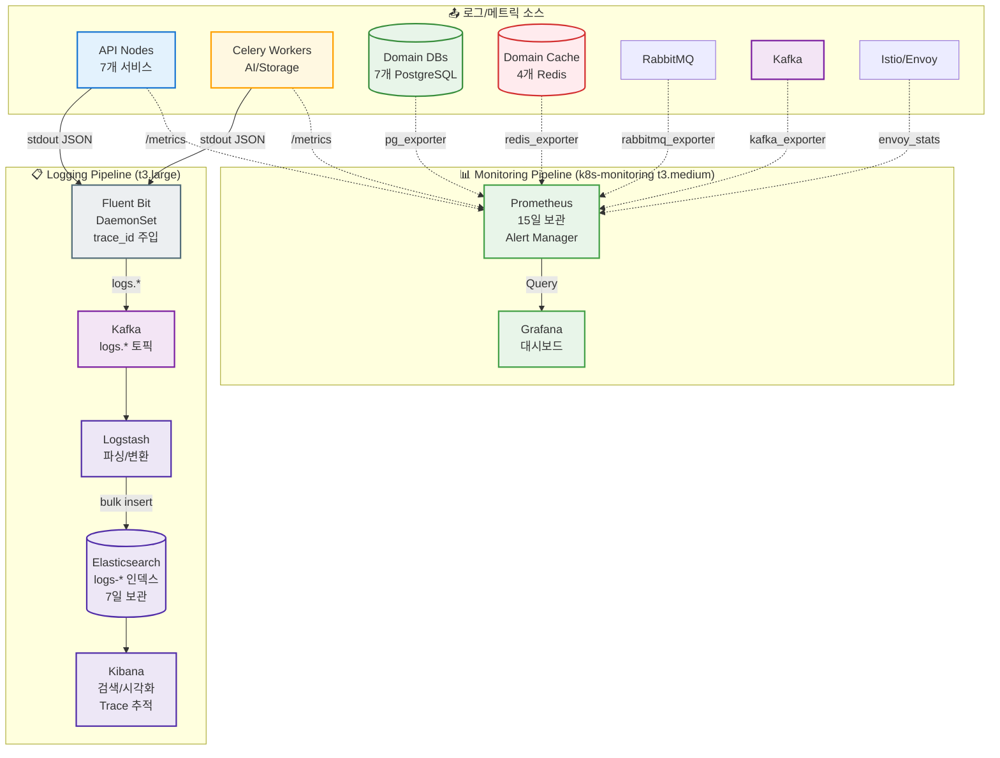
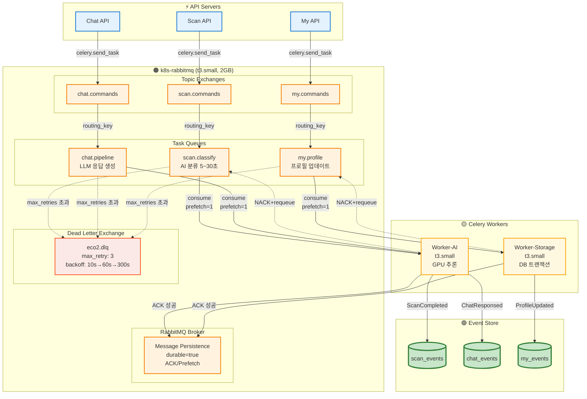
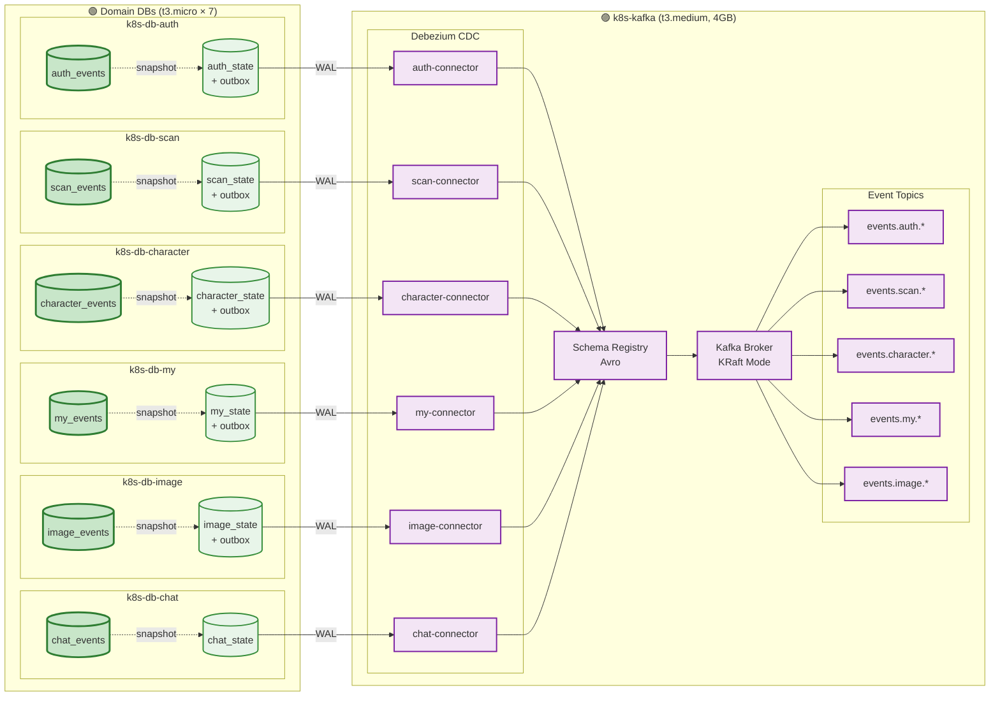
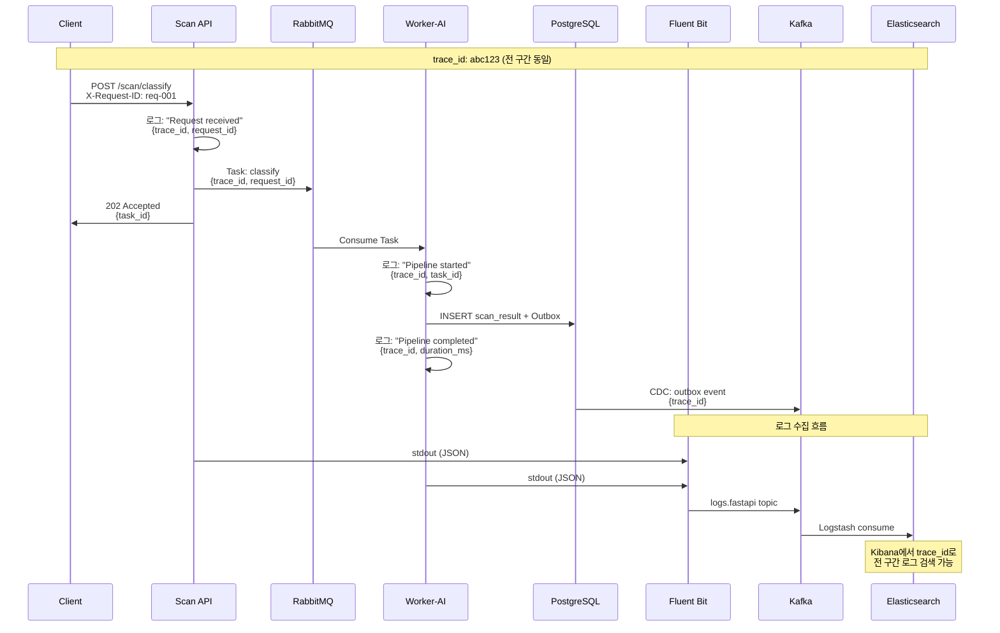
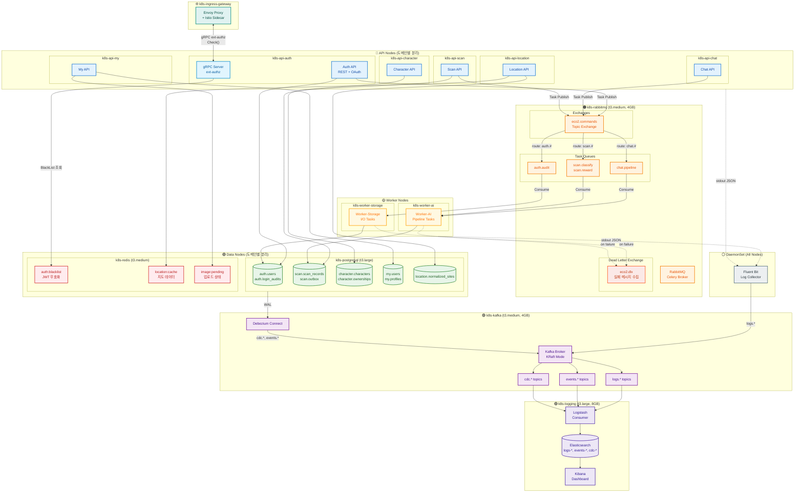

# 성숙 EDA + Observability 통합 아키텍처

> **Version:** 2.0.0  
> **Date:** 2025-12-17  
> **Status:** Planning  
> **Branch:** `feat/async-observability-architecture`  
> **Prerequisites:** 도메인 분리 완료, gRPC 마이그레이션 완료, Istio Service Mesh 구축 완료

---

## 📋 목차

1. [개요](#1-개요)
   - 1.1 목표
   - 1.2 현재 상태
   - 1.3 목표 상태: 성숙 EDA + 도메인별 DB 분리
   - 1.4 EDA 성숙도 목표
   - 1.5 노드 구성 변경 (Before → After)
   - 1.6 컴포넌트 역할 명세
   - 1.7 Saga Choreography 플로우
2. [아키텍처 원칙](#2-아키텍처-원칙)
   - 2.1 EDA 핵심 원칙 (8대 원칙)
   - 2.2 레이어 아키텍처 (EDA 강화)
   - 2.3 데이터 흐름 원칙
3. [EDA 패턴 설계](#3-eda-패턴-설계)
   - 3.1 Ordering (순서 보장)
   - 3.2 Idempotency (멱등성)
   - 3.3 Saga Pattern (Choreography)
   - 3.4 DLQ 재처리 전략
   - 3.5 Schema Evolution
4. [추적 시스템 설계 (Tracing)](#4-추적-시스템-설계-tracing)
5. [비즈니스 로직 vs Disk I/O 분리](#5-비즈니스-로직-vs-disk-io-분리)
6. [RabbitMQ/Celery 작업 분류](#6-rabbitmqcelery-작업-분류)
7. [Kafka/CDC 작업 분류](#7-kafkacdc-작업-분류)
8. [CQRS + Event Sourcing 전략](#8-cqrs--event-sourcing-전략)
   - 8.1 CQRS 개요
   - 8.2 ECO² CQRS 적용 설계
   - 8.3 Event Projector 구현
   - 8.4 Event Sourcing (Character 도메인)
9. [Observability 노드 구성](#9-observability-노드-구성)
10. [구현 로드맵](#10-구현-로드맵)
11. [비용 분석](#11-비용-분석)

---

## 1. 개요

### 1.1 목표

```
┌─────────────────────────────────────────────────────────────┐
│  "모든 DB/Cache I/O를 비동기화하고,                          │
│   요청부터 결과까지 전 구간을 추적 가능하게 만든다"           │
└─────────────────────────────────────────────────────────────┘
```

### 1.2 현재 상태

| 구성 요소 | 상태 | 비고 |
|----------|------|------|
| 동기 gRPC (Istio/Envoy) | ✅ 완료 | Auth ↔ Go 인증 체크 |
| 메트릭/대시보드 | ✅ 완료 | Prometheus + Grafana |
| RabbitMQ 노드 | ⏳ 미구성 | k8s-rabbitmq (4GB) 존재 |
| Kafka/CDC 노드 | ⏳ 미구성 | 신규 프로비저닝 필요 |
| 중앙 로깅 (ELK) | ⏳ 미구성 | 신규 프로비저닝 필요 |
| DB (PostgreSQL) | ✅ 운영 중 | 통합 DB |
| Cache (Redis) | ✅ 운영 중 | 캐시 전용 |

### 1.3 아키텍처 다이어그램 (분리형)

> 복잡한 전체 다이어그램 대신, 주제별로 분리하여 각 영역의 흐름을 명확히 표현합니다.

---

#### 1.3.1 Observability: 로깅 + 모니터링



**핵심 포인트:**
- **Fluent Bit**: 모든 노드에 DaemonSet으로 배포, `trace_id` 자동 주입
- **Kafka**: 로그 버퍼 역할, 스파이크 흡수
- **Elasticsearch**: 7일 보관, `logs-YYYY.MM.DD` 인덱스 패턴
- **Prometheus**: 모든 컴포넌트 메트릭 수집, 15일 보관

---

#### 1.3.2 MQ: RabbitMQ + Celery (장기 실행 Command)



**핵심 포인트:**
- **Message Persistence**: `durable=true`, 메시지 영속성 보장
- **ACK/Prefetch**: Worker가 처리 완료 후 ACK, `prefetch=1`로 부하 분산
- **DLQ + Retry**: 3회 재시도 후 DLQ로 이동, exponential backoff
- **Event append**: Worker 작업 완료 후 Event Store에 이벤트 기록

---

#### 1.3.3 CDC: Event Store → Debezium → Kafka



**핵심 포인트:**
- **Event Store**: 도메인별 이벤트 저장소 (append-only)
- **Outbox Pattern**: 트랜잭션 내에서 이벤트 + outbox 동시 커밋
- **Debezium CDC**: PostgreSQL WAL 기반 변경 감지
- **Schema Registry**: Avro 스키마 버전 관리

---

#### 1.3.4 EDA: Saga Choreography + CQRS

```mermaid
flowchart TB
    classDef kafkaStyle fill:#f3e5f5,stroke:#7b1fa2,stroke-width:2px
    classDef sagaStyle fill:#fce4ec,stroke:#c2185b,stroke-width:2px
    classDef apiStyle fill:#e3f2fd,stroke:#1976d2,stroke-width:2px
    classDef cqrsStyle fill:#e8eaf6,stroke:#3f51b5,stroke-width:2px
    classDef redisStyle fill:#ffebee,stroke:#d32f2f,stroke-width:2px
    classDef elkStyle fill:#ede7f6,stroke:#512da8,stroke-width:2px

    subgraph Kafka["🟣 Kafka Topics"]
        T_SCAN[events.scan.*]
        T_CHAR[events.character.*]
        T_IMG[events.image.*]
        T_MY[events.my.*]
        T_AUTH[events.auth.*]
    end

    subgraph Saga["💃 Saga Choreography"]
        SAGA_IMG[ImageRegistered<br/>→ ScanService]
        SAGA_SCAN[ScanCompleted<br/>→ CharacterService]
        SAGA_CHAR[CharacterAcquired<br/>→ MyService]
        SAGA_MY[ProfileUpdated<br/>→ Notification]
        SAGA_COMP[*Failed<br/>→ Compensate]
    end

    subgraph APIs["⚡ API Services"]
        SCAN_API[Scan API]
        CHAR_API[Character API]
        MY_API[My API]
        NOTIFY[Notification]
    end

    subgraph CQRS["📖 CQRS Projectors"]
        PROJ_AUTH[Auth Projector]
        PROJ_SCAN[Scan Projector]
        PROJ_CHAR[Character Projector]
        PROJ_MY[My Projector]
        PROJ_IMG[Image Projector]
    end

    subgraph ReadModels["📚 Read Models"]
        R_AUTH[(Redis<br/>auth:blacklist)]
        R_CHAR[(Redis<br/>char:ranking)]
        R_IMG[(Redis<br/>image:cdn)]
        RM_ES[(Elasticsearch<br/>검색/분석)]
    end

    %% Saga Flow (이벤트 체인)
    T_IMG -->|"ImageRegistered"| SAGA_IMG
    SAGA_IMG --> SCAN_API
    T_SCAN -->|"ScanCompleted"| SAGA_SCAN
    SAGA_SCAN --> CHAR_API
    T_CHAR -->|"CharacterAcquired"| SAGA_CHAR
    SAGA_CHAR --> MY_API
    T_MY -->|"ProfileUpdated"| SAGA_MY
    SAGA_MY --> NOTIFY

    %% 실패 시 보상
    T_SCAN -.->|"*Failed"| SAGA_COMP
    T_CHAR -.->|"*Failed"| SAGA_COMP
    SAGA_COMP -.->|"Compensate"| SCAN_API

    %% CQRS Flow (Read Model 구축)
    T_AUTH --> PROJ_AUTH
    T_SCAN --> PROJ_SCAN
    T_CHAR --> PROJ_CHAR
    T_MY --> PROJ_MY
    T_IMG --> PROJ_IMG

    PROJ_AUTH --> R_AUTH
    PROJ_SCAN --> RM_ES
    PROJ_CHAR --> R_CHAR
    PROJ_MY --> RM_ES
    PROJ_IMG --> R_IMG

    class T_SCAN,T_CHAR,T_IMG,T_MY,T_AUTH kafkaStyle
    class SAGA_IMG,SAGA_SCAN,SAGA_CHAR,SAGA_MY,SAGA_COMP sagaStyle
    class SCAN_API,CHAR_API,MY_API,NOTIFY apiStyle
    class PROJ_AUTH,PROJ_SCAN,PROJ_CHAR,PROJ_MY,PROJ_IMG cqrsStyle
    class R_AUTH,R_CHAR,R_IMG redisStyle
    class RM_ES elkStyle
```



**핵심 포인트:**
- **Saga Choreography**: 이벤트 기반 도메인 간 협력 (중앙 오케스트레이터 없음)
- **이벤트 체인**: `Image → Scan → Character → My → Notification`
- **보상 트랜잭션**: `*Failed` 이벤트 발생 시 역방향 보상
- **CQRS**: Kafka Consumer가 Read Model(Redis, ES)을 비동기로 구축

### 1.4 EDA 성숙도 목표

```
┌─────────────────────────────────────────────────────────────────────────────┐
│  🎯 ECO² 성숙 EDA + 도메인별 DB 분리 아키텍처                                │
├─────────────────────────────────────────────────────────────────────────────┤
│                                                                              │
│  ┌─────────────────────────────────────────────────────────────────────┐   │
│  │  ✅ 이미 완료된 기반                                                 │   │
│  │  ├─ 도메인 분리 (7개 독립 서비스)                                   │   │
│  │  ├─ gRPC 마이그레이션 (ext-authz, 내부 통신)                        │   │
│  │  ├─ Istio Service Mesh (Envoy, mTLS, Traffic Control)              │   │
│  │  └─ Prometheus + Grafana (메트릭 수집)                              │   │
│  └─────────────────────────────────────────────────────────────────────┘   │
│                                                                              │
│  ┌─────────────────────────────────────────────────────────────────────┐   │
│  │  🏗️ 인프라 변경: 도메인별 물리적 DB/Cache 분리                       │   │
│  │  ├─ 통합 DB (t3.large) → 도메인별 DB (t3.micro × 7)                │   │
│  │  ├─ 통합 Cache (t3.medium) → 도메인별 Cache (t3.micro × 4)         │   │
│  │  ├─ 마이그레이션 완료 후 통합 노드 폐기                             │   │
│  │  └─ 장애 격리 + 독립 스케일링 + 비용 최적화                         │   │
│  └─────────────────────────────────────────────────────────────────────┘   │
│                                                                              │
│  ┌─────────────────────────────────────────────────────────────────────┐   │
│  │  📚 Event Sourcing: 모든 도메인 필수 적용                            │   │
│  │  ├─ auth_events   → 로그인/로그아웃/권한변경 이력                   │   │
│  │  ├─ scan_events   → 스캔 요청/완료/보상 이력                        │   │
│  │  ├─ character_events → 캐릭터 획득/진화/소실 이력                   │   │
│  │  ├─ my_events     → 프로필 변경/설정 변경 이력                      │   │
│  │  ├─ image_events  → 업로드/처리/삭제 이력                           │   │
│  │  └─ chat_events   → 대화 시작/메시지/종료 이력                      │   │
│  └─────────────────────────────────────────────────────────────────────┘   │
│                                                                              │
│  ┌─────────────────────────────────────────────────────────────────────┐   │
│  │  🎯 구현할 EDA 패턴                                                  │   │
│  │  ├─ 📦 Ordering: Kafka Partition Key (user_id, session_id)          │   │
│  │  ├─ 🔄 Idempotency: Event Store 시퀀스 기반 중복 방지              │   │
│  │  ├─ 💃 Saga (Choreography): Scan→Char→My→Notif 이벤트 체인         │   │
│  │  ├─ 📬 Outbox Pattern: 도메인별 outbox → Debezium CDC              │   │
│  │  ├─ ☠️ DLQ + 재처리: 자동 재시도 (max 3회) + Archive              │   │
│  │  ├─ 📜 Schema Registry: Avro 스키마 + 하위 호환성                   │   │
│  │  └─ 📖 CQRS: Event Store(쓰기) → Projector → Cache/ES(읽기)        │   │
│  └─────────────────────────────────────────────────────────────────────┘   │
│                                                                              │
└─────────────────────────────────────────────────────────────────────────────┘
```

### 1.5 노드 구성 변경 (Before → After)

```
┌─────────────────────────────────────────────────────────────────────────────┐
│  인프라 변경: 통합 → 도메인 분리 + 안정 운영 스펙                           │
├─────────────────────────────────────────────────────────────────────────────┤
│                                                                              │
│  [Before - 통합 노드]                                                       │
│  ┌──────────────────────────────────────────────────────────────────────┐  │
│  │  k8s-postgresql  (t3.large, 8GB)   $60.74/월  ← 폐기 예정           │  │
│  │  k8s-redis       (t3.medium, 4GB)  $30.37/월  ← 폐기 예정           │  │
│  │  ─────────────────────────────────────────────────────────────────  │  │
│  │  합계: $91.11/월                                                    │  │
│  └──────────────────────────────────────────────────────────────────────┘  │
│                                                                              │
│  [After - 도메인별 분리 + 인프라 노드 안정 스펙]                            │
│  ┌──────────────────────────────────────────────────────────────────────┐  │
│  │                                                                      │  │
│  │  📦 Domain DBs (PostgreSQL t3.micro × 7)            소계: $53.13/월 │  │
│  │  ├─ k8s-db-auth       $7.59/월   (Event Store + State)             │  │
│  │  ├─ k8s-db-scan       $7.59/월   (Event Store + State)             │  │
│  │  ├─ k8s-db-character  $7.59/월   (Event Store + State)             │  │
│  │  ├─ k8s-db-my         $7.59/월   (Event Store + State)             │  │
│  │  ├─ k8s-db-image      $7.59/월   (CDN 링크 기록, Event Store)      │  │
│  │  ├─ k8s-db-chat       $7.59/월   (Event Store + State)             │  │
│  │  └─ k8s-db-location   $7.59/월   (Read-Only, Static Data)          │  │
│  │                                                                      │  │
│  │  🔴 Domain Caches (Redis t3.micro × 4)              소계: $30.36/월 │  │
│  │  ├─ k8s-cache-auth      $7.59/월                                   │  │
│  │  │   └─ 역할: 🔑 BlackList (JWT 무효화), Session 저장              │  │
│  │  ├─ k8s-cache-character $7.59/월                                   │  │
│  │  │   └─ 역할: 📊 Projection Cache (ownership, ranking)            │  │
│  │  ├─ k8s-cache-location  $7.59/월                                   │  │
│  │  │   └─ 역할: 🗺️ Geo Index, Sites 캐시                            │  │
│  │  └─ k8s-cache-image     $7.59/월                                   │  │
│  │      └─ 역할: 📷 Presigned URL TTL, CDN 링크 캐시                 │  │
│  │                                                                      │  │
│  │  🟣 Event Streaming (안정 운영 스펙)                소계: $30.37/월 │  │
│  │  └─ k8s-kafka (t3.medium, 4GB)  $30.37/월                          │  │
│  │     └─ 역할: CDC 6개 Connector, 로그 버퍼, Schema Registry         │  │
│  │     └─ 이유: CDC + 로그 처리에 최소 4GB 메모리 필요                │  │
│  │                                                                      │  │
│  │  📋 Logging (ELK - 안정 운영 스펙)                  소계: $60.74/월 │  │
│  │  └─ k8s-logging (t3.large, 8GB)  $60.74/월                         │  │
│  │     └─ 역할: Logstash 파싱, ES 인덱싱(7일), Kibana 시각화          │  │
│  │     └─ 이유: ES는 JVM 기반, 최소 8GB 필요 (4GB heap + OS)         │  │
│  │                                                                      │  │
│  │  📊 Monitoring (Prometheus + Grafana)               소계: $30.37/월 │  │
│  │  └─ k8s-monitoring (t3.medium, 4GB)  $30.37/월                     │  │
│  │     └─ Prometheus 역할:                                            │  │
│  │        └─ 메트릭 수집 (API, Worker, DB, Cache, Kafka)              │  │
│  │        └─ 15일 보관 (TSDB)                                         │  │
│  │        └─ Alert Manager (Slack/Discord 알림)                       │  │
│  │     └─ Grafana 역할:                                               │  │
│  │        └─ 대시보드 (노드별, 도메인별, 서비스별)                     │  │
│  │        └─ 알림 규칙 설정                                           │  │
│  │     └─ 이유: Prometheus TSDB에 최소 4GB 권장                       │  │
│  │                                                                      │  │
│  │  🟠 Async Queue                                     소계: $15.18/월 │  │
│  │  └─ k8s-rabbitmq (t3.small, 2GB)  $15.18/월                        │  │
│  │     └─ 역할: Celery Broker, Task Queue, DLQ                        │  │
│  │                                                                      │  │
│  │  ─────────────────────────────────────────────────────────────────  │  │
│  │  총 합계: $220.15/월                                                │  │
│  │  (데이터 $83.49 + 인프라 $136.66)                                  │  │
│  │                                                                      │  │
│  └──────────────────────────────────────────────────────────────────────┘  │
│                                                                              │
│  [이점]                                                                     │
│  ├─ 🔒 장애 격리: 도메인별 DB/Cache 독립, 인프라 노드 분리               │  │
│  ├─ 📈 독립 스케일링: 트래픽 높은 도메인만 스케일업/아웃                 │  │
│  ├─ 🔧 독립 운영: 도메인별 백업/복구/스키마 변경                         │  │
│  ├─ 📊 모니터링: 도메인별 + 인프라별 메트릭 분리                         │  │
│  └─ ☁️ Image: CDN/S3 직접 업로드로 API 서버 부하 최소화                 │  │
│                                                                              │
└─────────────────────────────────────────────────────────────────────────────┘
```

### 1.6 컴포넌트 역할 명세

```
┌─────────────────────────────────────────────────────────────────────────────┐
│  주요 컴포넌트 역할 명세                                                    │
├─────────────────────────────────────────────────────────────────────────────┤
│                                                                              │
│  [Redis 역할별 분류]                                                        │
│  ┌──────────────────────────────────────────────────────────────────────┐  │
│  │  k8s-cache-auth                                                     │  │
│  │  ├─ auth:blacklist:{token_hash}    → JWT 무효화 목록 (SET)         │  │
│  │  ├─ auth:session:{user_id}         → 세션 데이터 (HASH)            │  │
│  │  └─ auth:refresh:{token_id}        → Refresh Token (STRING, TTL)   │  │
│  │                                                                      │  │
│  │  k8s-cache-character                                                │  │
│  │  ├─ char:ownership:{user_id}       → 보유 캐릭터 목록 (LIST/JSON)  │  │
│  │  ├─ char:ranking:weekly            → 주간 랭킹 (SORTED SET)        │  │
│  │  └─ char:detail:{char_id}          → 캐릭터 상세 (HASH)            │  │
│  │                                                                      │  │
│  │  k8s-cache-location                                                 │  │
│  │  ├─ loc:sites:geohash:{hash}       → 지역별 센터 목록 (GEO)        │  │
│  │  ├─ loc:site:{site_id}             → 센터 상세 (HASH)              │  │
│  │  └─ loc:search:{query_hash}        → 검색 결과 캐시 (STRING, TTL)  │  │
│  │                                                                      │  │
│  │  k8s-cache-image                                                    │  │
│  │  ├─ img:presigned:{upload_id}      → Presigned URL (STRING, TTL)   │  │
│  │  ├─ img:cdn:{image_id}             → CDN 링크 (STRING)             │  │
│  │  └─ img:user:{user_id}:recent      → 최근 이미지 목록 (LIST)       │  │
│  └──────────────────────────────────────────────────────────────────────┘  │
│                                                                              │
│  [Prometheus 수집 대상]                                                     │
│  ┌──────────────────────────────────────────────────────────────────────┐  │
│  │  메트릭 소스              Exporter              주요 메트릭          │  │
│  │  ─────────────────────────────────────────────────────────────────  │  │
│  │  API Nodes               (내장)                 request_*, latency   │  │
│  │  Worker Nodes            (내장)                 task_*, queue_*      │  │
│  │  Domain DBs              postgres_exporter      pg_stat_*, conn_*   │  │
│  │  Domain Caches           redis_exporter         redis_*, memory_*   │  │
│  │  Kafka                   kafka_exporter         kafka_*, lag_*      │  │
│  │  RabbitMQ                rabbitmq_exporter      rabbitmq_queue_*    │  │
│  │  K8s Nodes               node_exporter          node_cpu_*, mem_*   │  │
│  └──────────────────────────────────────────────────────────────────────┘  │
│                                                                              │
│  [Grafana 대시보드 구성]                                                    │
│  ┌──────────────────────────────────────────────────────────────────────┐  │
│  │  대시보드                패널                                        │  │
│  │  ─────────────────────────────────────────────────────────────────  │  │
│  │  API Overview            Request Rate, Error Rate, Latency P99      │  │
│  │  Domain Health           도메인별 DB/Cache 상태, 이벤트 처리량      │  │
│  │  Kafka Metrics           토픽별 메시지량, Consumer Lag, CDC 상태    │  │
│  │  Queue Status            RabbitMQ 큐 깊이, DLQ 메시지 수            │  │
│  │  Node Resources          CPU/Memory/Disk 사용률 (노드별)            │  │
│  │  Alert Summary           활성 알림, 최근 알림 이력                   │  │
│  └──────────────────────────────────────────────────────────────────────┘  │
│                                                                              │
│  [Image 도메인 - CDN 직접 업로드 방식]                                     │
│  ┌──────────────────────────────────────────────────────────────────────┐  │
│  │                                                                      │  │
│  │  Client                                                             │  │
│  │     │                                                               │  │
│  │     │ 1. POST /images/presigned-url                                 │  │
│  │     ▼                                                               │  │
│  │  Image API                                                          │  │
│  │     │ → S3 Presigned URL 생성                                       │  │
│  │     │ → Redis에 pending 상태 저장                                   │  │
│  │     ▼                                                               │  │
│  │  Client                                                             │  │
│  │     │                                                               │  │
│  │     │ 2. PUT (Presigned URL) → S3 직접 업로드                       │  │
│  │     │    (API 서버 경유 X, 대역폭 절약)                             │  │
│  │     ▼                                                               │  │
│  │  CloudFront CDN                                                     │  │
│  │     │ → S3 Origin                                                   │  │
│  │     │ → Edge 캐싱                                                   │  │
│  │     ▼                                                               │  │
│  │  Client                                                             │  │
│  │     │                                                               │  │
│  │     │ 3. POST /images/register                                      │  │
│  │     │    {cdn_url: "https://cdn.eco2.kr/images/xxx.jpg"}           │  │
│  │     ▼                                                               │  │
│  │  Image API                                                          │  │
│  │     └─ Event Store에 ImageRegistered 이벤트 append                  │  │
│  │     └─ Scan API가 ImageRegistered 이벤트 구독하여 분류 시작         │  │
│  │                                                                      │  │
│  │  ※ API 서버는 CDN 링크만 관리, 이미지 바이너리 처리 없음            │  │
│  │  ※ 썸네일은 CloudFront Functions 또는 Lambda@Edge에서 처리          │  │
│  │                                                                      │  │
│  └──────────────────────────────────────────────────────────────────────┘  │
│                                                                              │
└─────────────────────────────────────────────────────────────────────────────┘
```

### 1.7 Saga Choreography 플로우

```
┌─────────────────────────────────────────────────────────────────────────────┐
│  💃 이벤트 기반 도메인 간 협력 (Choreography)                                │
├─────────────────────────────────────────────────────────────────────────────┤
│                                                                              │
│  [Flow 1: Image(CDN) → Scan → Character → My]                              │
│  ┌──────────────────────────────────────────────────────────────────────┐  │
│  │                                                                      │  │
│  │  Client                                                             │  │
│  │     │ 1. S3 Presigned URL로 CDN에 직접 업로드                       │  │
│  │     │ 2. POST /images/register {cdn_url}                           │  │
│  │     ▼                                                               │  │
│  │  Image API                                                          │  │
│  │     │ register_cdn_link()                                           │  │
│  │     │ append: ImageRegistered                                       │  │
│  │     ▼                                                               │  │
│  │  ┌──────────────────┐                                               │  │
│  │  │ ImageRegistered  │ ────────────────────────────────────────────▶│  │
│  │  │ {image_id,       │                                   Scan API   │  │
│  │  │  cdn_url}        │                                      │        │  │
│  │  └──────────────────┘                                      │        │  │
│  │                                                            │        │  │
│  │                                          classify()        │        │  │
│  │                                          append: ScanCompleted      │  │
│  │                                                            ▼        │  │
│  │  ┌─────────────────┐                                                │  │
│  │  │ ScanCompleted   │ ◀─────────────────────────────────────────────│  │
│  │  │ {scan_id, category, reward_eligible}                            │  │
│  │  └────────┬────────┘                                                │  │
│  │           │                                                         │  │
│  │           ▼ Character API                                           │  │
│  │           │ grant_character()                                       │  │
│  │           │ append: CharacterAcquired                               │  │
│  │           ▼                                                         │  │
│  │  ┌───────────────────┐                                              │  │
│  │  │ CharacterAcquired │ ─────────────────────────────────────────▶  │  │
│  │  │ {char_id, name}   │                                    My API   │  │
│  │  └───────────────────┘                                      │       │  │
│  │                                                             │       │  │
│  │                                      update_stats()         │       │  │
│  │                                      append: ProfileUpdated │       │  │
│  │                                                             ▼       │  │
│  │  ┌─────────────────┐                                                │  │
│  │  │ ProfileUpdated  │ ──────▶ Notification Service                  │  │
│  │  │ {total_chars}   │                                                │  │
│  │  └─────────────────┘                                                │  │
│  │                                                                      │  │
│  └──────────────────────────────────────────────────────────────────────┘  │
│                                                                              │
│  [Flow 2: 실패 시 보상 트랜잭션]                                            │
│  ┌──────────────────────────────────────────────────────────────────────┐  │
│  │                                                                      │  │
│  │  Character API                                                      │  │
│  │     │ grant_character() 실패 (max_characters_reached)               │  │
│  │     │ append: CharacterAcquireFailed                                │  │
│  │     ▼                                                               │  │
│  │  ┌───────────────────────┐                                          │  │
│  │  │ CharacterAcquireFailed│ ─────────────────────────────────────▶  │  │
│  │  │ {scan_id, reason}     │                              Scan API   │  │
│  │  └───────────────────────┘                                  │       │  │
│  │                                                             │       │  │
│  │                              compensate()                   │       │  │
│  │                              append: ScanRewardCompensated  │       │  │
│  │                                                             ▼       │  │
│  │  ┌───────────────────────┐                                          │  │
│  │  │ ScanRewardCompensated │ ──────▶ User 알림 (재시도 옵션)         │  │
│  │  │ {scan_id, status}     │                                          │  │
│  │  └───────────────────────┘                                          │  │
│  │                                                                      │  │
│  └──────────────────────────────────────────────────────────────────────┘  │
│                                                                              │
│  [Flow 3: Location (Read-Only, No Event)]                                  │
│  ┌──────────────────────────────────────────────────────────────────────┐  │
│  │  Location API                                                       │  │
│  │     │ get_nearby_centers()                                          │  │
│  │     ▼                                                               │  │
│  │  ┌─────────────────┐    Cache Miss    ┌─────────────────┐           │  │
│  │  │ k8s-cache-loc   │ ───────────────▶ │ k8s-db-location │           │  │
│  │  │ (Geo Index)     │ ◀─────────────── │ (Static Sites)  │           │  │
│  │  └─────────────────┘    Update Cache  └─────────────────┘           │  │
│  │                                                                      │  │
│  │  ※ Location은 외부 데이터 동기화만 (배치), Event Sourcing 제외      │  │
│  │                                                                      │  │
│  └──────────────────────────────────────────────────────────────────────┘  │
│                                                                              │
└─────────────────────────────────────────────────────────────────────────────┘
```

---

## 2. 아키텍처 원칙

### 2.1 EDA 핵심 원칙

```
┌─────────────────────────────────────────────────────────────────────────────┐
│  🎯 성숙 EDA 8대 원칙                                                       │
├─────────────────────────────────────────────────────────────────────────────┤
│                                                                              │
│  1. 📦 Ordering - 순서 보장                                                 │
│     ├─ 같은 Entity의 이벤트는 순서대로 처리                                 │
│     ├─ Kafka: partition key = entity_id (user_id, scan_id)                 │
│     └─ RabbitMQ: 같은 routing key = 같은 queue = 순차 처리                 │
│                                                                              │
│  2. 🔄 Idempotency - 멱등성                                                 │
│     ├─ 모든 Consumer는 동일 메시지 중복 처리해도 결과 동일                  │
│     ├─ idempotency_key (UUID) 필수                                         │
│     └─ processed_events 테이블로 처리 여부 확인                             │
│                                                                              │
│  3. 💃 Choreography - 자율 협력                                             │
│     ├─ 중앙 Orchestrator 없이 이벤트 기반 서비스 간 협력                    │
│     ├─ 각 서비스는 관심 이벤트만 구독                                       │
│     └─ 실패 시 역이벤트로 보상 트랜잭션                                     │
│                                                                              │
│  4. 📬 Outbox Pattern - 트랜잭션 일관성                                     │
│     ├─ 비즈니스 데이터 + 이벤트를 같은 트랜잭션에 저장                      │
│     ├─ CDC(Debezium)가 Outbox 테이블 읽어서 Kafka로 발행                   │
│     └─ "DB 성공했는데 이벤트 발행 실패" 문제 해결                           │
│                                                                              │
│  5. ☠️ DLQ + 재처리 - 장애 격리                                            │
│     ├─ 실패 메시지는 DLQ로 이동 (원본 큐 영향 없음)                        │
│     ├─ 자동 재시도 (max 3회, exponential backoff)                          │
│     └─ 3회 초과 시 archive로 이동 + 알림                                    │
│                                                                              │
│  6. 📜 Schema Evolution - 스키마 진화                                       │
│     ├─ Schema Registry로 스키마 버전 관리                                   │
│     ├─ 하위 호환성 필수 (새 필드는 Optional)                               │
│     └─ Producer/Consumer 스키마 호환성 자동 검증                            │
│                                                                              │
│  7. 📖 CQRS - 읽기/쓰기 분리                                                │
│     ├─ Write Path: API → RabbitMQ → Worker → PostgreSQL + Outbox          │
│     ├─ Event Path: Outbox → CDC → Kafka → Projectors                       │
│     └─ Read Path: API → Redis/Elasticsearch (Materialized View)           │
│                                                                              │
│  8. 📚 Event Sourcing (필수) - 이벤트 기반 상태                             │
│     ├─ 모든 도메인에 Event Store 적용 (append-only)                        │
│     ├─ 이벤트로부터 현재 상태 재구성 (replay)                              │
│     ├─ Snapshot으로 성능 최적화 (매 100 이벤트)                            │
│     └─ Location만 예외 (외부 데이터, Read-Only)                            │
│                                                                              │
└─────────────────────────────────────────────────────────────────────────────┘
```

### 2.2 레이어 아키텍처 (EDA 강화)

```
┌─────────────────────────────────────────────────────────────────────────────┐
│  [API Layer] - FastAPI Router                                               │
│  ├─ 요청 파싱, 응답 구성, 인증 확인                                         │
│  ├─ trace_id 생성/전파 (W3C Trace Context)                                 │
│  ├─ Idempotency-Key 헤더 수신                                              │
│  └─ 즉시 응답 (202 Accepted) + 폴링/웹소켓으로 결과 수신                   │
├─────────────────────────────────────────────────────────────────────────────┤
│  [Command Layer] - Command Handlers (NEW)                                   │
│  ├─ Command 객체 검증 (Pydantic)                                           │
│  ├─ Idempotency 체크 (이미 처리됐는지 확인)                                │
│  └─ RabbitMQ로 Task 발행                                                   │
├─────────────────────────────────────────────────────────────────────────────┤
│  [Service Layer] - Business Logic                                           │
│  ├─ 순수 비즈니스 규칙 (I/O 없음, 테스트 용이)                             │
│  ├─ 상태 전이 로직                                                         │
│  └─ 도메인 이벤트 생성 (DomainEvent 객체)                                  │
├─────────────────────────────────────────────────────────────────────────────┤
│  [Task Layer] - Celery Workers                                              │
│  ├─ Idempotent 처리 (processed_events 체크)                               │
│  ├─ 비즈니스 로직 실행 (Service 호출)                                      │
│  ├─ State + Outbox 단일 트랜잭션 저장                                      │
│  └─ Saga 보상 로직 (실패 이벤트 구독)                                      │
├─────────────────────────────────────────────────────────────────────────────┤
│  [Repository Layer] - SQLAlchemy + Async                                    │
│  ├─ DB 접근 추상화                                                         │
│  ├─ Outbox 테이블 저장 (같은 트랜잭션)                                     │
│  └─ Idempotency Key 저장                                                   │
├─────────────────────────────────────────────────────────────────────────────┤
│  [Event Layer] - Kafka Consumers (NEW)                                      │
│  ├─ CDC 이벤트 수신 (Debezium)                                             │
│  ├─ Choreography 이벤트 처리 (다른 서비스 이벤트)                          │
│  ├─ Read Model 프로젝션 (CQRS)                                             │
│  └─ Schema Validation (Schema Registry)                                    │
├─────────────────────────────────────────────────────────────────────────────┤
│  [Query Layer] - Read Models (NEW)                                          │
│  ├─ Redis: 캐시, 세션, 실시간 조회                                         │
│  ├─ Elasticsearch: 검색, 분석                                              │
│  └─ PostgreSQL Read Replica: 복잡한 조인 쿼리                              │
├─────────────────────────────────────────────────────────────────────────────┤
│  [Infrastructure Layer]                                                     │
│  └─ RabbitMQ, Kafka, PostgreSQL, Redis, S3, Schema Registry               │
└─────────────────────────────────────────────────────────────────────────────┘
```

### 2.3 데이터 흐름 원칙

```
┌─────────────────────────────────────────────────────────────────────────────┐
│  Write Path (Command → State)                                               │
│  ═══════════════════════════════════════════════════════════════════════   │
│                                                                              │
│  Client                                                                      │
│    │                                                                         │
│    ▼                                                                         │
│  ┌─────────────┐    ┌─────────────┐    ┌─────────────┐                     │
│  │  API Layer  │───▶│  RabbitMQ   │───▶│   Worker    │                     │
│  │  (Command)  │    │  (Queue)    │    │ (Idempotent)│                     │
│  └─────────────┘    └─────────────┘    └──────┬──────┘                     │
│        │                                       │                            │
│        │ 202 Accepted                          ▼                            │
│        │                              ┌───────────────────┐                │
│        │                              │  Single TX:       │                │
│        │                              │  - State Table    │                │
│        │                              │  - Outbox Table   │                │
│        │                              │  - Idempotency    │                │
│        │                              └─────────┬─────────┘                │
│        │                                        │                          │
│        │                                        ▼                          │
│        │                              ┌─────────────────┐                  │
│        │                              │  CDC (Debezium) │                  │
│        │                              └────────┬────────┘                  │
│        │                                       │                           │
│        │                                       ▼                           │
│        │                              ┌─────────────────┐                  │
│        │                              │     Kafka       │                  │
│        │                              │  (Events Bus)   │                  │
│        ▼                              └─────────────────┘                  │
│      Result                                                                 │
│   (Polling/WS)                                                              │
│                                                                              │
└─────────────────────────────────────────────────────────────────────────────┘

┌─────────────────────────────────────────────────────────────────────────────┐
│  Event Path (Kafka → Read Models)                                           │
│  ═══════════════════════════════════════════════════════════════════════   │
│                                                                              │
│  ┌─────────────┐                                                            │
│  │    Kafka    │                                                            │
│  │   Events    │                                                            │
│  └──────┬──────┘                                                            │
│         │                                                                    │
│         ├───────────────────┬───────────────────┐                          │
│         │                   │                   │                          │
│         ▼                   ▼                   ▼                          │
│  ┌─────────────┐     ┌─────────────┐     ┌─────────────┐                  │
│  │  Projector  │     │  Projector  │     │  Projector  │                  │
│  │   (Redis)   │     │    (ES)     │     │  (Analytics)│                  │
│  └──────┬──────┘     └──────┬──────┘     └──────┬──────┘                  │
│         │                   │                   │                          │
│         ▼                   ▼                   ▼                          │
│  ┌─────────────┐     ┌─────────────┐     ┌─────────────┐                  │
│  │ Redis Cache │     │Elasticsearch│     │  Data Lake  │                  │
│  │  (Read)     │     │  (Search)   │     │ (Analytics) │                  │
│  └─────────────┘     └─────────────┘     └─────────────┘                  │
│                                                                              │
└─────────────────────────────────────────────────────────────────────────────┘

┌─────────────────────────────────────────────────────────────────────────────┐
│  Read Path (Query → Read Model)                                             │
│  ═══════════════════════════════════════════════════════════════════════   │
│                                                                              │
│  Client                                                                      │
│    │                                                                         │
│    ▼                                                                         │
│  ┌─────────────┐                                                            │
│  │  API Layer  │                                                            │
│  │  (Query)    │                                                            │
│  └──────┬──────┘                                                            │
│         │                                                                    │
│         ├───────────────────┬───────────────────┐                          │
│         │                   │                   │                          │
│         ▼                   ▼                   ▼                          │
│  ┌─────────────┐     ┌─────────────┐     ┌─────────────┐                  │
│  │ Redis Cache │     │Elasticsearch│     │  PG Replica │                  │
│  │ (Real-time) │     │  (Search)   │     │  (Complex)  │                  │
│  └─────────────┘     └─────────────┘     └─────────────┘                  │
│                                                                              │
└─────────────────────────────────────────────────────────────────────────────┘
```

---

## 3. EDA 패턴 설계

### 3.1 Ordering (순서 보장)

```
┌─────────────────────────────────────────────────────────────────────────────┐
│  📦 문제: 같은 Entity의 이벤트가 순서대로 처리되지 않을 수 있음             │
├─────────────────────────────────────────────────────────────────────────────┤
│                                                                              │
│  예시: User A의 포인트 변경                                                  │
│  ┌──────────────────────────────────────────────────────────────────────┐  │
│  │  Event 1: points += 100 (적립)                                       │  │
│  │  Event 2: points -= 50  (사용)                                       │  │
│  │  Event 3: points += 30  (적립)                                       │  │
│  │                                                                      │  │
│  │  순서가 깨지면? → Event 2가 먼저 처리되면 잔액 부족 에러              │  │
│  └──────────────────────────────────────────────────────────────────────┘  │
│                                                                              │
│  해결책: Partition Key 전략                                                  │
│  ┌──────────────────────────────────────────────────────────────────────┐  │
│  │  # Kafka: 같은 user_id → 같은 Partition → 순서 보장                  │  │
│  │  producer.send(                                                      │  │
│  │      topic="events.character",                                      │  │
│  │      key=str(user_id),  # partition key                             │  │
│  │      value=event_payload                                            │  │
│  │  )                                                                  │  │
│  │                                                                      │  │
│  │  # RabbitMQ: Consistent Hash Exchange 또는 routing key 사용         │  │
│  │  channel.basic_publish(                                             │  │
│  │      exchange='eco2.commands',                                      │  │
│  │      routing_key=f'scan.classify.{user_id}',  # 같은 key = 같은 큐  │  │
│  │      body=message                                                   │  │
│  │  )                                                                  │  │
│  └──────────────────────────────────────────────────────────────────────┘  │
│                                                                              │
│  Partition Key 설계:                                                         │
│  ┌──────────────────┬─────────────────────────────────────────────────┐    │
│  │ 도메인            │ Partition Key                                   │    │
│  ├──────────────────┼─────────────────────────────────────────────────┤    │
│  │ scan              │ user_id (같은 사용자의 스캔은 순차 처리)        │    │
│  │ character         │ user_id (캐릭터 획득/소실 순서 보장)            │    │
│  │ chat              │ session_id (같은 세션의 메시지 순서 보장)       │    │
│  │ auth.audit        │ user_id (로그인 기록 순서)                      │    │
│  │ cdc.*             │ aggregate_id (Debezium 기본 설정)               │    │
│  └──────────────────┴─────────────────────────────────────────────────┘    │
│                                                                              │
└─────────────────────────────────────────────────────────────────────────────┘
```

### 3.2 Idempotency (멱등성)

```
┌─────────────────────────────────────────────────────────────────────────────┐
│  🔄 문제: 네트워크 재시도, Consumer 재시작 시 중복 처리 발생                │
├─────────────────────────────────────────────────────────────────────────────┤
│                                                                              │
│  해결책: Idempotency Key + 처리 기록                                        │
│                                                                              │
│  1. 메시지 발행 시 idempotency_key 포함                                     │
│  ┌──────────────────────────────────────────────────────────────────────┐  │
│  │  # API Layer에서 발행                                                │  │
│  │  message = {                                                         │  │
│  │      "idempotency_key": str(uuid.uuid4()),  # 고유 키                │  │
│  │      "trace_id": ctx.trace_id,                                      │  │
│  │      "timestamp": datetime.utcnow().isoformat(),                    │  │
│  │      "payload": { ... }                                             │  │
│  │  }                                                                  │  │
│  └──────────────────────────────────────────────────────────────────────┘  │
│                                                                              │
│  2. Worker에서 처리 전 확인                                                 │
│  ┌──────────────────────────────────────────────────────────────────────┐  │
│  │  @celery.task(bind=True)                                            │  │
│  │  async def process_task(self, message: dict):                       │  │
│  │      idempotency_key = message["idempotency_key"]                   │  │
│  │                                                                      │  │
│  │      # 이미 처리됐는지 확인                                          │  │
│  │      if await idempotency_repo.exists(idempotency_key):             │  │
│  │          logger.info(f"Already processed: {idempotency_key}")       │  │
│  │          return {"status": "skipped", "reason": "duplicate"}        │  │
│  │                                                                      │  │
│  │      # 처리 시작 (트랜잭션 내에서)                                   │  │
│  │      async with db.transaction():                                   │  │
│  │          result = await do_business_logic(message["payload"])       │  │
│  │          await state_repo.save(result)                              │  │
│  │          await outbox_repo.save(event)                              │  │
│  │          await idempotency_repo.mark_processed(idempotency_key)     │  │
│  │                                                                      │  │
│  │      return {"status": "success"}                                   │  │
│  └──────────────────────────────────────────────────────────────────────┘  │
│                                                                              │
│  3. Idempotency 테이블 스키마                                               │
│  ┌──────────────────────────────────────────────────────────────────────┐  │
│  │  CREATE TABLE processed_events (                                    │  │
│  │      idempotency_key VARCHAR(64) PRIMARY KEY,                       │  │
│  │      domain VARCHAR(32) NOT NULL,                                   │  │
│  │      processed_at TIMESTAMP DEFAULT NOW(),                          │  │
│  │      result JSONB,                                                  │  │
│  │      expires_at TIMESTAMP DEFAULT (NOW() + INTERVAL '7 days')       │  │
│  │  );                                                                 │  │
│  │                                                                      │  │
│  │  -- TTL 정리 (주기적 실행)                                          │  │
│  │  DELETE FROM processed_events WHERE expires_at < NOW();             │  │
│  └──────────────────────────────────────────────────────────────────────┘  │
│                                                                              │
└─────────────────────────────────────────────────────────────────────────────┘
```

### 3.3 Saga Pattern (Choreography)

```
┌─────────────────────────────────────────────────────────────────────────────┐
│  💃 Choreography 기반 Saga: 중앙 조정자 없이 이벤트로 협력                  │
├─────────────────────────────────────────────────────────────────────────────┤
│                                                                              │
│  ECO² Scan → Character Saga 예시:                                           │
│                                                                              │
│  ┌──────────────────────────────────────────────────────────────────────┐  │
│  │  정상 흐름 (Happy Path)                                              │  │
│  │  ═══════════════════════════════════════════════════════════════════│  │
│  │                                                                      │  │
│  │  [Scan Service]                                                     │  │
│  │       │                                                             │  │
│  │       │ 1. classify() 완료                                          │  │
│  │       │ 2. scan_records 저장                                        │  │
│  │       │ 3. outbox에 ScanCompleted 저장                              │  │
│  │       ▼                                                             │  │
│  │  ┌─────────────────┐                                                │  │
│  │  │  ScanCompleted  │ ───▶ Kafka ───▶                               │  │
│  │  │  {scan_id, user_id, category, reward_eligible: true}            │  │
│  │  └─────────────────┘                                                │  │
│  │                                              │                      │  │
│  │                                              ▼                      │  │
│  │  [Character Service] ◀────── Subscribe ──────┘                      │  │
│  │       │                                                             │  │
│  │       │ 1. ScanCompleted 수신                                       │  │
│  │       │ 2. reward 계산 (category 기반)                              │  │
│  │       │ 3. character_ownerships 저장                                │  │
│  │       │ 4. outbox에 CharacterAcquired 저장                          │  │
│  │       ▼                                                             │  │
│  │  ┌───────────────────┐                                              │  │
│  │  │ CharacterAcquired │ ───▶ Kafka ───▶                             │  │
│  │  │ {user_id, character_id, source: "scan"}                         │  │
│  │  └───────────────────┘                                              │  │
│  │                                              │                      │  │
│  │                                              ▼                      │  │
│  │  [Notification Service] ◀───── Subscribe ────┘                      │  │
│  │       │                                                             │  │
│  │       └─▶ Push 알림 전송                                            │  │
│  │                                                                      │  │
│  └──────────────────────────────────────────────────────────────────────┘  │
│                                                                              │
│  ┌──────────────────────────────────────────────────────────────────────┐  │
│  │  실패 흐름 (Compensation)                                            │  │
│  │  ═══════════════════════════════════════════════════════════════════│  │
│  │                                                                      │  │
│  │  [Character Service]                                                │  │
│  │       │                                                             │  │
│  │       │ reward 계산 실패 (ex: 이미 최대 캐릭터 보유)                 │  │
│  │       ▼                                                             │  │
│  │  ┌───────────────────────┐                                          │  │
│  │  │ CharacterAcquireFailed│ ───▶ Kafka ───▶                         │  │
│  │  │ {scan_id, user_id, reason: "max_characters_reached"}            │  │
│  │  └───────────────────────┘                                          │  │
│  │                                              │                      │  │
│  │                                              ▼                      │  │
│  │  [Scan Service] ◀──────── Subscribe ─────────┘                      │  │
│  │       │                                                             │  │
│  │       │ 보상 트랜잭션 (Compensate)                                   │  │
│  │       │ 1. scan_records.reward_status = 'failed'                   │  │
│  │       │ 2. 사용자에게 실패 알림                                     │  │
│  │       ▼                                                             │  │
│  │  ┌───────────────────────┐                                          │  │
│  │  │ ScanRewardCompensated │ ───▶ Kafka                              │  │
│  │  │ {scan_id, compensation_reason}                                  │  │
│  │  └───────────────────────┘                                          │  │
│  │                                                                      │  │
│  └──────────────────────────────────────────────────────────────────────┘  │
│                                                                              │
└─────────────────────────────────────────────────────────────────────────────┘
```

```python
# Saga Choreography 구현 예시

# ═══════════════════════════════════════════════════════════════════════════
# Scan Service - ScanCompleted 발행
# ═══════════════════════════════════════════════════════════════════════════
@celery.task(bind=True)
async def classify_and_publish(self, scan_id: str, image_url: str, user_id: str):
    """분류 완료 후 ScanCompleted 이벤트 발행"""
    
    idempotency_key = f"scan:classify:{scan_id}"
    if await idempotency_repo.exists(idempotency_key):
        return {"status": "skipped"}
    
    # 1. AI 분류 실행
    result = await ai_service.classify(image_url)
    
    # 2. 단일 트랜잭션: State + Outbox + Idempotency
    async with db.transaction():
        # 상태 저장
        scan_record = await scan_repo.save(
            scan_id=scan_id,
            user_id=user_id,
            category=result.category,
            confidence=result.confidence,
            reward_status="pending"
        )
        
        # Outbox에 이벤트 저장 (CDC가 Kafka로 발행)
        await outbox_repo.save(
            aggregate_type="Scan",
            aggregate_id=scan_id,
            event_type="ScanCompleted",
            payload={
                "scan_id": scan_id,
                "user_id": user_id,
                "category": result.category,
                "reward_eligible": result.is_recyclable,
                "trace_id": ctx.trace_id
            }
        )
        
        # Idempotency 기록
        await idempotency_repo.mark_processed(idempotency_key)
    
    return {"status": "success", "scan_id": scan_id}


# ═══════════════════════════════════════════════════════════════════════════
# Character Service - ScanCompleted 구독 & CharacterAcquired 발행
# ═══════════════════════════════════════════════════════════════════════════
@kafka_consumer("events.scan.completed")
async def handle_scan_completed(event: dict):
    """ScanCompleted 이벤트 수신 → 캐릭터 지급"""
    
    idempotency_key = f"char:scan:{event['scan_id']}"
    if await idempotency_repo.exists(idempotency_key):
        return
    
    user_id = event["user_id"]
    category = event["category"]
    
    try:
        # 보상 계산
        character = await reward_service.calculate_reward(category)
        
        if not character:
            # 보상 대상 아님 → 이벤트 발행 안 함
            await idempotency_repo.mark_processed(idempotency_key)
            return
        
        # 단일 트랜잭션
        async with db.transaction():
            # 캐릭터 지급
            ownership = await ownership_repo.grant(
                user_id=user_id,
                character_id=character.id,
                source="scan",
                source_id=event["scan_id"]
            )
            
            # CharacterAcquired 이벤트 발행
            await outbox_repo.save(
                aggregate_type="Character",
                aggregate_id=user_id,
                event_type="CharacterAcquired",
                payload={
                    "user_id": user_id,
                    "character_id": character.id,
                    "character_name": character.name,
                    "source": "scan",
                    "scan_id": event["scan_id"],
                    "trace_id": event["trace_id"]
                }
            )
            
            await idempotency_repo.mark_processed(idempotency_key)
            
    except MaxCharactersReached as e:
        # 실패 이벤트 발행 (보상 트랜잭션 트리거)
        async with db.transaction():
            await outbox_repo.save(
                aggregate_type="Character",
                aggregate_id=user_id,
                event_type="CharacterAcquireFailed",
                payload={
                    "user_id": user_id,
                    "scan_id": event["scan_id"],
                    "reason": str(e),
                    "trace_id": event["trace_id"]
                }
            )
            await idempotency_repo.mark_processed(idempotency_key)


# ═══════════════════════════════════════════════════════════════════════════
# Scan Service - CharacterAcquireFailed 구독 (보상 트랜잭션)
# ═══════════════════════════════════════════════════════════════════════════
@kafka_consumer("events.character.acquire_failed")
async def handle_acquire_failed(event: dict):
    """CharacterAcquireFailed 수신 → 보상 트랜잭션"""
    
    scan_id = event["scan_id"]
    
    async with db.transaction():
        # Scan 상태 업데이트
        await scan_repo.update_reward_status(
            scan_id=scan_id,
            status="failed",
            failure_reason=event["reason"]
        )
        
        # 보상 완료 이벤트
        await outbox_repo.save(
            aggregate_type="Scan",
            aggregate_id=scan_id,
            event_type="ScanRewardCompensated",
            payload={
                "scan_id": scan_id,
                "reason": event["reason"],
                "trace_id": event["trace_id"]
            }
        )
```

### 3.4 DLQ 재처리 전략

```
┌─────────────────────────────────────────────────────────────────────────────┐
│  ☠️ Dead Letter Queue 처리 전략                                             │
├─────────────────────────────────────────────────────────────────────────────┤
│                                                                              │
│  RabbitMQ DLQ 설정:                                                         │
│  ┌──────────────────────────────────────────────────────────────────────┐  │
│  │  # RabbitMQ Queue 설정                                               │  │
│  │  queues:                                                             │  │
│  │    scan.classify:                                                   │  │
│  │      arguments:                                                     │  │
│  │        x-dead-letter-exchange: "eco2.dlx"                          │  │
│  │        x-dead-letter-routing-key: "scan.classify.dlq"              │  │
│  │        x-message-ttl: 300000  # 5분 후 미처리 시 DLQ               │  │
│  │                                                                      │  │
│  │    eco2.dlq:                                                        │  │
│  │      arguments:                                                     │  │
│  │        x-message-ttl: 3600000  # 1시간 후 archive로                │  │
│  │        x-dead-letter-exchange: "eco2.archive"                      │  │
│  └──────────────────────────────────────────────────────────────────────┘  │
│                                                                              │
│  자동 재처리 로직:                                                          │
│  ┌──────────────────────────────────────────────────────────────────────┐  │
│  │  @celery.task(                                                      │  │
│  │      bind=True,                                                     │  │
│  │      autoretry_for=(RetryableError,),                              │  │
│  │      retry_backoff=True,                                           │  │
│  │      retry_backoff_max=300,  # 최대 5분                            │  │
│  │      max_retries=3,                                                 │  │
│  │      retry_jitter=True                                              │  │
│  │  )                                                                  │  │
│  │  async def process_task(self, message: dict):                       │  │
│  │      retry_count = self.request.retries                            │  │
│  │                                                                      │  │
│  │      try:                                                           │  │
│  │          return await do_work(message)                              │  │
│  │      except RetryableError as e:                                    │  │
│  │          logger.warning(f"Retry {retry_count}/3: {e}")             │  │
│  │          raise  # autoretry가 처리                                  │  │
│  │      except NonRetryableError as e:                                 │  │
│  │          # 바로 DLQ로 (재시도 안 함)                                │  │
│  │          await dlq_service.send_to_dlq(message, str(e))            │  │
│  │          return {"status": "failed", "reason": str(e)}              │  │
│  └──────────────────────────────────────────────────────────────────────┘  │
│                                                                              │
│  DLQ 모니터링 & 알림:                                                       │
│  ┌──────────────────────────────────────────────────────────────────────┐  │
│  │  # Prometheus Alert Rule                                            │  │
│  │  - alert: DLQMessagesHigh                                          │  │
│  │    expr: rabbitmq_queue_messages{queue=~".*dlq.*"} > 100           │  │
│  │    for: 5m                                                          │  │
│  │    labels:                                                          │  │
│  │      severity: warning                                              │  │
│  │    annotations:                                                     │  │
│  │      summary: "DLQ에 {{ $value }}개 메시지 적체"                   │  │
│  │                                                                      │  │
│  │  - alert: DLQMessagessCritical                                     │  │
│  │    expr: rabbitmq_queue_messages{queue=~".*dlq.*"} > 1000          │  │
│  │    for: 5m                                                          │  │
│  │    labels:                                                          │  │
│  │      severity: critical                                             │  │
│  └──────────────────────────────────────────────────────────────────────┘  │
│                                                                              │
│  수동 재처리 Admin API:                                                     │
│  ┌──────────────────────────────────────────────────────────────────────┐  │
│  │  # POST /admin/dlq/reprocess                                        │  │
│  │  @router.post("/admin/dlq/reprocess")                              │  │
│  │  async def reprocess_dlq_messages(                                  │  │
│  │      queue: str,                                                    │  │
│  │      count: int = 10,                                               │  │
│  │      filter_reason: Optional[str] = None                           │  │
│  │  ):                                                                 │  │
│  │      """DLQ 메시지를 원래 큐로 재발행"""                            │  │
│  │      messages = await dlq_service.get_messages(queue, count)       │  │
│  │      reprocessed = []                                               │  │
│  │                                                                      │  │
│  │      for msg in messages:                                          │  │
│  │          if filter_reason and filter_reason not in msg.reason:     │  │
│  │              continue                                               │  │
│  │          # 원래 큐로 재발행                                         │  │
│  │          await dlq_service.requeue(msg)                            │  │
│  │          reprocessed.append(msg.id)                                │  │
│  │                                                                      │  │
│  │      return {"reprocessed": len(reprocessed)}                      │  │
│  └──────────────────────────────────────────────────────────────────────┘  │
│                                                                              │
└─────────────────────────────────────────────────────────────────────────────┘
```

### 3.5 Schema Evolution (스키마 진화)

```
┌─────────────────────────────────────────────────────────────────────────────┐
│  📜 Schema Registry + 버전 관리 전략                                        │
├─────────────────────────────────────────────────────────────────────────────┤
│                                                                              │
│  Schema Registry 구성:                                                       │
│  ┌──────────────────────────────────────────────────────────────────────┐  │
│  │  # k8s-kafka 노드에 Schema Registry 배포 (Confluent Schema Registry) │  │
│  │  apiVersion: apps/v1                                                │  │
│  │  kind: Deployment                                                   │  │
│  │  metadata:                                                          │  │
│  │    name: schema-registry                                           │  │
│  │    namespace: kafka                                                 │  │
│  │  spec:                                                              │  │
│  │    template:                                                        │  │
│  │      spec:                                                          │  │
│  │        containers:                                                  │  │
│  │        - name: schema-registry                                     │  │
│  │          image: confluentinc/cp-schema-registry:7.5.0              │  │
│  │          env:                                                       │  │
│  │          - name: SCHEMA_REGISTRY_KAFKASTORE_BOOTSTRAP_SERVERS      │  │
│  │            value: "kafka:9092"                                     │  │
│  │          - name: SCHEMA_REGISTRY_COMPATIBILITY_LEVEL               │  │
│  │            value: "BACKWARD"  # 하위 호환성 필수                   │  │
│  └──────────────────────────────────────────────────────────────────────┘  │
│                                                                              │
│  스키마 호환성 규칙:                                                         │
│  ┌──────────────────────────────────────────────────────────────────────┐  │
│  │  BACKWARD (권장):                                                   │  │
│  │  └─ 새 Consumer가 이전 Producer의 메시지 읽을 수 있음              │  │
│  │  └─ 새 필드는 Optional + Default 필수                              │  │
│  │  └─ 필드 삭제 불가 (deprecated 처리)                               │  │
│  │                                                                      │  │
│  │  # 스키마 진화 예시                                                 │  │
│  │  # v1: 초기 버전                                                   │  │
│  │  {                                                                  │  │
│  │    "type": "record",                                               │  │
│  │    "name": "ScanCompleted",                                        │  │
│  │    "fields": [                                                     │  │
│  │      {"name": "scan_id", "type": "string"},                        │  │
│  │      {"name": "user_id", "type": "string"},                        │  │
│  │      {"name": "category", "type": "string"}                        │  │
│  │    ]                                                               │  │
│  │  }                                                                  │  │
│  │                                                                      │  │
│  │  # v2: 새 필드 추가 (하위 호환)                                     │  │
│  │  {                                                                  │  │
│  │    "type": "record",                                               │  │
│  │    "name": "ScanCompleted",                                        │  │
│  │    "fields": [                                                     │  │
│  │      {"name": "scan_id", "type": "string"},                        │  │
│  │      {"name": "user_id", "type": "string"},                        │  │
│  │      {"name": "category", "type": "string"},                       │  │
│  │      {"name": "confidence", "type": ["null", "double"],            │  │
│  │       "default": null},  # Optional + Default                      │  │
│  │      {"name": "version", "type": "string", "default": "2.0"}       │  │
│  │    ]                                                               │  │
│  │  }                                                                  │  │
│  └──────────────────────────────────────────────────────────────────────┘  │
│                                                                              │
│  Producer/Consumer에서 Schema 사용:                                          │
│  ┌──────────────────────────────────────────────────────────────────────┐  │
│  │  from confluent_kafka.schema_registry import SchemaRegistryClient   │  │
│  │  from confluent_kafka.schema_registry.avro import AvroSerializer    │  │
│  │                                                                      │  │
│  │  # Producer                                                         │  │
│  │  schema_registry = SchemaRegistryClient({"url": SCHEMA_REGISTRY_URL})│  │
│  │  avro_serializer = AvroSerializer(                                  │  │
│  │      schema_registry,                                               │  │
│  │      schema_str,                                                    │  │
│  │      conf={'auto.register.schemas': True}                          │  │
│  │  )                                                                  │  │
│  │                                                                      │  │
│  │  producer.produce(                                                  │  │
│  │      topic="events.scan.completed",                                │  │
│  │      value=avro_serializer(event_dict)                             │  │
│  │  )                                                                  │  │
│  │                                                                      │  │
│  │  # Consumer - 스키마 자동 역직렬화                                  │  │
│  │  avro_deserializer = AvroDeserializer(schema_registry)             │  │
│  │  event = avro_deserializer(msg.value())                            │  │
│  │                                                                      │  │
│  │  # 버전별 처리 (필요시)                                             │  │
│  │  if event.get("version", "1.0") == "2.0":                          │  │
│  │      confidence = event["confidence"]                               │  │
│  │  else:                                                              │  │
│  │      confidence = None  # v1은 confidence 없음                     │  │
│  └──────────────────────────────────────────────────────────────────────┘  │
│                                                                              │
└─────────────────────────────────────────────────────────────────────────────┘
```

---

## 4. 추적 시스템 설계 (Tracing)

### 4.1 추적 ID 체계

```yaml
# 추적 컨텍스트 스키마
TraceContext:
  trace_id: string      # 전체 요청 흐름 (W3C Trace Context)
  request_id: string    # HTTP 요청 단위
  span_id: string       # 개별 작업 단위
  parent_span_id: string
  
# 예시
{
  "trace_id": "4bf92f3577b34da6a3ce929d0e0e4736",
  "request_id": "req-a1b2c3d4",
  "span_id": "00f067aa0ba902b7",
  "parent_span_id": "b7ad6b7169203331"
}
```

### 4.2 전파 경로

```
┌─────────────────────────────────────────────────────────────┐
│  1. HTTP Request (Client → API)                             │
│     └─ Header: X-Request-ID, traceparent                    │
├─────────────────────────────────────────────────────────────┤
│  2. gRPC Call (API → API)                                   │
│     └─ Metadata: grpc-trace-bin, x-request-id               │
├─────────────────────────────────────────────────────────────┤
│  3. RabbitMQ Message (API → Worker)                         │
│     └─ Header: trace_id, request_id, parent_span_id         │
├─────────────────────────────────────────────────────────────┤
│  4. Kafka Event (Outbox → Consumer)                         │
│     └─ Header: trace_id, request_id                         │
├─────────────────────────────────────────────────────────────┤
│  5. Log Entry (All Layers)                                  │
│     └─ Field: trace_id, request_id, span_id                 │
└─────────────────────────────────────────────────────────────┘
```

### 4.3 구조화 로깅 포맷

```python
# FastAPI 로그 포맷 (JSON)
{
    "timestamp": "2025-12-17T10:30:00.123Z",
    "level": "INFO",
    "logger": "domains.scan.services.scan",
    "message": "Pipeline completed",
    
    # 추적 필드 (필수)
    "trace_id": "4bf92f3577b34da6a3ce929d0e0e4736",
    "request_id": "req-a1b2c3d4",
    "span_id": "00f067aa0ba902b7",
    
    # 컨텍스트 필드
    "user_id": "550e8400-e29b-41d4-a716-446655440000",
    "domain": "scan",
    "service": "scan-api",
    "method": "POST",
    "path": "/api/v1/scan/classify",
    
    # 비즈니스 필드
    "task_id": "task-xyz123",
    "duration_ms": 1234,
    "status": "success"
}
```

### 3.4 로그 → ELK → 추적 흐름



---

## 5. 비즈니스 로직 vs Disk I/O 분리

### 5.1 분리 매트릭스

| 작업 유형 | 처리 방식 | 레이어 | 비고 |
|----------|----------|--------|------|
| 요청 검증 | 동기 | API | 즉시 응답 |
| 인증/인가 | 동기 | API (gRPC) | Redis 조회 (<5ms) |
| 비즈니스 규칙 | 동기 | Service | 순수 계산 |
| 캐시 조회 | 동기 | Repository | Redis (<10ms) |
| DB 단순 조회 | 동기 | Repository | Index scan (<50ms) |
| **DB 복잡 조회** | **비동기** | **Task** | Heavy query |
| **DB Write** | **비동기** | **Task** | Outbox 패턴 |
| **외부 API 호출** | **비동기** | **Task** | Vision, GPT |
| **파일 I/O** | **비동기** | **Task** | S3 Upload |

### 5.2 도메인별 분리 적용

#### Scan 도메인 (Before/After)

```python
# ❌ BEFORE: 동기 처리 (10-35초 블로킹)
class ScanService:
    async def classify(self, payload, user_id):
        # 1. 파이프라인 실행 (10-35초) - 블로킹!
        result = await asyncio.to_thread(
            process_waste_classification,
            payload.user_input,
            payload.image_url,
        )
        
        # 2. DB 저장 - 블로킹
        task = ScanTask(...)
        _TASK_STORE[task_id] = task
        
        # 3. Reward API 호출 - 블로킹
        reward = await self._call_character_reward_api(...)
        
        return ClassificationResponse(...)
```

```python
# ✅ AFTER: 비동기 분리
class ScanService:
    async def classify(self, payload, user_id) -> ClassificationResponse:
        """API Layer: 즉시 응답"""
        task_id = str(uuid4())
        trace_ctx = get_trace_context()
        
        # 1. Task 발행 (비동기)
        classify_task.delay(
            task_id=task_id,
            image_url=str(payload.image_url),
            user_id=str(user_id),
            user_input=payload.user_input,
            trace_context=trace_ctx.dict(),
        )
        
        # 2. 즉시 응답 (202 Accepted)
        return ClassificationResponse(
            task_id=task_id,
            status="processing",
            message="분류 작업이 시작되었습니다.",
        )


# tasks/scan.py - Task Layer
@celery_app.task(
    name="scan.classify",
    queue="scan.classify",
    bind=True,
    max_retries=3,
)
def classify_task(
    self,
    task_id: str,
    image_url: str,
    user_id: str,
    user_input: str,
    trace_context: dict,
):
    """Task Layer: I/O 작업"""
    with trace_span("classify_pipeline", trace_context):
        # 1. 파이프라인 실행 (I/O)
        result = process_waste_classification(user_input, image_url)
        
        # 2. DB 저장 + Outbox (트랜잭션)
        with db_session() as session:
            scan_record = ScanRecord(
                id=task_id,
                user_id=user_id,
                result=result,
            )
            session.add(scan_record)
            
            # Outbox 이벤트 (같은 트랜잭션)
            outbox = Outbox(
                aggregatetype="scan",
                aggregateid=task_id,
                type="ScanCompleted",
                payload={...},
                trace_id=trace_context["trace_id"],
            )
            session.add(outbox)
            session.commit()
        
        # 3. Reward 요청 (체이닝)
        evaluate_reward_task.delay(
            task_id=task_id,
            user_id=user_id,
            classification_result=result,
            trace_context=trace_context,
        )
```

---

## 6. RabbitMQ/Celery 작업 분류

### 6.1 분류 기준

```
┌─────────────────────────────────────────────────────────────┐
│  RabbitMQ/Celery = "커맨드/작업 큐"                          │
│                                                              │
│  ✅ 해당하는 경우:                                           │
│  ├─ "~해라" 형태의 명령                                      │
│  ├─ 결과가 필요한 비동기 작업                                │
│  ├─ 재시도/보상 로직 필요                                    │
│  ├─ 짧은 수명 (초~분 단위)                                   │
│  └─ 외부 API 호출                                           │
│                                                              │
│  ❌ 해당하지 않는 경우:                                       │
│  ├─ 데이터 변경 사실 전파                                    │
│  ├─ 재처리/리플레이 필요                                     │
│  └─ 분석/파이프라인용 이벤트                                 │
└─────────────────────────────────────────────────────────────┘
```

### 6.2 작업 목록 테이블

| 도메인 | 작업명 | Queue | 설명 | 우선순위 | 예상 소요 |
|--------|--------|-------|------|---------|----------|
| **scan** | `scan.classify` | `scan.classify` | 이미지 분류 파이프라인 | 🔴 최우선 | 10-35초 |
| **scan** | `scan.reward` | `scan.reward` | 캐릭터 리워드 평가 | 🟡 높음 | 1-3초 |
| **chat** | `chat.pipeline.image` | `chat.pipeline` | 챗봇 이미지 파이프라인 | 🔴 최우선 | 10-30초 |
| **chat** | `chat.pipeline.text` | `chat.pipeline` | 챗봇 텍스트 파이프라인 | 🟡 높음 | 2-10초 |
| **auth** | `auth.audit.login` | `auth.audit` | 로그인 감사 기록 | 🟢 중간 | <1초 |
| **location** | `location.geocode` | `location.external` | 외부 Geocoding API | 🟢 중간 | 1-3초 |
| **image** | `image.process` | `image.process` | 이미지 후처리 (썸네일) | 🟢 낮음 | 2-5초 |
| **notification** | `notification.push` | `notification.push` | 푸시 알림 발송 | 🟢 중간 | 1-2초 |

### 6.3 Queue 설계

```yaml
# RabbitMQ Exchange & Queue 설계
exchanges:
  eco2.commands:
    type: topic
    durable: true
    
  eco2.dlx:  # Dead Letter Exchange
    type: topic
    durable: true

queues:
  # ─────────────────────────────────────────────────
  # Scan 도메인 (Worker-AI 처리)
  # ─────────────────────────────────────────────────
  scan.classify:
    exchange: eco2.commands
    routing_key: "scan.classify.#"
    durable: true
    arguments:
      x-message-ttl: 3600000          # 1시간
      x-max-length: 10000             # 최대 메시지 수
      x-dead-letter-exchange: eco2.dlx
      x-dead-letter-routing-key: dlq.scan.classify

  scan.reward:
    exchange: eco2.commands
    routing_key: "scan.reward.#"
    durable: true
    arguments:
      x-message-ttl: 1800000          # 30분
      x-dead-letter-exchange: eco2.dlx

  # ─────────────────────────────────────────────────
  # Chat 도메인 (Worker-AI 처리)
  # ─────────────────────────────────────────────────
  chat.pipeline:
    exchange: eco2.commands
    routing_key: "chat.pipeline.#"
    durable: true
    arguments:
      x-message-ttl: 3600000
      x-dead-letter-exchange: eco2.dlx

  # ─────────────────────────────────────────────────
  # Auth 도메인 (Worker-Storage 처리)
  # ─────────────────────────────────────────────────
  auth.audit:
    exchange: eco2.commands
    routing_key: "auth.audit.#"
    durable: true
    arguments:
      x-message-ttl: 86400000         # 24시간

  # ─────────────────────────────────────────────────
  # Dead Letter Queue (모니터링/재처리용)
  # ─────────────────────────────────────────────────
  dlq.all:
    exchange: eco2.dlx
    routing_key: "dlq.#"
    durable: true
```

### 6.4 Celery 설정

```python
# celery_config.py
from celery import Celery

app = Celery("eco2")

app.conf.update(
    # Broker 설정
    broker_url="amqp://rabbitmq:5672/eco2",
    broker_connection_retry_on_startup=True,
    
    # Result Backend (Redis)
    result_backend="redis://redis:6379/1",
    result_expires=3600,
    
    # Task 설정
    task_serializer="json",
    accept_content=["json"],
    result_serializer="json",
    timezone="Asia/Seoul",
    
    # 재시도 정책
    task_acks_late=True,
    task_reject_on_worker_lost=True,
    task_default_retry_delay=60,
    
    # Worker 설정
    worker_prefetch_multiplier=1,
    worker_concurrency=4,
    
    # Queue 라우팅
    task_routes={
        "scan.classify": {"queue": "scan.classify"},
        "scan.reward": {"queue": "scan.reward"},
        "chat.pipeline.*": {"queue": "chat.pipeline"},
        "auth.audit.*": {"queue": "auth.audit"},
    },
    
    # Quorum Queue (내구성)
    task_queue_arguments={
        "x-queue-type": "quorum",
    },
)
```

---

## 7. Kafka/CDC 작업 분류

### 7.1 분류 기준

```
┌─────────────────────────────────────────────────────────────┐
│  Kafka/CDC = "사실/이벤트 스트림"                            │
│                                                              │
│  ✅ 해당하는 경우:                                           │
│  ├─ "~가 일어났다" 형태의 사실                               │
│  ├─ DB 변경 사실 전파 (CDC)                                 │
│  ├─ 재처리/리플레이 필요                                     │
│  ├─ 분석/파이프라인용 이벤트                                 │
│  └─ 검색 인덱싱                                             │
│                                                              │
│  ❌ 해당하지 않는 경우:                                       │
│  ├─ 즉시 결과가 필요한 작업                                  │
│  ├─ 재시도/보상 로직이 복잡한 커맨드                         │
│  └─ 짧은 수명의 작업 큐                                      │
└─────────────────────────────────────────────────────────────┘
```

### 7.2 CDC 대상 테이블

| 스키마 | 테이블 | Topic | 용도 | Key |
|--------|--------|-------|------|-----|
| `auth` | `users` | `cdc.auth.users` | 사용자 분석 | `user_id` |
| `auth` | `user_social_accounts` | `cdc.auth.social_accounts` | 소셜 연동 분석 | `user_id` |
| `auth` | `login_audits` | `cdc.auth.login_audits` | 로그인 패턴 | `user_id` |
| `character` | `character_ownerships` | `cdc.character.ownerships` | 캐릭터 획득 분석 | `user_id` |
| `my` | `users` | `cdc.my.users` | 프로필 변경 추적 | `user_id` |
| `(all)` | `outbox` | `cdc.*.outbox` | 도메인 이벤트 | `aggregateid` |

### 7.3 Outbox 이벤트 테이블

| 도메인 | 이벤트 타입 | Topic | 용도 |
|--------|-----------|-------|------|
| **scan** | `ScanCompleted` | `events.scan.completed` | 검색 인덱싱, 분석 |
| **scan** | `ScanFailed` | `events.scan.failed` | 실패 분석, 모델 개선 |
| **character** | `CharacterAcquired` | `events.character.acquired` | 획득 분석, 알림 트리거 |
| **auth** | `UserRegistered` | `events.auth.user_registered` | 온보딩 트리거 |
| **auth** | `UserLoggedIn` | `events.auth.user_logged_in` | 활동 분석 |

### 7.4 Outbox 테이블 스키마

```sql
-- 도메인별 outbox 테이블
CREATE TABLE outbox (
    id              UUID PRIMARY KEY DEFAULT gen_random_uuid(),
    
    -- Aggregate 정보
    aggregatetype   VARCHAR(64) NOT NULL,   -- 'scan', 'character', 'auth'
    aggregateid     VARCHAR(64) NOT NULL,   -- entity ID (PK)
    
    -- Event 정보
    type            VARCHAR(64) NOT NULL,   -- 'ScanCompleted', 'CharacterAcquired'
    payload         JSONB NOT NULL,
    
    -- Tracing (필수!)
    trace_id        VARCHAR(64) NOT NULL,
    request_id      VARCHAR(64),
    
    -- Metadata
    created_at      TIMESTAMPTZ NOT NULL DEFAULT NOW(),
    
    -- Index for CDC polling
    CONSTRAINT idx_outbox_created 
        CHECK (created_at IS NOT NULL)
);

CREATE INDEX idx_outbox_aggregatetype_created 
    ON outbox(aggregatetype, created_at);
```

### 7.5 Kafka Topic 설계

```yaml
# Kafka Topic 설계
topics:
  # ─────────────────────────────────────────────────
  # CDC Topics (Debezium 자동 생성)
  # ─────────────────────────────────────────────────
  cdc.auth.users:
    partitions: 3
    replication.factor: 1
    retention.ms: 604800000      # 7일
    cleanup.policy: delete
    
  cdc.character.ownerships:
    partitions: 3
    replication.factor: 1
    retention.ms: 604800000
    
  cdc.outbox:                    # Outbox용 (transform 후 라우팅)
    partitions: 6
    replication.factor: 1
    retention.ms: 86400000       # 1일 (처리 후 삭제)

  # ─────────────────────────────────────────────────
  # Event Topics (Outbox 기반 도메인 이벤트)
  # ─────────────────────────────────────────────────
  events.scan.completed:
    partitions: 6
    replication.factor: 1
    retention.ms: 2592000000     # 30일 (재처리 가능)
    key: aggregateid             # user_id로 파티셔닝
    
  events.character.acquired:
    partitions: 3
    replication.factor: 1
    retention.ms: 2592000000
    
  events.auth.user_registered:
    partitions: 3
    replication.factor: 1
    retention.ms: 2592000000

  # ─────────────────────────────────────────────────
  # Log Topics (Fluent Bit → Kafka → ELK)
  # ─────────────────────────────────────────────────
  logs.fastapi:
    partitions: 6
    replication.factor: 1
    retention.ms: 604800000      # 7일
    
  logs.celery:
    partitions: 3
    replication.factor: 1
    retention.ms: 604800000
    
  logs.system:
    partitions: 3
    replication.factor: 1
    retention.ms: 604800000
```

### 7.6 Debezium Connector 설정

```json
{
  "name": "postgres-outbox-connector",
  "config": {
    "connector.class": "io.debezium.connector.postgresql.PostgresConnector",
    "database.hostname": "postgresql",
    "database.port": "5432",
    "database.user": "debezium",
    "database.password": "${secrets:debezium-password}",
    "database.dbname": "eco2",
    "database.server.name": "eco2-postgres",
    
    "table.include.list": "auth.outbox,character.outbox,scan.outbox,my.outbox",
    
    "transforms": "outbox",
    "transforms.outbox.type": "io.debezium.transforms.outbox.EventRouter",
    "transforms.outbox.table.field.event.key": "aggregateid",
    "transforms.outbox.table.field.event.type": "type",
    "transforms.outbox.table.field.event.payload": "payload",
    "transforms.outbox.route.topic.replacement": "events.${routedByValue}",
    
    "tombstones.on.delete": "true",
    "slot.name": "debezium_outbox",
    "publication.name": "dbz_publication"
  }
}
```

---

## 8. CQRS + Event Sourcing 전략

### 8.1 CQRS 개요

```
┌─────────────────────────────────────────────────────────────────────────────┐
│  📖 CQRS (Command Query Responsibility Segregation)                         │
│     명령(쓰기)과 조회(읽기)의 책임 분리                                      │
├─────────────────────────────────────────────────────────────────────────────┤
│                                                                              │
│  현재 문제:                                                                  │
│  ┌──────────────────────────────────────────────────────────────────────┐  │
│  │  1. 쓰기 최적화 스키마 ≠ 읽기 최적화 스키마                          │  │
│  │     - 정규화된 DB는 복잡한 JOIN 필요 (느림)                          │  │
│  │     - 검색은 Full-text 인덱스 필요 (PostgreSQL 한계)                 │  │
│  │                                                                      │  │
│  │  2. 읽기 트래픽 >> 쓰기 트래픽                                       │  │
│  │     - 캐릭터 조회, 스캔 이력 조회가 대부분                           │  │
│  │     - 하나의 DB에 모든 부하 집중                                     │  │
│  │                                                                      │  │
│  │  3. 실시간 데이터 요구                                               │  │
│  │     - 캐릭터 랭킹, 실시간 스캔 통계                                  │  │
│  │     - DB 직접 조회는 부하 큼                                         │  │
│  └──────────────────────────────────────────────────────────────────────┘  │
│                                                                              │
│  CQRS 해결책:                                                               │
│  ┌──────────────────────────────────────────────────────────────────────┐  │
│  │                                                                      │  │
│  │     ┌─────────────┐         ┌─────────────┐                        │  │
│  │     │  Command    │         │   Query     │                        │  │
│  │     │   (Write)   │         │   (Read)    │                        │  │
│  │     └──────┬──────┘         └──────┬──────┘                        │  │
│  │            │                       │                                │  │
│  │            ▼                       ▼                                │  │
│  │     ┌─────────────┐         ┌─────────────┐                        │  │
│  │     │ PostgreSQL  │ ──CDC──▶│ Read Models │                        │  │
│  │     │ (정규화)    │         │ (비정규화)  │                        │  │
│  │     └─────────────┘         └─────────────┘                        │  │
│  │                                    │                                │  │
│  │                          ┌────────┼────────┐                       │  │
│  │                          ▼        ▼        ▼                       │  │
│  │                       Redis   Elastic   PG Read                    │  │
│  │                       (캐시)  (검색)    Replica                    │  │
│  │                                                                      │  │
│  └──────────────────────────────────────────────────────────────────────┘  │
│                                                                              │
└─────────────────────────────────────────────────────────────────────────────┘
```

### 8.2 ECO² CQRS 적용 설계

```
┌─────────────────────────────────────────────────────────────────────────────┐
│  도메인별 Read Model 설계                                                   │
├─────────────────────────────────────────────────────────────────────────────┤
│                                                                              │
│  [Character 도메인]                                                         │
│  ┌──────────────────────────────────────────────────────────────────────┐  │
│  │  Write Model (PostgreSQL)          Read Model (Redis + ES)          │  │
│  │  ────────────────────────          ─────────────────────────        │  │
│  │  character.characters               character:{user_id}:list        │  │
│  │  character.ownerships              (JSON: 보유 캐릭터 목록)         │  │
│  │  character.acquisition_history                                      │  │
│  │                                    character:ranking:weekly         │  │
│  │  → 정규화, FK 관계                  (Sorted Set: 랭킹)               │  │
│  │  → 트랜잭션 무결성                                                   │  │
│  │                                    ES: characters-* (검색용)        │  │
│  │                                    → 캐릭터 이름/특성 검색          │  │
│  └──────────────────────────────────────────────────────────────────────┘  │
│                                                                              │
│  [Scan 도메인]                                                              │
│  ┌──────────────────────────────────────────────────────────────────────┐  │
│  │  Write Model (PostgreSQL)          Read Model (ES + Redis)          │  │
│  │  ────────────────────────          ─────────────────────────        │  │
│  │  scan.scan_records                  ES: scans-* (이력 검색)         │  │
│  │  scan.outbox                        → 날짜, 카테고리 필터           │  │
│  │                                    → 통계 집계 (Aggregation)        │  │
│  │  → 정규화, 순차 기록                                                │  │
│  │                                    scan:{user_id}:stats             │  │
│  │                                    (Hash: 오늘/주간/월간 통계)      │  │
│  └──────────────────────────────────────────────────────────────────────┘  │
│                                                                              │
│  [Location 도메인]                                                          │
│  ┌──────────────────────────────────────────────────────────────────────┐  │
│  │  Write Model (PostgreSQL)          Read Model (Redis)               │  │
│  │  ────────────────────────          ─────────────────────────        │  │
│  │  location.normalized_sites          location:sites:geohash:{hash}   │  │
│  │                                    (Geo: 근처 센터 목록)            │  │
│  │  → 정규화 데이터                                                     │  │
│  │                                    location:site:{id}               │  │
│  │                                    (Hash: 센터 상세 정보 캐시)      │  │
│  └──────────────────────────────────────────────────────────────────────┘  │
│                                                                              │
└─────────────────────────────────────────────────────────────────────────────┘
```

### 8.3 Event Projector 구현

```python
# ═══════════════════════════════════════════════════════════════════════════
# Character Projector - CDC 이벤트 → Redis/ES Read Model
# ═══════════════════════════════════════════════════════════════════════════

from kafka import KafkaConsumer
import redis
from elasticsearch import Elasticsearch

class CharacterProjector:
    """
    CDC 이벤트를 수신하여 Read Model(Redis, ES)을 업데이트
    """
    
    def __init__(self):
        self.redis = redis.Redis(host=REDIS_HOST)
        self.es = Elasticsearch([ES_HOST])
        self.consumer = KafkaConsumer(
            'cdc.character.ownerships',
            'events.character.acquired',
            'events.character.lost',
            bootstrap_servers=KAFKA_BOOTSTRAP,
            group_id='character-projector',
            auto_offset_reset='earliest',
            enable_auto_commit=False  # 수동 commit으로 exactly-once 근사
        )
    
    async def run(self):
        """이벤트 루프 - 이벤트 수신 및 프로젝션"""
        for message in self.consumer:
            try:
                event = json.loads(message.value)
                await self._project(event)
                self.consumer.commit()
            except Exception as e:
                logger.error(f"Projection failed: {e}")
                # DLT로 이동 (재처리 필요)
                await self._send_to_dlt(message, str(e))
                self.consumer.commit()
    
    async def _project(self, event: dict):
        """이벤트 타입별 프로젝션"""
        event_type = event.get("type") or event.get("__debezium.op")
        
        if event_type == "CharacterAcquired":
            await self._on_character_acquired(event)
        elif event_type == "CharacterLost":
            await self._on_character_lost(event)
        elif event_type in ("c", "u"):  # CDC: create/update
            await self._on_ownership_changed(event)
    
    async def _on_character_acquired(self, event: dict):
        """캐릭터 획득 시 Read Model 업데이트"""
        user_id = event["payload"]["user_id"]
        character_id = event["payload"]["character_id"]
        character_name = event["payload"]["character_name"]
        
        # 1. Redis: 사용자 캐릭터 목록 업데이트
        key = f"character:{user_id}:list"
        character_data = {
            "id": character_id,
            "name": character_name,
            "acquired_at": event["payload"].get("timestamp"),
            "source": event["payload"].get("source")
        }
        
        # JSON Array에 추가 (비정규화된 형태)
        current = self.redis.get(key)
        characters = json.loads(current) if current else []
        characters.append(character_data)
        self.redis.set(key, json.dumps(characters))
        self.redis.expire(key, 86400)  # 24시간 TTL
        
        # 2. Redis: 주간 랭킹 업데이트
        week_key = f"character:ranking:{self._get_week_key()}"
        self.redis.zincrby(week_key, 1, user_id)
        
        # 3. Elasticsearch: 검색 인덱스 업데이트
        await self.es.index(
            index="characters-ownership",
            id=f"{user_id}:{character_id}",
            document={
                "user_id": user_id,
                "character_id": character_id,
                "character_name": character_name,
                "acquired_at": event["payload"].get("timestamp"),
                "source": event["payload"].get("source")
            }
        )
    
    async def _on_character_lost(self, event: dict):
        """캐릭터 소실 시 Read Model 업데이트"""
        user_id = event["payload"]["user_id"]
        character_id = event["payload"]["character_id"]
        
        # Redis: 목록에서 제거
        key = f"character:{user_id}:list"
        current = self.redis.get(key)
        if current:
            characters = json.loads(current)
            characters = [c for c in characters if c["id"] != character_id]
            self.redis.set(key, json.dumps(characters))
        
        # ES: 문서 삭제
        await self.es.delete(
            index="characters-ownership",
            id=f"{user_id}:{character_id}",
            ignore=[404]
        )


# ═══════════════════════════════════════════════════════════════════════════
# Query API - Read Model에서 조회
# ═══════════════════════════════════════════════════════════════════════════

@router.get("/characters/me")
async def get_my_characters(
    user: User = Depends(get_current_user),
    redis: Redis = Depends(get_redis)
):
    """
    내 캐릭터 목록 조회
    - Read Model (Redis)에서 직접 조회
    - Write DB 부하 없음
    """
    key = f"character:{user.id}:list"
    cached = await redis.get(key)
    
    if cached:
        return {"characters": json.loads(cached)}
    
    # Cache miss: Write DB에서 조회 후 캐시
    characters = await character_repo.get_user_characters(user.id)
    await redis.set(key, json.dumps(characters), ex=86400)
    return {"characters": characters}


@router.get("/characters/ranking")
async def get_character_ranking(
    period: str = "weekly",
    limit: int = 100,
    redis: Redis = Depends(get_redis)
):
    """
    캐릭터 랭킹 조회
    - Redis Sorted Set에서 즉시 조회
    """
    week_key = f"character:ranking:{_get_week_key()}"
    ranking = await redis.zrevrange(week_key, 0, limit - 1, withscores=True)
    
    return {
        "period": period,
        "ranking": [
            {"user_id": user_id, "count": int(score)}
            for user_id, score in ranking
        ]
    }
```

### 8.4 Event Sourcing (Character 도메인)

```
┌─────────────────────────────────────────────────────────────────────────────┐
│  📚 Event Sourcing: Character 도메인 선택적 적용                            │
├─────────────────────────────────────────────────────────────────────────────┤
│                                                                              │
│  적용 이유:                                                                  │
│  ┌──────────────────────────────────────────────────────────────────────┐  │
│  │  1. 캐릭터 획득/소실 이력이 비즈니스 핵심                            │  │
│  │     - "어떻게 이 캐릭터를 얻었는지?" 추적 필요                       │  │
│  │     - "언제 어떤 캐릭터를 잃었는지?" 감사 필요                       │  │
│  │                                                                      │  │
│  │  2. 시간 여행 쿼리 가능                                              │  │
│  │     - "지난주 기준 망고의 캐릭터 목록?"                              │  │
│  │     - 이벤트 replay로 재구성 가능                                    │  │
│  │                                                                      │  │
│  │  3. 기존 State 테이블과 공존 (Hybrid)                                │  │
│  │     - Event Store: 이벤트 원본 저장 (append-only)                    │  │
│  │     - State Table: 현재 상태 (조회 최적화)                           │  │
│  └──────────────────────────────────────────────────────────────────────┘  │
│                                                                              │
│  Event Store 스키마:                                                         │
│  ┌──────────────────────────────────────────────────────────────────────┐  │
│  │  CREATE TABLE character.events (                                    │  │
│  │      event_id UUID PRIMARY KEY DEFAULT gen_random_uuid(),           │  │
│  │      aggregate_type VARCHAR(50) NOT NULL,  -- 'CharacterOwnership' │  │
│  │      aggregate_id VARCHAR(64) NOT NULL,    -- user_id              │  │
│  │      sequence_number BIGINT NOT NULL,      -- 버전 번호            │  │
│  │      event_type VARCHAR(100) NOT NULL,     -- 'CharacterAcquired'  │  │
│  │      payload JSONB NOT NULL,                                        │  │
│  │      metadata JSONB,                       -- trace_id, 등         │  │
│  │      created_at TIMESTAMP DEFAULT NOW(),                            │  │
│  │                                                                      │  │
│  │      UNIQUE (aggregate_type, aggregate_id, sequence_number)         │  │
│  │  );                                                                 │  │
│  │                                                                      │  │
│  │  -- 인덱스                                                          │  │
│  │  CREATE INDEX idx_events_aggregate                                  │  │
│  │      ON character.events (aggregate_type, aggregate_id);            │  │
│  │  CREATE INDEX idx_events_type                                       │  │
│  │      ON character.events (event_type);                              │  │
│  │  CREATE INDEX idx_events_created                                    │  │
│  │      ON character.events (created_at);                              │  │
│  └──────────────────────────────────────────────────────────────────────┘  │
│                                                                              │
│  Snapshot 테이블 (성능 최적화):                                              │
│  ┌──────────────────────────────────────────────────────────────────────┐  │
│  │  CREATE TABLE character.snapshots (                                 │  │
│  │      aggregate_type VARCHAR(50) NOT NULL,                           │  │
│  │      aggregate_id VARCHAR(64) NOT NULL,                             │  │
│  │      sequence_number BIGINT NOT NULL,      -- 스냅샷 시점 버전     │  │
│  │      state JSONB NOT NULL,                 -- 현재 상태 직렬화     │  │
│  │      created_at TIMESTAMP DEFAULT NOW(),                            │  │
│  │                                                                      │  │
│  │      PRIMARY KEY (aggregate_type, aggregate_id)                     │  │
│  │  );                                                                 │  │
│  │                                                                      │  │
│  │  -- 매 100개 이벤트마다 스냅샷 생성                                  │  │
│  └──────────────────────────────────────────────────────────────────────┘  │
│                                                                              │
└─────────────────────────────────────────────────────────────────────────────┘
```

```python
# ═══════════════════════════════════════════════════════════════════════════
# Event Sourcing 구현 (Character 도메인)
# ═══════════════════════════════════════════════════════════════════════════

from dataclasses import dataclass
from typing import List, Optional
from abc import ABC, abstractmethod

# ─────────────────────────────────────────────────────────────────────────────
# Domain Events
# ─────────────────────────────────────────────────────────────────────────────
@dataclass
class DomainEvent(ABC):
    aggregate_id: str
    timestamp: datetime
    trace_id: str

@dataclass
class CharacterAcquired(DomainEvent):
    character_id: str
    character_name: str
    source: str  # "scan", "event", "purchase"
    source_id: Optional[str] = None

@dataclass
class CharacterLost(DomainEvent):
    character_id: str
    reason: str  # "expired", "traded", "deleted"

@dataclass
class CharacterEvolved(DomainEvent):
    from_character_id: str
    to_character_id: str
    evolution_level: int


# ─────────────────────────────────────────────────────────────────────────────
# Aggregate (Event Sourced)
# ─────────────────────────────────────────────────────────────────────────────
class CharacterOwnership:
    """
    Event Sourced Aggregate
    - 상태를 직접 수정하지 않고 이벤트를 발행
    - 이벤트를 apply해서 상태 재구성
    """
    
    def __init__(self, user_id: str):
        self.user_id = user_id
        self.characters: dict[str, dict] = {}  # character_id -> info
        self.version = 0
        self._pending_events: List[DomainEvent] = []
    
    # ═══════════════════════════════════════════════════════════════════════
    # Command Handlers - 비즈니스 로직 + 이벤트 생성
    # ═══════════════════════════════════════════════════════════════════════
    def acquire_character(
        self,
        character_id: str,
        character_name: str,
        source: str,
        source_id: str,
        trace_id: str
    ):
        """캐릭터 획득 커맨드"""
        # 비즈니스 규칙 검증
        if character_id in self.characters:
            raise CharacterAlreadyOwned(character_id)
        
        if len(self.characters) >= MAX_CHARACTERS:
            raise MaxCharactersReached(self.user_id)
        
        # 이벤트 생성 (상태 직접 수정 X)
        event = CharacterAcquired(
            aggregate_id=self.user_id,
            timestamp=datetime.utcnow(),
            trace_id=trace_id,
            character_id=character_id,
            character_name=character_name,
            source=source,
            source_id=source_id
        )
        
        self._apply(event)
        self._pending_events.append(event)
    
    def lose_character(self, character_id: str, reason: str, trace_id: str):
        """캐릭터 소실 커맨드"""
        if character_id not in self.characters:
            raise CharacterNotOwned(character_id)
        
        event = CharacterLost(
            aggregate_id=self.user_id,
            timestamp=datetime.utcnow(),
            trace_id=trace_id,
            character_id=character_id,
            reason=reason
        )
        
        self._apply(event)
        self._pending_events.append(event)
    
    # ═══════════════════════════════════════════════════════════════════════
    # Event Handlers - 이벤트 → 상태 변경
    # ═══════════════════════════════════════════════════════════════════════
    def _apply(self, event: DomainEvent):
        """이벤트를 상태에 적용"""
        if isinstance(event, CharacterAcquired):
            self.characters[event.character_id] = {
                "name": event.character_name,
                "acquired_at": event.timestamp,
                "source": event.source
            }
        elif isinstance(event, CharacterLost):
            del self.characters[event.character_id]
        elif isinstance(event, CharacterEvolved):
            del self.characters[event.from_character_id]
            self.characters[event.to_character_id] = {
                "evolved_from": event.from_character_id,
                "evolution_level": event.evolution_level
            }
        
        self.version += 1
    
    # ═══════════════════════════════════════════════════════════════════════
    # Reconstitution - 이벤트로부터 상태 재구성
    # ═══════════════════════════════════════════════════════════════════════
    @classmethod
    def from_events(cls, user_id: str, events: List[DomainEvent]) -> "CharacterOwnership":
        """이벤트 시퀀스로부터 Aggregate 재구성"""
        aggregate = cls(user_id)
        for event in events:
            aggregate._apply(event)
        return aggregate
    
    @classmethod
    def from_snapshot(
        cls,
        user_id: str,
        snapshot: dict,
        events_after_snapshot: List[DomainEvent]
    ) -> "CharacterOwnership":
        """스냅샷 + 이후 이벤트로 재구성 (성능 최적화)"""
        aggregate = cls(user_id)
        aggregate.characters = snapshot["characters"]
        aggregate.version = snapshot["version"]
        
        for event in events_after_snapshot:
            aggregate._apply(event)
        
        return aggregate


# ─────────────────────────────────────────────────────────────────────────────
# Event Store Repository
# ─────────────────────────────────────────────────────────────────────────────
class CharacterEventStore:
    """Event Store 저장소"""
    
    async def save(self, aggregate: CharacterOwnership):
        """Aggregate의 pending events 저장"""
        async with db.transaction():
            for event in aggregate._pending_events:
                await self._append_event(aggregate.user_id, event)
            
            # 100개마다 스냅샷
            if aggregate.version % 100 == 0:
                await self._save_snapshot(aggregate)
        
        aggregate._pending_events.clear()
    
    async def load(self, user_id: str) -> CharacterOwnership:
        """Event Store에서 Aggregate 로드"""
        # 1. 최신 스냅샷 조회
        snapshot = await self._get_latest_snapshot(user_id)
        
        if snapshot:
            # 스냅샷 이후 이벤트만 조회
            events = await self._get_events_after(
                user_id, snapshot["sequence_number"]
            )
            return CharacterOwnership.from_snapshot(
                user_id, snapshot["state"], events
            )
        else:
            # 스냅샷 없음 → 전체 이벤트 replay
            events = await self._get_all_events(user_id)
            return CharacterOwnership.from_events(user_id, events)
    
    async def get_state_at(
        self, user_id: str, timestamp: datetime
    ) -> CharacterOwnership:
        """특정 시점의 상태 재구성 (시간 여행)"""
        events = await self._get_events_until(user_id, timestamp)
        return CharacterOwnership.from_events(user_id, events)
```

---

## 9. Observability 노드 구성

### 9.1 노드 아키텍처

```
┌─────────────────────────────────────────────────────────────┐
│                    Observability 노드 구성                   │
├─────────────────────────────────────────────────────────────┤
│                                                              │
│  [노드 1] k8s-rabbitmq (t3.medium, 4GB) - 기존              │
│  ├─ RabbitMQ 3.12 (Quorum Queue)                           │
│  ├─ Management Plugin (15672)                               │
│  └─ Celery Broker                                           │
│                                                              │
│  [노드 2] k8s-kafka (t3.medium, 4GB) - 신규                 │
│  ├─ Kafka 3.6 (KRaft Mode, Zookeeper-less)                 │
│  ├─ Kafka Connect (Debezium)                                │
│  └─ CDC + 로그 스트리밍 버퍼                                 │
│                                                              │
│  [노드 3] k8s-logging (t3.large, 8GB) - 신규                │
│  ├─ Elasticsearch 8.x (Single Node)                        │
│  ├─ Logstash (Kafka Consumer)                              │
│  └─ Kibana                                                  │
│                                                              │
│  [DaemonSet] Fluent Bit - 모든 노드                         │
│  └─ stdout/stderr → Kafka → ELK                            │
│                                                              │
└─────────────────────────────────────────────────────────────┘
```

### 7.2 메모리 배분

```
┌─────────────────────────────────────────────────────────────┐
│  k8s-rabbitmq (4GB)                                         │
├─────────────────────────────────────────────────────────────┤
│  RabbitMQ:        2.5GB  ██████████████████████░░░░░░░░░░  │
│  System/Kubelet:  1.5GB  ██████████████░░░░░░░░░░░░░░░░░░  │
└─────────────────────────────────────────────────────────────┘

┌─────────────────────────────────────────────────────────────┐
│  k8s-kafka (4GB)                                            │
├─────────────────────────────────────────────────────────────┤
│  Kafka Broker:    2GB    ████████████████░░░░░░░░░░░░░░░░  │
│  Kafka Connect:   0.5GB  ████░░░░░░░░░░░░░░░░░░░░░░░░░░░░  │
│  System/Kubelet:  1.5GB  ██████████████░░░░░░░░░░░░░░░░░░  │
└─────────────────────────────────────────────────────────────┘

┌─────────────────────────────────────────────────────────────┐
│  k8s-logging (8GB)                                          │
├─────────────────────────────────────────────────────────────┤
│  Elasticsearch:   4GB    ████████████████████████░░░░░░░░  │
│  Logstash:        1.5GB  ██████████████░░░░░░░░░░░░░░░░░░  │
│  Kibana:          0.5GB  ████░░░░░░░░░░░░░░░░░░░░░░░░░░░░  │
│  System/Kubelet:  2GB    ████████████████░░░░░░░░░░░░░░░░  │
└─────────────────────────────────────────────────────────────┘
```

### 7.3 전체 데이터 흐름 (노드별 구분)



### 7.4 흐름별 범례

```
┌─────────────────────────────────────────────────────────────────────────────┐
│  데이터 흐름 범례                                                            │
├─────────────────────────────────────────────────────────────────────────────┤
│                                                                              │
│  🌐 gRPC ext-authz 흐름 (Istio/Envoy)                                       │
│     └─ Envoy Proxy ↔ Auth API (gRPC Check)                                 │
│     └─ 용도: JWT 검증, BlackList 체크                                       │
│     └─ 색상: 청록색 양방향                                                  │
│                                                                              │
│  🟠 비동기 로직 흐름 (RabbitMQ)                                              │
│     └─ API → Exchange → Queue → Worker → DB                                │
│     └─ 실패 시: Worker → DLQ (Dead Letter Queue)                           │
│     └─ 용도: 이미지 분류, AI 파이프라인, 감사 로그                          │
│     └─ 색상: 주황색 실선                                                    │
│                                                                              │
│  🔴 DLQ 흐름 (실패 메시지)                                                  │
│     └─ Worker 실패 → Dead Letter Exchange → DLQ                            │
│     └─ 용도: 실패 메시지 수집, 재처리/분석                                  │
│     └─ 색상: 빨간색 점선                                                    │
│                                                                              │
│  🔵 동기 DB/Cache 흐름                                                      │
│     └─ API → PostgreSQL / Redis                                            │
│     └─ 용도: 인증, 조회, 캐시                                               │
│     └─ 색상: 파란색 실선                                                    │
│                                                                              │
│  🟢 CDC 흐름 (Kafka)                                                        │
│     └─ PostgreSQL WAL → Debezium → Kafka                                   │
│     └─ 용도: 데이터 변경 캡처, 이벤트 발행                                  │
│     └─ 색상: 녹색 실선                                                      │
│                                                                              │
│  🟣 로깅 흐름 (ELK)                                                         │
│     └─ stdout → Fluent Bit → Kafka → Logstash → Elasticsearch              │
│     └─ 용도: 중앙 로깅, 추적, 분석                                          │
│     └─ 색상: 보라색 점선                                                    │
│                                                                              │
└─────────────────────────────────────────────────────────────────────────────┘
```

### 7.4 노드별 역할 요약

```
┌─────────────────────────────────────────────────────────────────────────────┐
│  클러스터 노드 구성 (18개 노드)                                              │
├─────────────────────────────────────────────────────────────────────────────┤
│                                                                              │
│  [Control Plane]                                                            │
│  └─ k8s-master (t3.xlarge, 16GB)                                           │
│     └─ API Server, etcd, Scheduler, Controller Manager                     │
│                                                                              │
│  [API Nodes - 7개]                                                          │
│  ├─ k8s-api-auth (t3.small, 2GB)      → Auth API + gRPC                   │
│  ├─ k8s-api-my (t3.small, 2GB)        → My API                            │
│  ├─ k8s-api-scan (t3.medium, 4GB)     → Scan API                          │
│  ├─ k8s-api-character (t3.small, 2GB) → Character API                     │
│  ├─ k8s-api-location (t3.small, 2GB)  → Location API                      │
│  ├─ k8s-api-image (t3.small, 2GB)     → Image API                         │
│  └─ k8s-api-chat (t3.medium, 4GB)     → Chat API                          │
│                                                                              │
│  [Worker Nodes - 2개]                                                       │
│  ├─ k8s-worker-storage (t3.medium, 4GB) → Celery Worker (I/O Tasks)       │
│  └─ k8s-worker-ai (t3.medium, 4GB)      → Celery Worker (AI Pipeline)     │
│                                                                              │
│  [Data Nodes - 2개]                                                         │
│  ├─ k8s-postgresql (t3.large, 8GB)    → 도메인별 DB (auth, scan, char, my) │
│  └─ k8s-redis (t3.medium, 4GB)        → Cache (BlackList, Location, Session)│
│                                                                              │
│  [MQ Nodes - 2개]                                                           │
│  ├─ k8s-rabbitmq (t3.medium, 4GB)     → 내부 로직 MQ (Celery Broker)      │
│  └─ k8s-kafka (t3.medium, 4GB)        → CDC + 로그 스트리밍 버퍼           │
│                                                                              │
│  [Observability Nodes - 2개]                                                │
│  ├─ k8s-monitoring (t3.large, 8GB)    → Prometheus + Grafana              │
│  └─ k8s-logging (t3.large, 8GB)       → Elasticsearch + Logstash + Kibana │
│                                                                              │
│  [Network Nodes - 1개]                                                      │
│  └─ k8s-ingress-gateway (t3.medium, 4GB) → Istio Ingress Gateway          │
│                                                                              │
│  [DaemonSet - 모든 노드]                                                    │
│  └─ Fluent Bit → stdout/stderr 수집 → Kafka → ELK                         │
│                                                                              │
└─────────────────────────────────────────────────────────────────────────────┘
```

### 7.4 Fluent Bit 설정

```yaml
# fluent-bit-config.yaml
[SERVICE]
    Flush         5
    Log_Level     info
    Daemon        off
    Parsers_File  parsers.conf

[INPUT]
    Name              tail
    Tag               kube.*
    Path              /var/log/containers/*.log
    Parser            docker
    DB                /var/log/flb_kube.db
    Mem_Buf_Limit     50MB
    Skip_Long_Lines   On
    Refresh_Interval  10

[FILTER]
    Name                kubernetes
    Match               kube.*
    Kube_URL            https://kubernetes.default.svc:443
    Kube_Tag_Prefix     kube.var.log.containers.
    Merge_Log           On
    Keep_Log            Off
    K8S-Logging.Parser  On
    K8S-Logging.Exclude On

[FILTER]
    Name          parser
    Match         kube.*
    Key_Name      log
    Parser        json
    Reserve_Data  On

[OUTPUT]
    Name          kafka
    Match         kube.*
    Brokers       kafka.kafka.svc.cluster.local:9092
    Topics        logs.fastapi
    Timestamp_Key @timestamp
    Retry_Limit   3
    rdkafka.log.connection.close false
```

### 7.5 Logstash Pipeline

```ruby
# logstash-pipeline.conf
input {
  kafka {
    bootstrap_servers => "kafka.kafka.svc.cluster.local:9092"
    topics => ["logs.fastapi", "logs.celery", "logs.system"]
    group_id => "logstash-elk"
    codec => json
    consumer_threads => 2
  }
  
  kafka {
    bootstrap_servers => "kafka.kafka.svc.cluster.local:9092"
    topics_pattern => "events\\..*"
    group_id => "logstash-events"
    codec => json
    consumer_threads => 1
  }
  
  kafka {
    bootstrap_servers => "kafka.kafka.svc.cluster.local:9092"
    topics_pattern => "cdc\\..*"
    group_id => "logstash-cdc"
    codec => json
    consumer_threads => 1
  }
}

filter {
  # trace_id 추출 (필수 필드)
  if [trace_id] {
    mutate {
      add_field => { "[@metadata][trace_id]" => "%{trace_id}" }
    }
  }
  
  # 타임스탬프 정규화
  date {
    match => ["timestamp", "ISO8601"]
    target => "@timestamp"
  }
  
  # 도메인별 인덱스 라우팅
  if [kubernetes][labels][domain] {
    mutate {
      add_field => { "[@metadata][index_prefix]" => "logs-%{[kubernetes][labels][domain]}" }
    }
  } else {
    mutate {
      add_field => { "[@metadata][index_prefix]" => "logs-unknown" }
    }
  }
}

output {
  elasticsearch {
    hosts => ["elasticsearch.logging.svc.cluster.local:9200"]
    index => "%{[@metadata][index_prefix]}-%{+YYYY.MM.dd}"
    
    # ILM 정책
    ilm_enabled => true
    ilm_rollover_alias => "logs"
    ilm_pattern => "000001"
    ilm_policy => "logs-policy"
  }
}
```

---

## 10. 구현 로드맵

### 8.1 Phase 0: 추적 시스템 표준화 (1주)

```
┌─────────────────────────────────────────────────────────────┐
│  목표: trace_id 전파 체계 확립                               │
├─────────────────────────────────────────────────────────────┤
│                                                              │
│  □ 1. 공통 TraceContext 클래스 구현                         │
│     └─ domains/_shared/tracing.py                           │
│                                                              │
│  □ 2. FastAPI Middleware 구현                               │
│     └─ X-Request-ID, traceparent 헤더 파싱/생성             │
│                                                              │
│  □ 3. 구조화 로깅 설정                                       │
│     └─ python-json-logger 도입                              │
│     └─ trace_id, request_id 필드 포함                       │
│                                                              │
│  □ 4. gRPC Interceptor 구현                                 │
│     └─ trace context 전파                                   │
│                                                              │
│  산출물:                                                     │
│  - domains/_shared/tracing.py                               │
│  - domains/_shared/middleware/trace.py                      │
│  - domains/_shared/logging_config.py                        │
└─────────────────────────────────────────────────────────────┘
```

### 8.2 Phase 1: Observability 노드 구성 (1주)

```
┌─────────────────────────────────────────────────────────────┐
│  목표: 중앙 로깅 인프라 구축                                 │
├─────────────────────────────────────────────────────────────┤
│                                                              │
│  □ 1. Terraform 수정                                        │
│     └─ k8s-kafka 노드 추가 (t3.medium, 4GB)                │
│     └─ k8s-logging 노드 추가 (t3.large, 8GB)               │
│                                                              │
│  □ 2. Ansible 설정                                          │
│     └─ 노드 조인, 라벨/Taint 설정                           │
│                                                              │
│  □ 3. ArgoCD Applications 배포                              │
│     └─ Kafka (KRaft Mode)                                   │
│     └─ Elasticsearch + Kibana                               │
│     └─ Fluent Bit (DaemonSet)                               │
│     └─ Logstash                                              │
│                                                              │
│  □ 4. 파이프라인 검증                                       │
│     └─ FastAPI 로그 → Fluent Bit → Kafka → ELK             │
│                                                              │
│  산출물:                                                     │
│  - terraform/main.tf (수정)                                 │
│  - clusters/dev/apps/25-kafka.yaml                          │
│  - clusters/dev/apps/26-elk-stack.yaml                      │
│  - workloads/logging/fluent-bit/                            │
└─────────────────────────────────────────────────────────────┘
```

### 8.3 Phase 2: RabbitMQ + Celery (2주)

```
┌─────────────────────────────────────────────────────────────┐
│  목표: 비동기 작업 처리 체계 구축                            │
├─────────────────────────────────────────────────────────────┤
│                                                              │
│  □ Week 1: 인프라 + 기본 구성                               │
│     └─ RabbitMQ 배포 (k8s-rabbitmq)                        │
│     └─ Celery 공통 설정                                     │
│     └─ Task 베이스 클래스 (trace context 전파)              │
│     └─ DLQ + 재시도 정책                                    │
│                                                              │
│  □ Week 2: 도메인 적용                                      │
│     └─ scan.classify 비동기화                               │
│     └─ scan.reward 비동기화                                 │
│     └─ chat.pipeline 비동기화                               │
│     └─ auth.audit 비동기화                                  │
│                                                              │
│  산출물:                                                     │
│  - domains/_shared/celery/                                  │
│  - domains/scan/tasks/                                      │
│  - domains/chat/tasks/                                      │
│  - domains/auth/tasks/                                      │
│  - workloads/domains/workers/                               │
└─────────────────────────────────────────────────────────────┘
```

### 8.4 Phase 3: Kafka + CDC (2주)

```
┌─────────────────────────────────────────────────────────────┐
│  목표: 이벤트 스트리밍 + CDC 파이프라인                      │
├─────────────────────────────────────────────────────────────┤
│                                                              │
│  □ Week 1: Outbox 패턴 구현                                 │
│     └─ Outbox 테이블 마이그레이션                           │
│     └─ Repository에 Outbox 로직 추가                        │
│     └─ 트랜잭션 안에서 이벤트 기록                          │
│                                                              │
│  □ Week 2: Debezium + 연동                                  │
│     └─ Kafka Connect 배포                                   │
│     └─ Debezium PostgreSQL Connector 설정                   │
│     └─ Outbox Transform 설정                                │
│     └─ CDC → ELK 연동 검증                                  │
│                                                              │
│  산출물:                                                     │
│  - migrations/outbox_tables.sql                             │
│  - domains/_shared/outbox/                                  │
│  - workloads/kafka/debezium-connector.yaml                  │
└─────────────────────────────────────────────────────────────┘
```

### 8.5 전체 타임라인

```
┌─────────────────────────────────────────────────────────────┐
│  Week 1    │  Phase 0: 추적 시스템 표준화                   │
│            │  - trace_id 체계, 구조화 로깅                  │
├────────────┼─────────────────────────────────────────────────┤
│  Week 2    │  Phase 1: Observability 노드                   │
│            │  - Kafka, ELK, Fluent Bit 배포                 │
├────────────┼─────────────────────────────────────────────────┤
│  Week 3-4  │  Phase 2: RabbitMQ + Celery                    │
│            │  - 비동기 작업 처리 체계                        │
├────────────┼─────────────────────────────────────────────────┤
│  Week 5-6  │  Phase 3: Kafka + CDC                          │
│            │  - Outbox 패턴 + Debezium                      │
└────────────┴─────────────────────────────────────────────────┘
```

---

## 11. 비용 분석

### 9.1 노드 비용

| 노드 | 인스턴스 | vCPU | 메모리 | 스토리지 | 월 비용 (USD) |
|------|----------|------|--------|----------|---------------|
| k8s-rabbitmq | t3.medium | 2 | 4GB | 40GB GP3 | $38 |
| k8s-kafka | t3.medium | 2 | 4GB | 80GB GP3 | $45 |
| k8s-logging | t3.large | 2 | 8GB | 100GB GP3 | $85 |
| **신규 합계** | | 6 | 16GB | 220GB | **$168** |

### 9.2 기존 인프라 대비

```
┌─────────────────────────────────────────────────────────────┐
│  현재 클러스터 (14노드)        │  추가 후 (17노드)           │
├────────────────────────────────┼─────────────────────────────┤
│  API 노드: 7개                 │  동일                       │
│  Worker 노드: 2개              │  동일                       │
│  Infra 노드: 4개               │  7개 (+3)                   │
│  Master: 1개                   │  동일                       │
│                                │                             │
│  월 비용: ~$450                │  ~$618 (+$168)             │
└────────────────────────────────┴─────────────────────────────┘
```

### 9.3 ROI 분석

```
┌─────────────────────────────────────────────────────────────┐
│  투자: $168/월 (3개 노드)                                   │
├─────────────────────────────────────────────────────────────┤
│  기대 효과:                                                  │
│                                                              │
│  1. 디버깅 시간 단축                                        │
│     - 분산 로그 추적: 수 시간 → 수 분                       │
│     - trace_id 기반 전 구간 추적                            │
│                                                              │
│  2. 응답 시간 개선                                          │
│     - Scan API: 10-35초 → 즉시 응답 (202)                  │
│     - Chat API: 10-30초 → 즉시 응답 (202)                  │
│                                                              │
│  3. 장애 격리                                               │
│     - MQ/CDC 장애가 API에 영향 안 줌                        │
│     - 로깅 장애가 비즈니스에 영향 안 줌                      │
│                                                              │
│  4. 분석 역량 확보                                          │
│     - CDC 기반 실시간 데이터 파이프라인                      │
│     - 로그 기반 사용자 행동 분석                            │
└─────────────────────────────────────────────────────────────┘
```

---

## 부록 A: 운영 규칙

### A.1 RabbitMQ 메시지 규칙

```yaml
# 모든 메시지 필수 필드
message_schema:
  # 추적 (필수)
  trace_id: string          # W3C Trace Context
  request_id: string        # HTTP Request ID
  
  # Idempotency (필수)
  idempotency_key: string   # UUID, 중복 처리 방지
  
  # 메타데이터
  timestamp: datetime       # ISO8601
  source: string            # 발행 서비스
  version: string           # 스키마 버전
  
  # 페이로드
  payload: object           # 실제 데이터
```

### A.2 Kafka 이벤트 규칙

```yaml
# Outbox 이벤트 필수 필드
event_schema:
  # Aggregate
  aggregatetype: string     # 도메인명 (scan, character, auth)
  aggregateid: string       # 엔티티 ID
  
  # Event
  type: string              # 이벤트 타입 (ScanCompleted, CharacterAcquired)
  payload: object           # 이벤트 데이터 (JSON)
  
  # 추적 (필수)
  trace_id: string
  request_id: string
  
  # 메타데이터
  created_at: datetime
```

### A.3 로그 필수 필드

```yaml
# 모든 로그 필수 필드
log_schema:
  # 표준 필드
  timestamp: datetime
  level: string             # DEBUG, INFO, WARN, ERROR
  logger: string            # 로거 이름
  message: string           # 로그 메시지
  
  # 추적 (필수)
  trace_id: string
  request_id: string
  span_id: string
  
  # 컨텍스트
  domain: string            # 도메인명
  service: string           # 서비스명
  user_id: string           # (있는 경우)
```

---

## 부록 B: DB/Cache 도메인별 분리 계획

### B.1 PostgreSQL 도메인별 스키마 분리

```
┌─────────────────────────────────────────────────────────────────────────────┐
│  k8s-postgresql (t3.large, 8GB)                                             │
│  └─ PostgreSQL 15                                                          │
├─────────────────────────────────────────────────────────────────────────────┤
│                                                                              │
│  [Schema: auth]                                                             │
│  ├─ users                  사용자 기본 정보                                 │
│  ├─ user_social_accounts   소셜 계정 연동                                   │
│  ├─ login_audits           로그인 감사 로그                                 │
│  └─ outbox                 CDC용 Outbox                                    │
│                                                                              │
│  [Schema: scan]                                                             │
│  ├─ scan_records           스캔 결과 저장                                   │
│  ├─ scan_tasks             비동기 태스크 상태                               │
│  └─ outbox                 CDC용 Outbox                                    │
│                                                                              │
│  [Schema: character]                                                        │
│  ├─ characters             캐릭터 정의                                      │
│  ├─ character_ownerships   사용자별 소유 현황                               │
│  └─ outbox                 CDC용 Outbox                                    │
│                                                                              │
│  [Schema: my]                                                               │
│  ├─ users                  프로필 정보                                      │
│  ├─ preferences            사용자 설정                                      │
│  └─ outbox                 CDC용 Outbox                                    │
│                                                                              │
│  [Schema: location]                                                         │
│  ├─ normalized_sites       정규화된 위치 데이터                             │
│  └─ (read-heavy, 캐시 의존)                                                │
│                                                                              │
│  [Schema: chat]                                                             │
│  ├─ conversations          대화 기록                                        │
│  ├─ messages               메시지 저장                                      │
│  └─ outbox                 CDC용 Outbox                                    │
│                                                                              │
└─────────────────────────────────────────────────────────────────────────────┘
```

### B.2 Redis 도메인별 키 분리

```
┌─────────────────────────────────────────────────────────────────────────────┐
│  k8s-redis (t3.medium, 4GB)                                                 │
│  └─ Redis 7.x (Standalone)                                                 │
├─────────────────────────────────────────────────────────────────────────────┤
│                                                                              │
│  [Namespace: auth]                                                          │
│  ├─ auth:blacklist:{jti}        JWT 블랙리스트 (TTL: token expiry)         │
│  ├─ auth:state:{state_id}       OAuth state 저장 (TTL: 10분)              │
│  └─ auth:user_tokens:{user_id}  사용자별 활성 토큰 목록                    │
│                                                                              │
│  [Namespace: location]                                                      │
│  ├─ location:sites:{hash}       위치 검색 결과 캐시 (TTL: 1시간)           │
│  ├─ location:metrics            메트릭 캐시                                │
│  └─ location:geocode:{addr}     Geocoding 결과 캐시 (TTL: 24시간)          │
│                                                                              │
│  [Namespace: image]                                                         │
│  ├─ image:pending:{key}         업로드 대기 상태 (TTL: 15분)               │
│  └─ image:session:{user_id}     업로드 세션                                │
│                                                                              │
│  [Namespace: scan]                                                          │
│  ├─ scan:task:{task_id}         태스크 상태 캐시 (TTL: 1시간)              │
│  └─ scan:result:{task_id}       결과 캐시 (TTL: 24시간)                    │
│                                                                              │
│  [Namespace: celery]                                                        │
│  └─ celery:results:{task_id}    Celery 결과 저장 (result_backend)          │
│                                                                              │
└─────────────────────────────────────────────────────────────────────────────┘
```

### B.3 도메인별 DB 연결 설정

```python
# domains/_shared/database/config.py

DOMAIN_DB_SCHEMAS = {
    "auth": {
        "schema": "auth",
        "tables": ["users", "user_social_accounts", "login_audits", "outbox"],
        "connection_pool_size": 5,
        "max_overflow": 10,
    },
    "scan": {
        "schema": "scan",
        "tables": ["scan_records", "scan_tasks", "outbox"],
        "connection_pool_size": 10,  # 높은 쓰기 부하
        "max_overflow": 20,
    },
    "character": {
        "schema": "character",
        "tables": ["characters", "character_ownerships", "outbox"],
        "connection_pool_size": 5,
        "max_overflow": 10,
    },
    "my": {
        "schema": "my",
        "tables": ["users", "preferences", "outbox"],
        "connection_pool_size": 5,
        "max_overflow": 10,
    },
    "location": {
        "schema": "location",
        "tables": ["normalized_sites"],
        "connection_pool_size": 3,  # 읽기 전용, 캐시 의존
        "max_overflow": 5,
    },
    "chat": {
        "schema": "chat",
        "tables": ["conversations", "messages", "outbox"],
        "connection_pool_size": 5,
        "max_overflow": 10,
    },
}
```

### B.4 CDC 토픽 매핑

```yaml
# Debezium → Kafka Topic 매핑
cdc_topic_mapping:
  # auth 스키마
  auth.users: cdc.auth.users
  auth.user_social_accounts: cdc.auth.social_accounts
  auth.login_audits: cdc.auth.login_audits
  auth.outbox: cdc.auth.outbox
  
  # scan 스키마
  scan.scan_records: cdc.scan.records
  scan.outbox: cdc.scan.outbox
  
  # character 스키마
  character.characters: cdc.character.characters
  character.character_ownerships: cdc.character.ownerships
  character.outbox: cdc.character.outbox
  
  # my 스키마
  my.users: cdc.my.users
  my.outbox: cdc.my.outbox
  
  # chat 스키마
  chat.conversations: cdc.chat.conversations
  chat.messages: cdc.chat.messages
  chat.outbox: cdc.chat.outbox
```

### B.5 향후 분리 계획 (DB 노드 분리)

```
┌─────────────────────────────────────────────────────────────────────────────┐
│  현재: 통합 DB (k8s-postgresql 1대)                                         │
├─────────────────────────────────────────────────────────────────────────────┤
│                                                                              │
│  모든 도메인 스키마가 하나의 PostgreSQL 인스턴스에 위치                      │
│  - 장점: 단순, 비용 절감, Cross-domain 조회 가능                            │
│  - 단점: SPOF, 스케일링 제한                                                │
│                                                                              │
├─────────────────────────────────────────────────────────────────────────────┤
│  향후: 도메인별 DB 노드 분리 (필요시)                                       │
├─────────────────────────────────────────────────────────────────────────────┤
│                                                                              │
│  Phase 1: Read Replica 추가                                                 │
│  └─ location 도메인용 읽기 전용 복제본                                      │
│                                                                              │
│  Phase 2: 부하 높은 도메인 분리                                             │
│  ├─ k8s-postgresql-auth   → auth 스키마 전용                               │
│  ├─ k8s-postgresql-scan   → scan 스키마 전용 (쓰기 부하 높음)              │
│  └─ k8s-postgresql-main   → character, my, location, chat                  │
│                                                                              │
│  Phase 3: 완전 분리 (MSA 성숙 시)                                           │
│  └─ 도메인당 독립 DB 인스턴스                                               │
│                                                                              │
└─────────────────────────────────────────────────────────────────────────────┘
```

---

## 부록 C: 참고 자료

- [W3C Trace Context](https://www.w3.org/TR/trace-context/)
- [Debezium Outbox Event Router](https://debezium.io/documentation/reference/transformations/outbox-event-router.html)
- [Celery Best Practices](https://docs.celeryproject.org/en/stable/userguide/tasks.html)
- [Kafka Connect](https://kafka.apache.org/documentation/#connect)
- [Fluent Bit Kubernetes](https://docs.fluentbit.io/manual/installation/kubernetes)
- [PostgreSQL Schema Isolation](https://www.postgresql.org/docs/current/ddl-schemas.html)
- [Redis Key Naming Conventions](https://redis.io/docs/manual/patterns/namespacing/)

---

> **Next Steps:**
> 1. Phase 0 시작 - `domains/_shared/tracing.py` 구현
> 2. Terraform 수정 - k8s-kafka, k8s-logging 노드 추가
> 3. 팀 리뷰 - 아키텍처 확정
> 4. DB 스키마 마이그레이션 계획 수립

