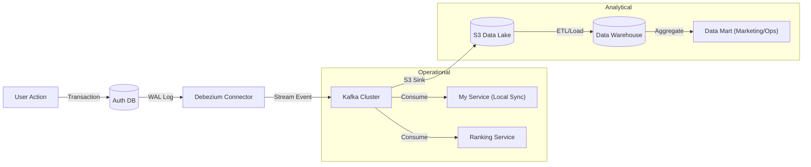

# CDC (Change Data Capture) Architecture Plan

## 1. 개요 (Overview)

본 문서는 **Eco2** 서비스의 데이터베이스 분리(Database per Service)를 지원하고, 실시간 데이터 기반의 서비스 고도화(Gamification, Analytics)를 달성하기 위한 **CDC(Change Data Capture)** 시스템 구축 계획입니다.

CDC는 데이터베이스의 변경사항(WAL)을 실시간 스트림으로 변환하여, 다운스트림 서비스나 데이터 레이크로 전달하는 기술입니다.

## 2. 도입 목적 (Why CDC?)

1.  **데이터베이스 물리적 분리 지원 (Operational)**:
    - `auth` DB의 변경사항을 실시간으로 `my` 서비스 등으로 전파하여, 직접적인 DB 조인 없이 데이터 일관성 유지.
    - 기존 Monolithic DB 구조를 안전하게 MSA 구조로 전환하는 핵심 연결 고리.
2.  **실시간 서비스 경험 제공 (Real-time Experience)**:
    - 사용자의 활동(Scan) 즉시 캐릭터 성장, 랭킹 반영 등 지연 없는 게이미피케이션 요소 구현.
3.  **데이터 분석 파이프라인 고도화 (Analytical)**:
    - **Data Lake (S3)**: 원본 데이터 영구 보관 및 AI 모델 학습용 데이터셋 구축.
    - **Data Warehouse (DW) & Data Mart (DM)**: 서비스 지표 분석, 마케팅 전략 수립 등을 위한 대용량 데이터 분석 환경 제공.

---

## 3. 아키텍처 구성 (Architecture)

### 3.1 기술 스택
- **Source DB**: PostgreSQL (Primary)
- **CDC Connector**: **Debezium** (Kafka Connect 기반)
- **Message Broker**: **Apache Kafka** (데이터 스트리밍 표준)
- **Operational Sink (Consumers)**:
  - `my-service`: 로컬 캐시 DB 동기화 (CQRS Read Model)
  - `character-service`: 경험치/레벨 실시간 계산
  - `elasticsearch`: 검색 인덱스 실시간 갱신 (Location 등)
- **Analytical Sink (Consumers)**:
  - **Data Lake**: `Amazon S3` (Kafka Connect S3 Sink) - Raw Data 저장.
  - **Data Warehouse**: `BigQuery` 또는 `PostgreSQL(OLAP)` - 통합 데이터 분석.
  - **Data Mart**: `Redis` (실시간 랭킹), `Materialized Views` (지표 대시보드).

### 3.2 데이터 흐름 (Data Flow)

### 3.3 인프라 구성 전략
CDC 파이프라인은 높은 처리량(Throughput)과 디스크 I/O를 요구하므로, 비즈니스 로직용 RabbitMQ와는 분리된 인프라를 사용합니다.

- **Kafka Nodes**: 최소 3대 (고가용성 보장)
- **Node Label**: `infra-type=streaming` (또는 `kafka`)
- **Taint**: `role=streaming:NoSchedule` (전용 노드 격리)

### 3.4 수집 대상 데이터 (Data Points)
Eco2 서비스의 핵심 기능(폐기물 분석 및 가이드)에서 발생하는 주요 데이터를 CDC로 수집하여 활용합니다.

1.  **Scan Transaction Data (분석 요청/결과)**
    - **Source**: `scan` Service DB
    - **Content**: 
        - 사용자 업로드 이미지 경로 (Raw/Processed)
        - LLM의 판단 결과 (분류 품목, 신뢰도 Score, 근거 텍스트)
        - RAG 검색에 사용된 문서 청크(Chunk) 및 관련성 점수
    - **Usage**: AI 모델 재학습(RLHF), RAG 성능 평가.

2.  **User Feedback Data (피드백)**
    - **Source**: `scan` / `my` Service DB
    - **Content**:
        - 사용자의 만족/불만족(Thumbs up/down)
        - 사용자가 수정한 올바른 정답 (Labeling Data)
    - **Usage**: 오답 노트 생성, 모델 튜닝을 위한 Golden Dataset 구축.

3.  **Performance Metrics (성능 지표)**
    - **Source**: `scan` Service DB (Log Table)
    - **Content**:
        - 분석 소요 시간 (Latency)
        - LLM 토큰 사용량 (Cost Analysis)
    - **Usage**: 비용 최적화, 응답 속도 개선 모니터링.

---

## 4. 구현 로드맵 (Roadmap)

전체 시스템 고도화 일정에 맞춘 단계별 도입 계획입니다.

### Phase 1: 인프라 구축 (Infrastructure)
- **목표**: Kafka 및 Kafka Connect(Debezium) 클러스터 구축.
- **작업**:
  - `terraform`으로 전용 노드 프로비저닝.
  - `Strimzi Operator` 또는 `Helm Chart`를 사용하여 Kafka 배포.
  - Debezium PostgreSQL Connector 플러그인 설치 확인.

### Phase 2: 파이프라인 연결 검증 (Pipeline POC)
- **목표**: `auth.users` 테이블의 변경사항이 Kafka 토픽으로 들어오는지 확인.
- **작업**:
  - PostgreSQL `wal_level=logical` 설정 확인.
  - Debezium Connector 설정 (`auth.users` 테이블 모니터링).
  - Kafka Console Consumer로 데이터 유입 확인 (`before`, `after` 필드 확인).

### Phase 3: 서비스 연동 및 DB 분리 (Service Integration)
- **목표**: `my` 서비스가 Kafka 이벤트를 받아 로컬 DB를 갱신.
- **작업**:
  - `my` 서비스에 Kafka Consumer 구현.
  - `UserCreated`, `UserUpdated` CDC 이벤트를 수신하여 `my.users_view` 테이블 Upsert 로직 구현.
  - 데이터 동기화 검증 후 `auth` DB 접근 코드 제거 (물리적 분리 완성).

### Phase 4: 분석 파이프라인 고도화 (Analytical Pipeline)
- **목표**: Data Lake 및 Warehouse 구축을 통한 데이터 기반 의사결정 체계 마련.
- **작업**:
  - **S3 Sink Connector** 설정: 모든 CDC 토픽을 S3 버킷(`s3://eco2-data-lake`)에 실시간 적재.
  - **DW 적재**: S3 데이터를 주기적으로(Daily/Hourly) DW로 로드하는 파이프라인 구축.
  - **AI 학습 연동**: `scan` 테이블의 이미지 경로와 분석 결과를 S3에서 추출하여 모델 재학습에 활용.
  - **Data Mart 구성**: 마케팅/운영 팀을 위한 지표 대시보드(Redash/Metabase 등) 연동.

---

## 5. 운영 고려사항

### 5.1 메시지 순서 보장 (Ordering)
- DB 변경 순서(Insert -> Update -> Delete)가 뒤바뀌면 데이터 정합성이 깨집니다.
- Kafka Partitioning Key를 `Primary Key` (예: `user_id`)로 설정하여, 동일 데이터의 변경은 반드시 동일 파티션/순서로 처리되도록 보장해야 합니다.

### 5.2 스키마 변경 대응 (Schema Evolution)
- 소스 DB 스키마가 변경(컬럼 추가 등)될 때 다운스트림 서비스가 깨지지 않도록 **Schema Registry** 도입을 고려합니다 (Avro 포맷 사용 권장).

### 5.3 초기 스냅샷 (Snapshot)
- Debezium 최초 실행 시 기존 DB의 모든 데이터를 한 번 읽어오는 **Initial Snapshot** 과정이 필요합니다. 이때 DB 부하가 발생할 수 있으므로 트래픽이 적은 시간에 수행합니다.

## 6. 결론
CDC 도입은 단순한 기술적 챌린지가 아니라, Eco2 서비스를 **"실시간 반응형 서비스"**로 진화시키는 핵심 동력입니다. 로깅(EFK)과 메시징(RabbitMQ)이 안정화된 후, Phase 3~4 단계에서 본격적으로 도입하여 데이터 중심의 아키텍처를 완성합니다.

## 7. 운영 효율화 전략 (1인 운영 환경)

현재 1인 운영 환경(GitOps, MSA, Infra 등 전체 관리)임을 고려하여, 분석 파이프라인(Phase 4)의 운영 부담을 최소화하는 현실적인 전략을 채택합니다.

### 7.1 Data Warehouse: BigQuery (SaaS) 도입
- **Zero Ops**: PostgreSQL 등 OLAP DB를 직접 구축/운영하는 대신, 완전 관리형 서비스인 **Google BigQuery**를 사용합니다.
- **장점**: 인프라 관리 불필요, 자동 확장, 초기 비용 무료(Free Tier 활용).
- **연동**: Kafka Connect BigQuery Sink 또는 S3 -> BigQuery 로드 방식을 사용.

### 7.2 속도 조절 (Phased Approach)
- **우선순위**:
    1.  **Logging (EFK)**: 운영 가시성 확보 (최우선).
    2.  **Messaging (RabbitMQ)**: 비즈니스 로직 결합도 해소.
    3.  **CDC (Kafka)**: DB 분리를 위한 기반 마련.
    4.  **DW/Analytics**: 데이터가 충분히 쌓인 후 도입 (Phase 4 이후).
- **대안 (초기 분석)**:
    - 복잡한 실시간 CDC 파이프라인 대신, 초기에는 `pg_dump`를 활용한 **일일 배치(Daily Batch)** 스크립트로 S3/BigQuery에 데이터를 적재하여 분석 니즈를 해소합니다.
    - 이를 통해 Kafka 운영 부담을 줄이고, 서비스 안정화에 집중합니다.
