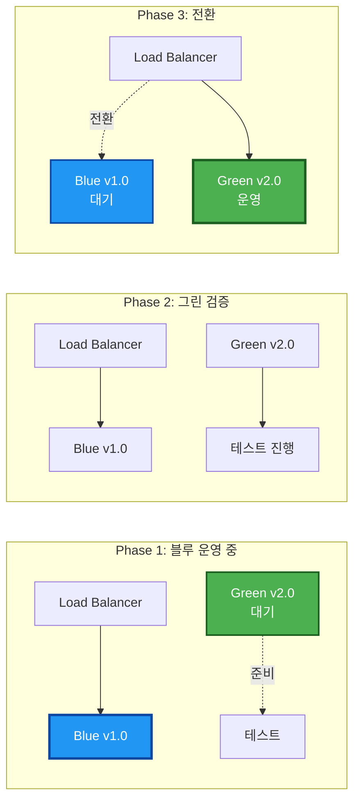
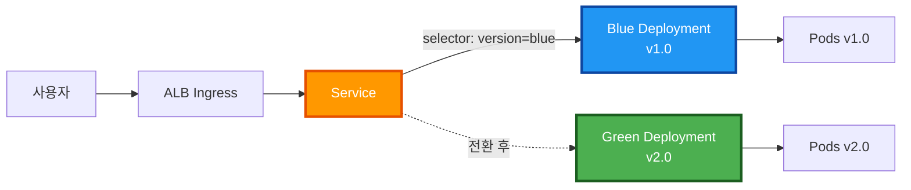
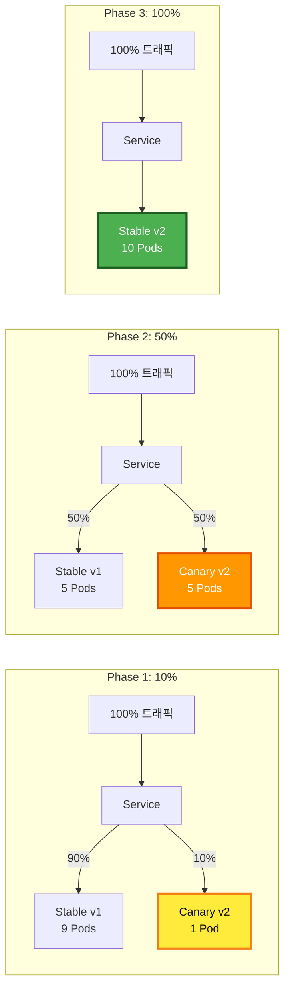
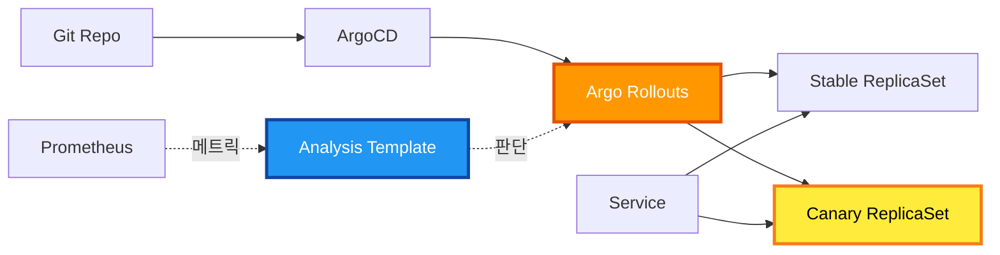

# 🚀 배포 전략 비교 및 선택

**블루-그린 vs 카나리 배포 전략 상세 분석**

- **작성일**: 2025-11-05
- **상태**: 📋 분석 완료, 구현 준비 중
- **우선순위**: 높음
- **선택된 전략**: 블루-그린 배포 (1차), 카나리 배포 (2차)

---

## 📋 목차

1. [배포 전략 개요](#배포-전략-개요)
2. [블루-그린 배포](#블루-그린-배포)
3. [카나리 배포](#카나리-배포)
4. [상세 비교 분석](#상세-비교-분석)
5. [현재 아키텍처 분석](#현재-아키텍처-분석)
6. [배포 전략 선택](#배포-전략-선택)
7. [구현 계획](#구현-계획)

---

## 🎯 배포 전략 개요

### 현재 상황

**적용 중인 전략**
- **Rolling Update**: Kubernetes 기본 배포 전략
- **설정**: maxSurge=1, maxUnavailable=0
- **특징**: 순차적 Pod 교체, 점진적 배포

**문제점**
- 문제 발생 시 일부 사용자에게 영향
- 롤백이 느림 (역순 Rolling Update)
- 트래픽 제어 불가능
- A/B 테스트 불가능

**요구사항**
- 무중단 배포
- 즉시 롤백 가능
- 프로덕션 리스크 최소화
- 점진적 트래픽 전환

---

## 🔵🟢 블루-그린 배포

### 개념

**정의**
- 두 개의 동일한 프로덕션 환경 유지
- **블루(Blue)**: 현재 운영 중인 버전
- **그린(Green)**: 새로운 버전
- 검증 후 트래픽을 그린으로 즉시 전환

**동작 원리**



### Kubernetes 구현 방법

#### 방법 1: Service Label Selector 변경 (권장)

**아키텍처**



**Kubernetes 리소스**

```yaml
---
# Blue Deployment (현재 운영 중)
apiVersion: apps/v1
kind: Deployment
metadata:
  name: backend-blue
  labels:
    app: backend
    version: blue
spec:
  replicas: 3
  selector:
    matchLabels:
      app: backend
      version: blue
  template:
    metadata:
      labels:
        app: backend
        version: blue
    spec:
      containers:
        - name: backend
          image: ghcr.io/org/backend:v1.0.0
          ports:
            - containerPort: 8000
          env:
            - name: VERSION
              value: "blue"
          resources:
            requests:
              memory: "256Mi"
              cpu: "100m"
            limits:
              memory: "512Mi"
              cpu: "500m"
          livenessProbe:
            httpGet:
              path: /health
              port: 8000
            initialDelaySeconds: 30
            periodSeconds: 10
          readinessProbe:
            httpGet:
              path: /ready
              port: 8000
            initialDelaySeconds: 5
            periodSeconds: 5

---
# Green Deployment (새 버전)
apiVersion: apps/v1
kind: Deployment
metadata:
  name: backend-green
  labels:
    app: backend
    version: green
spec:
  replicas: 3
  selector:
    matchLabels:
      app: backend
      version: green
  template:
    metadata:
      labels:
        app: backend
        version: green
    spec:
      containers:
        - name: backend
          image: ghcr.io/org/backend:v2.0.0
          ports:
            - containerPort: 8000
          env:
            - name: VERSION
              value: "green"
          resources:
            requests:
              memory: "256Mi"
              cpu: "100m"
            limits:
              memory: "512Mi"
              cpu: "500m"
          livenessProbe:
            httpGet:
              path: /health
              port: 8000
            initialDelaySeconds: 30
            periodSeconds: 10
          readinessProbe:
            httpGet:
              path: /ready
              port: 8000
            initialDelaySeconds: 5
            periodSeconds: 5

---
# Service (Label Selector로 트래픽 제어)
apiVersion: v1
kind: Service
metadata:
  name: backend
  labels:
    app: backend
spec:
  selector:
    app: backend
    version: blue  # 이 부분을 green으로 변경하여 전환
  ports:
    - name: http
      port: 8000
      targetPort: 8000
      protocol: TCP
  type: ClusterIP
```

**전환 명령**

```bash
# 1. Green 배포
kubectl apply -f backend-green-deployment.yaml

# 2. Green Pod 상태 확인
kubectl get pods -l version=green
kubectl logs -l version=green

# 3. Green 테스트 (ClusterIP로 직접 접근)
kubectl run -it --rm debug --image=curlimages/curl --restart=Never -- \
  curl http://backend-green:8000/health

# 4. Service를 Green으로 전환
kubectl patch service backend -p '{"spec":{"selector":{"version":"green"}}}'

# 5. 롤백 (문제 발생 시)
kubectl patch service backend -p '{"spec":{"selector":{"version":"blue"}}}'

# 6. Blue 스케일 다운 (안정화 후)
kubectl scale deployment backend-blue --replicas=0
```

**ArgoCD 통합**

```yaml
# argocd-app.yaml
apiVersion: argoproj.io/v1alpha1
kind: Application
metadata:
  name: backend
  namespace: argocd
spec:
  project: default
  source:
    repoURL: https://github.com/org/backend.git
    targetRevision: main
    path: k8s/blue-green
    helm:
      values: |
        blueGreen:
          activeVersion: blue  # blue 또는 green
          blue:
            image:
              tag: v1.0.0
            replicas: 3
          green:
            image:
              tag: v2.0.0
            replicas: 3
  destination:
    server: https://kubernetes.default.svc
    namespace: default
  syncPolicy:
    automated:
      prune: true
      selfHeal: true
```

### 장점

#### 1. 즉시 전환 및 롤백
- Service Label Selector만 변경 → 1초 이내 전환
- 문제 발생 시 즉시 롤백 가능
- DNS 변경 불필요

#### 2. 완전한 환경 격리
- Blue와 Green이 완전히 독립적
- 데이터베이스 마이그레이션 테스트 가능
- 리소스 충돌 없음

#### 3. 안전한 검증
- 프로덕션 트래픽 전환 전 완전한 테스트
- Smoke Test, Integration Test 수행 가능
- 실제 프로덕션 환경에서 검증

#### 4. 무중단 배포
- 사용자 영향 없음
- Downtime 0초
- 세션 유지 가능

### 단점

#### 1. 리소스 2배 소비
- Blue + Green 동시 운영 → 비용 2배
- 전환 기간 동안만 리소스 필요
- 스케일 다운으로 완화 가능

#### 2. 데이터베이스 동기화
- 상태 저장 애플리케이션 복잡
- 스키마 변경 시 호환성 고려
- 마이그레이션 전략 필요

#### 3. 점진적 전환 불가
- All-or-Nothing 전환
- 일부 사용자만 테스트 불가
- A/B 테스트 불가능

### 적용 시나리오

**적합한 경우**
- 대규모 업데이트
- 데이터베이스 마이그레이션 포함
- 완전한 검증 필요
- 즉시 롤백 필수

**부적합한 경우**
- 리소스 제약이 큰 경우
- 점진적 롤아웃 필요
- A/B 테스트 목적

---

## 🐦 카나리 배포

### 개념

**정의**
- 소수의 사용자에게 먼저 배포
- 점진적으로 트래픽 비율 증가
- 문제 감지 시 자동 롤백
- 메트릭 기반 자동 판단

**동작 원리**



### Argo Rollouts 구현 (권장)

**아키텍처**



**Rollout 리소스**

```yaml
apiVersion: argoproj.io/v1alpha1
kind: Rollout
metadata:
  name: backend
spec:
  replicas: 10
  revisionHistoryLimit: 5
  selector:
    matchLabels:
      app: backend
  template:
    metadata:
      labels:
        app: backend
    spec:
      containers:
        - name: backend
          image: ghcr.io/org/backend:v2.0.0
          ports:
            - containerPort: 8000
          resources:
            requests:
              memory: "256Mi"
              cpu: "100m"
            limits:
              memory: "512Mi"
              cpu: "500m"
  strategy:
    canary:
      # Canary 전략
      steps:
        # Step 1: 10% 트래픽
        - setWeight: 10
        - pause: {duration: 5m}
        
        # Step 2: 메트릭 분석
        - analysis:
            templates:
              - templateName: success-rate
              - templateName: latency
            args:
              - name: service-name
                value: backend
        
        # Step 3: 30% 트래픽
        - setWeight: 30
        - pause: {duration: 5m}
        
        # Step 4: 메트릭 분석
        - analysis:
            templates:
              - templateName: success-rate
              - templateName: latency
        
        # Step 5: 50% 트래픽
        - setWeight: 50
        - pause: {duration: 10m}
        
        # Step 6: 최종 분석
        - analysis:
            templates:
              - templateName: success-rate
              - templateName: latency
      
      # 자동 승격 설정
      autoPromotionEnabled: false
      
      # 트래픽 라우팅
      trafficRouting:
        # Kubernetes 네이티브 방식 (Pod 수 조절)
        # 또는 Istio, ALB 등 사용 가능

---
# Analysis Template: Success Rate
apiVersion: argoproj.io/v1alpha1
kind: AnalysisTemplate
metadata:
  name: success-rate
spec:
  args:
    - name: service-name
  metrics:
    - name: success-rate
      interval: 1m
      successCondition: result >= 0.95
      failureLimit: 3
      provider:
        prometheus:
          address: http://prometheus:9090
          query: |
            sum(rate(http_requests_total{
              service="{{args.service-name}}",
              status!~"5.."
            }[5m])) /
            sum(rate(http_requests_total{
              service="{{args.service-name}}"
            }[5m]))

---
# Analysis Template: Latency
apiVersion: argoproj.io/v1alpha1
kind: AnalysisTemplate
metadata:
  name: latency
spec:
  args:
    - name: service-name
  metrics:
    - name: latency-p95
      interval: 1m
      successCondition: result < 500  # 500ms 이하
      failureLimit: 3
      provider:
        prometheus:
          address: http://prometheus:9090
          query: |
            histogram_quantile(0.95,
              sum(rate(http_request_duration_seconds_bucket{
                service="{{args.service-name}}"
              }[5m])) by (le)
            ) * 1000
```

**Argo Rollouts 설치**

```bash
# 1. Argo Rollouts Controller 설치
kubectl create namespace argo-rollouts
kubectl apply -n argo-rollouts -f \
  https://github.com/argoproj/argo-rollouts/releases/latest/download/install.yaml

# 2. Kubectl Plugin 설치
curl -LO https://github.com/argoproj/argo-rollouts/releases/latest/download/kubectl-argo-rollouts-linux-amd64
chmod +x kubectl-argo-rollouts-linux-amd64
sudo mv kubectl-argo-rollouts-linux-amd64 /usr/local/bin/kubectl-argo-rollouts

# 3. Rollout 배포
kubectl apply -f backend-rollout.yaml

# 4. Rollout 상태 확인
kubectl argo rollouts get rollout backend --watch

# 5. 수동 승격
kubectl argo rollouts promote backend

# 6. 롤백
kubectl argo rollouts undo backend
```

**ArgoCD 통합**

```yaml
# argocd-app.yaml
apiVersion: argoproj.io/v1alpha1
kind: Application
metadata:
  name: backend
  namespace: argocd
spec:
  project: default
  source:
    repoURL: https://github.com/org/backend.git
    targetRevision: main
    path: k8s/rollouts
  destination:
    server: https://kubernetes.default.svc
    namespace: default
  syncPolicy:
    automated:
      prune: true
      selfHeal: true
```

**대시보드**

```bash
# Argo Rollouts Dashboard 실행
kubectl argo rollouts dashboard

# 브라우저에서 http://localhost:3100 접속
```

### 장점

#### 1. 점진적 롤아웃
- 10% → 30% → 50% → 100% 단계적 증가
- 소수 사용자에게 먼저 검증
- 영향 범위 최소화

#### 2. 메트릭 기반 자동 판단
- Prometheus 메트릭 실시간 분석
- 성공률, 레이턴시, 에러율 자동 확인
- 임계값 초과 시 자동 롤백

#### 3. 리소스 효율성
- 전체 리소스의 10%만 추가 필요
- Blue-Green보다 비용 효율적
- 동적 스케일링 가능

#### 4. 세밀한 제어
- 각 단계별 pause 설정
- 수동 승격 가능
- 트래픽 비율 조정

### 단점

#### 1. 복잡한 설정
- Argo Rollouts 도입 필요
- Analysis Template 작성 필요
- 학습 곡선 존재

#### 2. 느린 배포
- 단계별 대기 시간 필요
- 전체 배포 시간 20~30분
- 긴급 배포 불리

#### 3. 불완전한 격리
- Stable과 Canary가 동일 클러스터
- 리소스 공유로 간섭 가능
- 데이터베이스 공유

#### 4. 트래픽 라우팅 제약
- 기본 Kubernetes는 Pod 수로만 제어
- 정확한 % 제어는 Istio 등 필요
- ALB 통합 복잡

### 적용 시나리오

**적합한 경우**
- 마이크로서비스 환경
- 빈번한 배포
- 리소스 제약
- 메트릭 기반 자동화

**부적합한 경우**
- 빠른 롤백 필수
- 복잡한 설정 회피
- 즉시 전환 필요

---

## 📊 상세 비교 분석

### 기능 비교

| 항목 | 블루-그린 | 카나리 | Rolling Update |
|------|-----------|--------|----------------|
| **전환 속도** | ⚡⚡⚡ 즉시 (1초) | ⚡ 느림 (20~30분) | ⚡⚡ 중간 (5~10분) |
| **롤백 속도** | ⚡⚡⚡ 즉시 (1초) | ⚡⚡ 빠름 (1분) | ⚡ 느림 (5~10분) |
| **리소스 사용** | 💰💰💰 높음 (2배) | 💰💰 중간 (1.1배) | 💰 낮음 (1배) |
| **환경 격리** | 🔒🔒🔒 완전 격리 | 🔒 부분 격리 | 🔒 격리 없음 |
| **트래픽 제어** | ❌ 불가능 | ✅ 세밀한 제어 | ❌ 불가능 |
| **자동화** | ⭐⭐ 중간 | ⭐⭐⭐ 높음 | ⭐⭐⭐ 높음 |
| **복잡도** | ⭐⭐ 단순 | ⭐⭐⭐ 복잡 | ⭐ 매우 단순 |
| **메트릭 분석** | ❌ 수동 | ✅ 자동 | ❌ 불가능 |
| **다운타임** | ⭐⭐⭐ 0초 | ⭐⭐⭐ 0초 | ⭐⭐ 거의 0초 |

### 리스크 비교

| 리스크 유형 | 블루-그린 | 카나리 | Rolling Update |
|-------------|-----------|--------|----------------|
| **배포 실패 영향** | 🔴 높음 (100% 영향) | 🟢 낮음 (10~30% 영향) | 🟡 중간 (순차적 영향) |
| **데이터 손실 위험** | 🟡 중간 | 🟢 낮음 | 🟢 낮음 |
| **리소스 부족** | 🔴 높음 | 🟢 낮음 | 🟢 낮음 |
| **설정 오류** | 🟢 낮음 | 🟡 중간 | 🟢 낮음 |
| **롤백 실패** | 🟢 낮음 | 🟢 낮음 | 🟡 중간 |

### 비용 분석

**블루-그린 배포**
- 전환 시간 동안 리소스 2배
- 예시: 3 Pods → 6 Pods (30분)
- 월 비용: 기본 + 추가 2% (전환 시간 비율)

**카나리 배포**
- 단계별 리소스 증가
- 예시: 10 Pods → 11 Pods (30분)
- 월 비용: 기본 + 추가 1%

**Rolling Update**
- maxSurge=1 설정 시
- 예시: 10 Pods → 11 Pods (10분)
- 월 비용: 기본 + 추가 0.5%

### 배포 시간 비교

**블루-그린**
```
준비: 5분 (Green 배포 및 테스트)
전환: 1초 (Service 변경)
검증: 5분 (모니터링)
정리: 1분 (Blue 스케일 다운)
----
총: 약 11분
```

**카나리**
```
10% 배포: 5분
대기: 5분
분석: 1분
30% 배포: 5분
대기: 5분
분석: 1분
50% 배포: 5분
대기: 10분
분석: 1분
100% 배포: 5분
----
총: 약 43분
```

**Rolling Update**
```
순차 업데이트: 10분 (10 Pods)
검증: 5분
----
총: 약 15분
```

---

## 🏗️ 현재 아키텍처 분석

### 인프라 현황

**Kubernetes 클러스터 (7 노드)**

| 노드 | 역할 | 인스턴스 타입 | vCPU | RAM | 스토리지 | Workload |
|------|------|---------------|------|-----|----------|----------|
| **k8s-master** | Control Plane | t3.large | 2 | 8GB | 80GB | Control Plane + etcd |
| **k8s-worker-1** | Worker | t3.medium | 2 | 4GB | 40GB | Application Pods (FastAPI) |
| **k8s-worker-2** | Worker | t3.medium | 2 | 4GB | 40GB | Async Workers (Celery) |
| **k8s-rabbitmq** | Worker | t3.small | 2 | 2GB | 40GB | Message Queue |
| **k8s-postgresql** | Worker | t3.small | 2 | 2GB | 60GB | Database |
| **k8s-redis** | Worker | t3.small | 2 | 2GB | 30GB | Cache |
| **k8s-monitoring** | Worker | t3.large | 2 | 8GB | 60GB | Prometheus + Grafana |

**총 리소스**
- **vCPU**: 14 cores
- **RAM**: 30GB
- **스토리지**: 350GB
- **노드**: 7개 (1 Master + 6 Workers)

**네트워크 구성**
- **VPC CIDR**: 10.0.0.0/16
- **Public Subnets**: 3개 (10.0.1.0/24, 10.0.2.0/24, 10.0.3.0/24)
- **Availability Zones**: 3개 (ap-northeast-2a, 2b, 2c)
- **CNI**: Calico (Overlay Network)
- **Pod CIDR**: 192.168.0.0/16
- **Service CIDR**: 10.96.0.0/12

**배포 도구**
- ArgoCD (GitOps)
- Helm Charts
- GitHub Actions (CI)
- AWS ALB Ingress Controller

**모니터링**
- Prometheus (전용 노드)
- Grafana (전용 노드)
- Alertmanager

**현재 배포 전략**
- Rolling Update
- maxSurge: 1
- maxUnavailable: 0

### 노드 배치 전략

**AZ 분산**
```yaml
ap-northeast-2a:
  - k8s-master (Control Plane)
  - k8s-rabbitmq (Message Queue)

ap-northeast-2b:
  - k8s-worker-1 (Application)
  - k8s-postgresql (Database)

ap-northeast-2c:
  - k8s-worker-2 (Async Workers)
  - k8s-redis (Cache)
  - k8s-monitoring (Monitoring)
```

**Workload 분리**
- **Application Worker**: FastAPI 동기 API
- **Async Worker**: Celery 비동기 작업
- **Dedicated Services**: RabbitMQ, PostgreSQL, Redis, Monitoring

### 제약 사항

#### 1. 리소스 제약
- **Application Worker**: 2개 (worker-1, worker-2)
- **각 Worker**: 2 vCPU, 4GB RAM
- **전용 서비스 노드**: 리소스 예약됨
- **블루-그린 시**: Application Worker 2개로 충분

#### 2. Dedicated 노드 사용 불가
- RabbitMQ, PostgreSQL, Redis, Monitoring은 전용 노드
- Application Pod은 worker-1, worker-2에만 배포
- NodeSelector 또는 Taint/Toleration 필요

#### 3. 네트워킹
- **Calico CNI**: Overlay Network (VPC와 독립적)
- **ALB Ingress**: target-type=instance, NodePort 사용
- **Pod IP**: 192.168.0.0/16 (Overlay)
- **Service**: 10.96.0.0/12

### 강점

#### 1. 충분한 리소스
- **총 30GB RAM**: 블루-그린 배포 가능
- **14 vCPU**: 동시 워크로드 처리 가능
- **6개 Worker 노드**: 높은 가용성

#### 2. Workload 분리
- Application과 Infrastructure 분리
- 리소스 경합 최소화
- 안정적인 성능 보장

#### 3. ArgoCD GitOps
- 자동화된 배포 파이프라인
- Git 기반 상태 관리
- 롤백 용이

#### 4. Prometheus 모니터링
- 전용 모니터링 노드 (t3.large)
- 메트릭 수집 완비
- Alert 설정 가능
- Argo Rollouts Analysis 연동 가능

#### 5. ALB Ingress
- AWS 네이티브 통합
- Health Check 지원
- 자동 로드 밸런싱

---

## ✅ 배포 전략 선택

### 1차 선택: 블루-그린 배포

**선택 이유**

#### 1. 구현 단순성
- 추가 도구 불필요 (Kubernetes 기본 기능만 사용)
- ArgoCD와 완벽 호환
- 학습 곡선 낮음

#### 2. 즉시 롤백 가능
- 1초 이내 롤백
- 프로덕션 안정성 최우선
- 리스크 최소화

#### 3. 완전한 검증
- 프로덕션 트래픽 전환 전 완전한 테스트
- Smoke Test, Load Test 수행 가능
- 데이터베이스 마이그레이션 검증

#### 4. 현재 아키텍처 적합
- ALB Ingress와 완벽 호환
- Istio 불필요
- Service Label Selector만으로 구현

**리소스 최적화 방안**

```yaml
# Application Worker 노드에만 배포 (NodeSelector 사용)
blueGreen:
  # Node Selector로 Application Worker 지정
  nodeSelector:
    workload: application  # worker-1, worker-2
  
  # 평소: Blue만 운영
  blue:
    replicas: 3  # worker-1, worker-2에 분산
  green:
    replicas: 0  # 배포 시에만 3으로 증가
  
  # 리소스 요청
  resources:
    requests:
      memory: "256Mi"
      cpu: "100m"
    limits:
      memory: "512Mi"
      cpu: "500m"
  
  # 배포 프로세스
  # 1. Green replicas: 0 → 3
  # 2. Green 테스트 및 검증 (5분)
  # 3. Service 전환: blue → green (1초)
  # 4. Blue replicas: 3 → 0 (1시간 후)
  
  # 리소스 사용
  # 평소: 3 Pods x 512MB = 1.5GB
  # 배포 시: 6 Pods x 512MB = 3GB (30분)
  # Worker-1: 4GB, Worker-2: 4GB → 충분 ✅
```

**Application Worker 노드 확인**

```bash
# Worker 노드 라벨 확인
kubectl get nodes --show-labels | grep workload

# Worker 노드에 라벨 추가 (필요시)
kubectl label nodes k8s-worker-1 workload=application
kubectl label nodes k8s-worker-2 workload=application

# Application Pod만 조회
kubectl get pods -l app=backend -o wide
```

**배포 워크플로우**

```bash
# 1. Green 배포
kubectl apply -f backend-green-deployment.yaml
kubectl scale deployment backend-green --replicas=3

# 2. Green Ready 대기
kubectl wait --for=condition=available deployment/backend-green --timeout=300s

# 3. Green 테스트
./scripts/smoke-test.sh backend-green

# 4. Service 전환
kubectl patch service backend -p '{"spec":{"selector":{"version":"green"}}}'

# 5. 모니터링 (5분)
./scripts/monitor.sh backend 5m

# 6. Blue 스케일 다운 (문제 없으면 1시간 후)
sleep 3600
kubectl scale deployment backend-blue --replicas=0
```

### 2차 선택: 카나리 배포 (장기)

**도입 시기**: Phase 2 (블루-그린 안정화 후 3개월)

**선택 이유**

#### 1. 메트릭 기반 자동화
- Prometheus 메트릭 활용
- 자동 롤백
- 운영 부담 감소

#### 2. 점진적 롤아웃
- 10% → 30% → 50% → 100%
- 리스크 최소화
- A/B 테스트 가능

#### 3. 리소스 효율성
- 블루-그린보다 리소스 절약
- 장기적으로 비용 효율적

**도입 계획**

```yaml
# Phase 2 로드맵 (3개월)
month1:
  - Argo Rollouts Controller 설치
  - 개발 환경 PoC
  - Analysis Template 작성
  
month2:
  - 스테이징 환경 적용
  - 메트릭 수집 검증
  - 팀 교육
  
month3:
  - 프로덕션 파일럿
  - 모니터링 및 튜닝
  - 전체 서비스 적용
```

---

## 📋 구현 계획

### Phase 1: 블루-그린 배포 구현 (2주)

#### Week 1: 설계 및 개발

**Day 1-2: 설계**
- [ ] Helm Chart 구조 설계
- [ ] Blue/Green Deployment YAML 작성
- [ ] Service 전환 스크립트 작성
- [ ] 테스트 계획 수립

**Day 3-4: 개발**
- [ ] Helm Chart 구현
  - `templates/deployment-blue.yaml`
  - `templates/deployment-green.yaml`
  - `templates/service.yaml`
- [ ] 전환 스크립트 개발
  - `scripts/deploy-green.sh`
  - `scripts/switch-to-green.sh`
  - `scripts/rollback-to-blue.sh`

**Day 5: 테스트**
- [ ] 로컬 Kind 클러스터에서 테스트
- [ ] 전환 시나리오 테스트
- [ ] 롤백 시나리오 테스트

#### Week 2: 배포 및 검증

**Day 1-2: 스테이징 배포**
- [ ] 스테이징 환경 설정
- [ ] Blue 배포
- [ ] Green 배포 및 테스트
- [ ] 전환 테스트

**Day 3-4: 프로덕션 준비**
- [ ] 프로덕션 Helm Values 작성
- [ ] Runbook 작성
- [ ] 모니터링 대시보드 구성
- [ ] Alert 설정

**Day 5: 프로덕션 배포**
- [ ] 프로덕션 Blue 배포
- [ ] 첫 Green 배포 (낮은 트래픽 시간)
- [ ] 전환 및 모니터링
- [ ] 회고 및 문서화

### 디렉토리 구조

```
k8s/
├── blue-green/
│   ├── Chart.yaml
│   ├── values.yaml
│   ├── values-staging.yaml
│   ├── values-production.yaml
│   └── templates/
│       ├── deployment-blue.yaml
│       ├── deployment-green.yaml
│       ├── service.yaml
│       └── ingress.yaml
└── scripts/
    ├── deploy-green.sh
    ├── switch-to-green.sh
    ├── rollback-to-blue.sh
    ├── smoke-test.sh
    └── monitor.sh
```

### 필요한 리소스

**인력**
- DevOps 엔지니어: 1명 (풀타임)
- 백엔드 개발자: 1명 (파트타임, 테스트 지원)

**인프라**
- 추가 노드 불필요 (기존 리소스로 가능)
- 전환 시 일시적 리소스 증가 (30분)

**도구**
- 기존 ArgoCD 활용
- 기존 Prometheus/Grafana 활용
- 추가 도구 없음

---

## 🎯 성공 지표

### 기술 지표

**배포 성공률**
- 목표: 99% 이상
- 측정: 성공한 배포 / 전체 배포 시도

**롤백 시간**
- 목표: 1분 이내
- 측정: 문제 감지 → 이전 버전 복구

**다운타임**
- 목표: 0초
- 측정: Health Check 실패 시간

**배포 시간**
- 목표: 15분 이내
- 측정: Green 배포 시작 → Blue 스케일 다운

### 비즈니스 지표

**사용자 영향**
- 목표: 배포 중 에러율 증가 없음
- 측정: 에러율 (배포 전 1시간 vs 배포 중)

**서비스 가용성**
- 목표: 99.9% 이상 유지
- 측정: Uptime (월별)

**팀 생산성**
- 목표: 배포 횟수 2배 증가
- 측정: 주간 배포 횟수

---

## 📚 참고 자료

### 관련 문서
- [CI/CD 파이프라인](../architecture/CI_CD_PIPELINE.md)
- [최종 K8s 아키텍처](../architecture/final-k8s-architecture.md)
- [GitOps ArgoCD Helm](../deployment/gitops-argocd-helm.md)

### 외부 리소스
- [Kubernetes Blue-Green Deployment](https://kubernetes.io/blog/2018/04/30/zero-downtime-deployment-kubernetes-jenkins/)
- [Argo Rollouts Documentation](https://argoproj.github.io/argo-rollouts/)
- [Blue-Green vs Canary](https://www.redhat.com/en/topics/devops/what-is-blue-green-deployment)

---

## 📝 다음 단계

### 즉시 실행
1. **새 브랜치 생성**
   ```bash
   git checkout -b feature/blue-green-deployment
   ```

2. **Helm Chart 작성**
   - `k8s/blue-green/` 디렉토리 생성
   - Blue/Green Deployment 템플릿 작성

3. **스크립트 개발**
   - 전환 스크립트
   - 롤백 스크립트
   - 테스트 스크립트

### 검증
1. **로컬 테스트**
   - Kind 클러스터에서 검증
   - 전환/롤백 시나리오 테스트

2. **스테이징 배포**
   - 실제 환경 검증
   - 성능 테스트

3. **프로덕션 배포**
   - 낮은 트래픽 시간대 선택
   - 점진적 적용

---

**문서 버전**: 1.0  
**최종 업데이트**: 2025-11-05  
**작성자**: Infrastructure Team  
**상태**: ✅ 분석 완료, 구현 준비 완료  
**선택된 전략**: 블루-그린 배포 (1차), 카나리 배포 (2차)

