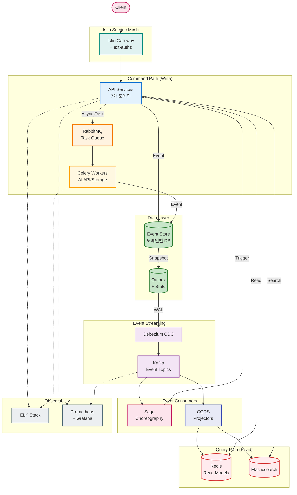
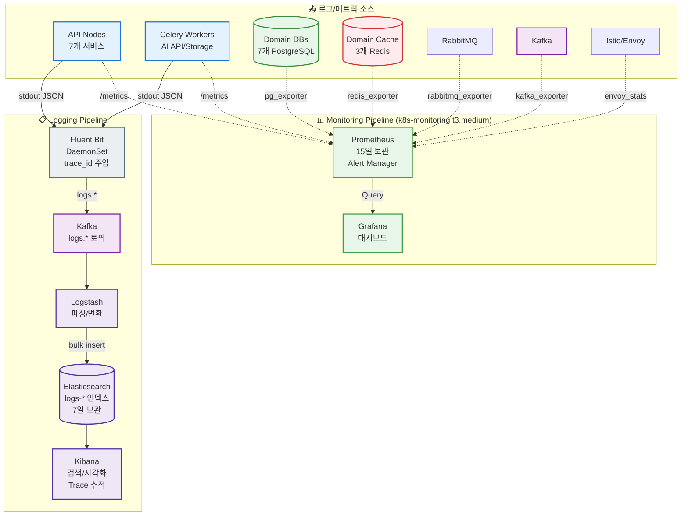
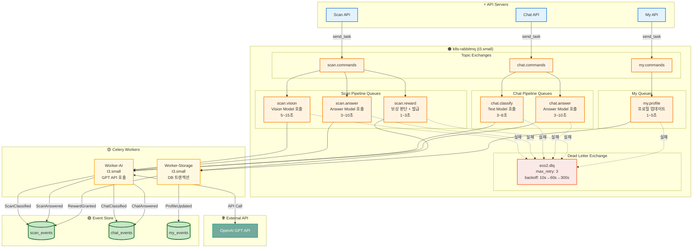
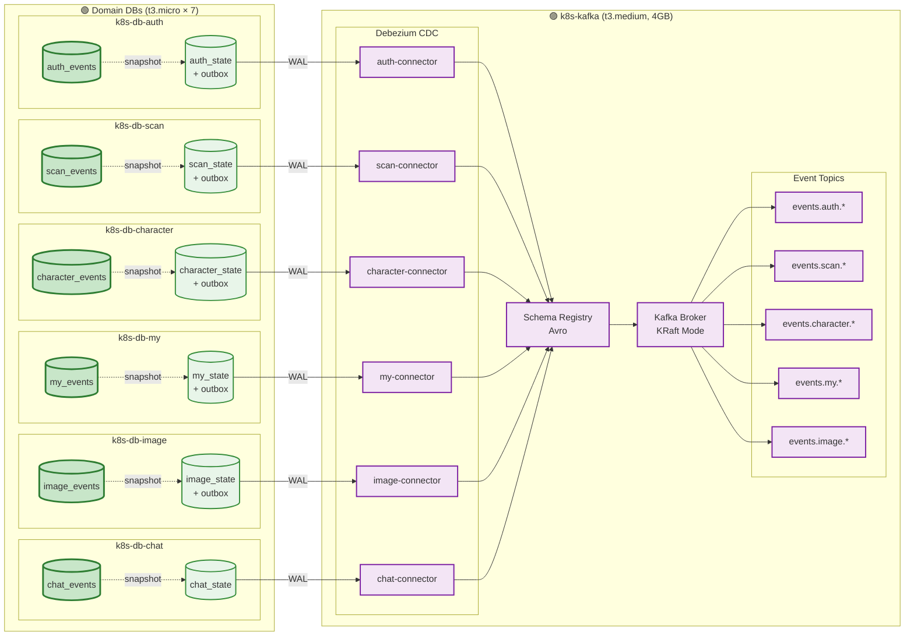

# 이코에코(Eco²) EDA 전환 로드맵: Observability → MQ → CDC → Event Sourcing

> 이전 글: [튜닝하다 진이 빠진 채로 잡담](https://rooftopsnow.tistory.com/25)

---

## 개요

지난 포스팅에서 Observability 보강과 Message Queue 도입 계획을 언급했었다.  
이코에코(Eco²) 백엔드는 현재 Istio Service Mesh 기반의 Kubernetes 클러스터 위에서 8개 도메인 서비스(auth, character, chat, scan, my, location, image, ext-authz)로 분리되어 운영 중이다. 

서비스 간 통신은 gRPC와 Envoy Proxy를 통해 이루어지며, 기본적인 메트릭 수집 환경은 구축되어 있다. 하지만 **진정한 클라우드 네이티브 아키텍처**로 나아가기 위해, 동기 통신의 한계를 극복하고 데이터 정합성을 보장할 수 있는 **EDA(Event-Driven Architecture)** 도입을 결정했다.

본 글에서는 현재 아키텍처의 상태를 진단하고, EDA로의 안정적인 전환을 위한 4단계 로드맵을 기술한다.

### 목표 아키텍처 개요



---

## 현재 아키텍처 상태 진단

EDA 전환을 위한 기반 작업은 상당 부분 진행되었다.

### ✅ 기반 구축 완료

| 구성 요소 | 상태 | 기술적 의의 |
|----------|------|------------|
| **도메인 분리** | ✅ 완료 | 7개 서비스로의 분리를 통해 이벤트 발행/구독의 경계(Bounded Context) 명확화 |
| **gRPC 마이그레이션** | ✅ 완료 | 내부 통신 프로토콜 표준화 및 동기 통신 구간의 병목 지점 식별 |
| **Istio Service Mesh** | ✅ 완료 | mTLS 보안 통신, 트래픽 제어, Envoy Sidecar를 통한 메트릭 수집 기반 마련 |
| **Observability (Metric)** | ✅ 완료 | Prometheus + Grafana를 통한 리소스 및 애플리케이션 상태 모니터링 |

특히 **gRPC 마이그레이션** 과정에서 Scan API와 Character API 간의 동기 호출 레이턴시 누적을 확인하였으며, 이를 통해 비동기 아키텍처 전환의 필요성이 구체화되었다.

### ⏳ 추가 필요 구성

```
RabbitMQ 노드        → 미구성 (k8s-rabbitmq 노드 존재)
Kafka/CDC 노드       → 신규 프로비저닝 필요
중앙 로깅 (ELK)      → 신규 프로비저닝 필요
물리적 DB 분리       → 현재 통합 DB 사용 중, 도메인별 분리 필요
Event Sourcing       → 도메인별 이벤트 저장소 설계 필요
```

위 요소를 일시에 도입할 경우 운영 복잡도가 급증할 위험이 있다. 따라서 의존성을 고려한 **단계별 도입 전략**을 수립하였다.

---

## 전환 로드맵: 4단계 접근 전략

안정적인 전환을 위해 의존성에 따라 다음 순서로 진행한다.

```
1️⃣ Observability  →  2️⃣ MQ (Async)  →  3️⃣ CDC (Consistency)  →  4️⃣ EDA (Architecture)
```

**단계별 수립 근거:**

1.  **Observability 선행**: 분산 환경에서 비동기 메시지 흐름을 추적(Tracing)할 수 없는 상태에서의 MQ 도입은 디버깅을 불가능하게 만든다.
2.  **MQ 도입**: 장기 실행 작업(Long-running Task)을 비동기로 분리하여 API 응답 속도를 개선한다.
3.  **CDC 도입**: 비동기 처리에 따른 데이터 정합성(이중 쓰기 문제)을 해결하기 위해 Transaction Log 기반의 이벤트 발행을 보장한다.
4.  **EDA 완성**: Saga Pattern과 CQRS를 적용하여 도메인 간 결합도를 낮추고 유연한 아키텍처를 완성한다.

---

## 1️⃣ Phase 0: Observability (Logging + Tracing)

> **"분산 트랜잭션의 가시성 확보"**

현재 메트릭 수집은 가능하나, **중앙화된 로깅 시스템의 부재**로 인해 요청의 구체적인 흐름을 파악하기 어렵다. 특히 MSA 환경에서는 단일 요청이 여러 서비스와 Pod를 거치기 때문에, 로그 파편화 문제는 치명적이다.

**Trace Context(Trace ID)** 기반의 분산 추적 환경 구축이 필수적이다.

### 구현 아키텍처



**핵심 목표:**
*   gRPC 요청, Celery Task, CDC 이벤트 등 모든 트랜잭션 단계에 동일한 `trace_id`를 전파한다.
*   단일 ID 검색만으로 HTTP 요청부터 비동기 작업 처리 결과까지의 전체 흐름을 역추적할 수 있어야 한다.

---

## 2️⃣ Phase 1: MQ (RabbitMQ + Celery)

> **"동기 통신 병목 해소"**

현재 Scan API의 이미지 분류 작업은 AI 모델의 응답 대기로 인해 **5~30초의 레이턴시**가 발생한다. 이는 사용자 경험을 저해할 뿐만 아니라, API 서버의 리소스를 점유하는 원인이 된다.

### AI Pipeline 구조

현재 AI 파이프라인은 **GPT API 호출 기반**으로 동작한다.

```
[AI Scan Pipeline]
Image → CDN_url → Vision Model (GPT) → Rule-based Retrieval → Answer Model (GPT)
                        │                                            │
                        ▼                                            ▼
                  classification                              disposal rules
                        │                                            │
                        └──────────────► 보상 여부 판단 ◄────────────┘
                                              │
                                    YES ──────┼────── NO
                                              ▼
                                      2레벨 분류라벨 매칭
                                              │
                                    YES ──────┼────── NO
                                              ▼
                                      캐릭터 발급 요청

[AI Chat Pipeline]
Text → Text Model (GPT) → Rule-based Retrieval → Answer Model (GPT) → 응답
              │                                          │
              ▼                                          ▼
        classification                            disposal rules
```

### 구현 아키텍처



### RabbitMQ + Celery 구성

**RabbitMQ**는 AI 파이프라인의 **단계별 비동기 처리**를 담당한다.

#### Exchange/Queue 전략

| Exchange | Queue | 작업 내용 | 예상 시간 | Worker |
|----------|-------|----------|----------|--------|
| `scan.commands` | `scan.vision` | Vision Model (GPT) 분류 | 5~15초 | AI |
| `scan.commands` | `scan.answer` | Answer Model (GPT) 응답 생성 | 3~10초 | AI |
| `scan.commands` | `scan.reward` | 보상 판단 + 캐릭터 발급 요청 | 1~3초 | Storage |
| `chat.commands` | `chat.classify` | Text Model (GPT) 분류 | 3~8초 | AI |
| `chat.commands` | `chat.answer` | Answer Model (GPT) 응답 생성 | 3~10초 | AI |
| `my.commands` | `my.profile` | 프로필 대량 업데이트 | 1~5초 | Storage |

#### Pipeline 실행 흐름

```
[Scan Pipeline - Chained Tasks]
1. scan.vision   → Vision Model API 호출 → ScanClassified 이벤트
2. scan.answer   → Rule-based Retrieval (동기) + Answer Model API 호출 → ScanAnswered 이벤트
3. scan.reward   → 보상 여부 판단 → 2레벨 매칭 → 캐릭터 발급 요청 → RewardGranted 이벤트

[Chat Pipeline - Chained Tasks]
1. chat.classify → Text Model API 호출 → ChatClassified 이벤트
2. chat.answer   → Rule-based Retrieval (동기) + Answer Model API 호출 → ChatAnswered 이벤트
```

*   **Rule-based Retrieval**: 로컬 JSON 기반 검색으로 지연 시간이 짧아 별도 Queue 없이 Answer Task 내에서 동기 처리.
*   **Chained Tasks**: Celery의 `chain()` 또는 이벤트 기반으로 단계별 순차 실행.

#### 안정성 확보 (DLQ)

*   **GPT API 실패**: Rate Limit, Timeout 등 외부 API 오류 시 Exponential Backoff로 3회 재시도.
*   **최종 실패**: Dead Letter Queue(DLQ)로 격리하여 메시지 유실 방지 및 수동 재처리 지원.
*   **리소스**: `t3.small` (2GB) 노드에 Quorum Queue를 구성하여 내구성 확보.

---

## 3️⃣ Phase 2: CDC (Debezium → Kafka)

> **"데이터 정합성 및 이중 쓰기 문제 해결"**

MQ 도입 시 **Dual Write Problem**(DB 커밋은 성공했으나 메시지 발행은 실패하는 현상)이 발생할 수 있다. 이를 해결하기 위해 **Outbox Pattern**과 **CDC(Change Data Capture)**를 도입한다.

### 구현 아키텍처



### Outbox Pattern & CDC Flow

각 AI Pipeline 단계에서 발생하는 이벤트를 Outbox 테이블에 기록한다.

```python
# Scan Pipeline - 단계별 이벤트 발행
async with db.transaction():
    # Vision Model 완료 시
    await outbox_repo.insert({
        "event_type": "ScanClassified",
        "aggregate_id": scan_id,
        "payload": {"category": "plastic", "situation": "recyclable"}
    })

async with db.transaction():
    # Answer Model 완료 시
    await outbox_repo.insert({
        "event_type": "ScanAnswered", 
        "aggregate_id": scan_id,
        "payload": {"disposal_rules": [...], "answer": "..."}
    })

async with db.transaction():
    # 보상 지급 완료 시
    await outbox_repo.insert({
        "event_type": "RewardGranted",
        "aggregate_id": scan_id,
        "payload": {"character_id": "char_001", "reward_type": "character"}
    })
```

#### CDC 이벤트 타입

| Domain | Event Type | 발생 시점 | Saga Trigger |
|--------|------------|----------|--------------|
| Scan | `ScanClassified` | Vision Model 분류 완료 | - |
| Scan | `ScanAnswered` | Answer Model 응답 완료 | - |
| Scan | `RewardGranted` | 보상 판단 + 캐릭터 발급 완료 | Character 서비스 |
| Chat | `ChatClassified` | Text Model 분류 완료 | - |
| Chat | `ChatAnswered` | Answer Model 응답 완료 | - |
| Character | `CharacterAcquired` | 캐릭터 획득 | My 서비스 |
| My | `ProfileUpdated` | 프로필 업데이트 | Notification |

1.  각 Pipeline 단계 완료 시 Outbox 테이블에 이벤트 기록 (트랜잭션 내).
2.  **Debezium Connector**가 WAL을 감지하여 Kafka로 발행.
3.  **At-least-once** 전송을 보장하며, Consumer는 Idempotency로 중복 처리.

---

## 4️⃣ Phase 3: EDA (Saga + CQRS + Event Sourcing)

> **"Event-Driven Architecture 완성"**

CDC를 통해 신뢰할 수 있는 이벤트 스트림이 확보되면, 본격적인 EDA 패턴을 적용한다.

### 구현 아키텍처



```mermaid
flowchart TB
    classDef kafkaStyle fill:#f3e5f5,stroke:#7b1fa2,stroke-width:2px
    classDef sagaStyle fill:#fce4ec,stroke:#c2185b,stroke-width:2px
    classDef apiStyle fill:#e3f2fd,stroke:#1976d2,stroke-width:2px
    classDef cqrsStyle fill:#e8eaf6,stroke:#3f51b5,stroke-width:2px
    classDef redisStyle fill:#ffebee,stroke:#d32f2f,stroke-width:2px
    classDef elkStyle fill:#ede7f6,stroke:#512da8,stroke-width:2px

    subgraph Kafka["🟣 Kafka Topics"]
        subgraph ScanTopics["events.scan.*"]
            E_CLASSIFIED[ScanClassified]
            E_ANSWERED[ScanAnswered]
            E_REWARD[RewardGranted]
        end
        subgraph ChatTopics["events.chat.*"]
            E_CHAT_CLS[ChatClassified]
            E_CHAT_ANS[ChatAnswered]
        end
        T_CHAR[events.character.*]
        T_MY[events.my.*]
        T_AUTH[events.auth.*]
    end

    subgraph Saga["💃 Saga Choreography"]
        SAGA_REWARD[RewardGranted<br/>→ CharacterService]
        SAGA_CHAR[CharacterAcquired<br/>→ MyService]
        SAGA_MY[ProfileUpdated<br/>→ Notification]
        SAGA_COMP[*Failed<br/>→ Compensate]
    end

    subgraph APIs["⚡ API Services"]
        CHAR_API[Character API]
        MY_API[My API]
        SCAN_API[Scan API]
        NOTIFY[Notification]
    end

    subgraph CQRS["📖 CQRS Projectors"]
        PROJ_SCAN[Scan Projector<br/>분류/응답 기록]
        PROJ_CHAT[Chat Projector<br/>대화 이력]
        PROJ_CHAR[Character Projector]
        PROJ_MY[My Projector]
        PROJ_AUTH[Auth Projector]
    end

    subgraph ReadModels["📚 Read Models"]
        R_CHAR[(Redis<br/>char:ranking)]
        RM_ES[(Elasticsearch<br/>검색/분석)]
        R_AUTH[(Redis<br/>auth:blacklist)]
    end

    %% Saga Flow
    E_REWARD -->|"캐릭터 발급 요청"| SAGA_REWARD
    SAGA_REWARD --> CHAR_API
    T_CHAR -->|"CharacterAcquired"| SAGA_CHAR
    SAGA_CHAR --> MY_API
    T_MY -->|"ProfileUpdated"| SAGA_MY
    SAGA_MY --> NOTIFY
    
    E_REWARD -.->|"발급 실패"| SAGA_COMP
    T_CHAR -.->|"*Failed"| SAGA_COMP
    SAGA_COMP -.->|"Compensate"| SCAN_API

    %% CQRS Flow
    E_CLASSIFIED --> PROJ_SCAN
    E_ANSWERED --> PROJ_SCAN
    E_CHAT_CLS --> PROJ_CHAT
    E_CHAT_ANS --> PROJ_CHAT
    T_CHAR --> PROJ_CHAR
    T_MY --> PROJ_MY
    T_AUTH --> PROJ_AUTH

    PROJ_CHAR --> R_CHAR
    PROJ_SCAN --> RM_ES
    PROJ_CHAT --> RM_ES
    PROJ_MY --> RM_ES
    PROJ_AUTH --> R_AUTH

    class E_CLASSIFIED,E_ANSWERED,E_REWARD,E_CHAT_CLS,E_CHAT_ANS,T_CHAR,T_MY,T_AUTH kafkaStyle
    class SAGA_REWARD,SAGA_CHAR,SAGA_MY,SAGA_COMP sagaStyle
    class CHAR_API,MY_API,SCAN_API,NOTIFY apiStyle
    class PROJ_SCAN,PROJ_CHAT,PROJ_CHAR,PROJ_MY,PROJ_AUTH cqrsStyle
    class R_CHAR,R_AUTH redisStyle
    class RM_ES elkStyle
```

### Saga Choreography

중앙 오케스트레이터 없이 이벤트 구독만으로 도메인 간 비즈니스 프로세스를 연결한다.

```
[Scan Pipeline Event Chain]
1. ScanClassified    → Scan Projector (ES 인덱싱)
2. ScanAnswered      → Scan Projector (ES 인덱싱)
3. RewardGranted     → Character 서비스 (캐릭터 발급)
4. CharacterAcquired → My 서비스 (프로필 업데이트)
5. ProfileUpdated    → Notification (푸시 알림)

[Chat Pipeline Event Chain]
1. ChatClassified    → Chat Projector (ES 인덱싱)
2. ChatAnswered      → Chat Projector (대화 이력 저장)
```

AI Pipeline의 각 단계에서 발생하는 이벤트가 독립적으로 처리되며, **RewardGranted** 이벤트만 Saga를 트리거하여 다음 도메인으로 전파된다. 서비스 간 직접적인 결합(Coupling)을 제거하여 독립적인 배포와 확장이 가능해진다.

### CQRS & Event Sourcing

*   **Event Sourcing**: 모든 도메인의 상태 변경 이력을 `Event Store`에 저장하여 데이터의 완전성을 보장한다. (Audit Log 역할 포함)
*   **CQRS**: 명령(Write)과 조회(Read) 모델을 분리한다.
    *   **Write**: Event Store (Append-only)
    *   **Read**: Kafka Consumer(Projector)가 이벤트를 구독하여 Redis나 Elasticsearch에 최적화된 조회 모델을 생성.

---

## 인프라 구조 변경: 도메인별 물리적 분리

EDA의 장점인 장애 격리와 독립적인 스케일링을 극대화하기 위해, 통합되어 있던 DB와 Cache 노드를 도메인별로 물리적으로 분리한다.

```
[AS-IS] 통합 노드
- k8s-postgresql (t3.large)
- k8s-redis (t3.medium)

[TO-BE] 도메인별 분리 (Micro Instances)
- Domain DBs (t3.micro × 7): 각 도메인 전용 DB 및 Event Store
- Domain Caches (t3.micro × 3): auth(BlackList/Session), character(Ranking), location(Geo)
```

이를 통해 특정 도메인의 부하가 전체 시스템에 영향을 주는 것을 방지(Bulkhead Pattern)하며, 오히려 통합 노드 대비 비용 효율적인 구성이 가능하다.

---

## 향후 계획

현재 아키텍처는 프로덕션 레벨의 안정성과 확장성을 확보하기 위한 과도기적 단계에 있다.

1.  **Observability 구축**: 금주 내 Fluent Bit DaemonSet 배포 및 Trace ID 표준 수립을 최우선으로 진행한다.
2.  **비동기 전환**: RabbitMQ를 도입하여 Scan API의 동기 대기 구간을 비동기로 전환한다.
3.  **CDC 파이프라인**: Kafka 클러스터 및 Debezium 구성을 통해 데이터 파이프라인의 신뢰성을 확보한다.

단계별 도입을 통해 시스템의 복잡도를 관리하며, 완전한 형태의 EDA로 전환하는 것이 목표다.

EDA는 학습곡선이 높은 아키텍처 패턴이다. Eventual Consistency, Idempotency, Saga, Outbox Pattern, CQRS 등 기존의 CRUD 기반 사고방식과는 다른 개념들을 이해해야 한다. 따라서 구현 과정에서 마주치는 필수 지향점과 핵심 패턴들을 별도의 학습 자료로 정리하며 진행할 예정이다.

---

## 참고

- [GitHub: eco2-team/backend](https://github.com/eco2-team/backend)
- [이코에코 GitOps 구축기 시리즈](https://rooftopsnow.tistory.com/)
- [이코에코 Service Mesh: Istio 도입](https://rooftopsnow.tistory.com/)

