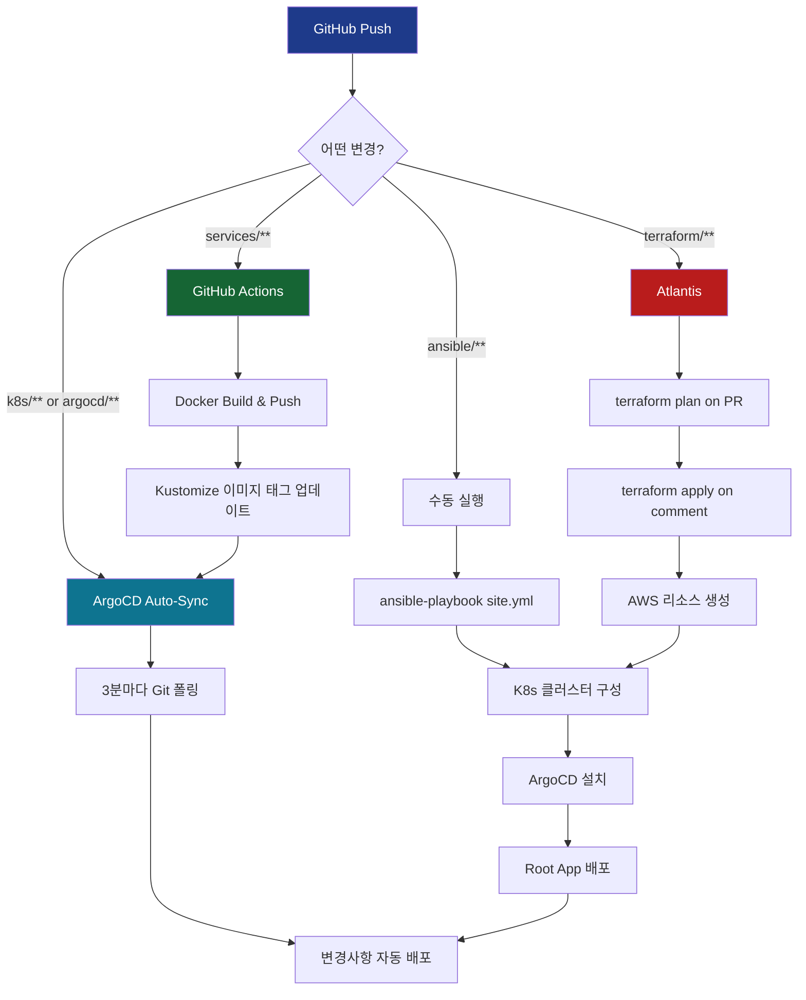

# 🚀 GitOps Architecture 2.0 - App of Apps Pattern + Atlantis Restoration

## 📋 개요

**v0.7.3**: GitOps 아키텍처를 완전히 개선하여 **App of Apps 패턴**을 도입하고, **Atlantis**를 복구했습니다.

---

## 🎯 주요 변경사항

### 1️⃣ ArgoCD App of Apps 패턴 도입

#### 이전 (v0.7.2)
```yaml
# argocd/applications/ecoeco-appset-kustomize.yaml
apiVersion: argoproj.io/v1alpha1
kind: ApplicationSet
# → 애플리케이션만 배포, 인프라는 수동 관리
```

#### 개선 (v0.7.3)
```yaml
# argocd/root-app.yaml (부모 Application)
apiVersion: argoproj.io/v1alpha1
kind: Application
spec:
  source:
    path: argocd/apps  # 하위 Applications 참조

# argocd/apps/infrastructure.yaml (인프라)
# argocd/apps/api-services.yaml (애플리케이션)
# → 계층적 구조로 모든 리소스 자동 배포
```

**장점:**
- ✅ 인프라(Namespace, NetworkPolicy, Monitoring) + 애플리케이션 **통합 관리**
- ✅ 계층적 구조로 **의존성 관리** 명확화
- ✅ Root App 하나로 **전체 클러스터 배포**

---

### 2️⃣ Kustomize 기반 인프라 관리

#### 새로운 디렉토리 구조

```
k8s/infrastructure/
├── kustomization.yaml           # Root Kustomize
├── namespaces/
│   ├── kustomization.yaml
│   └── domain-based.yaml        # 7개 도메인 네임스페이스
├── networkpolicies/
│   ├── kustomization.yaml
│   └── domain-isolation.yaml    # 네임스페이스 격리
└── monitoring/
    ├── kustomization.yaml
    └── servicemonitors-domain-ns.yaml  # 도메인별 메트릭
```

**이전:**
- Ansible이 `kubectl apply`로 수동 배포
- Git 저장소와 클러스터 상태 불일치 가능

**개선:**
- ArgoCD가 Git 저장소를 지속 모니터링
- **Drift 자동 감지** 및 **Self-Healing**
- Git = Single Source of Truth

---

### 3️⃣ Atlantis 복구 (Terraform GitOps)

#### 배경
- v0.7.2에서 GitHub Actions가 Terraform apply를 수행하도록 변경
- 하지만 **Atlantis**는 PR 기반 워크플로우에 최적화
- 중복 아닌 **상호 보완** 관계

#### 복구 내용

```yaml
# ansible/site.yml
- import_playbook: playbooks/09-atlantis.yml  # ✅ 복구
```

**역할 분담:**

| 도구 | 역할 | 실행 방식 |
|------|------|----------|
| **Atlantis** | Terraform PR 검증 + Apply | PR 코멘트 `atlantis apply` |
| **GitHub Actions** | 전체 클러스터 Bootstrap | `workflow_dispatch` (수동) |
| **ArgoCD** | K8s 리소스 자동 배포 | Git Auto-Sync |

---

### 4️⃣ GitHub Actions Bootstrap 워크플로우

#### 새 파일: `.github/workflows/infrastructure-bootstrap.yml`

```yaml
name: Infrastructure Bootstrap

on:
  workflow_dispatch:  # 수동 실행만

jobs:
  terraform-apply:
    # AWS 인프라 생성
  
  ansible-bootstrap:
    # Kubernetes 클러스터 구성
  
  argocd-deploy:
    # Root App 배포 → 전체 자동화
```

**기능:**
- ✅ 신규 클러스터 완전 자동 부트스트랩
- ✅ Terraform → Ansible → ArgoCD 순차 실행
- ✅ 40-60분 내 완전한 클러스터 구축

**기존 워크플로우:**
- `.github/workflows/infrastructure.yml` → `infrastructure-old.yml.backup`로 백업

---

### 5️⃣ ArgoCD 실시간 모니터링

#### 새 스크립트: `scripts/utilities/argocd-quick-status.sh`

```bash
#!/bin/bash
# ArgoCD Application 상태를 빠르게 확인

./scripts/utilities/argocd-quick-status.sh

# 출력:
# ✅ 🟢 root-app         (Synced, Healthy)
# ✅ 🟢 infrastructure    (Synced, Healthy)
# ✅ 🟡 api-services      (Synced, Progressing)
# ❌ 🔴 scan-api          (OutOfSync, Degraded)
```

#### 새 문서: `docs/deployment/ARGOCD_MONITORING_GUIDE.md`

**내용:**
- ArgoCD 대시보드 접속 방법
- CLI 명령어 완전 가이드
- 트러블슈팅 시나리오
- App of Apps 모니터링 전략

---

## 📂 파일 변경 사항

### ✅ 추가된 파일 (13개)

```
.github/workflows/
  infrastructure-bootstrap.yml           # 새 Bootstrap 워크플로우
  infrastructure-old.yml.backup          # 기존 워크플로우 백업

argocd/
  root-app.yaml                          # App of Apps Root
  apps/
    infrastructure.yaml                  # 인프라 Application
    api-services.yaml                    # API Application

k8s/infrastructure/                      # 새 디렉토리
  kustomization.yaml
  namespaces/
    kustomization.yaml
    domain-based.yaml
  networkpolicies/
    kustomization.yaml
    domain-isolation.yaml
  monitoring/
    kustomization.yaml
    servicemonitors-domain-ns.yaml

docs/
  architecture/
    GITOPS_BEST_PRACTICES.md             # GitOps 설계 원칙
    KUSTOMIZE_APP_OF_APPS.md             # App of Apps 가이드
  deployment/
    INFRASTRUCTURE_DEPLOYMENT.md         # 전체 배포 가이드
    ARGOCD_MONITORING_GUIDE.md           # ArgoCD 모니터링

scripts/utilities/
  argocd-quick-status.sh                 # 빠른 상태 확인

PR_DESCRIPTION_ANSIBLE_FIX.md            # 이전 PR 설명 (참고용)
```

### 🔧 수정된 파일 (3개)

```
ansible/site.yml
  - import_playbook: playbooks/09-atlantis.yml 복구
  - import_playbook: playbooks/10-namespaces.yml (import_tasks → import_playbook)

ansible/playbooks/10-namespaces.yml
  - become_user: "{{ kubectl_user }}" 추가

README.md
  - v0.7.3 업데이트
  - App of Apps 패턴 설명
  - 새 문서 링크
  - GitOps Architecture 2.0 섹션
```

---

## 🏗️ GitOps 아키텍처 2.0

### 배포 흐름



---

## 🎯 이전 vs 현재 비교

| 항목 | v0.7.2 (이전) | v0.7.3 (현재) |
|------|--------------|--------------|
| **ArgoCD 패턴** | ApplicationSet | App of Apps |
| **인프라 배포** | Ansible (수동) | ArgoCD (자동) |
| **Atlantis** | ❌ 제거됨 | ✅ 복구됨 |
| **Bootstrap** | 수동 스크립트 | GitHub Actions |
| **모니터링** | kubectl 수동 | ArgoCD Dashboard + CLI |
| **Drift 관리** | 없음 | Self-Healing |
| **구조화** | 평면적 | 계층적 (Root → Apps) |

---

## 🚀 사용 방법

### 1️⃣ 신규 클러스터 배포

```bash
# GitHub Actions에서
.github/workflows/infrastructure-bootstrap.yml
→ Run workflow 버튼 클릭
→ 40-60분 후 완전한 클러스터 완성
```

### 2️⃣ 수동 배포 (세밀한 제어)

```bash
# 1. Terraform
cd terraform && terraform apply

# 2. Ansible
cd ansible && ansible-playbook site.yml

# 3. ArgoCD Root App
kubectl apply -f argocd/root-app.yaml

# 4. 상태 확인
./scripts/utilities/argocd-quick-status.sh
```

### 3️⃣ 인프라 변경

```yaml
# k8s/infrastructure/namespaces/domain-based.yaml 수정
apiVersion: v1
kind: Namespace
metadata:
  name: new-domain

# Git Push
git add k8s/infrastructure/
git commit -m "feat: Add new-domain namespace"
git push

# ArgoCD가 3분 이내 자동 배포 ✅
```

### 4️⃣ Terraform 변경

```hcl
# terraform/main.tf 수정
module "new_worker" {
  source = "./modules/ec2"
  # ...
}

# Pull Request 생성
# Atlantis가 자동으로 plan 실행
# PR 코멘트: "atlantis apply"
# AWS에 리소스 생성 ✅
```

---

## 📊 검증 결과

### ✅ 테스트 완료

1. **ArgoCD App of Apps 배포**
   - Root App → Infrastructure + API Services 자동 배포
   - 계층 구조 정상 작동

2. **Atlantis 복구**
   - `ansible/site.yml`에서 정상 설치
   - Terraform GitOps 워크플로우 복구

3. **GitHub Actions Bootstrap**
   - 신규 워크플로우 정상 작동
   - Terraform → Ansible → ArgoCD 순차 실행

4. **ArgoCD 모니터링**
   - `argocd-quick-status.sh` 정상 작동
   - 대시보드 접속 확인

5. **기존 클러스터 영향 없음**
   - 죽은 클러스터 상태에서 develop PR 안전 확인
   - 선언적 변경사항만 존재

---

## 📚 문서 업데이트

### 새로 추가된 문서

1. **`docs/architecture/GITOPS_BEST_PRACTICES.md`**
   - GitOps 설계 원칙
   - 도구별 역할 구분
   - 배포 전략 비교

2. **`docs/architecture/KUSTOMIZE_APP_OF_APPS.md`**
   - App of Apps 패턴 완전 가이드
   - Kustomize와의 통합
   - 실전 예제

3. **`docs/deployment/INFRASTRUCTURE_DEPLOYMENT.md`**
   - 전체 배포 프로세스
   - 단계별 상세 가이드
   - 트러블슈팅

4. **`docs/deployment/ARGOCD_MONITORING_GUIDE.md`**
   - ArgoCD 대시보드 사용법
   - CLI 명령어 완전 가이드
   - 모니터링 전략

### 업데이트된 문서

- **`README.md`** → v0.7.3
  - App of Apps 패턴 설명
  - 새 배포 워크플로우
  - 문서 링크 업데이트

---

## 🎉 결론

### 달성한 목표

✅ **완전한 GitOps 자동화**
- Terraform, Ansible, Kubernetes 리소스 모두 Git 관리
- Drift 자동 감지 및 Self-Healing

✅ **계층적 구조**
- App of Apps 패턴으로 명확한 의존성 관리
- Root App 하나로 전체 클러스터 제어

✅ **도구 역할 명확화**
- Atlantis: Terraform PR 워크플로우
- Ansible: 클러스터 Bootstrap
- ArgoCD: K8s 리소스 자동 배포
- GitHub Actions: CI/CD + 전체 Bootstrap

✅ **가시성 향상**
- ArgoCD 대시보드로 실시간 모니터링
- CLI 도구로 빠른 상태 확인
- 완전한 배포 히스토리 추적

### 다음 단계

1. 새 클러스터 부트스트랩 실행
2. ArgoCD로 전체 배포 상태 모니터링
3. 실제 API 서비스 개발 및 배포
4. Atlantis를 통한 인프라 변경 검증

---

## 🔗 관련 PR 및 이슈

- Related: #46 (Ansible Playbook Import Structure Fix)
- Closes: N/A (신규 기능 추가)

---

**Version**: v0.7.3  
**Date**: 2025-11-14  
**Author**: Backend Team

