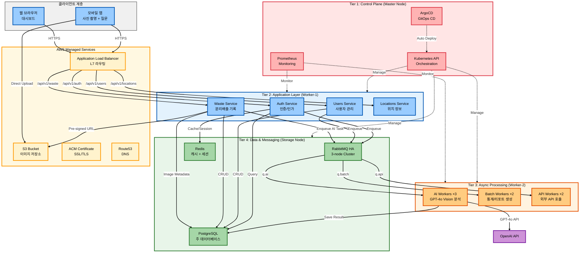
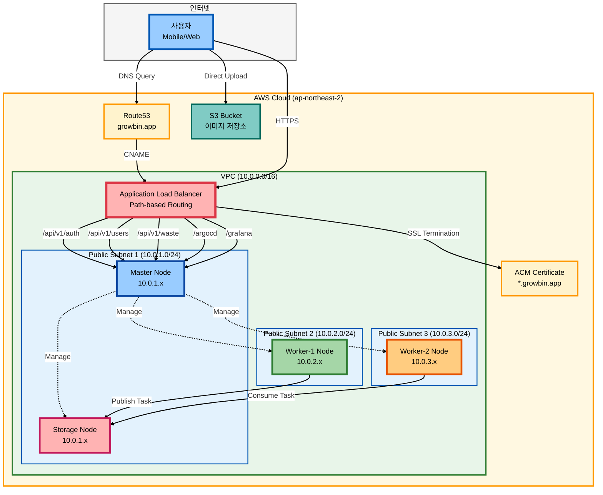
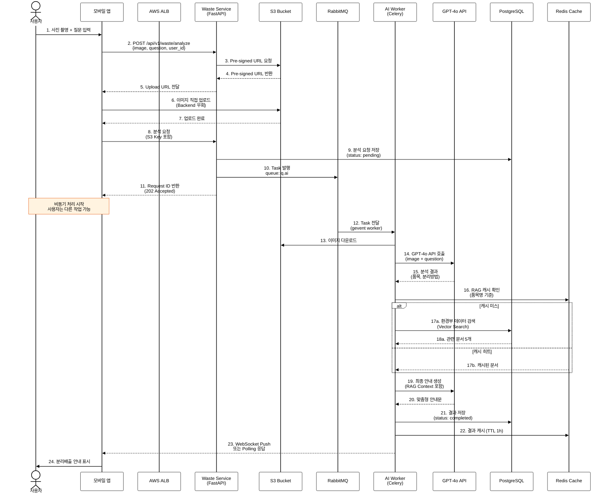
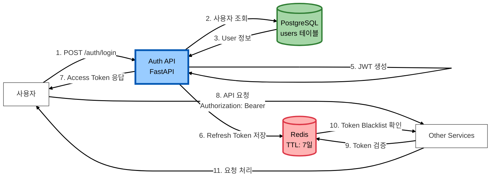
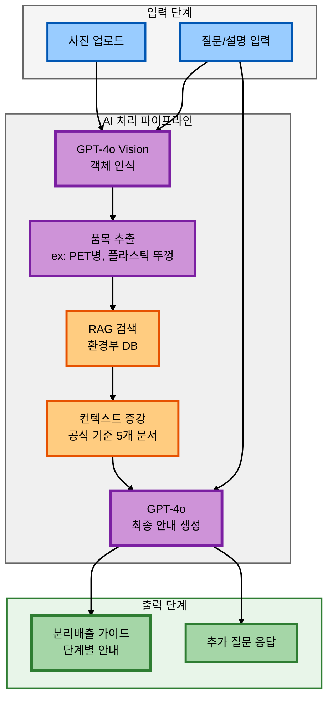
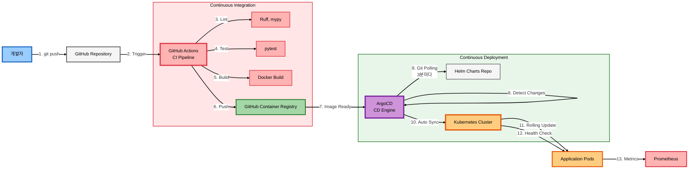

# 2. 서비스 아이디어 및 기술 아키텍처

## 2.1. 서비스 아이디어 개요

본 과제에서 개발하는 **AI Waste Coach** 서비스는 일반 시민이 일상생활에서 겪는 분리배출의 어려움을 해소하고, 올바른 재활용 문화를 정착시키기 위한 AI 기반 맞춤형 코칭 플랫폼입니다. 

### 2.1.1. 서비스 핵심 기능

본 서비스는 크게 **4단계 순환 구조**로 설계되었습니다.

**1단계 - 품목 인식 및 초기 분석**
- 사용자가 스마트폰으로 폐기물 사진을 촬영하고 간단한 설명 또는 질문을 입력합니다.
- GPT-4o Vision 모델이 이미지를 분석하여 품목을 자동 식별합니다.
- 예시: "투명 페트병", "플라스틱 용기", "종이팩" 등

**2단계 - 분리배출 기준 안내**
- RAG 시스템이 환경부 공식 데이터베이스에서 해당 품목의 분리배출 기준을 검색합니다.
- AI가 검색된 공식 기준을 바탕으로 사용자 맞춤형 안내를 생성합니다.
- 세척 여부, 라벨 제거, 뚜껑 분리 등 구체적인 사전 처리 방법을 단계별로 제시합니다.

**3단계 - 실행 결과 검증**
- 사용자가 AI 안내에 따라 분리배출을 수행한 후 결과 사진을 업로드합니다.
- GPT-4o가 전(Before)/후(After) 이미지를 비교 분석합니다.
- 분리배출 정확도를 평가하여 등급(상/중/하)과 개선 피드백을 제공합니다.

**4단계 - 학습 및 개선**
- 사용자의 분리배출 이력을 누적하여 개인별 통계를 제공합니다.
- 자주 틀리는 품목에 대해 맞춤형 재교육 콘텐츠를 제시합니다.

### 2.1.2. 서비스 차별성

기존 분리배출 안내 서비스와의 주요 차별점은 다음과 같습니다.

| 구분 | 기존 서비스 | AI Waste Coach |
|------|------------|----------------|
| **정보 제공 방식** | 정적 매뉴얼, 검색 기반 | AI 대화형 맞춤 안내 |
| **이미지 활용** | 단순 참고 이미지 제공 | 실시간 Vision AI 분석 |
| **피드백** | 일방향 정보 전달 | 양방향 검증 및 코칭 |
| **데이터 근거** | 일반화된 가이드라인 | 환경부 공식 최신 기준 |
| **사용자 경험** | 품목별 검색 필요 | 사진 촬영만으로 즉시 안내 |

---

## 2.2. 적용 기술 및 개발 환경

### 2.2.1. 기술 스택

본 프로젝트는 현대적인 클라우드 네이티브 아키텍처를 기반으로 구축되었으며, 주요 기술 스택은 다음과 같습니다.

#### 인공지능 및 데이터 처리

| 구분 | 기술 | 버전 | 역할 및 용도 |
|------|------|------|-------------|
| **AI 모델** | GPT-4o | - | 멀티모달 이미지+텍스트 분석 |
| | Vision API | - | 객체 인식 및 상태 판별 |
| | Embedding API | - | 문서 벡터화 (RAG) |
| **데이터 저장소** | PostgreSQL | 14 | 관계형 데이터베이스 (사용자, 품목, 이력) |
| | Redis | 7 | 캐시 및 세션 관리 |
| | S3 | - | 이미지 저장소 |
| | Vector DB | (예정) | RAG 문서 임베딩 |

#### 백엔드 애플리케이션

| 구분 | 기술 | 버전 | 역할 및 용도 |
|------|------|------|-------------|
| **언어** | Python | 3.11 | 주 개발 언어 |
| **프레임워크** | FastAPI | - | REST API 프레임워크 |
| | Celery | - | 비동기 작업 처리 |
| **메시지 큐** | RabbitMQ | 3.13 | 메시지 브로커 (HA 3-node) |
| | Celery Workers | - | AI 처리, 배치, API 작업 분산 |

#### 인프라 및 배포

| 구분 | 기술 | 버전 | 역할 및 용도 |
|------|------|------|-------------|
| **클라우드 플랫폼** | AWS | ap-northeast-2 | 서울 리전 |
| **컨테이너 오케스트레이션** | Kubernetes | v1.28 | Self-Managed (kubeadm) |
| | Calico VXLAN | - | CNI 네트워크 |
| | 4-Tier Architecture | - | 역할별 노드 분리 |
| **IaC** | Terraform | - | AWS 리소스 프로비저닝 |
| | Ansible | - | Kubernetes 클러스터 구성 |
| **CI/CD 및 GitOps** | GitHub Actions | - | CI 파이프라인 |
| | ArgoCD | - | CD 자동 배포 |
| | Helm | - | 패키지 관리 |

### 2.2.2. 개발 환경 상세

#### 하드웨어 스펙

본 프로젝트는 AWS EC2 인스턴스 기반 Self-Managed Kubernetes 클러스터로 구성되었으며, 총 4개 노드로 운영됩니다.

| 노드명 | 인스턴스 타입 | vCPU | 메모리 | 스토리지 | 역할 | 월 비용 |
|--------|--------------|------|--------|----------|------|---------|
| **Master** | t3.large | 2 | 8GB | 80GB gp3 | Control Plane, Monitoring | $60 |
| **Worker-1** | t3.medium | 2 | 4GB | 60GB gp3 | Application (FastAPI) | $30 |
| **Worker-2** | t3.medium | 2 | 4GB | 60GB gp3 | Async Workers (Celery) | $30 |
| **Storage** | t3.large | 2 | 8GB | 60GB gp3 | RabbitMQ, PostgreSQL, Redis | $60 |
| **합계** | - | **8 cores** | **24GB** | **260GB** | - | **$180** |

**추가 리소스**:
- S3 Bucket: 이미지 저장 (~$5/월)
- EBS 볼륨: PVC 동적 프로비저닝 (Prometheus 50GB, RabbitMQ 60GB)
- Route53: 도메인 관리
- ACM: SSL/TLS 인증서 (무료)

**총 인프라 비용**: 약 **$185/월** (EKS 대비 27% 절감)

#### 소프트웨어 환경

| 항목 | 버전/스펙 | 용도 |
|------|----------|------|
| **OS** | Ubuntu 22.04 LTS | 모든 노드 공통 |
| **Container Runtime** | containerd 1.7 | Docker 대체 (CRI 표준) |
| **Kubernetes** | v1.28.15 | 컨테이너 오케스트레이션 |
| **Python** | 3.11 | 애플리케이션 런타임 |
| **PostgreSQL** | 14 | 주 데이터베이스 |
| **Redis** | 7 | 캐시 및 상태 관리 |
| **RabbitMQ** | 3.13 | 메시지 큐 |

---

## 2.3. 서비스 아키텍처

### 2.3.1. 전체 시스템 아키텍처

본 서비스는 **4-Tier Layered Architecture**로 설계되었으며, 각 계층이 명확히 분리되어 독립적으로 확장 가능합니다.



### 2.3.2. 4-Tier 아키텍처 설계 근거

**Tier 1 - Control Plane (Master Node, t3.large)**
- Kubernetes API Server, Scheduler, Controller Manager 운영
- ArgoCD를 통한 GitOps 기반 자동 배포
- Prometheus + Grafana 모니터링 스택
- 역할: 전체 클러스터 관리 및 감시

**Tier 2 - Application Layer (Worker-1, t3.medium)**
- FastAPI 기반 동기 처리 서비스 (Auth, Users, Waste, Locations)
- 사용자 요청에 대한 즉시 응답 처리
- 데이터베이스 CRUD 작업 수행
- 역할: 실시간 API 응답 (응답시간 < 200ms 목표)

**Tier 3 - Async Processing (Worker-2, t3.medium)**
- Celery Workers를 통한 비동기 작업 처리
- AI Vision 분석 (시간 소요 2-5초)
- 배치 작업 (통계, 리포트 생성)
- 외부 API 호출 (타임아웃 대응)
- 역할: 시간이 걸리는 작업을 백그라운드 처리

**Tier 4 - Data & Messaging (Storage Node, t3.large)**
- RabbitMQ HA Cluster (3-node) - 메시지 큐
- PostgreSQL StatefulSet - 영구 데이터 저장
- Redis Deployment - 캐시 및 세션
- 역할: 데이터 영속성 및 메시지 중개

---

## 2.4. 배포 아키텍처

### 2.4.1. Kubernetes 클러스터 네트워크 구성



### 2.4.2. 네트워크 설계 원칙

**VPC 구성**:
- CIDR: 10.0.0.0/16 (65,536개 IP 주소)
- 가용 영역: 3개 (ap-northeast-2a, 2b, 2c)
- 서브넷: Public Subnet 3개 (각 노드 고가용성 배치)

**보안 그룹**:
- Master SG: Kubernetes API (6443), HTTPS (443), SSH (22)
- Worker SG: NodePort (30000-32767), Kubelet (10250)
- 노드 간 통신: VXLAN (4789 UDP), 전체 TCP 허용

**로드 밸런서**:
- AWS ALB Controller를 통한 Kubernetes Ingress 자동 관리
- Path-based Routing으로 서비스별 라우팅
- ACM 인증서를 통한 SSL/TLS 종료

---

## 2.5. 패킷 플로우

### 2.5.1. AI 이미지 분석 요청 흐름

사용자가 폐기물 사진을 업로드하고 분석을 요청하는 전체 과정입니다.



### 2.5.2. 패킷 플로우 주요 특징

**1. S3 Direct Upload (Pre-signed URL)**
- Frontend가 Backend를 거치지 않고 S3에 직접 업로드
- Backend 네트워크 대역폭 절약 (이미지 파일 크기: 평균 2-5MB)
- 업로드 속도 향상 (S3 엣지 로케이션 활용)

**2. 비동기 처리 (Fire and Forget)**
- API는 즉시 응답 (202 Accepted)
- AI 분석은 백그라운드에서 처리 (2-5초 소요)
- 사용자 경험 개선 (무응답 시간 제거)

**3. RAG 기반 지식 증강**
- 품목명 추출 → 환경부 DB 검색 → GPT-4o에 컨텍스트 제공
- Redis 캐시로 반복 검색 최소화
- 응답 품질 향상 + API 비용 절감

---

## 2.6. 도메인 서비스별 상세 아키텍처

### 2.6.1. 인증/인가 서비스 (Auth Service)



**주요 기능**:
- JWT 기반 Stateless 인증
- Refresh Token은 Redis에 저장 (7일 TTL)
- Access Token Blacklist (로그아웃 시)
- 비밀번호 해싱: bcrypt

**보안 고려사항**:
- HTTPS 전용 통신 (ALB SSL Termination)
- CORS 정책 적용 (허용 도메인 제한)
- Rate Limiting (Redis 기반, 분당 100 요청)

---

### 2.6.2. AI 이미지 분류 서비스



**AI 처리 단계**:

1. **이미지 전처리**
   - 해상도 정규화 (최대 2048px)
   - EXIF 메타데이터 제거
   - Base64 인코딩

2. **Vision 분석**
   - GPT-4o Vision API 호출
   - 객체 감지 및 분류
   - 상태 정보 추출 (세척 여부, 손상 정도)

3. **품목 매칭**
   - 추출된 객체명을 환경부 730개 품목 DB와 매칭
   - 유사도 기반 Top-5 후보 선정
   - 컨텍스트 기반 최종 품목 결정

4. **RAG 검색**
   - 품목명 + 상태 정보로 Vector Search
   - 관련 분리배출 기준 문서 5-10개 검색
   - 최신순 정렬 (2024년 이후 우선)

5. **최종 안내 생성**
   - GPT-4o에 증강 컨텍스트 제공
   - System Prompt: "환경부 공식 기준을 따르는 전문가"
   - 단계별 안내 생성 (준비→세척→분리→배출)

**성능 최적화**:
- Redis 캐시: 동일 품목 반복 요청 시 RAG 검색 생략
- Celery gevent: 동시 처리 성능 향상 (Worker당 100개 동시)
- API 타임아웃: 10초 (초과 시 재시도 큐 이동)

---

### 2.6.3. 위치 정보 기반 재활용 시설 탐색

```mermaid
%%{init: {'theme':'base', 'themeVariables': { 'lineColor':'#333333', 'primaryColor':'#ffffff', 'primaryBorderColor':'#333333'}}}%%
graph LR
    User[사용자] -->|1. 현재 위치 전송| LocationAPI[Locations API]
    LocationAPI -->|2. 캐시 확인| Redis[(Redis<br/>지역별 캐시)]
    
    alt 캐시 있음
        Redis -->|3a. 캐시된 시설 목록| LocationAPI
    else 캐시 없음
        LocationAPI -->|3b. 공공 API 호출| PublicAPI[공공데이터포털<br/>재활용센터 API]
        PublicAPI -->|4b. 시설 정보| LocationAPI
        LocationAPI -->|5b. 캐시 저장<br/>TTL: 24h| Redis
    end
    
    LocationAPI -->|6. 거리 계산<br/>Haversine| LocationAPI
    LocationAPI -->|7. 정렬<br/>가까운 순| LocationAPI
    LocationAPI -->|8. 시설 목록 응답<br/>Top 10| User
    
    style LocationAPI fill:#99ccff,stroke:#0056b3,stroke-width:3px,color:#000
    style Redis fill:#ffb3b3,stroke:#dc3545,stroke-width:3px,color:#000
    style PublicAPI fill:#ffcc80,stroke:#e65100,stroke-width:3px,color:#000
    
    linkStyle default stroke:#000000,stroke-width:2px
```

**주요 기능**:
- 사용자 GPS 좌표 기반 반경 5km 내 재활용 시설 검색
- Redis 캐시로 공공 API 호출 최소화 (24시간 TTL)
- Haversine 공식으로 정확한 거리 계산
- 운영 시간, 수거 품목 정보 포함

---

## 2.7. GitOps 배포 플로우

### 2.7.1. CI/CD 파이프라인



**CI 단계 (GitHub Actions)**:
1. 코드 품질 검사 (Ruff, mypy, Black)
2. 단위 테스트 실행 (pytest, coverage 80% 이상)
3. Docker 이미지 빌드 (멀티 스테이지)
4. GHCR에 푸시 (ghcr.io/sesacthon/*)
5. 평균 소요 시간: 3-5분

**CD 단계 (ArgoCD)**:
1. Git Repository 폴링 (3분 간격)
2. Helm Chart 변경 감지
3. 자동 동기화 (Auto Sync 활성화)
4. Rolling Update 배포 (무중단)
5. Health Check 확인 후 트래픽 전환
6. 평균 배포 시간: 2-3분

**전체 배포 시간**: 코드 푸시 → 프로덕션 배포 완료까지 **약 10분**

---

## 2.8. 기술적 의사결정 근거

### 2.8.1. Self-Managed Kubernetes 선택 이유

| 항목 | AWS EKS | Self-Managed (선택) |
|------|---------|---------------------|
| **비용** | $253/월 | **$185/월 (-27%)** |
| **제어권** | 제한적 | **완전한 제어** |
| **학습 가치** | 낮음 | **높음** |
| **구축 시간** | 1시간 | 3일 (AI 도구 활용) |
| **운영 복잡도** | 낮음 | 중간 (자동화로 완화) |

**선택 배경**:
- 9개월 엔터프라이즈 Kubernetes 운영 경험 보유
- Terraform + Ansible 완전 자동화 (1명이 관리 가능)
- Cursor + Claude 4.5 AI 도구로 생산성 6배 향상
- 비용 효율성 (연간 $816 절감)

### 2.8.2. 비동기 처리 아키텍처 선택

**동기 vs 비동기 비교**:

```
동기 처리 (기각):
User → API → GPT-4o (3초 대기) → 응답
- 사용자 대기 시간: 3-5초
- 타임아웃 리스크
- 서버 리소스 점유

비동기 처리 (선택):
User → API (즉시 응답) → RabbitMQ → Celery Worker → GPT-4o
- 사용자 대기 시간: < 200ms
- 안정적 처리 (재시도, DLQ)
- 리소스 효율적 사용
```

**RabbitMQ + Celery 선택 이유**:
- ✅ 큐별 작업 분리 (ai, batch, api, sched, dlq)
- ✅ HA 3-node 클러스터 (장애 대응)
- ✅ 공평성 보장 (prefetch_multiplier: 1)
- ✅ TTL + DLX로 무한 재시도 방지

---

## 2.9. 기술 스택 선정 이유 요약

| 기술 | 선정 이유 | 대안 기술 |
|------|----------|----------|
| **FastAPI** | 고성능, 자동 문서화, 타입 힌트 | Flask, Django |
| **PostgreSQL** | ACID 보장, JSON 지원, 성숙도 | MySQL, MongoDB |
| **Redis** | 빠른 캐시, 세션 관리, Pub/Sub | Memcached |
| **RabbitMQ** | 메시지 보장, HA, 큐 분리 | Redis Queue, SQS |
| **Celery** | Python 네이티브, 성숙도 | Dramatiq, Huey |
| **Kubernetes** | 표준 오케스트레이션, 확장성 | Docker Compose, ECS |
| **ArgoCD** | GitOps 표준, UI 대시보드 | FluxCD, Spinnaker |
| **Calico** | 성능, Network Policy | Flannel, Cilium |
| **Terraform** | 멀티 클라우드, 성숙도 | CloudFormation, Pulumi |
| **Ansible** | 에이전트리스, 멱등성 | Chef, Puppet |

---

## 부록: 인프라 자동화 코드 통계

**Terraform**:
- 파일: 36개
- 모듈: 3개 (VPC, EC2, Security Groups)
- 리소스: 42개
- 코드 라인: 1,250줄

**Ansible**:
- Playbook: 10개
- Role: 6개
- Task: 127개
- 코드 라인: 2,180줄

**Scripts**:
- 자동화 스크립트: 14개
- Bash 라인: 1,420줄

**총 IaC 코드**: **4,850줄** (완전 자동화)

---

**작성일**: 2025-11-02  
**작성자**: AI Waste Coach Backend Team  
**문서 버전**: 1.0  
**상태**: 참고용 (미제출)

