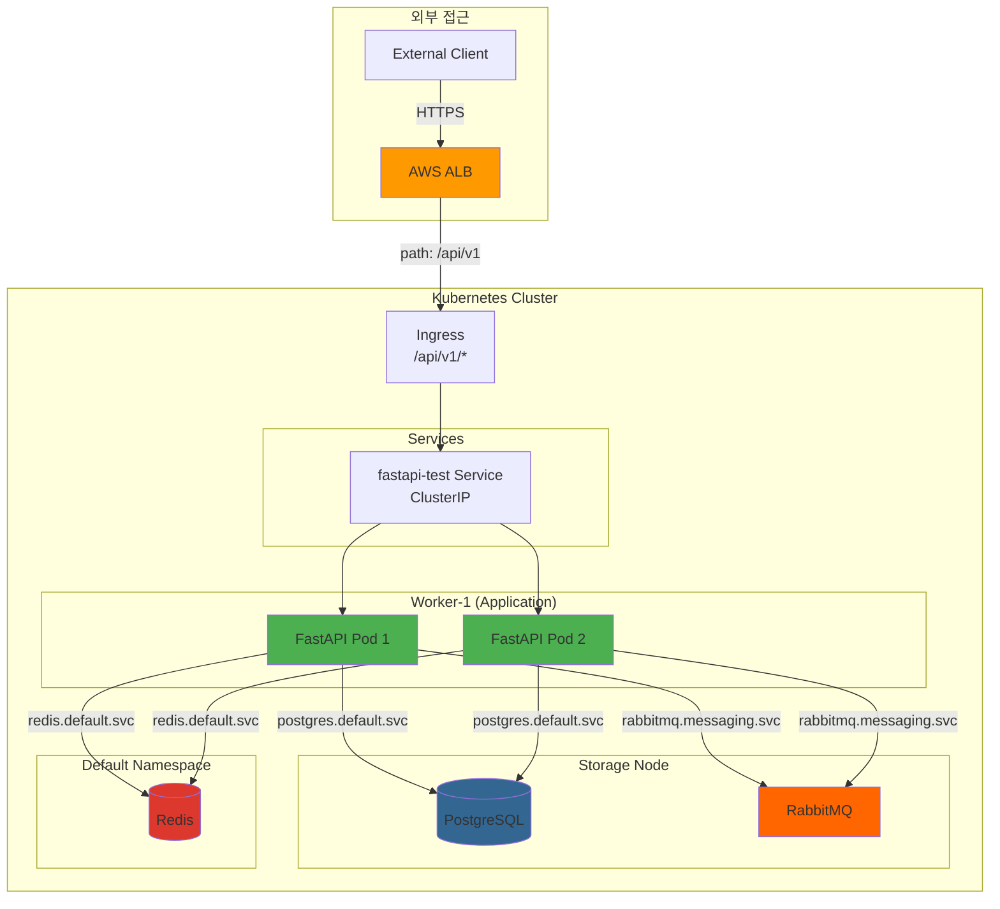

# FastAPI 테스트 서버 배포 가이드

> 현재 Kubernetes 클러스터에서 FastAPI 기반 테스트 서버를 배포하여  
> 외부/내부 통신 및 모든 서비스(PostgreSQL, Redis, RabbitMQ) 연결을 검증합니다.

---

## 📋 목차

1. [개요](#개요)
2. [테스트 아키텍처](#테스트-아키텍처)
3. [배포 방법](#배포-방법)
4. [통신 테스트](#통신-테스트)
5. [문제 해결](#문제-해결)

---

## 개요

### 테스트 목적

- ✅ **클러스터 내부 통신**: Pod → Service DNS 해석
- ✅ **데이터베이스 연결**: PostgreSQL 읽기/쓰기
- ✅ **캐시 연결**: Redis 읽기/쓰기
- ✅ **메시지 큐 연결**: RabbitMQ 큐 생성/삭제
- ✅ **외부 접근**: ALB Ingress (보안: 직접 접근 차단)

### 테스트 서버 스펙

- **프레임워크**: FastAPI 0.104.1
- **Python 버전**: 3.11
- **복제본**: 2 (HA)
- **배치 노드**: Worker-1 (`workload=application`)
- **리소스**:
  - Requests: 100m CPU, 128Mi RAM
  - Limits: 500m CPU, 512Mi RAM

---

## 테스트 아키텍처



---

## 배포 방법

### 사전 준비

1. **클러스터 정상 동작 확인**
   ```bash
   kubectl get nodes -L workload
   # 모든 노드 Ready 상태 확인
   ```

2. **서비스 정상 동작 확인**
   ```bash
   kubectl get pods -A | grep -E "(postgres|redis|rabbitmq)"
   # 모든 Pod Running 상태 확인
   ```

3. **Master 노드 IP 확인**
   ```bash
   cd terraform
   terraform output master_public_ip
   ```

### 1단계: 자동 배포 (권장)

```bash
cd scripts

# 배포 스크립트 실행
bash deploy-fastapi-test.sh <MASTER_IP> ubuntu

# 예시
bash deploy-fastapi-test.sh 52.79.238.50 ubuntu
```

**스크립트 동작**:
1. ConfigMap 생성 (FastAPI 앱 코드 + requirements.txt)
2. Deployment 생성 (2 replicas)
3. Service 생성 (ClusterIP만, 외부 직접 접근 차단)
4. Pod 상태 확인 (최대 2분 대기)
5. 내부 통신 테스트 (6개 엔드포인트)
6. Ingress 생성 (ALB, 외부 접근 유일 경로)

**예상 시간**: 3-5분

---

### 2단계: 수동 배포 (고급)

#### 2-1. FastAPI 앱 배포

```bash
ssh ubuntu@<MASTER_IP>

kubectl apply -f - <<EOF
---
apiVersion: v1
kind: ConfigMap
metadata:
  name: fastapi-test-app
  namespace: default
data:
  main.py: |
    from fastapi import FastAPI
    # (전체 코드는 scripts/deploy-fastapi-test.sh 참고)
  
  requirements.txt: |
    fastapi==0.104.1
    uvicorn[standard]==0.24.0
    asyncpg==0.29.0
    redis==5.0.1
    aio-pika==9.3.0

---
apiVersion: apps/v1
kind: Deployment
metadata:
  name: fastapi-test
  namespace: default
spec:
  replicas: 2
  selector:
    matchLabels:
      app: fastapi-test
  template:
    metadata:
      labels:
        app: fastapi-test
    spec:
      nodeSelector:
        workload: application
      containers:
      - name: fastapi
        image: python:3.11-slim
        # (전체 설정은 scripts/deploy-fastapi-test.sh 참고)

---
apiVersion: v1
kind: Service
metadata:
  name: fastapi-test
  namespace: default
spec:
  type: ClusterIP
  selector:
    app: fastapi-test
  ports:
  - port: 8000
    targetPort: 8000

# ⚠️ NodePort Service 제거 (보안: ALB를 통한 접근만 허용)
EOF
```

#### 2-2. Pod 상태 확인

```bash
kubectl get pods -l app=fastapi-test -n default -o wide

# 예상 출력:
# NAME                           READY   STATUS    NODE
# fastapi-test-xxxxxxxxx-xxxxx   1/1     Running   k8s-worker-1
# fastapi-test-xxxxxxxxx-xxxxx   1/1     Running   k8s-worker-1
```

#### 2-3. Service 정보 확인

```bash
kubectl get svc -l app=fastapi-test -n default

# ClusterIP: 10.x.x.x:8000 (내부 전용)
```

---

## 통신 테스트

### 1️⃣ 클러스터 내부 통신 (Pod → Service)

**다른 Pod에서 테스트**:
```bash
# Master 노드 접속
ssh ubuntu@<MASTER_IP>

# 테스트 Pod 생성
kubectl run test-curl --image=curlimages/curl --rm -it --restart=Never -- sh

# 내부에서 실행
curl http://fastapi-test.default.svc.cluster.local:8000/health
```

**FastAPI Pod 자체에서 테스트**:
```bash
POD_NAME=$(kubectl get pods -l app=fastapi-test -n default -o jsonpath='{.items[0].metadata.name}')

# Root endpoint
kubectl exec -n default $POD_NAME -- curl -s http://localhost:8000/

# Health Check
kubectl exec -n default $POD_NAME -- curl -s http://localhost:8000/health

# PostgreSQL 테스트
kubectl exec -n default $POD_NAME -- curl -s http://localhost:8000/test/postgres

# Redis 테스트
kubectl exec -n default $POD_NAME -- curl -s http://localhost:8000/test/redis

# RabbitMQ 테스트
kubectl exec -n default $POD_NAME -- curl -s http://localhost:8000/test/rabbitmq

# 전체 통합 테스트
kubectl exec -n default $POD_NAME -- curl -s http://localhost:8000/test/all
```

**예상 결과**:
```json
{
  "status": "ok",
  "postgres": "ok",
  "redis": "ok",
  "rabbitmq": "ok"
}
```

---

### 2️⃣ 외부 접근 테스트 (ALB + Ingress)

⚠️ **보안: NodePort를 통한 직접 접근은 차단되었습니다. ALB를 통한 접근만 허용됩니다.**

#### Ingress 생성

```bash
ssh ubuntu@<MASTER_IP>

kubectl apply -f - <<EOF
apiVersion: networking.k8s.io/v1
kind: Ingress
metadata:
  name: fastapi-test-ingress
  namespace: default
  annotations:
    alb.ingress.kubernetes.io/scheme: internet-facing
    alb.ingress.kubernetes.io/target-type: instance
    alb.ingress.kubernetes.io/group.name: growbin-alb
    alb.ingress.kubernetes.io/healthcheck-path: /health
spec:
  ingressClassName: alb
  rules:
  - http:
      paths:
      - path: /api/v1
        pathType: Prefix
        backend:
          service:
            name: fastapi-test
            port:
              number: 8000
EOF
```

#### Ingress 상태 확인

```bash
kubectl get ingress fastapi-test-ingress -n default

# ALB 주소 확인 (약 3분 후)
kubectl get ingress fastapi-test-ingress -n default \
  -o jsonpath='{.status.loadBalancer.ingress[0].hostname}'
```

#### 접근 테스트

```bash
# ALB 직접 접근 (ALB 주소 사용)
ALB_DNS=$(kubectl get ingress fastapi-test-ingress -n default -o jsonpath='{.status.loadBalancer.ingress[0].hostname}')
curl http://$ALB_DNS/api/v1/health

# 도메인 접근 (Route53 연동 시)
curl https://growbin.app/api/v1/health
```

---

## API 엔드포인트

### `GET /`
**설명**: API 기본 정보 및 엔드포인트 목록

**응답 예시**:
```json
{
  "message": "SeSACTHON Test API",
  "version": "1.0.0",
  "endpoints": [
    "/health",
    "/test/postgres",
    "/test/redis",
    "/test/rabbitmq",
    "/test/all"
  ]
}
```

---

### `GET /health`
**설명**: 모든 서비스 상태 확인

**응답 예시**:
```json
{
  "status": "ok",
  "postgres": "ok",
  "redis": "ok",
  "rabbitmq": "ok"
}
```

**상태 코드**:
- `200`: 모든 서비스 정상
- `503`: 하나 이상의 서비스 비정상 (`status: "degraded"`)

---

### `GET /test/postgres`
**설명**: PostgreSQL 연결 테스트 및 버전 확인

**테스트 내용**:
- DNS 해석 (`postgres.default.svc.cluster.local`)
- TCP 연결
- 인증
- `SELECT version()` 쿼리 실행

**응답 예시**:
```json
{
  "status": "ok",
  "service": "PostgreSQL",
  "host": "postgres.default.svc.cluster.local",
  "version": "PostgreSQL 16.1 on x86_64-pc-linux-musl, compiled..."
}
```

---

### `GET /test/redis`
**설명**: Redis 연결 테스트 및 읽기/쓰기

**테스트 내용**:
- DNS 해석 (`redis.default.svc.cluster.local`)
- TCP 연결
- `PING` 명령
- `SET test_key test_value EX 10`
- `GET test_key`
- `DEL test_key`

**응답 예시**:
```json
{
  "status": "ok",
  "service": "Redis",
  "host": "redis.default.svc.cluster.local",
  "test": "write/read success"
}
```

---

### `GET /test/rabbitmq`
**설명**: RabbitMQ 연결 테스트 및 큐 생성/삭제

**테스트 내용**:
- DNS 해석 (`rabbitmq.messaging.svc.cluster.local`)
- TCP 연결 (port 5672)
- 인증
- 임시 큐 생성 (`test_queue`, auto_delete=True)
- 큐 삭제

**응답 예시**:
```json
{
  "status": "ok",
  "service": "RabbitMQ",
  "host": "rabbitmq.messaging.svc.cluster.local",
  "test": "queue create/delete success"
}
```

---

### `GET /test/all`
**설명**: 모든 서비스 통합 테스트

**응답 예시**:
```json
{
  "summary": {
    "total": 3,
    "success": 3,
    "failed": 0
  },
  "details": {
    "postgres": {
      "status": "ok",
      "service": "PostgreSQL",
      "host": "postgres.default.svc.cluster.local",
      "version": "PostgreSQL 16.1..."
    },
    "redis": {
      "status": "ok",
      "service": "Redis",
      "host": "redis.default.svc.cluster.local",
      "test": "write/read success"
    },
    "rabbitmq": {
      "status": "ok",
      "service": "RabbitMQ",
      "host": "rabbitmq.messaging.svc.cluster.local",
      "test": "queue create/delete success"
    }
  }
}
```

---

## 테스트 시나리오

### 시나리오 1: 전체 스택 통신 테스트

```bash
# 1. 배포
bash scripts/deploy-fastapi-test.sh 52.79.238.50 ubuntu

# 2. 클러스터 내부 테스트
ssh ubuntu@52.79.238.50
kubectl run test --image=curlimages/curl --rm -it --restart=Never -- \
  curl http://fastapi-test.default.svc.cluster.local:8000/test/all

# 3. 외부 테스트 (ALB만 허용)
curl https://growbin.app/api/v1/test/all
```

**성공 기준**:
- ✅ 모든 서비스 `status: "ok"`
- ✅ `summary.success: 3`
- ✅ PostgreSQL version 반환
- ✅ Redis write/read 성공
- ✅ RabbitMQ queue 생성/삭제 성공

---

### 시나리오 2: 서비스별 개별 테스트

#### PostgreSQL 테스트
```bash
curl https://growbin.app/api/v1/test/postgres
```

**확인 사항**:
- DNS 해석: `postgres.default.svc.cluster.local` → `10.x.x.x`
- 포트: `5432`
- 인증: `admin` / Secret
- 쿼리 실행: `SELECT version()`

#### Redis 테스트
```bash
curl https://growbin.app/api/v1/test/redis
```

**확인 사항**:
- DNS 해석: `redis.default.svc.cluster.local` → `10.x.x.x`
- 포트: `6379`
- 명령: `PING`, `SET`, `GET`, `DEL`

#### RabbitMQ 테스트
```bash
curl https://growbin.app/api/v1/test/rabbitmq
```

**확인 사항**:
- DNS 해석: `rabbitmq.messaging.svc.cluster.local` → `10.x.x.x`
- 포트: `5672`
- 인증: `admin` / Secret
- 큐 생성/삭제

---

### 시나리오 3: 부하 테스트

⚠️ **주의**: 부하 테스트는 ALB DNS를 사용하거나 클러스터 내부에서 수행해야 합니다.

```bash
# ALB DNS 확인
ALB_DNS=$(kubectl get ingress fastapi-test-ingress -n default -o jsonpath='{.status.loadBalancer.ingress[0].hostname}')

# Apache Bench (100 요청, 동시성 10)
ab -n 100 -c 10 https://growbin.app/api/v1/health

# hey (1000 요청, 동시성 50)
hey -n 1000 -c 50 https://growbin.app/api/v1/health
```

**확인 사항**:
- 평균 응답 시간 < 500ms
- 에러율 0%
- Pod 리소스 사용량

---

## 문제 해결

### 1. Pod가 Pending 상태

**증상**:
```bash
kubectl get pods -l app=fastapi-test -n default
# STATUS: Pending
```

**원인**: Worker-1 노드 레이블 누락

**해결**:
```bash
kubectl label nodes k8s-worker-1 workload=application --overwrite
kubectl delete pod -l app=fastapi-test -n default
```

---

### 2. PostgreSQL 연결 실패

**증상**:
```json
{
  "status": "error",
  "service": "PostgreSQL",
  "error": "could not connect to server"
}
```

**원인**:
- PostgreSQL Pod 미실행
- Secret 누락
- DNS 해석 실패

**해결**:
```bash
# PostgreSQL Pod 확인
kubectl get pods -n default | grep postgres

# Secret 확인
kubectl get secret postgres-secret -n default

# DNS 테스트
kubectl run test-dns --image=busybox --rm -it --restart=Never -- \
  nslookup postgres.default.svc.cluster.local
```

---

### 3. Redis 연결 실패

**증상**:
```json
{
  "status": "error",
  "service": "Redis",
  "error": "Connection refused"
}
```

**원인**:
- Redis Pod 미실행
- Service 미생성

**해결**:
```bash
# Redis 상태 확인
kubectl get pods -n default | grep redis
kubectl get svc -n default | grep redis

# Redis 로그 확인
kubectl logs -n default deployment/redis
```

---

### 4. RabbitMQ 연결 실패

**증상**:
```json
{
  "status": "error",
  "service": "RabbitMQ",
  "error": "authentication failed"
}
```

**원인**:
- RabbitMQ Pod 미실행
- Secret 누락
- 네임스페이스 불일치

**해결**:
```bash
# RabbitMQ 상태 확인
kubectl get pods -n messaging | grep rabbitmq

# Secret 확인
kubectl get secret rabbitmq-default-user -n messaging

# RabbitMQ 로그 확인
kubectl logs -n messaging -l app.kubernetes.io/name=rabbitmq
```

---

### 5. ALB를 우회한 직접 접근 시도

**증상**:
Worker 노드의 IP로 직접 접근을 시도하면 연결 실패

**원인**: NodePort Service가 제거되어 외부 직접 접근이 차단됨 (의도된 보안 조치)

**해결**: ALB를 통한 접근만 사용
```bash
# ❌ 직접 접근 불가
curl http://52.79.238.50:30800/

# ✅ ALB를 통한 접근만 허용
curl https://growbin.app/api/v1/health
```

---

### 6. Ingress ALB 생성 실패

**증상**:
```bash
kubectl get ingress fastapi-test-ingress -n default
# ADDRESS: <empty>
```

**원인**: ALB Controller 권한 부족

**해결**:
```bash
# ALB Controller 로그 확인
kubectl logs -n kube-system deployment/aws-load-balancer-controller

# IAM 권한 확인 (scripts/fix-alb-iam-permissions.sh 참고)
```

---

## 정리 (Clean Up)

### 테스트 리소스 삭제

```bash
ssh ubuntu@<MASTER_IP>

# Ingress 삭제
kubectl delete ingress fastapi-test-ingress -n default

# Deployment & Services 삭제
kubectl delete deployment fastapi-test -n default
kubectl delete svc fastapi-test -n default

# ConfigMap 삭제
kubectl delete configmap fastapi-test-app -n default
```

**또는 한 번에**:
```bash
kubectl delete all -l app=fastapi-test -n default
kubectl delete configmap fastapi-test-app -n default
kubectl delete ingress fastapi-test-ingress -n default
```

---

## 요약

### ✅ 테스트 가능 항목

1. **클러스터 내부 통신**
   - Pod → Service (DNS)
   - Service → Backend Pods

2. **서비스 연결**
   - PostgreSQL (읽기/쓰기)
   - Redis (캐시)
   - RabbitMQ (메시지 큐)

3. **외부 접근**
   - ✅ ALB + Ingress (HTTPS) - **권장**
   - ❌ NodePort (HTTP) - **보안상 차단됨**

4. **고가용성**
   - 2 replicas
   - Pod 장애 복구
   - Service LoadBalancing

### 📊 예상 결과

**전체 통신 테스트 성공 시**:
```json
{
  "summary": {
    "total": 3,
    "success": 3,
    "failed": 0
  }
}
```

**이는 현재 Kubernetes 클러스터가 완전히 정상 동작함을 의미합니다!** ✅

---

**작성일**: 2025-11-04  
**버전**: 1.0.0

