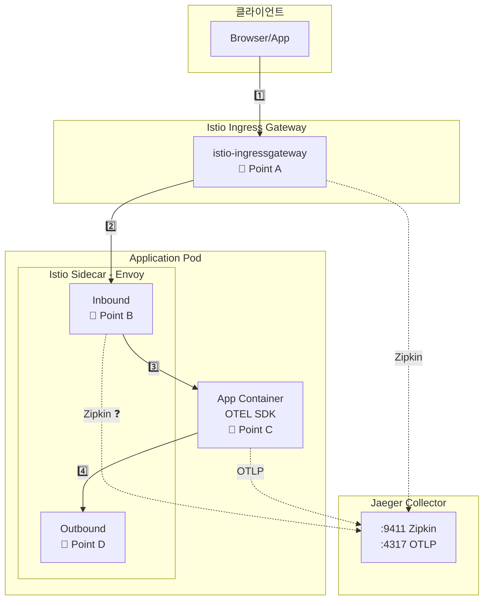
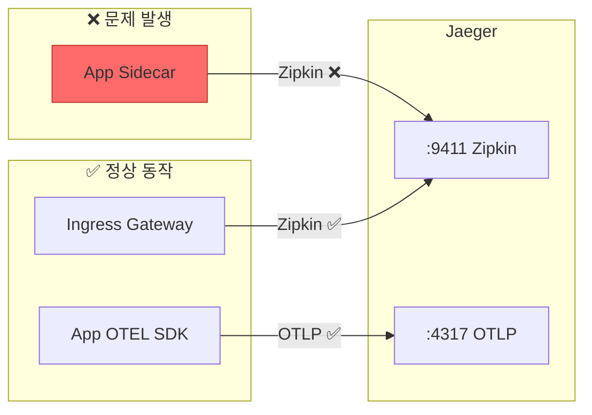
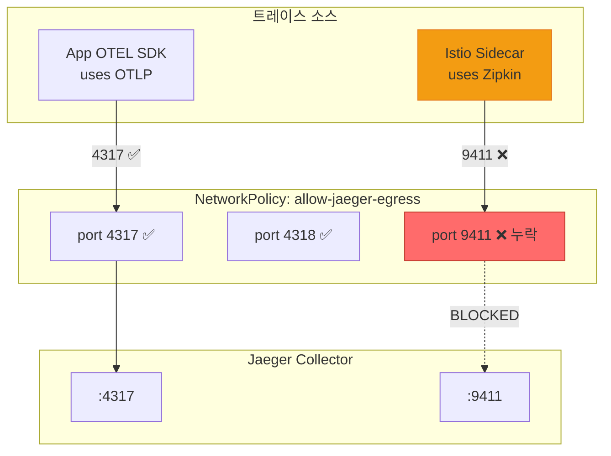
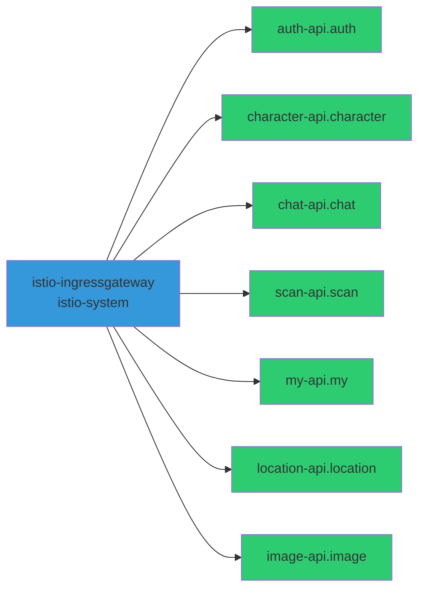

# 분산 트레이싱 NetworkPolicy 트러블슈팅

**날짜**: 2025-12-18  
**카테고리**: Observability / Istio / Jaeger  
**해결 시간**: 약 2시간

## 문제 증상

Jaeger UI에서 **"No service dependencies found"** 메시지가 표시되고, 서비스 간 호출 관계가 보이지 않음.

### 관찰된 현상

1. 앱의 OTEL SDK 트레이스는 Jaeger에 정상 수집됨
2. Istio Ingress Gateway 트레이스도 일부 수집됨
3. 하지만 **서비스 간 Dependencies가 표시되지 않음**
4. 각 서비스의 sidecar(Envoy)가 생성한 트레이스가 누락됨

## 진단 과정

### 1단계: 아키텍처 이해



### 2단계: 각 지점별 데이터 확인

#### Point A: Ingress Gateway → Jaeger

```bash
# Ingress Gateway의 zipkin 클러스터 stats 확인
kubectl exec -n istio-system $IG_POD -- pilot-agent request GET clusters | grep zipkin
```

**결과**: `rq_total::61` ✅ 정상 전송

#### Point B: App Sidecar → Jaeger

```bash
# auth-api sidecar의 zipkin 클러스터 stats 확인
kubectl exec -n auth $AUTH_POD -c istio-proxy -- pilot-agent request GET clusters | grep "9411.*rq_total"
```

**결과**: `rq_total::0` ❌ **전송 없음!**

#### Point C: App OTEL SDK → Jaeger

```bash
# OTLP 클러스터 stats 확인
kubectl exec -n auth $AUTH_POD -c istio-proxy -- pilot-agent request GET clusters | grep "4317.*rq_total"
```

**결과**: `rq_total::109` ✅ 정상 전송

### 3단계: 병목 지점 식별



**병목 지점**: App Pod의 Sidecar → Jaeger Collector (port 9411)

### 4단계: 원인 분석

NetworkPolicy 확인:

```bash
kubectl get networkpolicy allow-jaeger-egress -n auth -o yaml
```

```yaml
# 발견된 설정
spec:
  egress:
  - ports:
    - port: 4317  # OTLP gRPC ✅
    - port: 4318  # OTLP HTTP ✅
    # port: 9411 ❌ 누락!
```

## 근본 원인



**원인**: NetworkPolicy에서 Istio Sidecar(Envoy)가 사용하는 **Zipkin 포트(9411)**가 허용되지 않음

| 프로토콜 | 포트 | 사용처 | NetworkPolicy |
|----------|------|--------|---------------|
| OTLP gRPC | 4317 | App OTEL SDK | ✅ 허용됨 |
| OTLP HTTP | 4318 | App OTEL SDK | ✅ 허용됨 |
| **Zipkin** | **9411** | **Istio Sidecar** | ❌ **누락** |

## 해결 방법

### 수정 파일

`workloads/network-policies/base/allow-jaeger-egress.yaml`

### 변경 내용

```yaml
# Before (문제)
spec:
  egress:
  - ports:
    - port: 4317
      protocol: TCP
    - port: 4318
      protocol: TCP

# After (해결)
spec:
  egress:
  - ports:
    - port: 4317
      protocol: TCP
    - port: 4318
      protocol: TCP
    - port: 9411        # ✅ Zipkin 포트 추가
      protocol: TCP
```

### 적용 범위

모든 앱 네임스페이스에 동일하게 적용:
- auth, character, chat, scan, my, location, image

## 검증

### 수정 후 Sidecar Stats

```bash
# Before
outbound|9411||jaeger-collector-clusterip...::rq_total::0

# After
outbound|9411||jaeger-collector-clusterip...::rq_total::38
```

### Jaeger Dependencies 확인



### 최종 결과

| 도메인 | Zipkin 전송 | Jaeger 등록 |
|--------|:-----------:|:-----------:|
| auth | ✅ 38회 | ✅ auth-api.auth |
| character | ✅ 19회 | ✅ character-api.character |
| chat | ✅ 33회 | ✅ chat-api.chat |
| scan | ✅ 33회 | ✅ scan-api.scan |
| my | ✅ 1회 | ✅ my-api.my |
| location | ✅ 33회 | ✅ location-api.location |
| image | ✅ 20회 | ✅ image-api.image |

## 교훈

### 1. Istio 트레이싱 프로토콜 이해

Istio의 Envoy sidecar는 기본적으로 **Zipkin 프로토콜**을 사용하여 트레이스를 전송함:

```yaml
# Envoy tracing config
provider:
  name: envoy.tracers.zipkin
  typed_config:
    collector_cluster: "outbound|9411||jaeger-collector..."
    collector_endpoint: "/api/v2/spans"
```

### 2. 앱 OTEL SDK vs Istio Sidecar

| 구분 | 프로토콜 | 포트 | 설정 위치 |
|------|----------|------|----------|
| App OTEL SDK | OTLP | 4317/4318 | Deployment env |
| Istio Sidecar | Zipkin | 9411 | MeshConfig |

### 3. NetworkPolicy 설계 시 고려사항

분산 트레이싱을 위한 egress NetworkPolicy는 **두 가지 경로**를 모두 허용해야 함:

```yaml
ports:
  - port: 4317   # App → Jaeger (OTLP)
  - port: 4318   # App → Jaeger (OTLP HTTP)
  - port: 9411   # Sidecar → Jaeger (Zipkin)
```

## 관련 커밋

- `2a27a2e6` - fix(netpol): Zipkin 포트(9411) egress 허용 추가

## 참고 자료

- [Istio Distributed Tracing](https://istio.io/latest/docs/tasks/observability/distributed-tracing/)
- [Jaeger with Istio](https://www.jaegertracing.io/docs/latest/operator/#auto-injecting-jaeger-agent-sidecars)
- [Kubernetes NetworkPolicy](https://kubernetes.io/docs/concepts/services-networking/network-policies/)
