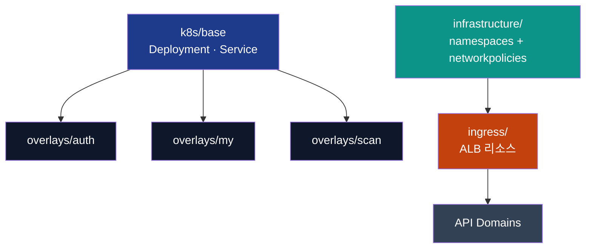

# Kustomize / Helm Layout

GitOps App-of-Apps가 참조하는 Kustomize/Helm 구조를 정리했습니다.  
Wave 값은 `argocd/apps/*.yaml`의 `argocd.argoproj.io/sync-wave`와 동일합니다.

| Wave | 디렉터리 | 설명 |
|------|----------|------|
| 00 | `foundations/` | 네임스페이스, CRD. `kustomization.yaml` 에서 `../namespaces/domain-based.yaml`을 포함 |
| 10 | `infrastructure/` | `namespaces/`, `networkpolicies/` 서브 디렉터리. ALB IMDS egress 등 기본 정책 |
| 20 | `ingress/` | `domain-based-api-ingress.yaml`, `infrastructure-ingress.yaml` (HTTPS-only ALB) |
| 40 | `charts/observability/*` | kube-prometheus-stack Helm Chart (ArgoCD Wave 40) |
| 50 | `k8s/data-operators/` + Helm `charts/data/databases` | DB 네임스페이스 + Umbrella Chart |
| 60 | `charts/platform/atlantis` | Atlantis Helm Chart |
| 80 | `overlays/<domain>` | auth/my/scan/... API. `base/`를 상속해 이미지/환경변수만 패치 |



## 사용 방법

### 로컬 검증
```bash
# 인프라 계층
kustomize build k8s/infrastructure

# 특정 도메인
kustomize build k8s/overlays/auth
```

### 새 도메인 추가 절차
1. `k8s/overlays/<domain>/` 생성 → `kustomization.yaml`에서 `../../base` 사용  
2. `patch-deployment.yaml`에 이미지, Env, NodeSelector, HPA labeling 적용  
3. `patch-service.yaml`로 NodePort 지정  
4. `argocd/apps/apis/<domain>.yaml` 또는 ApplicationSet 파라미터에 추가  

### Helm 연동 (Monitoring / Data / Atlantis)
- `charts/observability/kube-prometheus-stack`  
- `charts/data/databases`  
- `charts/platform/atlantis`  
Helm Chart는 ArgoCD Application에서 직접 참조하므로 `kustomize build`에는 포함되지 않습니다. 변경 시 `helm dependency update` 후 `argocd app sync`로 반영합니다.

---

문제 발생 시 `docs/TROUBLESHOOTING.md`의 Ingress/Namespace 섹션을 참고하세요. ARNs, NodePort 범위 등 모든 민감 값은 Ansible `group_vars` 또는 Terraform Outputs로 주입합니다.

